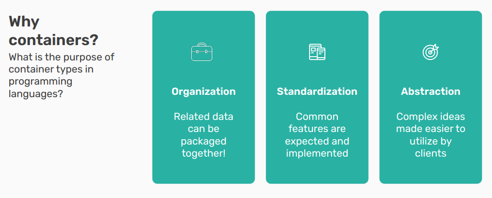
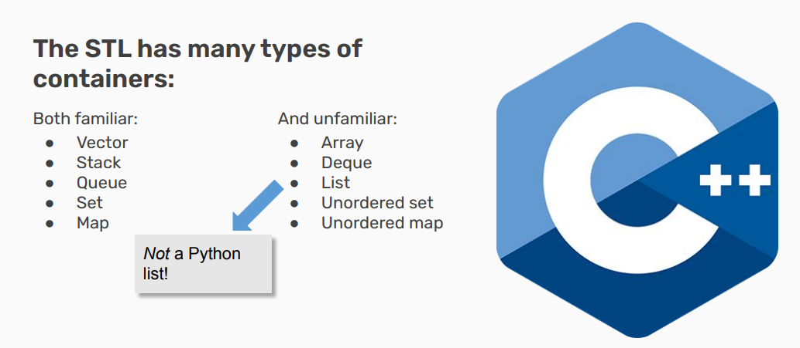
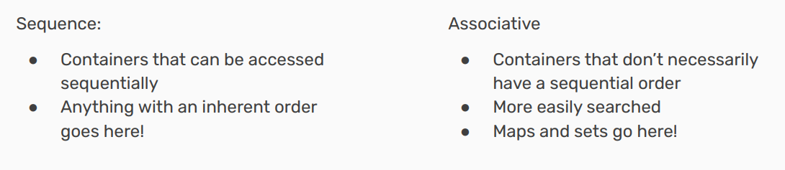
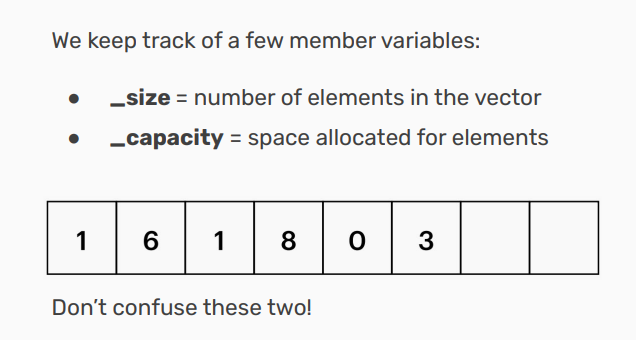
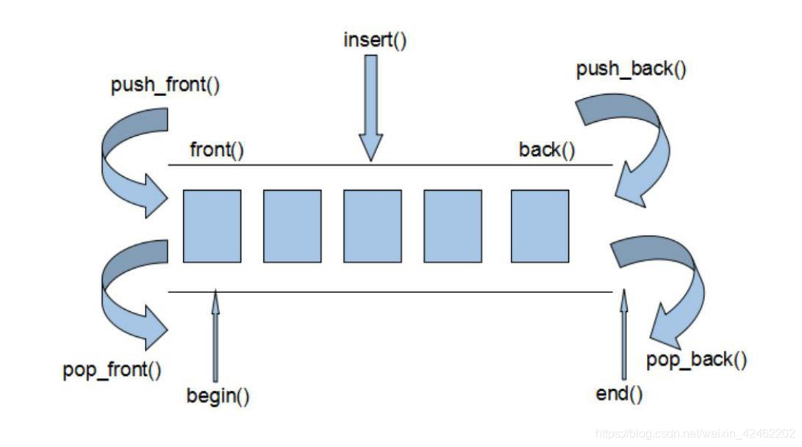
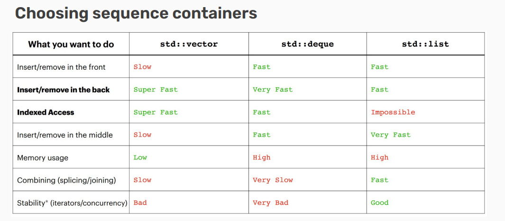
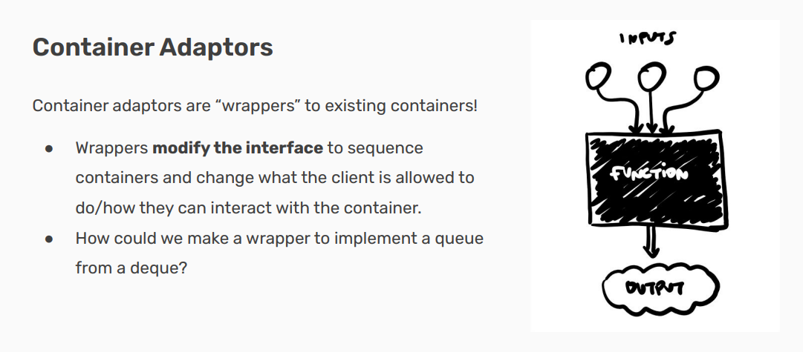
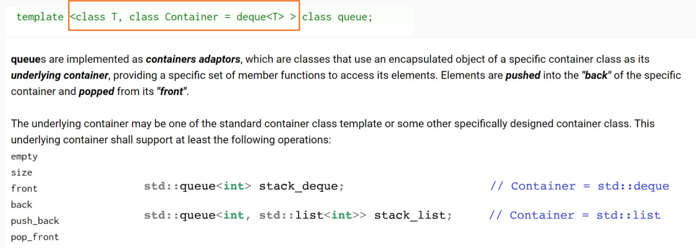
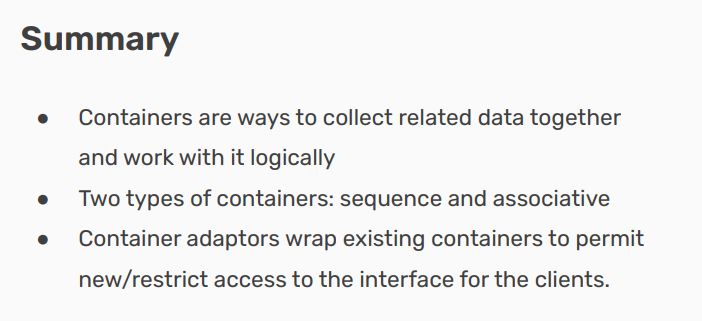

# Containers
- [ ] Version
    * [x] Lin
    * [x] 2023-01-08 
    * [x] learning Containers
    * [ ] review

!!! info
    * Defining Containers

        - What is a container in C++?

    * Containers in the STL

        - Types of containers and how they work

    * Container Adaptors

        - Abstracting container implementation

## Defining Containers

### Definition

    An object that allows us to collect other objects together and interact with them in some way.

!!! tip
    “允许我们将其他对象收集在一起并以某种方式与它们进行交互”的对象，通常是指像数组、列表、向量、集合、字典、队列、栈等这样的数据结构。这些结构提供了存储和管理一组对象的能力，并且通常提供了各种操作这些集合的方法，例如：

    - 添加或删除元素
    - 遍历集合中的元素
    - 检索特定元素
    - 排序和过滤集合中的元素等等

## Containers in the STL

Typically, containers export some standard, basic functionality.

- Allow you to store multiple objects (though all of the 
same type)

- Allow access to the collection through some 
(perhaps limited) way.Maybe allow iteration through all of the objects 

- May allow editing/deletion

### Some containers

* An array is the primitive form of a vector（数组是向量的原始形式）
    
    - Fixed size in a strict sequence（固定大小且严格按顺序排列）

* A deque is a double ended queue（双端队列（deque）是一种两端都可以进行入队和出队操作的队列）

* A list is a doubly linked list（双向链表）
    
    - Can loop through in either direction!（可以从两个方向遍历!）

### Two Types of Containers

!!! note
    **Sequence 容器（顺序容器）**:可以顺序访问的容器:

    这一类容器存储的元素是有固定顺序的，可以通过迭代器 (iterator) 或索引来顺序访问容器中的每一个元素。
    
    顺序容器按照元素添加的顺序保存它们，比如元素是按照它们被推入 (pushed) 的先后顺序排列的。

    在 C++ STL 中，常见的顺序容器包括 vector、deque 和 list。

    **Associative 容器（关联容器）**:不必然有顺序的容器:

    关联容器中的元素并不是按照它们插入的顺序存储的。相反，这些元素是根据它们的键值或者某种特定的排序准则来组织的。

    因为关联容器中的元素是有序的或者是基于键值进行组织的，所以查找效率通常高于顺序容器。例如，在一个平衡二叉搜索树中，查找操作的时间复杂度是 O(log n)。

    在 C++ STL 中，常见的关联容器包括 set、multiset、map 和 multimap。set 是元素集合，其中所有元素都唯一；而 multiset 允许存在重复的元素。map 提供了一种从键到值进行映射的方式，每个键都是唯一的，而 multimap 允许键不唯一。

### Sequence Containers

#### Vector implementation

How do vectors actually work?

At a high level, a vector is an ordered collection of 
elements of the same type that can grow and shrink in 
size.

Internally, vectors implement an array!

array无法成长，而vector虽然可以成长，但是只能向尾端生长。其实现原理是：

(1) 申请更大空间 

(2)原数据复制新空间 

(3)释放原空间，这种做法所付出的时间代价是非常大的。

#### Deque implementation

Vector 容器是单向开口的连续内存空间，deque则是一种双向开口的连续线性空间。所谓的双向开口，意思是可以在头尾两端分别做元素的插入和删除操作，当然，vector 容器也可以在头尾两端插入元素，但是在其头部操作效率奇差，无法被接受。

 deque 容器和 vector 容器最大的差异，一在于 deque 允许使用常数项时间对头端进行元素的插入和删除操作。二在于 deque 没有容量的概念，因为它是动态的以分段连续空间组合而成，随时可以增加一段新的空间并链接起来，换句话说，像 vector 那样，”旧空间不足而重新配置一块更大空间，然后复制元素，再释放旧空间”这样的事情在 deque 身上是不会发生的。也因此，deque 没有必须要提供所谓的空间保留(reserve)功能。

 虽然 deque 容器也提供了 Random Access Iterator,但是它的迭代器并不是普通的指针，其复杂度和 vector 不是一个量级，这当然影响各个运算的层面。因此，除非有必要，我们应该尽可能的使用 vector，而不是 deque。对 deque 进行的排序操作，为了最高效率，可将 deque 先完整的复制到一个 vector 中，对 vector 容器进行排序，再复制回 deque。

 deque 是由一段一段的定量的连续空间构成。一旦有必要在 deque 前端或者尾端增加新的空间，便配置一段连续定量的空间，串接在 deque 的头端或者尾端。
 
**Deque 最大的工作就是维护这些分段连续的内存空间的整体性的假象，并提供随机存取的接口，避开了重新配置空间，复制，释放的轮回，代价就是复杂的迭代器架构。**

deque 是分段连续内存空间，有**中央控制器**，维持整体连续的假象。

中控器中每一个节点都是一个指针，指向真正的缓存区。

#### Choosing Sequence Containers

● Sequence containers are for when you need to enforce 
some order on your information!

● Can usually use an std::vector for most anything

● If you need particularly fast inserts in the front, consider an std::deque

● For joining/working with multiple lists, consider an 
std::list (very rarely)

### Associative Containers

#### Map implementation

Maps are implemented with pairs! (std::pair&lt;const key, value&gt;)

● Note the const! Keys must be immutable(不可变的).

● Indexing into the map (myMap[key]) searches through 
the underlying collection of pairs first attribute for the 
key and will return its second attribute.

#### Unordered maps/sets

Both maps and sets in the STL have an unordered version!

● Ordered maps/sets require a comparison operator
to be defined.

● Unordered maps/sets require a hash function to be 
defined.

Unordered maps/sets are usually faster than ordered ones!

!!! tip
    **有序映射（Ordered Maps）和集合（Sets）**

    有序映射（std::map） 和 有序集合（std::set） 内部通常使用红黑树或者其他类型的平衡二叉搜索树来存储元素。这意味着它们会根据元素的键来自动排序。

    对于有序映射和集合来说，必须定义一个比较运算符（比如<），因为在插入新元素时，容器需要知道如何比较两个元素的键以确定它们的顺序。对于基本数据类型，如int、double等，STL提供默认的比较运算符。但如果你想要用自定义类型作为键，你需要提供一个比较函数或者重载相应的运算符。

    因为这些容器是有序的，所以可以保证元素按照特定的顺序存储和检索，这使得能够执行如二分查找等高效的操作。

    **无序映射（Unordered Maps）和集合（Sets）**

    无序映射（std::unordered_map） 和 无序集合（std::unordered_set） 内部使用哈希表来存储元素。这意味着元素不是按照顺序存储的，而是根据它们的哈希值放置在容器中。

    对于无序映射和集合来说，必须定义一个哈希函数。哈希函数用于将元素的键映射到哈希表中的位置（桶）。STL为许多标准类型提供了默认哈希函数。但是，如果你使用自定义类型作为键，你需要提供一个自定义的哈希函数或使用专门为此目的设计的哈希库。

    无序容器通常提供更快的插入和访问时间复杂度（平均情况下为O(1)），因为它们不需要维持元素间的任何顺序。然而实际性能也会根据哈希函数的质量和哈希表的管理方式而变化。

Lots of similarities between maps/sets! Broad tips:

● Unordered containers are faster, but can be difficult to get to work with nested containers/collections

● If using complicated data types/unfamiliar with hash functions, use an ordered container

!!! note
    **无序容器：更快但可能难以与嵌套容器配合使用**
    
    无序容器（比如std::unordered_map和std::unordered_set）通常提供更快的数据访问速度，平均时间复杂度为O(1)。然而，由于其内部实现是基于哈希表的，因此可能遇到一些挑战：

    嵌套容器：如果你在一个无序容器内部使用另一个容器作为键（例如，在std::unordered_map<std::vector<int>, int>中使用std::vector<int>作为键），需要为这个嵌套的容器提供一个自定义哈希函数。因为STL默认不提供容器类型的哈希函数，所以这可能会变得复杂且容易出错。

    容量：无序容器对于负载因子（load factor）和桶（bucket）数量非常敏感，这些都会影响性能。如果哈希函数设计得不好或者桶的数量分配不当，会导致很多键映射到同一个桶中，从而降低性能。

    **有序容器：适合复杂数据类型或不熟悉哈希函数的情况**

    有序容器（比如std::map和std::set）虽然在插入和查找操作上的时间复杂度略高（通常是O(log n)），但对于复杂数据类型更加友好：

    比较函数：对于复杂的数据类型，只需提供一个比较函数（或重载比较运算符），而无需担心哈希函数的实现。这简化了相关开发工作，并减少了出错的机会。

    天然排序：有序容器保持元素按特定顺序排列，这意味着元素总是有序的。这在某些应用场景中非常有用，例如，当需要按顺序迭代元素或者执行范围查询时。

!!! quote
    **桶（Bucket）**

    桶是哈希表中用于存放元素的位置单位。一个桶可以包含零个、一个或多个元素。当我们向无序容器中添加一个元素时，哈希函数会为该元素的键计算出一个哈希值，这个哈希值会被用来决定元素应该放置在哪一个桶中。

    通常，一个好的哈希函数会尽量将元素均匀地分布在所有可用的桶中，以减少冲突（即多个元素映射到同一桶中）的概率。如果太多元素映射到了同一个桶中，那么在这个桶上的操作（如查找、插入、删除）的性能就会逐渐接近线性时间复杂度（O(n)），从而影响总体性能。

    **负载因子（Load Factor）**

    负载因子是用来评估哈希表有多满的一个指标。它定义为哈希表中元素的数量除以桶的数量。数学公式表示为：负载因子 = 元素个数 / 桶的数量。

    当负载因子较低时，意味着桶之间元素分布得比较稀疏，冲突较少，哈希表的性能较好。然而，如果负载因子过低，则可能意味着内存利用率不高。

    当负载因子增加时，意味着哈希表变得更加充满，每个桶中平均元素数增加，冲突的可能性也随之增加，进而可能降低性能。

    为了控制性能，无序容器会有一个最大负载因子的阈值。一旦当前负载因子超过这个阈值，哈希表会进行再哈希（rehashing），即增加桶的数量并重新分配所有元素。这是一种性能与空间效率的折衷方式。

    为了管理和优化无序容器的性能，STL提供了相关的函数，如load_factor()获取当前的负载因子，max_load_factor()获取或设置允许的最大负载因子，以及rehash()和reserve()来控制容器何时需要增加桶的数量。

## Container Adaptors

在C++标准模板库（STL）中，容器适配器是一种特殊类型的容器，它们提供了对现有序列容器的封装。容器适配器通过改变被封装容器的接口，来限制或扩展客户端可以进行的操作，以及他们可以如何与底层容器交互。

STL 提供了三种主要的容器适配器：

**栈（stack）**：后进先出（LIFO）数据结构。

**队列（queue）**：先进先出（FIFO）数据结构。

**优先级队列（priority_queue）**：元素按优先级出队的数据结构。

## Recap

