# Initialization and Reference
- [ ] Version
    * [x] lin
    * [x] 2023-01-08 
    * [x] learning Initialization and Reference
    * [ ] review

!!! info
    * Initialization 
    * References 
    * L-values vs R-values
    * Const

## Initialization
"Provides initial values at the time of construction"

### Direct initialization
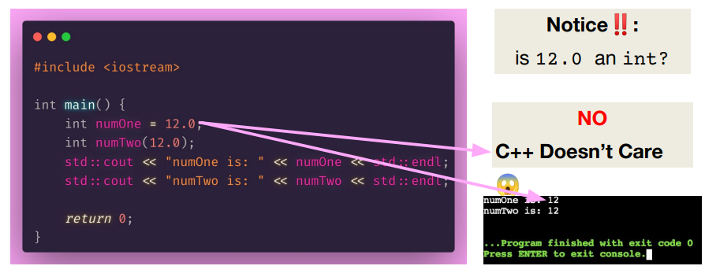

C++ doesn’t care in this case, it doesn’t type check with direct initialization.

This is commonly called a narrowing conversion

`narrowing conversion`:在编程中，"narrowing conversion"（缩小转换）是指将一个较大的数据类型转换成一个较小的数据类型时发生的类型转换。这种转换可能导致精度丧失或数据溢出。

### Uniform initialization(C++ 11引入的特性)
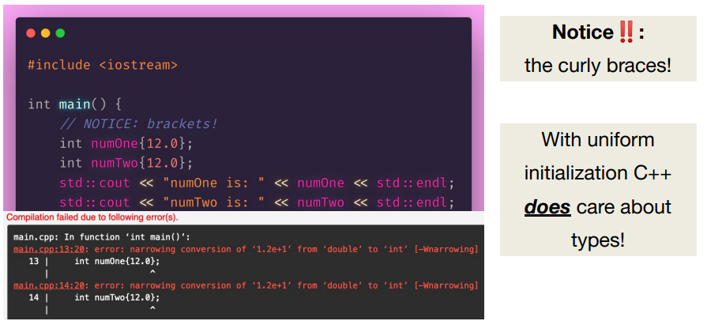

!!! note
    Uniform initialization is awesome because:

    1. It’s **safe**! It doesn’t allow for narrowing conversions—which can lead to unexpected behaviour (or critical system failures)

    2. It’s **ubiquitous**(普遍存在) it works for all types like vectors, maps, and custom classes, among other things!

Map的初始化

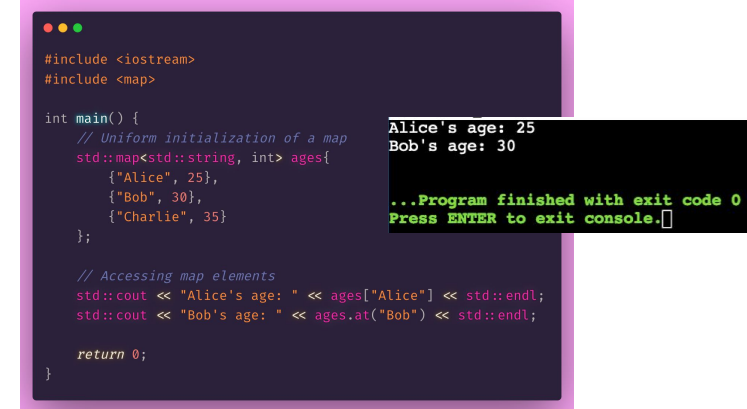

Vector的初始化

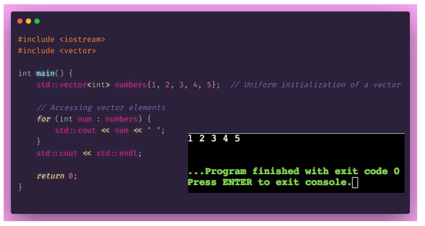

Struct的初始化

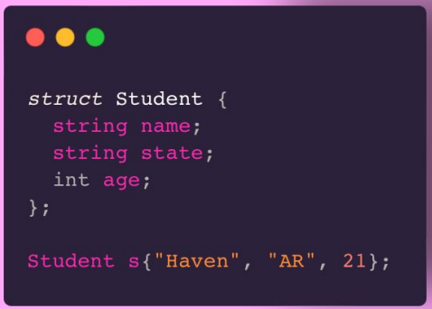

### Structured Binding(C++ 17引入的特性)
* A useful way to initialize some variables from data structures with fixed sizes at compile time
* Ability to access multiple values returned by a function

Structured Binding 是 C++17 引入的一个新特性，允许从数组、元组或结构体中方便地解包（destructure）和绑定多个变量。简单来说，它允许你在一行代码中创建多个变量，分别对应于复合对象的各个成员。

这个特性的主要好处是提升了代码的清晰度和可用性，尤其是在处理多值返回时。使用 Structured Binding 之前，如果你需要从一个函数获取多个返回值

比如如下代码：
```cpp
std::tuple<int, double, std::string> getValues() {
    return std::make_tuple(1, 2.0, "example");
}

auto values = getValues();
int i = std::get<0>(values);
double d = std::get<1>(values);
std::string s = std::get<2>(values);
```

有了 Structured Binding，你可以更直观地这样做：
```cpp
auto [i, d, s] = getValues();
```

Structured Binding 还可以与结构体和数组一起工作：
```cpp
struct MyStruct {
    int number;
    std::string text;
};

MyStruct getStruct() {
    return {42, "hello"};
}

// 使用 Structured Binding 解构 MyStruct
auto [num, txt] = getStruct();

int arr[] = {1, 2, 3};
// 使用 Structured Binding 解构数组
auto [a, b, c] = arr;
```

## References

### Definition

“Declares a name variable as a reference”

tldr(更简洁的解释): a reference is an alias to an already-existing thing

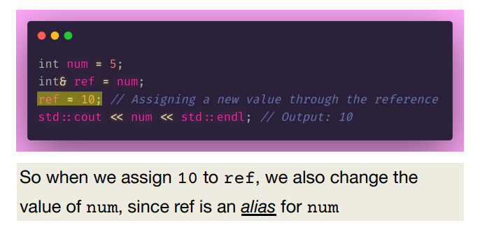

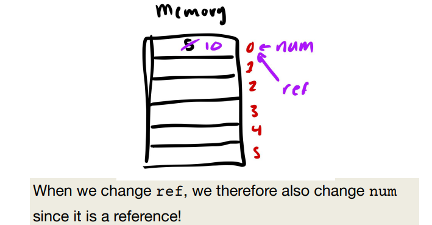

### Pass by Reference

Passing in a variable by `reference` into a function just means “take in the actual piece of memory, don’t make a copy!”

Passing in a variable by `value` into a function just means “make a copy, don’t take in the actual variable!”

!!! warning
    A classic reference-copy bug

    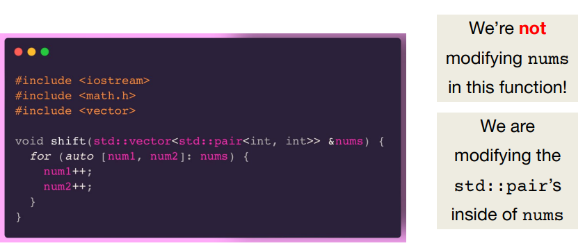

    fixed version

    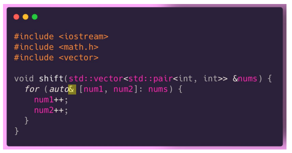

## l-values and r-values

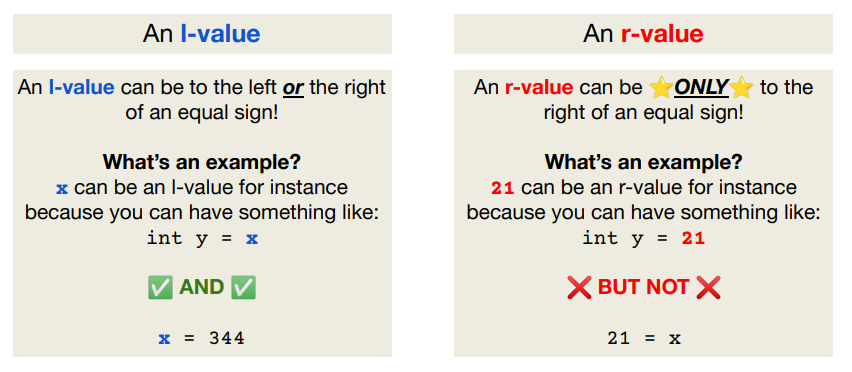

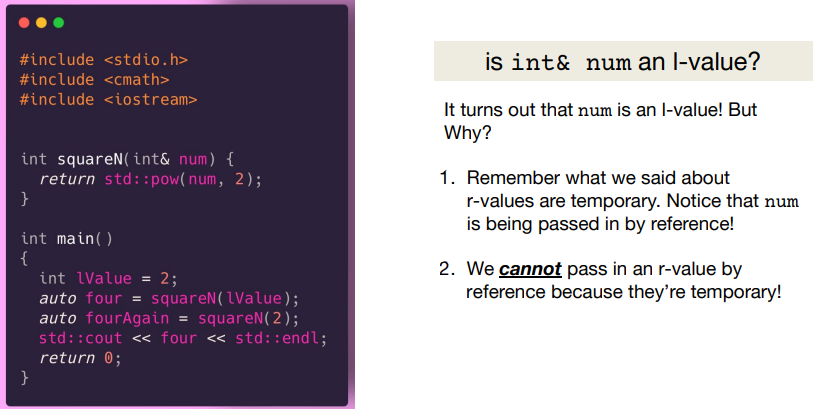

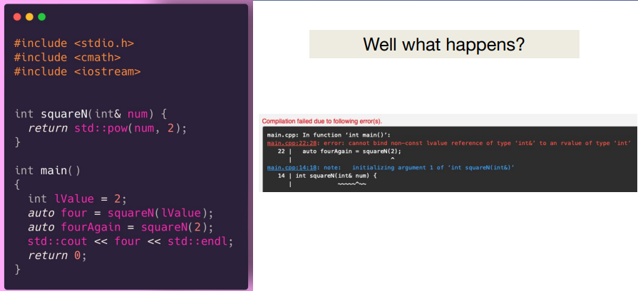

## const

A qualifier for objects that declares they cannot be modified

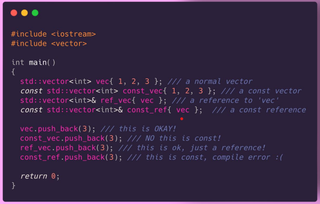

You can’t declare a non-const reference to a const variable

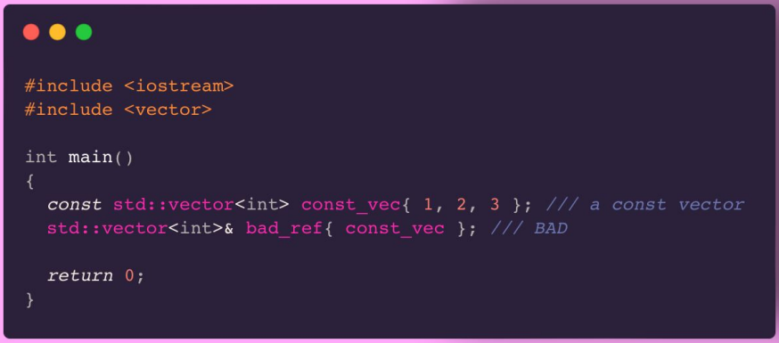

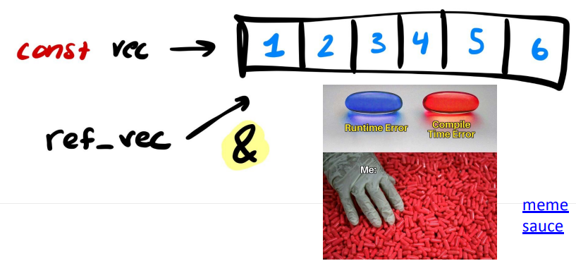

## Recap
!!! tip
    1. Use uniform initialization — it works for all types and objects!

    2. References are a way to alias variables!

    3. You can only reference an l-value!
    
    4. Const is a way to ensure that you can’t modify a variable

