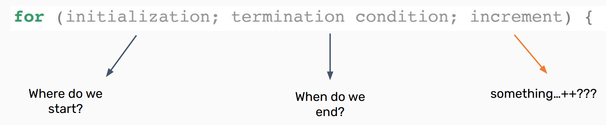
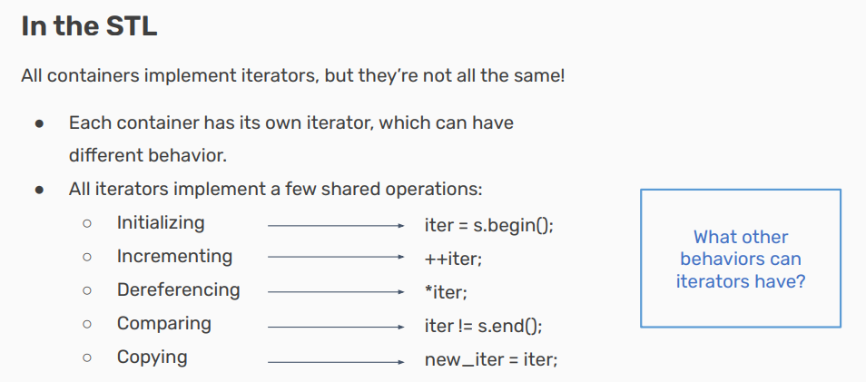
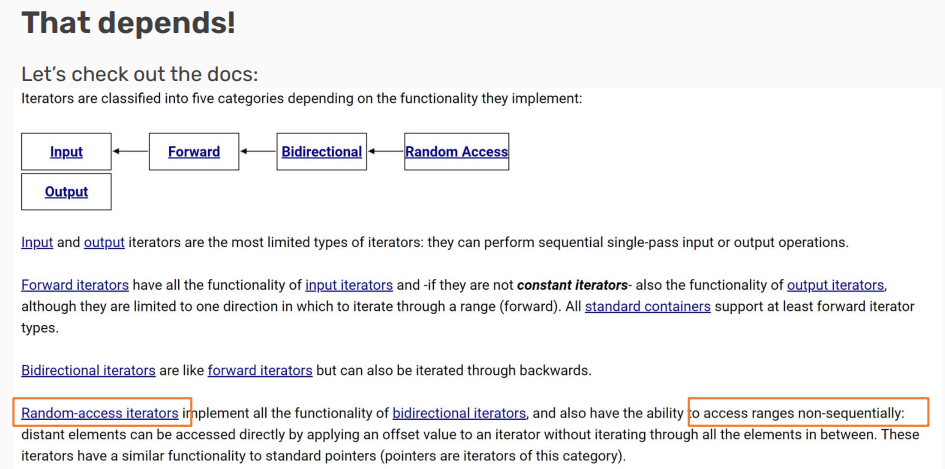
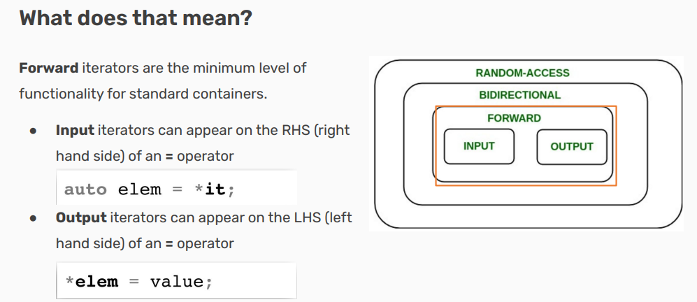
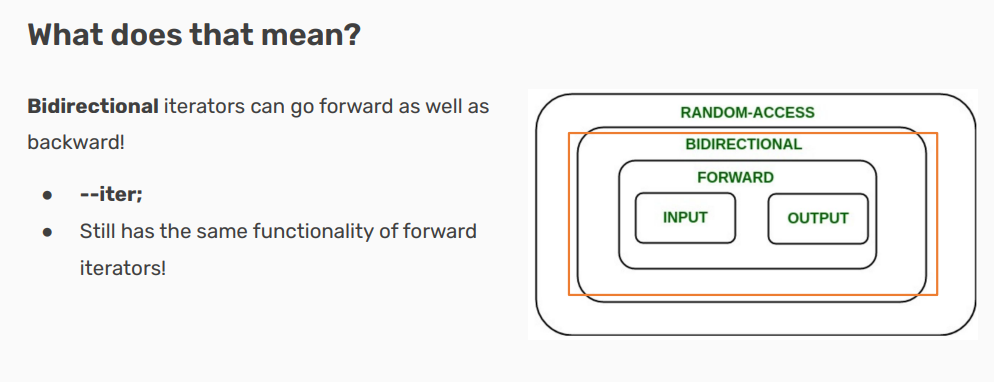
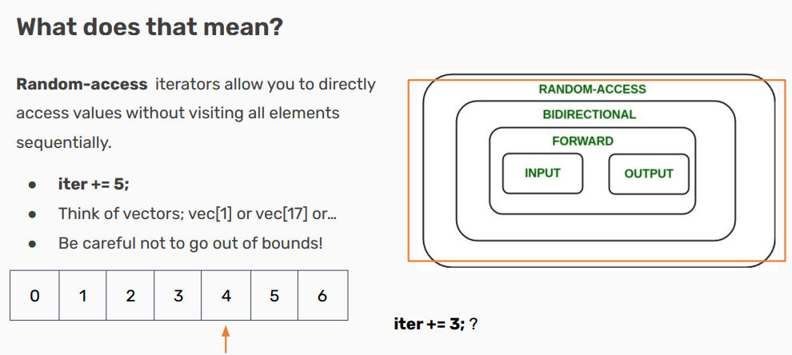
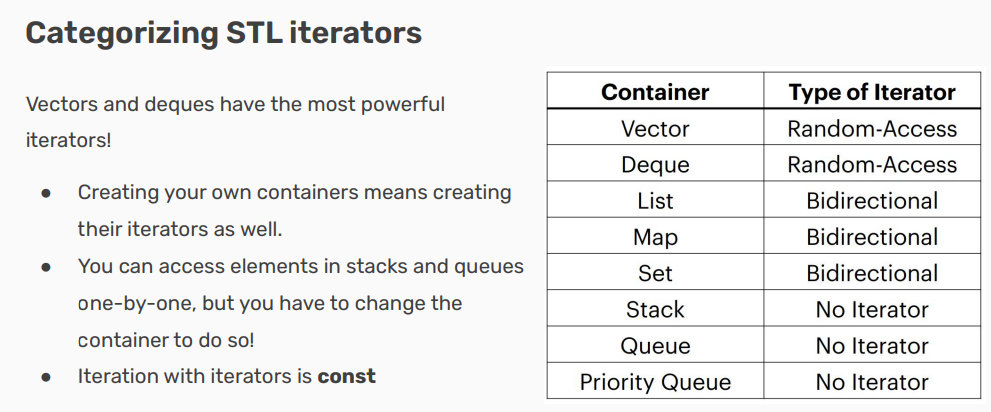
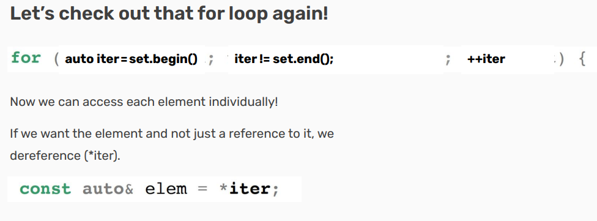
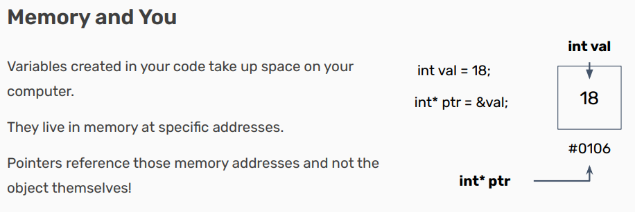

# Iterators and Pointers
- [ ] Version
    * [x] lin
    * [x] 2023-01-11 
    * [x] learning iterators and pointers
    * [ ] review

!!! info
    * Iterators

        - How to access container elements

    * Pointers

        - Accessing objects by address

## Iterators

**All containers are collections of objects…**

● So how do we access those objects?

- What if we want to print out everything in a vector?

- Or loop until we find a certain object in a set?

● How is this done in the STL?

- We’d like to have a for-loop, probably!

● What would that look like?



**Containers all implement something called an iterator to do this!**

● Containers all implement something called an iterator to do this!

- Iterators let you access all data in containers programmatically!

- An iterator has a certain order; it “knows” what element will 
come next

    - Not necessarily the same each time you iterate!

**Think of your container as a file cabinet!**

● An iterator lets you go through the files one at a time!

- You can see where the front and back of your drawer are.

- You can move your finger from one to the next,because you kept your place.

- You can take out any file you’ve your hand on, and read/write whatever you’d like in it.

- You can compare the relative location of any two files just by looking at where they are in the cabinet.













!!! note

    这句话指的是，在使用栈（std::stack）和队列（std::queue）这两种容器时，虽然你可以一个接一个地访问其中的元素，但在这个过程中，你将不可避免地修改容器的状态。具体来说：

    对于栈（后进先出，LIFO），你只能访问位于顶部的元素。要获取栈里的下一个元素，你需要先用 pop() 方法移除当前的顶部元素。这改变了栈的内容，因为它丢失了一个元素。

    对于队列（先进先出，FIFO），情况类似。你只能访问位于队列前端的元素，并通过 pop() 方法从队列中移除该元素以访问后面的元素。

    "Iteration with iterators is const" 这句话可能是指当使用常量迭代器（const_iterator）进行遍历时，迭代操作保持了容器内容的不变性。换句话说，通过常量迭代器进行迭代只允许你读取容器中的元素，而不允许修改它们。

    在C++中，容器类通常提供两种类型的迭代器：

    普通迭代器：允许你读取和修改它所指向的元素。

    常量迭代器：只允许你读取它所指向的元素，但不能修改。

Why not iter++; ? There’s a difference in when the value is returned!

● iter++ returns the value before being incremented.

● ++iter returns the value after being incremented.

Using an iterator, we already have the previous value! It’s slightly more inefficient to use iter++; 

!!! note
    当使用迭代器进行遍历时（比如在 for 循环中），通常推荐使用前置递增 ++iter。原因如下：

    效率：后置递增 iter++ 需要保留迭代器递增前的副本，因为需要返回它。即使这个副本在大多数情况下不会被用到，创建它仍然可能导致额外的开销。在某些情况下，这种开销是可以忽略的，但对于复杂的迭代器类型或者性能敏感的应用程序来说，这可能成为效率的瓶颈。

    习惯：++iter 更符合迭代器遍历容器时的“增加后立即使用”模式。这种方式也更符合 C++ 编程中追求效率的传统。

    在 C++ 中，后置递增操作 iter++ 的工作方式可以分为三个步骤：

    复制：创建一个与当前迭代器 iter 相同的新迭代器副本。这个副本保留了递增操作之前的状态，即它指向当前元素的位置。

    递增：更新原始迭代器 iter 的状态，使其指向下一个元素。

    返回：返回步骤 1 中创建的副本，即递增之前的迭代器状态。



If we have a map, we can use structured binding to be more efficient while dereferencing!

```cpp
std::map<int, int> map{{1, 6}, {2, 8}, {0, 3}, {3,9}};
for(auto iter = map.begin(); iter != map.end(); iter++) {
    const auto& [key, value] = *iter; // structured binding!
}
```

## Pointers

### Iterators are a particular type of pointer!

    ● Iterators “point” at particular elements in a container.

    ● Pointers can “point” at any objects in your code!



### Dereferencing

Pointers are marked by the asterisk (*) next to the type of the object they’re pointing at when they’re declared. 

The address of a variable can be accessed by using & before its name, same as when passing by reference!

If you want to access the data stored at a pointer’s address, dereference it using an asterisk again.

```cpp
std::cout >> *ptr >> std::endl;
```

### What if the object has member variables?

If we need to access a pointer’s object’s member variables, instead of dereferencing (*ptr) and then accessing (.var), there’s a shorthand!

```cpp
*ptr.var == ptr->var

```

### What’s the difference?

● Iterators are a type of pointer!

● Iterators have to point to elements in a container, but pointers can point to any object!
    
    ○ Why is this? All objects stored inside the big container known as memory!

● Can access memory addresses with & and the data at an address/pointer using *