# Streams
- [ ] Version
    * [x] Lin
    * [x] 2023-01-08 
    * [x] learning Streams
    * [ ] review

!!! info
    * What are streams?
    * Output streams
    * Input streams
    * String streams!

## What are streams?

### Definition

`Stream`:an abstraction for input/output. Streams convert between data and the string representation of data.

`std::cout` is an output stream. It has type `std::ostream`

### Two ways to classify streams

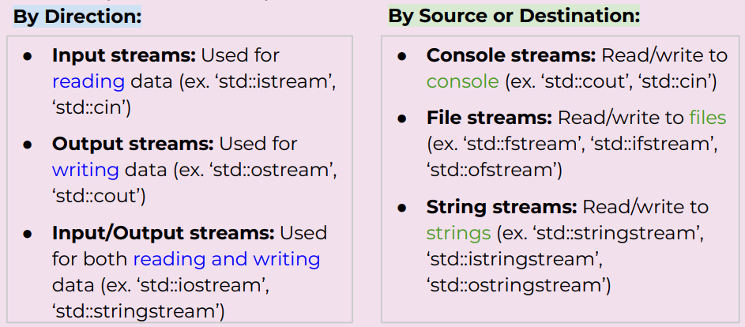

## Output Streams?
1.`Output Streams`

* Have type `std::ostream`

* You can only send data to the stream 
    * Interact with the stream using the << operator
    
    * Converts any type into string and sends it to the stream

* `std::cout` is the output stream that goes to the console

```cpp
std::cout << 5 << std::endl; 
 // converts int value 5 to string “5”
 // sends “5” to the console output stream
```

2.`Output File Streams`

* Have type `std::ofstream`

* You can only send data to file using the << operator
    * Converts data of any type into a string and sends it to the file stream

* Must initialize your own ofstream object linked to your file
```cpp
std::ofstream out(“out.txt”);
// out is now an ofstream that outputs to out.txt
out << 5 << std::endl; // out.txt contains 5
```

std::cout is a global constant object that you get from #include <iostream>

To use any other output stream, you must first initialize it!

## Input streams

### Definition

* Have type std::istream
    * You can only receive strings using the >> operator
        * Receives a string from the stream and converts it to data
    * std::cin is the input stream that gets input from the console

### >> << operator
* “>>” is the **stream extraction operator** or simply extraction operator
    * Used to extract data from a stream and place it into a variable
* “<<” is the **stream insertion operator** or insertion operator 
    * Used to insert data into a stream usually to output the data to a file, console, or string

### std::cin
`std::cin` is an input stream. It has type `std::istream`

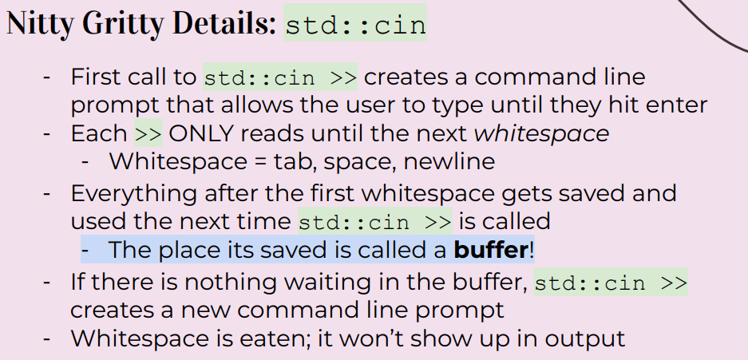

!!! example
    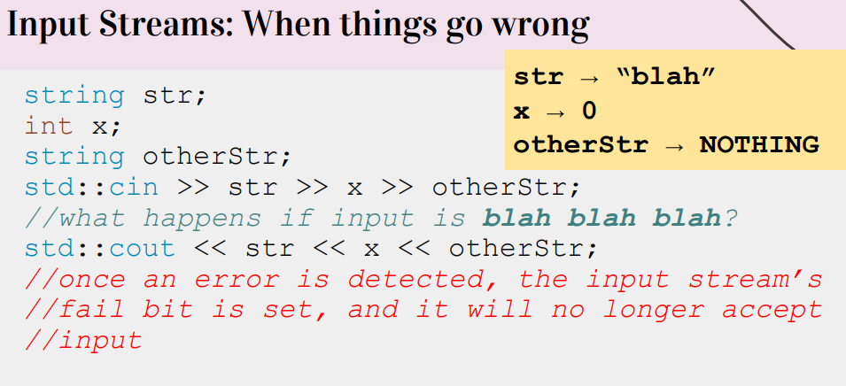

!!! example
    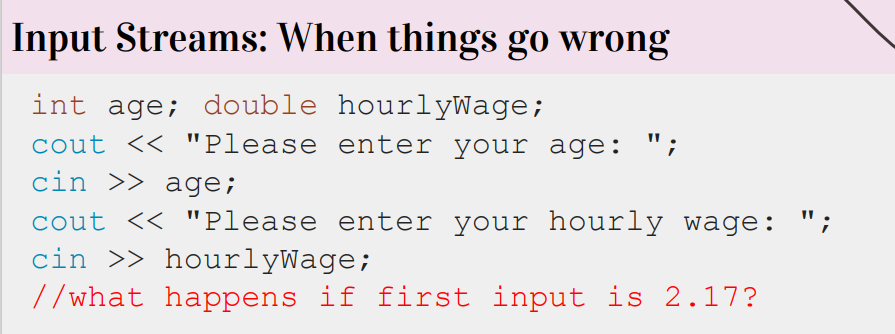

    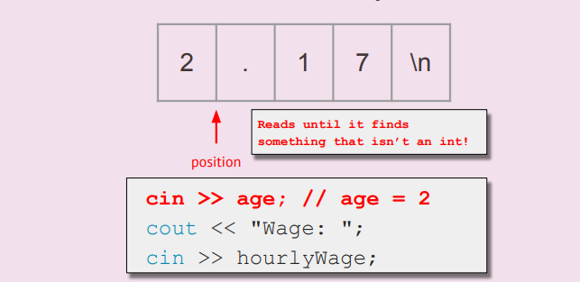

    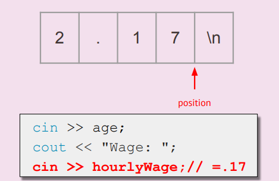

### std::getline()

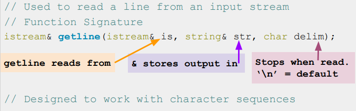

How it works:

* Clears contents in str

* Extracts chars from is and stores them in str until: 

    * End of file reached, sets EOF bit (checked using is.eof())

    * Next char in is is delim, extracts but does not store delim

    * str out of space, sets FAIL bit (checked using is.fail())

    * If no chars extracted for any reason, FAIL bit set

!!! tip
    * In contrast,">>" only **reads until it hits whitespace**(so can't read a sentence in one go)

    * But ">>" can **convert data to built-in types** (like ints) while getline can only produce strings

    * And ">>" only stops reading at predefined whitespace while getline can stop reading at any delimiter you define

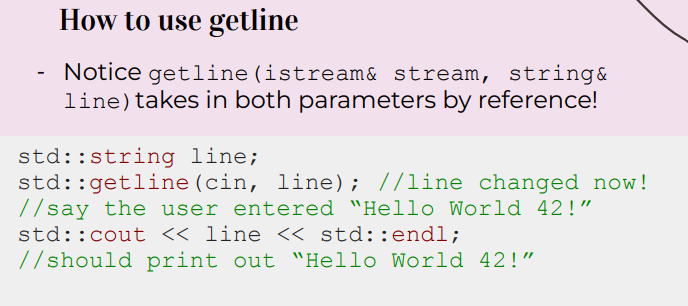

下一次cin才会把whitespace comsume掉

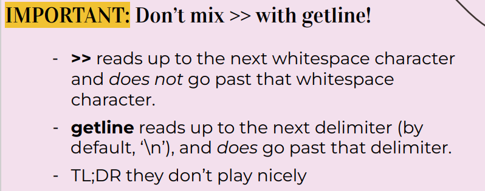

### Input File Streams

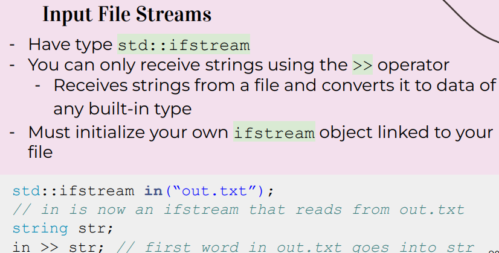

std::cin is a global constant object that you get from **#include iostream**

## Stringstreams

### Definition
A stream that can read from or write to a string object

Allows you to perform input/output operations on a string as if it were a stream 

```cpp
std::string input = "123";
std::stringstream stream(input);
int number;
stream >> number;
std::cout << number << std::endl; // Outputs "123"
```

### Example

If you only want to read OR write data:

Read only: std::istringstream

- Give any data type to the istringstream, it’ll store it as a string!

Write only: std::ostringstream

- Make an ostringstream out of a string, read from it word/type by word/type!

Follows same patterns as the other i/ostreams!

```cpp
#include <iostream>
#include <fstream>
#include <sstream>

int main() {
    std::ifstream file("data.txt");
    std::string line;
    int lineNum = 1;
    while (std::getline(file, line)) {
        std::stringstream ss(line);
        int a, b, c;
        ss >> a >> b >> c;
        std::cout << "The sum of the numbers on line " <<  lineNum << " is: " << a + b + c << std::endl;
        lineNum++;
    }

    return 0;
}
/*
data.txt
1 2 3
4 5 6
7 8 9
*/
```

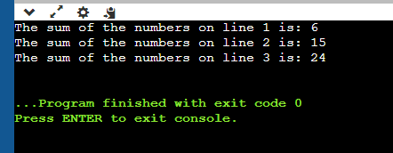

## Recap

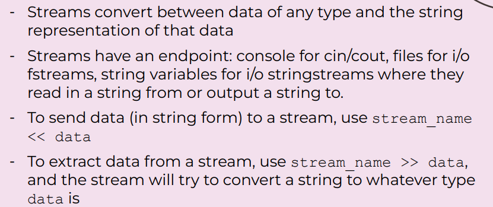