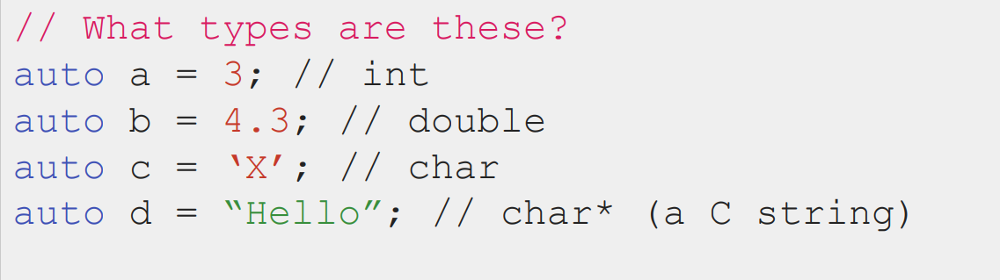

# C++ types and structs
- [ ] Version
    * [x] lhn
    * [x] 2023-1-7 
    * [x] learning C++ types and structs
    * [ ] review

!!! info
    * C++ Basics

        * Comparing to other languages you might know
    * Types

        * Working with a statically typed language（意味着你正在使用一种静态类型的编程语言进行编程。在这类语言中，变量的类型是在编译时确定的，也就是说，类型检查是在程序运行之前进行的）
    * Structs

        * …and pairs and structured binding

## 1.C++ Basics
C++由**C++标准语法**和**标准模板库（STL）**组成

## 2.C++ Types

### 静态类型和动态类型
当我们说 "C++ is a statically typed language" 时，意味着在C++中，所有具有名称的实体（如变量、函数等）都必须在程序运行之前被赋予一个明确的类型。这个类型定义了实体可以存储的数据种类，以及可以对其执行的操作类型。类型检查主要发生在编译阶段，也就是在程序代码转换成可执行文件之前。因此，任何类型不匹配或者类型错误都会在编译时被捕获。

相比之下，在动态类型语言（dynamically typed）如Python中，变量、函数等命名实体的类型是在程序运行时（runtime）根据当前赋给实体的值来决定的。

`Runtime`: Period when program is executing commands (after compilation, if compiled)

### 函数重载

C++允许指定参数的默认值，如下图：

## 3.Structs
强类型和静态类型的编程语言，如C++、Java和Rust，有许多在开发过程中的优点，比如提高性能、早期错误检测以及增加代码的可读性。然而，这些语言也存在一些缺点：

* 变量类型可能难以识别：

在强类型和静态类型的语言中，每个变量都必须有明确的类型。然而，在代码的阅读或者维护过程中，要知道某个变量的具体类型可能是件麻烦事。与之相比，动态类型语言（如Python）允许更大程度的灵活性，因为变量可以在运行时改变类型。

!!! quote
    `auto`: a keyword used in lieu of type when declaring a variable that tells the compiler to **deduce the type**.The compiler is able to determine the type itself without being explicitly told.

* 函数只能有一个确切的返回类型：

在强类型的语言中，一个函数的返回值只能有一个确定的类型。这意味着你不能让一个函数根据不同的条件返回不同类型的数据。这种限制可能会影响到函数设计，并且在某些情况下，可能需要引入额外的结构或类来封装不同类型的返回结果。

* 原始类型和标准模板库（STL）类型可能有限：

C++中的原始类型（如int, float, double等）在表示范围和精度方面有固定的限制。此外，即使是C++标准模板库（STL）中提供的类型，也可能不适合所有应用场景。

可以使用struct来解决上面的问题

在编程中，struct（结构体）是一种复合数据类型，它允许程序员将不同类型的变量组织在一起，并赋予每个变量一个名称。

STL也有它自己的structs

## 4.Recap

