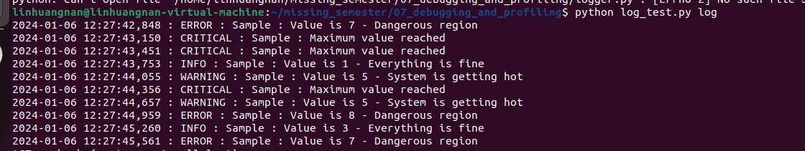
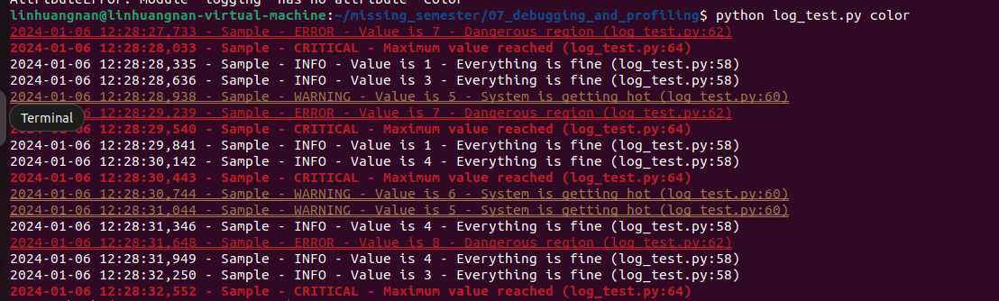
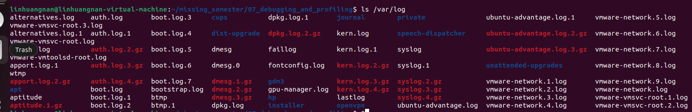
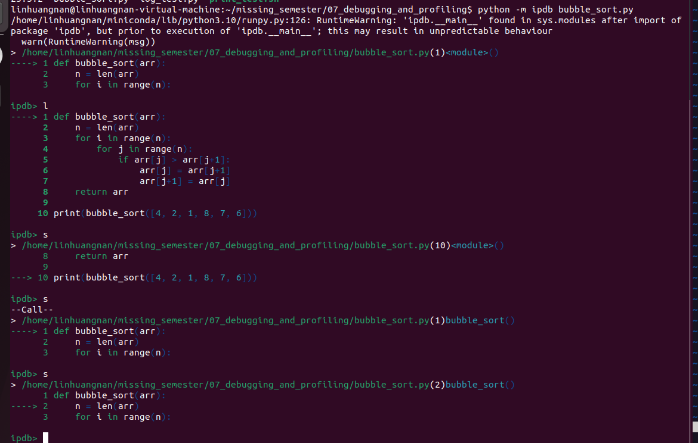
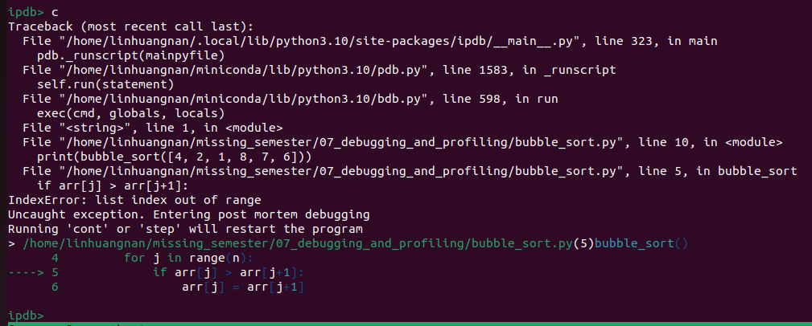
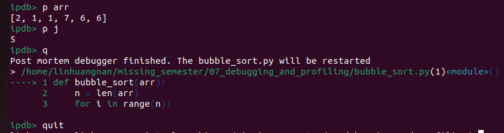
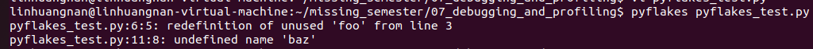
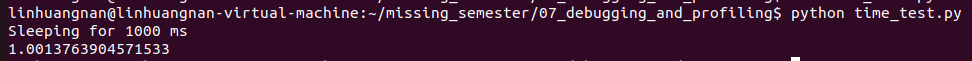

# 命令行环境
- [ ] Version
    * [x] lhn
    * [x] 2023-12-20 
    * [x] learning debugging and profiling
    * [ ] review

!!! info
    * 处理代码中的 bug
    * 优化程序性能

## 调试代码

### 打印调试法与日志
!!! quote
    “最有效的 debug 工具就是细致的分析，配合恰当位置的打印语句” — Brian

调试代码的第一种方法往往是在您发现问题的地方添加一些打印语句

另外一个方法是使用日志，而不是临时添加打印语句。日志较普通的打印语句有如下的一些优势：

* 可以将日志写入文件、socket 或者甚至是发送到远端服务器而不仅仅是标准输出；
* 日志可以支持严重等级（例如 INFO, DEBUG, WARN, ERROR等），这使得可以根据需要过滤日志；
* 对于新发现的问题，很可能在日志中已经包含了可以帮助您定位问题的足够的信息。

```python
import logging
import sys

class CustomFormatter(logging.Formatter):
    """Logging Formatter to add colors and count warning / errors"""

    grey = "\x1b[38;21m"
    yellow = "\x1b[33;21m"
    red = "\x1b[31;21m"
    bold_red = "\x1b[31;1m"
    reset = "\x1b[0m"
    format = "%(asctime)s - %(name)s - %(levelname)s - %(message)s (%(filename)s:%(lineno)d)"

    FORMATS = {
        logging.DEBUG: grey + format + reset,
        logging.INFO: grey + format + reset,
        logging.WARNING: yellow + format + reset,
        logging.ERROR: red + format + reset,
        logging.CRITICAL: bold_red + format + reset
    }

    def format(self, record):
        log_fmt = self.FORMATS.get(record.levelno)
        formatter = logging.Formatter(log_fmt)
        return formatter.format(record)

# create logger with 'spam_application'
logger = logging.getLogger("Sample")

# create console handler with a higher log level
ch = logging.StreamHandler()
ch.setLevel(logging.DEBUG)

if len(sys.argv)> 1:
    if sys.argv[1] == 'log':
        ch.setFormatter(logging.Formatter('%(asctime)s : %(levelname)s : %(name)s : %(message)s'))
    elif sys.argv[1] == 'color':
        ch.setFormatter(CustomFormatter())

if len(sys.argv) > 2:
    logger.setLevel(logging.__getattribute__(sys.argv[2]))
else:
    logger.setLevel(logging.DEBUG)

logger.addHandler(ch)

# logger.debug("debug message")
# logger.info("info message")
# logger.warning("warning message")
# logger.error("error message")
# logger.critical("critical message")

import random
import time
for _ in range(100):
    i = random.randint(0, 10)
    if i <= 4:
        logger.info("Value is {} - Everything is fine".format(i))
    elif i <= 6:
        logger.warning("Value is {} - System is getting hot".format(i))
    elif i <= 8:
        logger.error("Value is {} - Dangerous region".format(i))
    else:
        logger.critical("Maximum value reached")
    time.sleep(0.3)
```

运行 `python log_test.py log`,会进行Log的格式化输出



运行 `python log_test.py log`,会进行Log的格式化输出，并且加上颜色渲染



`ls` 和 `grep` 这样的程序会使用 `ANSI escape codes`，它是一系列的特殊字符，可以使 `shell` 改变输出结果的颜色。例如，执行 `echo -e "\e[38;2;255;0;0mThis is red\e[0m"` 会打印红色的字符串：This is red 。
!!! example
    ```sh
        #!/usr/bin/env bash
        for R in $(seq 0 20 255); do
            for G in $(seq 0 20 255); do
                for B in $(seq 0 20 255); do
                    printf "\e[38;2;${R};${G};${B}m█\e[0m";
                done
            done
        done
    ```

运行结果如下：


### 第三方日志系统

大多数的程序都会将日志保存在系统中的某个地方。对于 UNIX 系统来说，程序的日志通常存放在 /var/log。例如， NGINX web 服务器就将其日志存放于/var/log/nginx。



目前，系统开始使用 system log，所有的日志都会保存在这里。大多数（但不是全部的）Linux 系统都会使用 systemd，这是一个系统守护进程，它会控制系统中的很多东西，例如哪些服务应该启动并运行。systemd 会将日志以某种特殊格式存放于/var/log/journal，可以使用 journalctl 命令显示这些消息。

对于大多数的 UNIX 系统，也可以使用dmesg 命令来读取内核的日志。

如果希望将日志加入到系统日志中，可以使用 logger 这个 shell 程序。下面这个例子显示了如何使用 logger并且如何找到能够将其存入系统日志的条目。

```sh
logger "Hello Logs"
# On macOS
log show --last 1m | grep Hello
# On Linux
journalctl --since "1m ago" | grep Hello
```

### 调试器

当通过打印已经不能满足调试需求时，应该使用调试器。

调试器是一种可以允许我们和正在执行的程序进行交互的程序，它可以做到：

* 当到达某一行时将程序暂停；
* 一次一条指令地逐步执行程序；
* 程序崩溃后查看变量的值；
* 满足特定条件时暂停程序；
* 其他高级功能。

很多编程语言都有自己的调试器。Python 的调试器是pdb。

下面对pdb 支持的命令进行简单的介绍：

* l(ist) - 显示当前行附近的11行或继续执行之前的显示；
* s(tep) - 执行当前行，并在第一个可能的地方停止；
* n(ext) - 继续执行直到当前函数的下一条语句或者 return 语句；
* b(reak) - 设置断点（基于传入的参数）；
* p(rint) - 在当前上下文对表达式求值并打印结果。还有一个命令是pp ，它使用 pprint 打印；
* r(eturn) - 继续执行直到当前函数返回；
* q(uit) - 退出调试器。

用ipdb调试程序

```python
    def bubble_sort(arr):
    n = len(arr)
    for i in range(n):
        for j in range(n):
            if arr[j] > arr[j+1]:
                arr[j] = arr[j+1]
                arr[j+1] = arr[j]
    return arr

    print(bubble_sort([4, 2, 1, 8, 7, 6]))
```
输入如下命令

`python -m ipdb bubble_sort.py`





打印arr的值和j的值，发现数组越界了，因此源代码的 `j in range(n)` 应该改为 `j in range(n-1)`



`b 6`  `c`在第六行设置断点，再运行到第六行

`p locals()` 查看局部变量

对于更底层的编程语言，可能需要了解一下 gdb ( 以及它的改进版 pwndbg) 和 lldb。

它们都对类 C 语言的调试进行了优化，它允许您探索任意进程及其机器状态：寄存器、堆栈、程序计数器等。

### 专门工具

即使需要调试的程序是一个二进制的黑盒程序，仍然有一些工具可以使用。

当程序需要执行一些只有操作系统内核才能完成的操作时，它需要使用 `系统调用`。有一些命令可以帮助追踪程序执行的系统调用。在 Linux 中可以使用`strace`

下面的例子展现来如何使用 strace 来显示ls 执行时，对stat 系统调用进行追踪的结果。

!!! note
    stat 系统调用是在类Unix（如Linux）操作系统中用来获取文件或者文件系统状态信息的一个接口。通过这个系统调用，程序可以检索文件的各种属性，包括：

    * 文件大小
    * 文件权限
    * 所有者和所属组
    * 时间戳（最后访问时间、最后修改时间、状态改变时间）
    * 文件类型（普通文件、目录、符号链接等）

!!! example
    ```
        sudo strace -e trace=lstat ls -l > /dev/null
    ```
    `-e trace=lstat`: 这个选项告诉 strace 只跟踪 lstat 系统调用。lstat 是类似于 stat 的系统调用，但它会返回符号链接本身的信息，而不是链接指向的文件的信息。
    `> /dev/null`: 将 ls 的标准输出重定向到 /dev/null，也就是说不在终端上显示文件列表。

### 静态分析

有些问题是您不需要执行代码就能发现的。例如，仔细观察一段代码，您就能发现某个循环变量覆盖了某个已经存在的变量或函数名；或是有个变量在被读取之前并没有被定义。 这种情况下 静态分析 工具就可以帮我们找到问题。静态分析会将程序的源码作为输入然后基于编码规则对其进行分析并对代码的正确性进行推理。

下面这段 Python 代码中存在几个问题。 首先，我们的循环变量foo 覆盖了之前定义的函数foo。最后一行，我们还把 bar 错写成了baz，因此当程序完成sleep (一分钟)后，执行到这一行的时候便会崩溃。

```python
import time

def foo():
    return 42

for foo in range(5):
    print(foo)
bar = 1
bar *= 0.2
time.sleep(60)
print(baz)
```

静态分析工具可以发现此类的问题。当我们使用pyflakes 分析代码的时候，我们会得到与这两处 bug 相关的错误信息。



 shellcheck，这是一个类似的工具，但它是应用于 shell 脚本的。

!!! quote
     要检查一个脚本文件，只需在命令行上指定该文件的路径即可：  

     `shellcheck script.sh`

     要检查来自标准输入的脚本文本

     如果有一段脚本代码而不是文件，并想要检查它，可以通过管道将脚本内容传递给 shellcheck：
     ```
     bash
     echo "echo \$1" | shellcheck -
     ```
     这里的 - 告诉 shellcheck 从标准输入读取脚本。

大多数的编辑器和 IDE 都支持在编辑界面显示这些工具的分析结果、高亮有警告和错误的位置。 这个过程通常称为 code linting 。风格检查或安全检查的结果同样也可以进行相应的显示。

## 性能分析

即使代码能够像您期望的一样运行，但是如果它消耗了全部的 CPU 和内存，那么它显然也不是个好程序。算法课上我们通常会介绍大O标记法，但却没教给我们如何找到程序中的热点。 因此需要学习性能分析和监控工具，它们会帮助找到程序中最耗时、最耗资源的部分，这样您就可以有针对性的进行性能优化。

### 计时
```python
import time, random
n = random.randint(1, 10) * 100

# 获取当前时间 
start = time.time()

# 执行一些操作
print("Sleeping for {} ms".format(n))
time.sleep(n/1000)

# 比较当前时间和起始时间
print(time.time() - start)
```


不过，执行时间（wall clock time）也可能会误导您，因为您的电脑可能也在同时运行其他进程，也可能在此期间发生了等待。 对于工具来说，需要区分真实时间、用户时间和系统时间。通常来说，用户时间+系统时间代表了您的进程所消耗的实际 CPU

* 真实时间 - 从程序开始到结束流失掉的真实时间，包括其他进程的执行时间以及阻塞消耗的时间（例如等待 I/O或网络）；
* User - CPU 执行用户代码所花费的时间；
* Sys - CPU 执行系统内核代码所花费的时间。

例如，试着执行一个用于发起 HTTP 请求的命令并在其前面添加 time 前缀。网络不好的情况下您可能会看到下面的输出结果。请求花费了 2s 才完成，但是进程仅花费了 15ms 的 CPU 用户时间和 12ms 的 CPU 内核时间。

```sh
    $ time curl https://bing.com &> /dev/null
    real    0m2.561s
    user    0m0.015s
    sys     0m0.012s
```

### 性能分析工具（profilers）

#### CPU

大多数情况下，当人们提及性能分析工具的时候，通常指的是 CPU 性能分析工具。 CPU 性能分析工具有两种： 追踪分析器（tracing）及采样分析器（sampling）。 追踪分析器 会记录程序的每一次函数调用，而采样分析器则只会周期性的监测（通常为每毫秒）您的程序并记录程序堆栈。它们使用这些记录来生成统计信息，显示程序在哪些事情上花费了最多的时间。

大多数的编程语言都有一些基于命令行的分析器，可以使用它们来分析代码。

在 Python 中，可以使用 cProfile 模块来分析每次函数调用所消耗的时间。 在下面的例子中，实现了一个基础的 grep 命令：

```python
#!/usr/bin/env python

import sys, re

def grep(pattern, file):
    with open(file, 'r') as f:
        print(file)
        for i, line in enumerate(f.readlines()):
            pattern = re.compile(pattern)
            match = pattern.search(line)
            if match is not None:
                print("{}: {}".format(i, line), end="")

if __name__ == '__main__':
    times = int(sys.argv[1])
    pattern = sys.argv[2]
    for i in range(times):
        for file in sys.argv[3:]:
            grep(pattern, file)
```

可以使用下面的命令来对这段代码进行分析。通过它的输出我们可以知道，IO 消耗了大量的时间，编译正则表达式也比较耗费时间。

```sh
    $ python -m cProfile -s tottime grep.py 1000 '^(import|\s*def)[^,]*$' *.py
```