# Git分支

- [ ] Version
    * [x] lin
    * [x] 2023-03-03 
    * [x] git branch
    * [ ] review

## 分布式版本控制

客户端并不只提取最新版本的文件快照， 而是把代码仓库完整地镜像下来，包括完整的历史记录。 这么一来，任何一处协同工作用的服务器发生故障，事后都可以用任何一个镜像出来的本地仓库恢复。 因为每一次的克隆操作，实际上都是一次对代码仓库的完整备份。
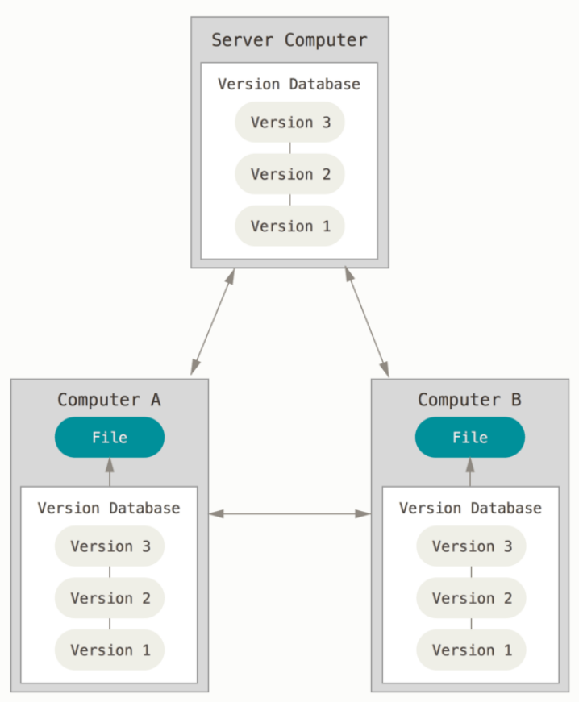

## Git直接记录快照，而非差异比较
Git 更像是把数据看作是对小型文件系统的一系列快照。 在 Git 中，每当你提交更新或保存项目状态时，它基本上就会对当时的全部文件创建一个快照并保存这个快照的索引。 为了效率，如果文件没有修改，Git 不再重新存储该文件，而是只保留一个链接指向之前存储的文件。 Git 对待数据更像是一个 快照流。
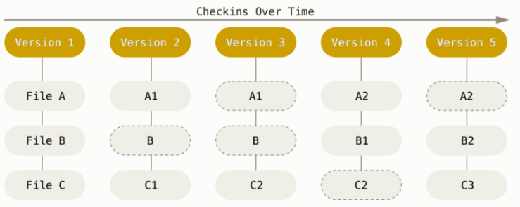

Git 中所有的数据在存储前都计算校验和，然后以校验和来引用。 这意味着不可能在 Git 不知情时更改任何文件内容或目录内容。

Git 用以计算校验和的机制叫做 SHA-1 散列（hash，哈希）。 这是一个由 40 个十六进制字符（0-9 和 a-f）组成的字符串，基于 Git 中文件的内容或目录结构计算出来。实际上，Git 数据库中保存的信息都是以文件内容的哈希值来索引，而不是文件名。

## 三种状态

已提交（committed）、已修改（modified） 和 已暂存（staged）。

已修改表示修改了文件，但还没保存到数据库中。

已暂存表示对一个已修改文件的当前版本做了标记，使之包含在下次提交的快照中。

已提交表示数据已经安全地保存在本地数据库中。

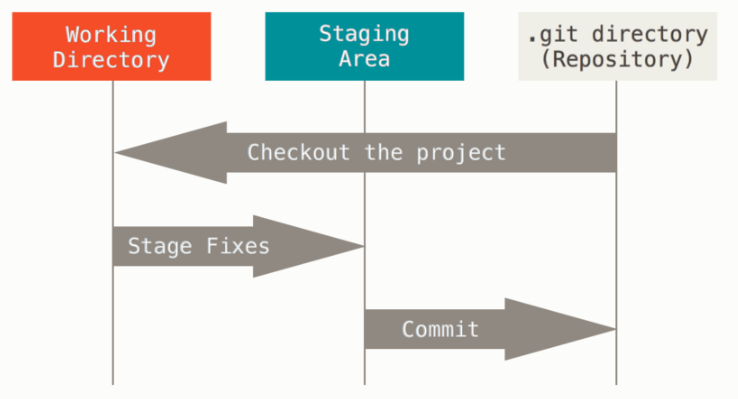

工作区是对项目的某个版本独立提取出来的内容。 这些从 Git 仓库的压缩数据库中提取出来的文件，放在磁盘上供你使用或修改。

暂存区是一个文件，保存了下次将要提交的文件列表信息，一般在 Git 仓库目录中。 按照 Git 的术语叫做“索引”，不过一般说法还是叫“暂存区”。

Git 仓库目录是 Git 用来保存项目的元数据和对象数据库的地方。 这是 Git 中最重要的部分，从其它计算机克隆仓库时，复制的就是这里的数据。

基本的 Git 工作流程如下：

在工作区中修改文件。

将你想要下次提交的更改选择性地暂存，这样只会将更改的部分添加到暂存区。

提交更新，找到暂存区的文件，将快照永久性存储到 Git 目录。

## Git 分支简介

几乎所有的版本控制系统都以某种形式支持分支。 使用分支意味着你可以把你的工作从开发主线上分离开来，以免影响开发主线。 

Git 处理分支的方式可谓是难以置信的轻量，创建新分支这一操作几乎能在瞬间完成，并且在不同分支之间的切换操作也是一样便捷。 与许多其它版本控制系统不同，Git 鼓励在工作流程中频繁地使用分支与合并。

在进行提交操作时，Git 会保存一个提交对象（commit object）。 该提交对象会包含一个指向暂存内容快照的指针，还包含了作者的姓名和邮箱、提交时输入的信息以及指向它的父对象的指针。首次提交产生的提交对象没有父对象，普通提交操作产生的提交对象有一个父对象， 而由多个分支合并产生的提交对象有多个父对象。

为了更加形象地说明，我们假设现在有一个工作目录，里面包含了三个将要被暂存和提交的文件。 暂存操作会为每一个文件计算校验和（使用SHA-1 哈希算法），然后会把当前版本的文件快照保存到 Git 仓库中 （Git 使用 blob 对象来保存它们），最终将校验和加入到暂存区域等待提交。

```shell
$ git add README test.rb LICENSE
$ git commit -m 'The initial commit of my project'
```

当使用 git commit 进行提交操作时，Git 会先计算每一个子目录（本例中只有项目根目录）的校验和， 然后在 Git 仓库中这些校验和保存为树对象。随后，Git 便会创建一个提交对象， 它除了包含上面提到的那些信息外，还包含指向这个树对象（项目根目录）的指针。 如此一来，Git 就可以在需要的时候重现此次保存的快照。

现在，Git 仓库中有五个对象：三个 blob 对象（保存着文件快照）、一个 树 对象 （记录着目录结构和 blob 对象索引）以及一个 提交 对象（包含着指向前述树对象的指针和所有提交信息）。

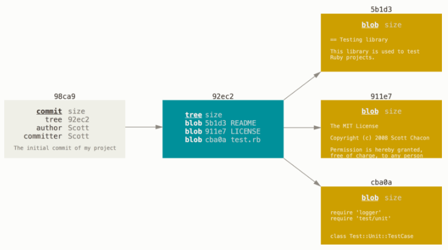

做些修改后再次提交，那么这次产生的提交对象会包含一个指向上次提交对象（父对象）的指针。

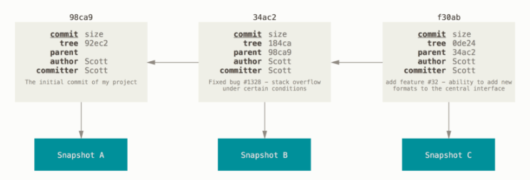

Git 的分支，其实本质上仅仅是指向提交对象的可变指针。 Git 的默认分支名字是 master。 在多次提交操作之后，你其实已经有一个指向最后那个提交对象的 master 分支。 master 分支会在每次提交时自动向前移动。

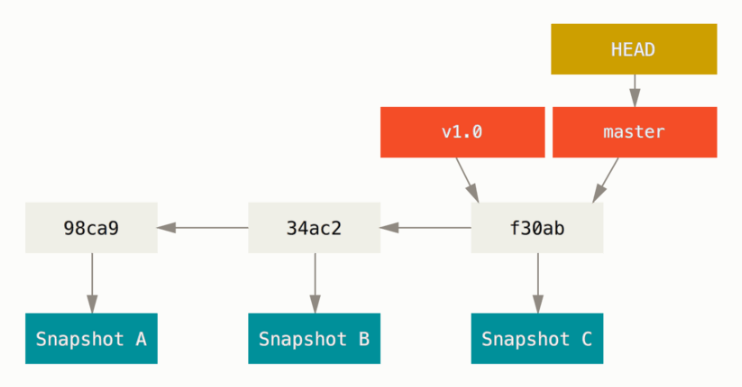

### 分支创建
```shell
$ git branch testing
```
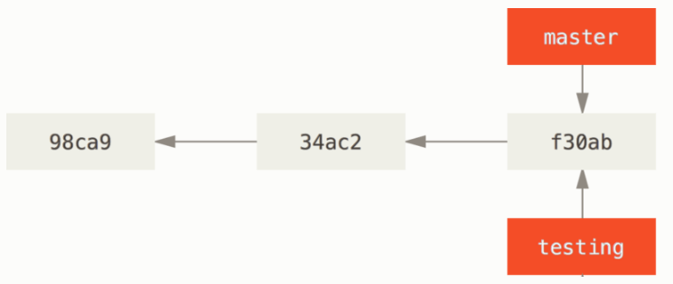

那么，Git 又是怎么知道当前在哪一个分支上呢？ 也很简单，它有一个名为 HEAD 的特殊指针。
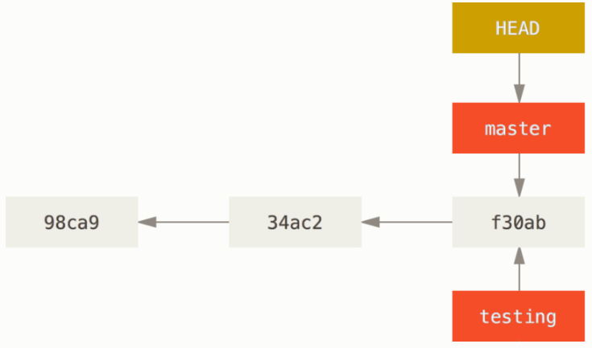

Figure 13. HEAD 指向当前所在的分支
你可以简单地使用 git log 命令查看各个分支当前所指的对象。 提供这一功能的参数是 --decorate。
```shell
$ git log --oneline --decorate
f30ab (HEAD -> master, testing) add feature #32 - ability to add new formats to the central interface
34ac2 Fixed bug #1328 - stack overflow under certain conditions
98ca9 The initial commit of my project
正如你所见，当前 master 和 testing 分支均指向校验和以 f30ab 开头的提交对象。
```

### 分支切换
要切换到一个已存在的分支，你需要使用 git checkout 命令。 我们现在切换到新创建的 testing 分支去：
```shell
$ git checkout testing
```
这样 HEAD 就指向 testing 分支了。
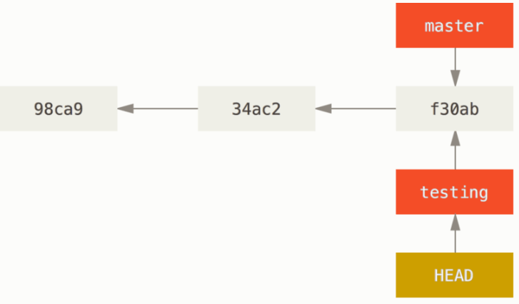

Figure 14. HEAD 指向当前所在的分支
那么，这样的实现方式会给我们带来什么好处呢？ 现在不妨再提交一次：
```shell
$ vim test.rb
$ git commit -a -m 'made a change'
```
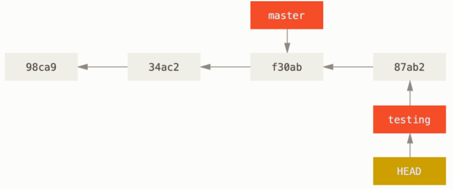

如图所示，你的 testing 分支向前移动了，但是 master 分支却没有，它仍然指向运行 git checkout 时所指的对象。 现在我们切换回 master 分支看看：
```shell
$ git checkout master
```
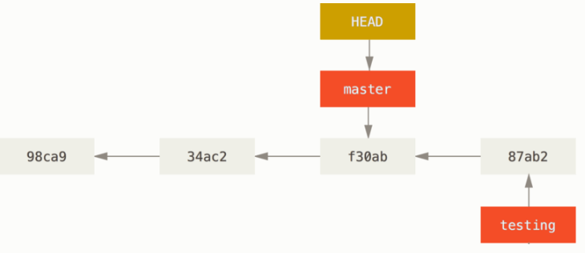

我们不妨再稍微做些修改并提交：
```shell
$ vim test.rb
$ git commit -a -m 'made other changes'
```
现在，这个项目的提交历史已经产生了分叉。 因为刚才你创建了一个新分支，并切换过去进行了一些工作，随后又切换回 master 分支进行了另外一些工作。 上述两次改动针对的是不同分支：你可以在不同分支间不断地来回切换和工作，并在时机成熟时将它们合并起来。 而所有这些工作，你需要的命令只有 branch、checkout 和 commit。

## 分支的新建与合并

让我们来看一个简单的分支新建与分支合并的例子，实际工作中你可能会用到类似的工作流。 你将经历如下步骤：

1、开发某个网站。

2、为实现某个新的用户需求，创建一个分支。

3、在这个分支上开展工作。

正在此时，你突然接到一个电话说有个很严重的问题需要紧急修补。 你将按照如下方式来处理：

1、切换到你的线上分支（production branch）。

2、为这个紧急任务新建一个分支，并在其中修复它。

3、在测试通过之后，切换回线上分支，然后合并这个修补分支，最后将改动推送到线上分支。

4、切换回你最初工作的分支上，继续工作。

### 新建分支
首先，我们假设你正在你的项目上工作，并且在 master 分支上已经有了一些提交。

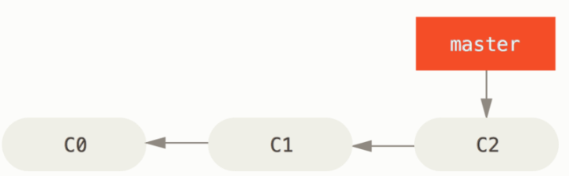

现在，你已经决定要解决你的公司使用的问题追踪系统中的 #53 问题。 想要新建一个分支并同时切换到那个分支上，你可以运行一个带有 -b 参数的 git checkout 命令：
```shell
$ git checkout -b iss53
Switched to a new branch "iss53"
# 它是下面两条命令的简写：

$ git branch iss53
$ git checkout iss53
```


你继续在 #53 问题上工作，并且做了一些提交。 在此过程中，iss53 分支在不断的向前推进，因为你已经检出到该分支 （也就是说，你的 HEAD 指针指向了 iss53 分支）

```shell
$ vim index.html
$ git commit -a -m 'added a new footer [issue 53]'
```

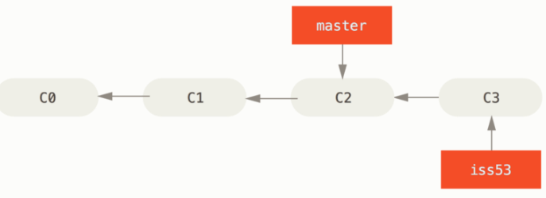

现在你接到那个电话，有个紧急问题等待你来解决。 有了 Git 的帮助，你不必把这个紧急问题和 iss53 的修改混在一起， 你也不需要花大力气来还原关于 53# 问题的修改，然后再添加关于这个紧急问题的修改，最后将这个修改提交到线上分支。 你所要做的仅仅是切换回 master 分支。

但是，在你这么做之前，要留意你的工作目录和暂存区里那些还没有被提交的修改， 它可能会和你即将检出的分支产生冲突从而阻止 Git 切换到该分支。 最好的方法是，在你切换分支之前，保持好一个干净的状态。 有一些方法可以绕过这个问题（即，贮藏（stashing） 和 修补提交（commit amending））。 现在，我们假设你已经把你的修改全部提交了，这时你可以切换回 master 分支了：

```shell
$ git checkout master
Switched to branch 'master'
```

这个时候，你的工作目录和你在开始 #53 问题之前一模一样，现在你可以专心修复紧急问题了。 请牢记：当你切换分支的时候，Git 会重置你的工作目录，使其看起来像回到了你在那个分支上最后一次提交的样子。 Git 会自动添加、删除、修改文件以确保此时你的工作目录和这个分支最后一次提交时的样子一模一样。

接下来，你要修复这个紧急问题。 我们来建立一个 hotfix 分支，在该分支上工作直到问题解决：

```shell
$ git checkout -b hotfix
Switched to a new branch 'hotfix'
$ vim index.html
$ git commit -a -m 'fixed the broken email address'
[hotfix 1fb7853] fixed the broken email address
 1 file changed, 2 insertions(+)
```

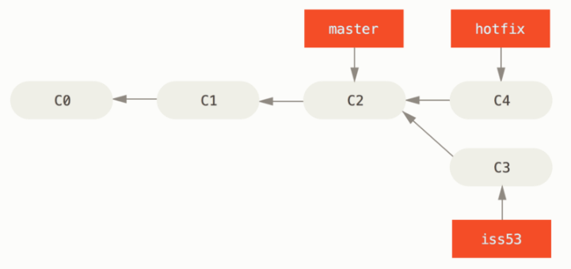

!!! note
    在合并的时候，你应该注意到了“快进（fast-forward）”这个词。 由于你想要合并的分支 hotfix 所指向的提交 C4 是你所在的提交 C2 的直接后继， 因此 Git 会直接将指针向前移动。换句话说，当你试图合并两个分支时， 如果顺着一个分支走下去能够到达另一个分支，那么 Git 在合并两者的时候， 只会简单的将指针向前推进（指针右移），因为这种情况下的合并操作没有需要解决的分歧——这就叫做 “快进（fast-forward）”。

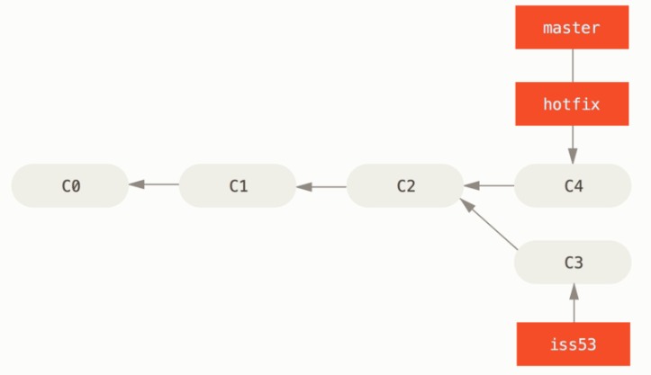

关于这个紧急问题的解决方案发布之后，你准备回到被打断之前时的工作中。 然而，你应该先删除 hotfix 分支，因为你已经不再需要它了 —— master 分支已经指向了同一个位置。 你可以使用带 -d 选项的 git branch 命令来删除分支：

```
$ git branch -d hotfix
Deleted branch hotfix (3a0874c).
```

现在你可以切换回你正在工作的分支继续你的工作，也就是针对 #53 问题的那个分支（iss53 分支）。
```shell
$ git checkout iss53
Switched to branch "iss53"
$ vim index.html
$ git commit -a -m 'finished the new footer [issue 53]'
[iss53 ad82d7a] finished the new footer [issue 53]
1 file changed, 1 insertion(+)
```

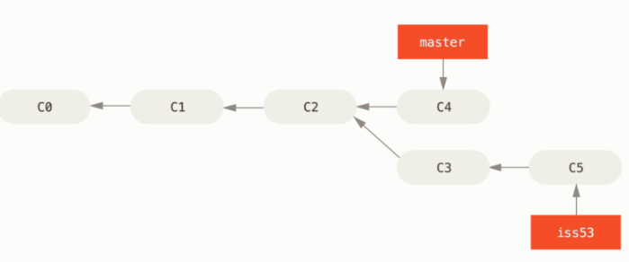

### 分支的合并
假设你已经修正了 #53 问题，并且打算将你的工作合并入 master 分支。 为此，你需要合并 iss53 分支到 master 分支，这和之前你合并 hotfix 分支所做的工作差不多。 你只需要检出到你想合并入的分支，然后运行 git merge 命令：
```shell
$ git checkout master
Switched to branch 'master'
$ git merge iss53
Merge made by the 'recursive' strategy.
index.html |    1 +
1 file changed, 1 insertion(+)
```

这和你之前合并 hotfix 分支的时候看起来有一点不一样。 在这种情况下，你的开发历史从一个更早的地方开始分叉开来（diverged）。 因为，master 分支所在提交并不是 iss53 分支所在提交的直接祖先，Git 不得不做一些额外的工作。 出现这种情况的时候，Git 会使用两个分支的末端所指的快照（C4 和 C5）以及这两个分支的公共祖先（C2），做一个简单的三方合并。
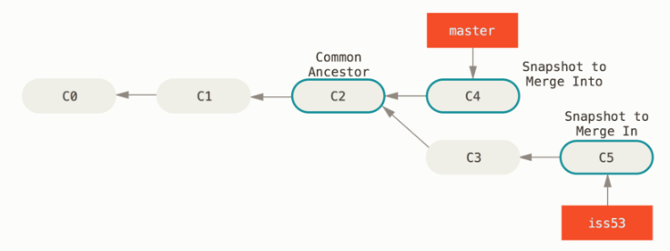

和之前将分支指针向前推进所不同的是，Git 将此次三方合并的结果做了一个新的快照并且自动创建一个新的提交指向它。 这个被称作一次合并提交，它的特别之处在于他有不止一个父提交。
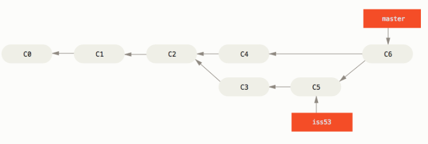

既然你的修改已经合并进来了，就不再需要 iss53 分支了。 现在你可以在任务追踪系统中关闭此项任务，并删除这个分支。
```shell
$ git branch -d iss53
```

### 遇到冲突时的分支合并

有时候合并操作不会如此顺利。 如果你在两个不同的分支中，对同一个文件的同一个部分进行了不同的修改，Git 就没法干净的合并它们。 如果你对 #53 问题的修改和有关 hotfix 分支的修改都涉及到同一个文件的同一处，在合并它们的时候就会产生合并冲突：
```shell
$ git merge iss53
Auto-merging index.html
CONFLICT (content): Merge conflict in index.html
Automatic merge failed; fix conflicts and then commit the result.
```

此时 Git 做了合并，但是没有自动地创建一个新的合并提交。 Git 会暂停下来，等待你去解决合并产生的冲突。 你可以在合并冲突后的任意时刻使用 git status 命令来查看那些因包含合并冲突而处于未合并（unmerged）状态的文件：
```shell
$ git status
On branch master
You have unmerged paths.
  (fix conflicts and run "git commit")

Unmerged paths:
  (use "git add <file>..." to mark resolution)

    both modified:      index.html

no changes added to commit (use "git add" and/or "git commit -a")

```
任何因包含合并冲突而有待解决的文件，都会以未合并状态标识出来。 Git 会在有冲突的文件中加入标准的冲突解决标记，这样你可以打开这些包含冲突的文件然后手动解决冲突。 出现冲突的文件会包含一些特殊区段，看起来像下面这个样子：
```shell
<<<<<<< HEAD:index.html
<div id="footer">contact : email.support@github.com</div>
=======
<div id="footer">
 please contact us at support@github.com
</div>
>>>>>>> iss53:index.html
```
这表示 HEAD 所指示的版本（也就是你的 master 分支所在的位置，因为你在运行 merge 命令的时候已经检出到了这个分支）在这个区段的上半部分（======= 的上半部分），而 iss53 分支所指示的版本在 ======= 的下半部分。 为了解决冲突，你必须选择使用由 ======= 分割的两部分中的一个，或者你也可以自行合并这些内容。 例如，你可以通过把这段内容换成下面的样子来解决冲突：
```shell
<div id="footer">
please contact us at email.support@github.com
</div>
```

上述的冲突解决方案仅保留了其中一个分支的修改，并且 <<<<<<< , ======= , 和 >>>>>>> 这些行被完全删除了。 在你解决了所有文件里的冲突之后，对每个文件使用 git add 命令来将其标记为冲突已解决。 一旦暂存这些原本有冲突的文件，Git 就会将它们标记为冲突已解决。

如果你想使用图形化工具来解决冲突，你可以运行 git mergetool，该命令会为你启动一个合适的可视化合并工具，并带领你一步一步解决这些冲突：

你可以再次运行 git status 来确认所有的合并冲突都已被解决：
```shell
$ git status
On branch master
All conflicts fixed but you are still merging.
  (use "git commit" to conclude merge)

Changes to be committed:

    modified:   index.html
```
如果你对结果感到满意，并且确定之前有冲突的文件都已经暂存了，这时你可以输入 git commit 来完成合并提交。 默认情况下提交信息看起来像下面这个样子：
```shell
Merge branch 'iss53'

Conflicts:
    index.html
#
# It looks like you may be committing a merge.
# If this is not correct, please remove the file
#	.git/MERGE_HEAD
# and try again.


# Please enter the commit message for your changes. Lines starting
# with '#' will be ignored, and an empty message aborts the commit.
# On branch master
# All conflicts fixed but you are still merging.
#
# Changes to be committed:
#	modified:   index.html
#
```

## 分支管理
现在已经创建、合并、删除了一些分支，让我们看看一些常用的分支管理工具。

`git branch` 命令不只是可以创建与删除分支。 如果不加任何参数运行它，会得到当前所有分支的一个列表：
```shell
$ git branch
  iss53
* master
  testing
```

注意 master 分支前的 * 字符：它代表现在检出的那一个分支（也就是说，当前 HEAD 指针所指向的分支）。 这意味着如果在这时候提交，master 分支将会随着新的工作向前移动。 如果需要查看每一个分支的最后一次提交，可以运行 git branch -v 命令：

```shell
$ git branch -v
  iss53   93b412c fix javascript issue
* master  7a98805 Merge branch 'iss53'
  testing 782fd34 add scott to the author list in the readmes
```

--merged 与 --no-merged 这两个有用的选项可以过滤这个列表中已经合并或尚未合并到当前分支的分支。 如果要查看哪些分支已经合并到当前分支，可以运行 git branch --merged：
```shell
$ git branch --merged
  iss53
* master
```

因为之前已经合并了 iss53 分支，所以现在看到它在列表中。 在这个列表中分支名字前没有 * 号的分支通常可以使用 git branch -d 删除掉；你已经将它们的工作整合到了另一个分支，所以并不会失去任何东西。

查看所有包含未合并工作的分支，可以运行 git branch --no-merged：

```shell
$ git branch --no-merged
  testing
```

这里显示了其他分支。 因为它包含了还未合并的工作，尝试使用 git branch -d 命令删除它时会失败：
```shell
$ git branch -d testing
error: The branch 'testing' is not fully merged.
If you are sure you want to delete it, run 'git branch -D testing'.
```

## 分支开发工作流
在本节，我们会介绍一些常见的利用分支进行开发的工作流程。

### 长期分支

许多使用 Git 的开发者都喜欢使用这种方式来工作，比如只在 master 分支上保留完全稳定的代码——有可能仅仅是已经发布或即将发布的代码。 他们还有一些名为 develop 或者 next 的平行分支，被用来做后续开发或者测试稳定性——这些分支不必保持绝对稳定，但是一旦达到稳定状态，它们就可以被合并入 master 分支了。 这样，在确保这些已完成的主题分支（短期分支，比如之前的 iss53 分支）能够通过所有测试，并且不会引入更多 bug 之后，就可以合并入主干分支中，等待下一次的发布。

事实上我们刚才讨论的，是随着你的提交而不断右移的指针。 稳定分支的指针总是在提交历史中落后一大截，而前沿分支的指针往往比较靠前。

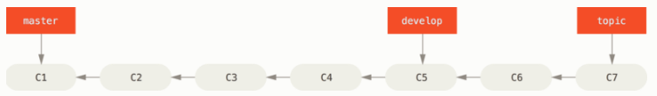

通常把他们想象成流水线（work silos）可能更好理解一点，那些经过测试考验的提交会被遴选到更加稳定的流水线上去。

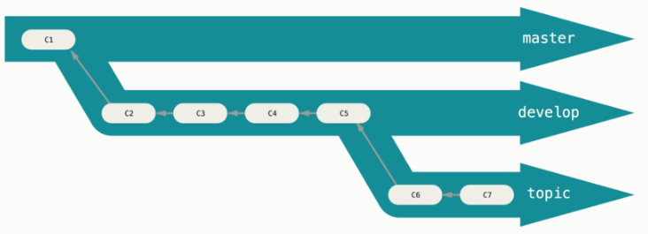

你可以用这种方法维护不同层次的稳定性。 一些大型项目还有一个 proposed（建议） 或 pu: proposed updates（建议更新）分支，它可能因包含一些不成熟的内容而不能进入 next 或者 master 分支。 这么做的目的是使你的分支具有不同级别的稳定性；当它们具有一定程度的稳定性后，再把它们合并入具有更高级别稳定性的分支中。 再次强调一下，使用多个长期分支的方法并非必要，但是这么做通常很有帮助，尤其是当你在一个非常庞大或者复杂的项目中工作时。

### 主题分支

主题分支对任何规模的项目都适用。 主题分支是一种短期分支，它被用来实现单一特性或其相关工作。 也许你从来没有在其他的版本控制系统（VCS）上这么做过，因为在那些版本控制系统中创建和合并分支通常很费劲。 然而，在 Git 中一天之内多次创建、使用、合并、删除分支都很常见。

你已经在上一节中你创建的 iss53 和 hotfix 主题分支中看到过这种用法。 你在上一节用到的主题分支（iss53 和 hotfix 分支）中提交了一些更新，并且在它们合并入主干分支之后，你又删除了它们。 这项技术能使你快速并且完整地进行上下文切换（context-switch）——因为你的工作被分散到不同的流水线中，在不同的流水线中每个分支都仅与其目标特性相关，因此，在做代码审查之类的工作的时候就能更加容易地看出你做了哪些改动。 你可以把做出的改动在主题分支中保留几分钟、几天甚至几个月，等它们成熟之后再合并，而不用在乎它们建立的顺序或工作进度。

考虑这样一个例子，你在 master 分支上工作到 C1，这时为了解决一个问题而新建 iss91 分支，在 iss91 分支上工作到 C4，然而对于那个问题你又有了新的想法，于是你再新建一个 iss91v2 分支试图用另一种方法解决那个问题，接着你回到 master 分支工作了一会儿，你又冒出了一个不太确定的想法，你便在 C10 的时候新建一个 dumbidea 分支，并在上面做些实验。 你的提交历史看起来像下面这个样子：

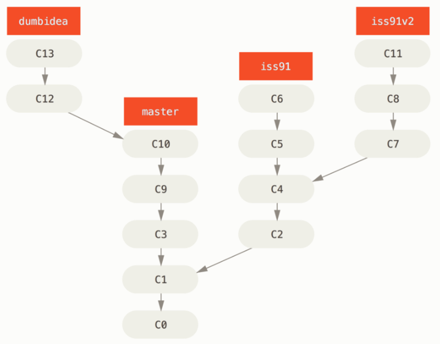

现在，我们假设两件事情：你决定使用第二个方案来解决那个问题，即使用在 iss91v2 分支中方案。 另外，你将 dumbidea 分支拿给你的同事看过之后，结果发现这是个惊人之举。 这时你可以抛弃 iss91 分支（即丢弃 C5 和 C6 提交），然后把另外两个分支合并入主干分支。 最终你的提交历史看起来像下面这个样子：

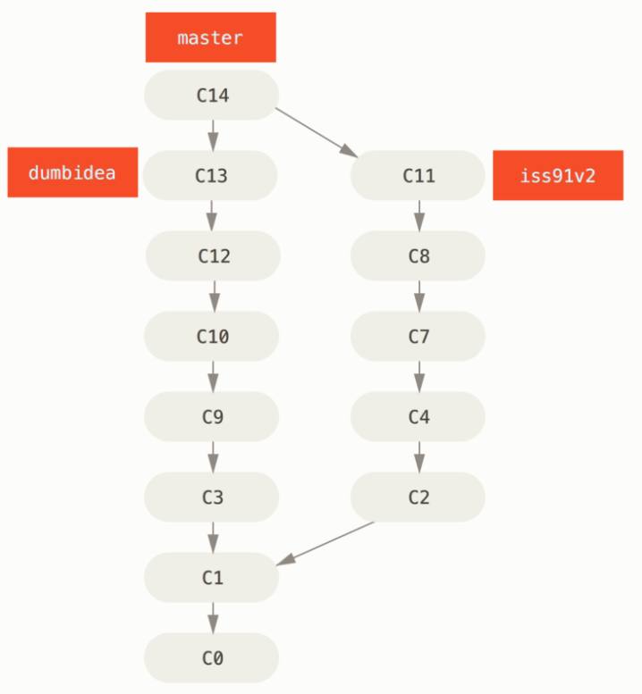

## Git 分支 - 远程分支
### 远程分支
远程引用是对远程仓库的引用（指针），包括分支、标签等等。 你可以通过 git ls-remote [remote] 来显式地获得远程引用的完整列表， 或者通过 git remote show [remote] 获得远程分支的更多信息。 然而，一个更常见的做法是利用远程跟踪分支。

远程跟踪分支是远程分支状态的引用。它们是你无法移动的本地引用。一旦你进行了网络通信， Git 就会为你移动它们以精确反映远程仓库的状态。请将它们看做书签， 这样可以提醒你该分支在远程仓库中的位置就是你最后一次连接到它们的位置。

它们以 [remote]/[branch] 的形式命名。 例如，如果你想要看你最后一次与远程仓库 origin 通信时 master 分支的状态，你可以查看 origin/master 分支。 你与同事合作解决一个问题并且他们推送了一个 iss53 分支，你可能有自己的本地 iss53 分支， 然而在服务器上的分支会以 origin/iss53 来表示。

这可能有一点儿难以理解，让我们来看一个例子。 假设你的网络里有一个在 git.ourcompany.com 的 Git 服务器。 如果你从这里克隆，Git 的 clone 命令会为你自动将其命名为 origin，拉取它的所有数据， 创建一个指向它的 master 分支的指针，并且在本地将其命名为 origin/master。 Git 也会给你一个与 origin 的 master 分支在指向同一个地方的本地 master 分支，这样你就有工作的基础。

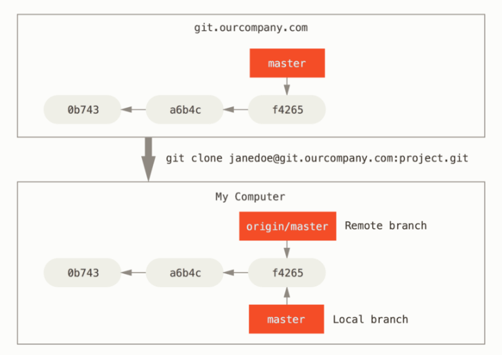
如果你在本地的 master 分支做了一些工作，在同一段时间内有其他人推送提交到 git.ourcompany.com 并且更新了它的 master 分支，这就是说你们的提交历史已走向不同的方向。 即便这样，只要你保持不与 origin 服务器连接（并拉取数据），你的 origin/master 指针就不会移动。

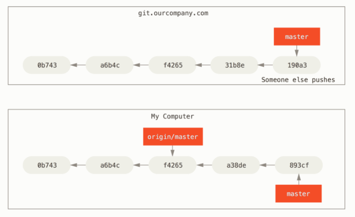

如果要与给定的远程仓库同步数据，运行 git fetch <remote> 命令（在本例中为 git fetch origin）。 这个命令查找 `origin'' 是哪一个服务器（在本例中，它是 `git.ourcompany.com）， 从中抓取本地没有的数据，并且更新本地数据库，移动 origin/master 指针到更新之后的位置。

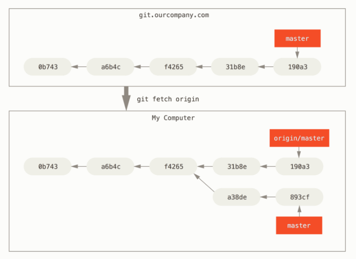

为了演示有多个远程仓库与远程分支的情况，我们假定你有另一个内部 Git 服务器，仅服务于你的某个敏捷开发团队。 这个服务器位于 git.team1.ourcompany.com。 你可以运行 git remote add 命令添加一个新的远程仓库引用到当前的项目，这个命令我们会在 Git 基础 中详细说明。 将这个远程仓库命名为 teamone，将其作为完整 URL 的缩写。

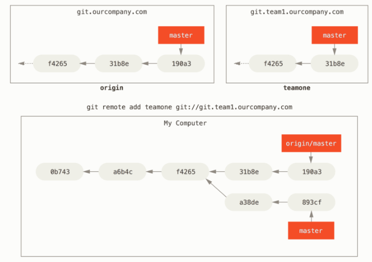

现在，可以运行 git fetch teamone 来抓取远程仓库 teamone 有而本地没有的数据。 因为那台服务器上现有的数据是 origin 服务器上的一个子集， 所以 Git 并不会抓取数据而是会设置远程跟踪分支 teamone/master 指向 teamone 的 master 分支。

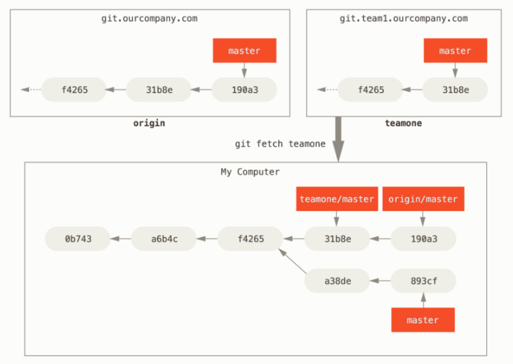

### 推送

当你想要公开分享一个分支时，需要将其推送到有写入权限的远程仓库上。 本地的分支并不会自动与远程仓库同步——你必须显式地推送想要分享的分支。 这样，你就可以把不愿意分享的内容放到私人分支上，而将需要和别人协作的内容推送到公开分支。

如果希望和别人一起在名为 serverfix 的分支上工作，你可以像推送第一个分支那样推送它。 运行 git push [remote] [branch]:
```shell
$ git push origin serverfix
Counting objects: 24, done.
Delta compression using up to 8 threads.
Compressing objects: 100% (15/15), done.
Writing objects: 100% (24/24), 1.91 KiB | 0 bytes/s, done.
Total 24 (delta 2), reused 0 (delta 0)
To https://github.com/schacon/simplegit
 * [new branch]      serverfix -> serverfix
```

这里有些工作被简化了。 Git 自动将 serverfix 分支名字展开为 refs/heads/serverfix:refs/heads/serverfix， 那意味着，“推送本地的 serverfix 分支来更新远程仓库上的 serverfix 分支。” 我们将会详细学习 Git 内部原理 的 refs/heads/ 部分， 但是现在可以先把它放在儿。你也可以运行 git push origin serverfix:serverfix， 它会做同样的事——也就是说“推送本地的 serverfix 分支，将其作为远程仓库的 serverfix 分支” 可以通过这种格式来推送本地分支到一个命名不相同的远程分支。 如果并不想让远程仓库上的分支叫做 serverfix，可以运行 git push origin serverfix:awesomebranch 来将本地的 serverfix 分支推送到远程仓库上的 awesomebranch 分支。

!!! quote
    如何避免每次输入密码

    如果你正在使用 HTTPS URL 来推送，Git 服务器会询问用户名与密码。 默认情况下它会在终端中提示服务器是否允许你进行推送。

    如果不想在每一次推送时都输入用户名与密码，你可以设置一个 “credential cache”。 最简单的方式就是将其保存在内存中几分钟，可以简单地运行 git config --global credential.helper cache 来设置它。

下一次其他协作者从服务器上抓取数据时，他们会在本地生成一个远程分支 origin/serverfix，指向服务器的 serverfix 分支的引用：
```shell
$ git fetch origin
remote: Counting objects: 7, done.
remote: Compressing objects: 100% (2/2), done.
remote: Total 3 (delta 0), reused 3 (delta 0)
Unpacking objects: 100% (3/3), done.
From https://github.com/schacon/simplegit
 * [new branch]      serverfix    -> origin/serverfix
```

要特别注意的一点是当抓取到新的远程跟踪分支时，本地不会自动生成一份可编辑的副本（拷贝）。 换一句话说，这种情况下，不会有一个新的 serverfix 分支——只有一个不可以修改的 origin/serverfix 指针。

可以运行 git merge origin/serverfix 将这些工作合并到当前所在的分支。 如果想要在自己的 serverfix 分支上工作，可以将其建立在远程跟踪分支之上：
```shell
$ git checkout -b serverfix origin/serverfix
Branch serverfix set up to track remote branch serverfix from origin.
Switched to a new branch 'serverfix'
```

### 跟踪分支
从一个远程跟踪分支检出一个本地分支会自动创建所谓的“跟踪分支”（它跟踪的分支叫做“上游分支”）。 跟踪分支是与远程分支有直接关系的本地分支。 如果在一个跟踪分支上输入 git pull，Git 能自动地识别去哪个服务器上抓取、合并到哪个分支。

当克隆一个仓库时，它通常会自动地创建一个跟踪 origin/master 的 master 分支。 然而，如果你愿意的话可以设置其他的跟踪分支，或是一个在其他远程仓库上的跟踪分支，又或者不跟踪 master 分支。 最简单的实例就是像之前看到的那样，运行 git checkout -b [branch] [remote]/[branch]。 这是一个十分常用的操作所以 Git 提供了 --track 快捷方式：

```shell
$ git checkout --track origin/serverfix
Branch serverfix set up to track remote branch serverfix from origin.
Switched to a new branch 'serverfix'
```

由于这个操作太常用了，该捷径本身还有一个捷径。 如果你尝试检出的分支 (a) 不存在且 (b) 刚好只有一个名字与之匹配的远程分支，那么 Git 就会为你创建一个跟踪分支：
```shell
$ git checkout serverfix
Branch serverfix set up to track remote branch serverfix from origin.
Switched to a new branch 'serverfix'
```

如果想要将本地分支与远程分支设置为不同的名字，你可以轻松地使用上一个命令增加一个不同名字的本地分支：
```shell
$ git checkout -b sf origin/serverfix
Branch sf set up to track remote branch serverfix from origin.
Switched to a new branch 'sf'
```

现在，本地分支 sf 会自动从 origin/serverfix 拉取。

设置已有的本地分支跟踪一个刚刚拉取下来的远程分支，或者想要修改正在跟踪的上游分支， 你可以在任意时间使用 -u 或 --set-upstream-to 选项运行 git branch 来显式地设置。
```shell
$ git branch -u origin/serverfix
Branch serverfix set up to track remote branch serverfix from origin.
```

当设置好跟踪分支后，可以通过简写 @{upstream} 或 @{u} 来引用它的上游分支。 所以在 master 分支时并且它正在跟踪 origin/master 时，如果愿意的话可以使用 git merge @{u} 来取代 git merge origin/master。

如果想要查看设置的所有跟踪分支，可以使用 git branch 的 -vv 选项。 这会将所有的本地分支列出来并且包含更多的信息，如每一个分支正在跟踪哪个远程分支与本地分支是否是领先、落后或是都有。
```shell
$ git branch -vv
  iss53     7e424c3 [origin/iss53: ahead 2] forgot the brackets
  master    1ae2a45 [origin/master] deploying index fix
* serverfix f8674d9 [teamone/server-fix-good: ahead 3, behind 1] this should do it
  testing   5ea463a trying something new
```

这里可以看到 iss53 分支正在跟踪 origin/iss53 并且 “ahead” 是 2，意味着本地有两个提交还没有推送到服务器上。 也能看到 master 分支正在跟踪 origin/master 分支并且是最新的。 接下来可以看到 serverfix 分支正在跟踪 teamone 服务器上的 server-fix-good 分支并且领先 3 落后 1， 意味着服务器上有一次提交还没有合并入同时本地有三次提交还没有推送。 最后看到 testing 分支并没有跟踪任何远程分支。

需要重点注意的一点是这些数字的值来自于你从每个服务器上最后一次抓取的数据。 这个命令并没有连接服务器，它只会告诉你关于本地缓存的服务器数据。 如果想要统计最新的领先与落后数字，需要在运行此命令前抓取所有的远程仓库。 可以像这样做：
```shell
$ git fetch --all; git branch -vv
```

### 拉取
当 git fetch 命令从服务器上抓取本地没有的数据时，它并不会修改工作目录中的内容。 它只会获取数据然后让你自己合并。 然而，有一个命令叫作 git pull 在大多数情况下它的含义是一个 git fetch 紧接着一个 git merge 命令。 如果有一个像之前章节中演示的设置好的跟踪分支，不管它是显式地设置还是通过 clone 或 checkout 命令为你创建的，git pull 都会查找当前分支所跟踪的服务器与分支， 从服务器上抓取数据然后尝试合并入那个远程分支。

由于 git pull 的魔法经常令人困惑所以通常单独显式地使用 fetch 与 merge 命令会更好一些。

### 删除远程分支
假设你已经通过远程分支做完所有的工作了——也就是说你和你的协作者已经完成了一个特性， 并且将其合并到了远程仓库的 master 分支（或任何其他稳定代码分支）。 可以运行带有 --delete 选项的 git push 命令来删除一个远程分支。 如果想要从服务器上删除 serverfix 分支，运行下面的命令：
```shell
$ git push origin --delete serverfix
To https://github.com/schacon/simplegit
 - [deleted]         serverfix
```
基本上这个命令做的只是从服务器上移除这个指针。 Git 服务器通常会保留数据一段时间直到垃圾回收运行，所以如果不小心删除掉了，通常是很容易恢复的。