# 【数字IC面试八股文(FIFO相关)】异步FIFO设计详解

- [ ] Version
    * [x] linhuangnan
    * [x] 2024-03-05 
    * [x] 异步FIFO设计
    * [ ] review

!!! info
    * 先从同步FIFO说起
    * 异步FIFO介绍
    * 空满判断
    * 跨时钟域问题
    * 关于格雷码的转换
    * 代码实现异步FIFO
    * 几点思考
    * 写在后面

## 先从同步FIFO说起

同步FIFO，简单地说就是写入FIFO的时钟和读出FIFO的**时钟相同**的FIFO，**FIFO的一个最重要的地方就是空和满的判断**；

对于同步FIFO来说，可以设置计数器，计数器最大值为FIFO深度，最小值为0，该计数器在写使能情况下加一，读使能情况下减一，分别代表着写入一个数据和读出一个数据；计数为0，说明读空，计数为FIFO深度，则说明写满。分别产生相应的空信号和满信号；

关于上期的同步FIFO设计中，还有一个小知识点，那就是关于系统函数`$clog2`。

**$clog2是个什么函数呢？**

$clog2是Verilog--2005标准新增的一个系统函数，**功能就是对输入整数实现以2为底取对数**，其结果向上取整(如5.5取6)。有一点需要说明的是，目前Vivado2017以上的版本都是支持这个系统函数的(Quartus II不清楚 )。

!!! info "$clog2"
    **1、位宽太小**

    在FPGA设计中，我们经常需要用寄存器来寄存某些“数量类”的变量，比如FIFO的深度啦、或者计数器的最大值啦；又或者输入输出信号也需要将位宽用parameter参数化以便更好的调用等。

    举个简单的小例子：系统频率100M（周期10ns），假设需要要求设计一个计时器计时100ns，那么需要计数次数为：100ns/10ns - 1 = 9，9这个数需要用多大位宽的寄存器表示呢？很简单，以2为底取对数就行，答案是最少4位宽。为了方便地复用这个模块，我们把计时时间参数化并放到模块外，如下：

        ```verilog
        module	counter #(
            parameter	TIME = 'd10			//计时时间，单位10ns
        )(
            input		clk_100M	,
            input		rst			
        );
        reg	[3:0]	cnt;					//计数器
        
        //计时器
        always@(posedge clk_100M)begin
            if(rst)
                cnt <= 0;
            else if(cnt == TIME - 1)
                cnt <= 0;
            else
                cnt <= cnt + 1;
        end
        
        endmodule
        ```

    假设我们下次设计需要一个计时器的话，直接调用上面的counter模块并把TIME这个参数改成自己需要的参数就可以，这样做理论上是可以的，只是会有一个致命的隐患。不妨再假设：我现在调用了counter模块，并将TIME设置为20，以实现计时200ns的功能。当TIME  = 20这个参数传递到被例化模块后，可以发现由于cnt寄存器的位宽仅为4位，其能表示的最大值为4'b1111（即十进制下的数字15），每次其到达15后就溢出为0重新开始了，也就是说这个200ns的计时器实际上根本就计数不到200ns。

    这个隐患发生的原因就是在设计寄存器cnt时的位宽只有4位，无法满足“大量时间的计时任务”。

    **2、自己写一个Function**

    现在来想一下如何解决上述的位宽不匹配的问题。将寄存器的位宽设计为一个较大的数值（如固定为32bit）不失为一个不错的方法，但是如果将这条规则适用到每一个寄存器，则势必造成大量的资源浪费（你资源多你随便玩）。而且该方法指标不治本，我们需要做的是，这个寄存器应该有多大就设计多大的位宽（有多大的脚就穿多大的鞋，鞋子太大一定能穿，但你脚不一定舒服）。

    前面说过寄存器的位宽的计算方法：以2为底取对数。所以我们只需要设计一个Function（可综合），来实现此项功能即可。刚好在Xilinx的许多源码都出现了这个简单的Function，我们直接拿过来用就是的：

    ```verilog
    //	function 实现 
        function integer clogb2 (input integer bit_depth);              
            begin                                                           
                for(clogb2=0; bit_depth>0; clogb2=clogb2+1)                   
                    bit_depth = bit_depth >> 1;                                 
            end                                                           
        endfunction                                                     
    
    // 使用案例
        localparam integer C_TRANSACTIONS_NUM = clogb2(C_M_AXI_BURST_LEN-1);	 
        reg [C_TRANSACTIONS_NUM : 0] 	write_index;
        reg [C_TRANSACTIONS_NUM : 0] 	read_index;
    ```

    上面的代码就是定义了一个求位宽的function，用其求得某类寄存器的位宽，然后再对寄存器赋值时就直接使用求得的位宽来赋值，这样复用起来就比较方便了。

    我们将这个代码放到上面的计数器模块中后，不管需要计数多大时间，都能计算出相匹配的寄存器位宽了。

    **3、无法在输入输出端口使用**

    自己写Function实现对2取对数的功能也有一定的局限性：无法对输入输出端口信号使用该Function。Function是定义在模块内部，所以若输入输出端口也需要根据输入的parameter参数来以2为底取对数的话此种方法就无能为力了。比如：设计一个同步FIFO，输出信号fifo_cnt（计数器）是对写入FIFO的数据进行计数的寄存器，其最大值即为FIFO的深度DATA_DEPTH ，所以fifo_cnt的位宽就需要在定义模块输入输出端口时确定，显然这无法使用自己构造的 cblogb2 Function。那该当如何？

    ```verilog
        //计数器法实现同步FIFO
    module	sync_fifo_cnt
    #(
        parameter   DATA_WIDTH = 'd8  ,							//FIFO位宽
        parameter   DATA_DEPTH = 'd16 							//FIFO深度
    )
    (
        input									clk		,		//系统时钟
        input									rst_n	,       //低电平有效的复位信号
        input	[DATA_WIDTH-1:0]				data_in	,       //写入的数据
        input									rd_en	,       //读使能信号，高电平有效
        input									wr_en	,       //写使能信号，高电平有效
                                                                
        output	reg	[DATA_WIDTH-1:0]			data_out,	    //输出的数据
        output									empty	,	    //空标志，高电平表示当前FIFO已被写满
        output									full	,       //满标志，高电平表示当前FIFO已被读空
        output	reg	[$clog2(DATA_DEPTH) : 0]	fifo_cnt		//$clog2是以2为底取对数	
    );
    
    //省略部分代码
    
    endmodule
    ```

    **4、$clog2系统函数**

    其实办法也有，在上面的代码中也展示出来了，就是使用 $clog2 这个Verilog的系统函数。$clog2是Verilog--2005标准新增的一个系统函数，功能就是对输入整数实现以2为底取对数，其结果向上取整（如5.5取6）。有一点需要说明的是，目前Vivado2017以上的版本都是支持这个系统函数的（Quartus II不清楚 ）。但是百度搜索这条结果的时候有两条结论是错误的：

    1、Vivado不支持$clog2系统函数

    2、$clog2系统函数在Vivado实现的是以e为底取对数，而不是2

## 异步FIFO介绍

异步FIFO，有两个时钟域，**读FIFO时钟和写FIFO的时钟不相同**；异步FIFO时钟可以用来很好的**解决跨时钟域的问题**，异步FIFO有哪些参数呢？如下：

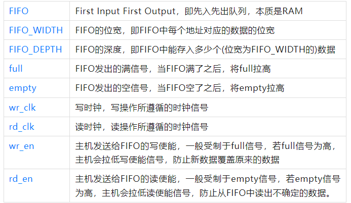

去百度异步FIFO，通常都会找到这么一张异步FIFO的结构图片，如下：

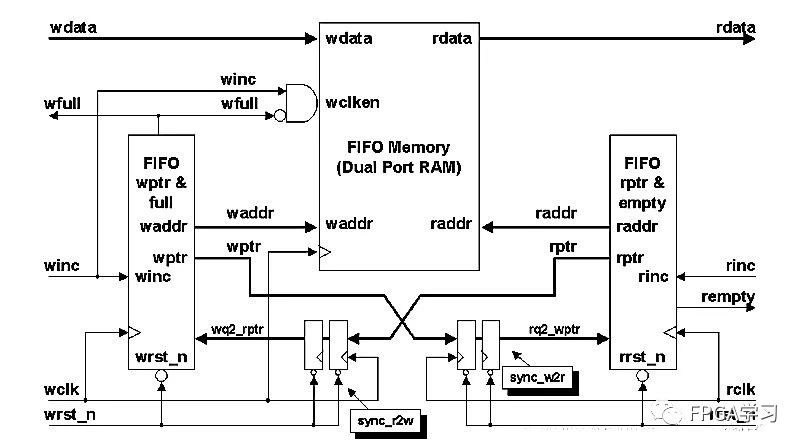

第一次看到这个图，不免有些迷茫，不着急，我们先不看这个图，先从头，慢慢来：

首先，这是一个FIFO的整体框图，无论同步FIFO还是异步FIFO，都适用下图：

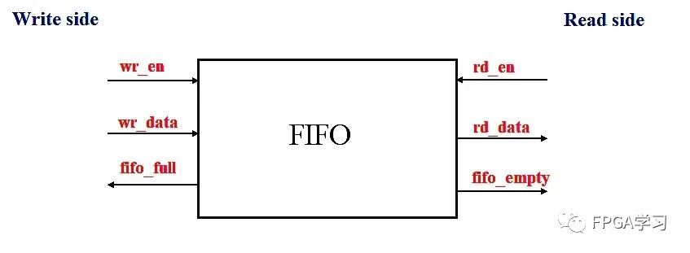

其次，从之前那个图，大致能看出，异步FIFO的结构，主要由5大模块组成

①双端口RAM，或者说FIFO存储体，主要用于数据的存储。

②FIFO的写入控制器；

③FIFO的读出控制器；

④读指针同步器，使用写时钟域的时钟对读指针打两拍，同步到写时钟域；

⑤写指针同步器，使用读时钟域的时钟对写指针打两拍，同步到读时钟域；

如此，便可得到一张简化版的结构图：

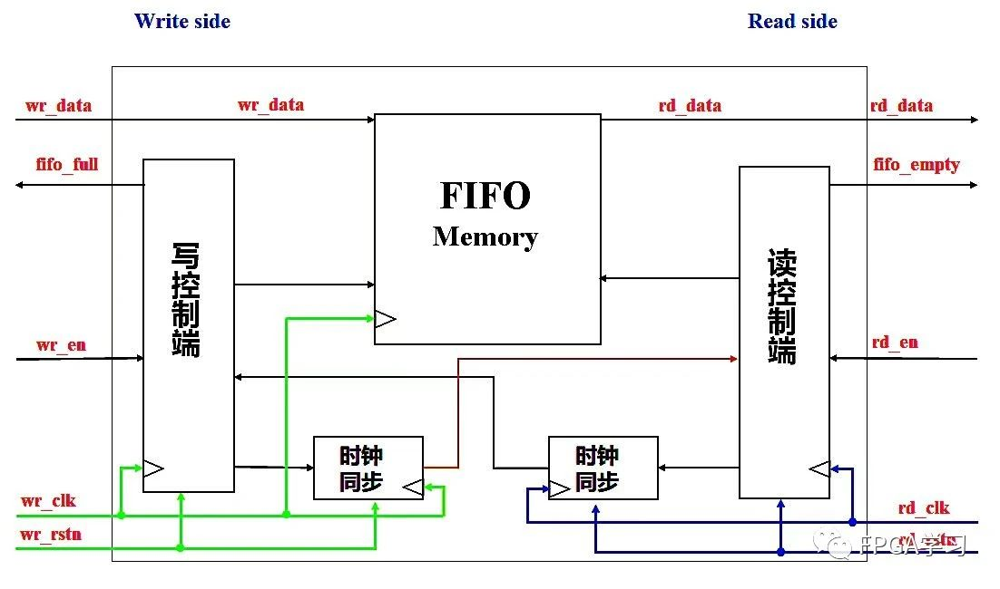

各个模块的功能在于控制异步FIFO：

①在有写使能且未写满的情况下，在写时钟域进行写操作；

②在有读使能且未读空的情况下，在读时钟域进行读操作；

## 空满判断

### 在同步FIFO中，怎么判断空满呢？

①使用计数器，对FIFO中的数据进行计数；这是上一期同步FIFO的方法。

②通过对比读写指针，比如下面这张图：

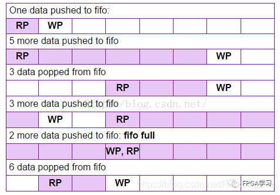

读写指针(即读写地址)相等时，FIFO有可能空(复位初始状态)，也有可能满(比如第五行的情形)。那该怎么判断呢？

 一个通常采用的做法是：

    地址扩展一位对读写指针进行计数；  

    读空信号：复位的时候，读指针和写指针相等，读空信号有效；当读指针赶上写指针的时候，写指针等于读指针意味着最后一个数据被读完，此时读空信号有效。

    写满信号：当写指针比读指针多一圈时，写指针等于读指针意味着写满了，此时写满信号有效。

 (这个多一圈，即读指针信号比写指针信号多走了一个FIFO_DEPTH)，具体怎么理解呢？假设FIFO_DEPTH = 8；则有效的地址信号为3位，读写指针都扩展1位到4位。

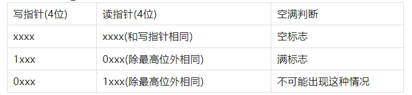

为什么不会出现第三种情况呢，因为读指针最多和写指针相等，读指针不可能比写指针多走一圈，读不可能比写快。但是写可以比读多转一圈，此时也就写满了。

 总结起来就是

    读写指针相同时认为是读空

    当最高位不同，其余位相同时认为是写满

该方法适用于二进制数之间的空满比较判断。

### 在异步FIFO中，怎么判断空满呢？

异步FIFO中，读指针和写指针都都分别在读时钟和写时钟下计数，这是不能直接进行比较的，想要进行比较，那就需要将指针同步到另一个时钟域。具体来说就是：

    读指针在写时钟下，同步到写时钟域

    写指针在读时钟下，同步到读时钟域

怎么进行方便简单的同步呢？

这就想到了曾经的**异步信号打两拍来降低亚稳态概率**的操作，但是这是**单bit**异步信号同步操作；**要是能把多位的读写指针信号，转化成单bit变化的信号，不就可以通过打两拍的方式进行同步了嘛**？

那，格雷码派上用场了。

读写指针可以使用格雷码进行计数，格雷码一个最大的特点就是计数加一时，所有位数只变其中一位，这就可以打两拍进行同步了。

怎么对格雷码进行比大小呢？如下图：

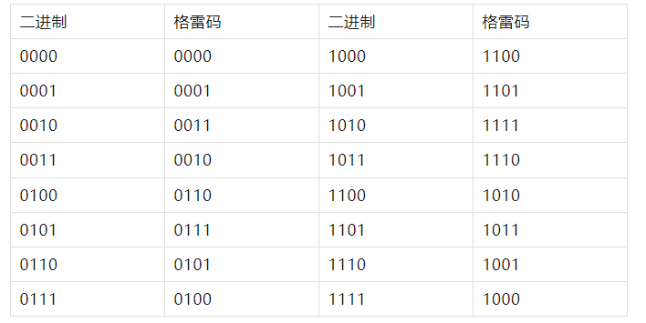

这就看清楚了，当二进制两个数相等时，毫无疑问，格雷码也是相同的，**当二进制最高位不同(即，“多了一圈”后)，格雷码的最高位和次高位不相同，其余低位都相同。**

加上之前判断空满的想法仍然适用，总结起来就是：

**读写指针所有位都相同时认为是读空**
        
**当最高位和次高位不同，其余位相同认为是写满**

## 跨时钟域问题

上面提到了同步和异步FIFO中判断空满状态的方法，在异步FIFO中，读指针属于读时钟域，写指针属于写时钟域，肯定是不能直接进行对比指针的，即使都转化为格雷码也不能直接对比。

解决方法是：两级寄存器同步+格雷码，似乎上面说过了，但是在这里再总结一下：

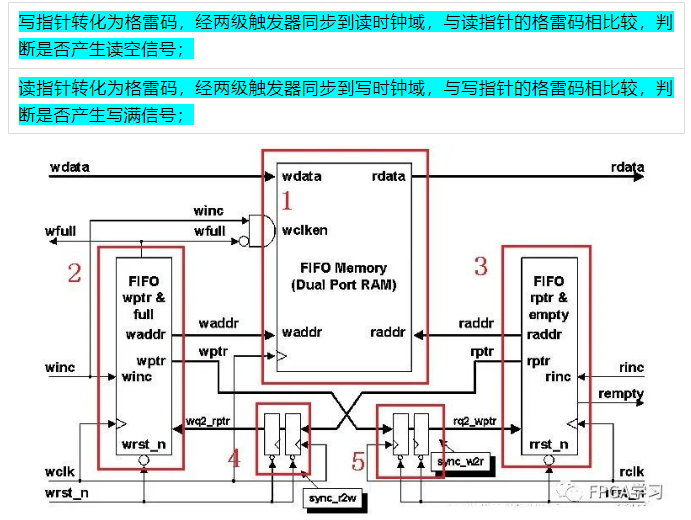

现在再来看这个图，4和5这两个模块应该很清楚了。

或者说，我又找到一个图，看着也比较清楚：

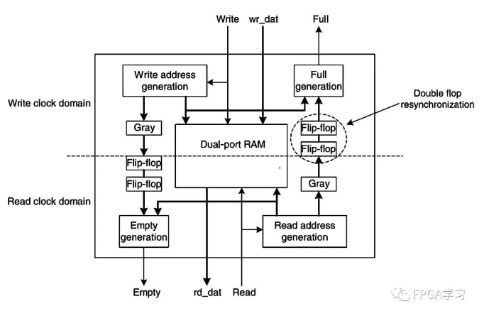

设计的时候读写指针用了至少两级寄存器同步，同步会消耗至少两个时钟周期，势必会使得判断空或满有所延迟，这会不会导致设计出错呢？

**总结来说异步逻辑转到同步逻辑不可避免需要额外的时钟开销，这会导致满空趋于保守，但是保守并不等于错误，这么写会稍微有性能损失，但是不会出错。**

## 关于格雷码的转换

#### 二进制转格雷码

转换规则是：(1)最高位保留不变；(2)格雷码其余位为二进制码对应位与其前一位的异或。

用代码表述就是

```verilog
//二进制码B[n:0],格雷码G[n:0];
G[n] = B[n];//最高位不变
G[n-1 : 0] = B[n-1 : 0] ^ B[n : 1];
```

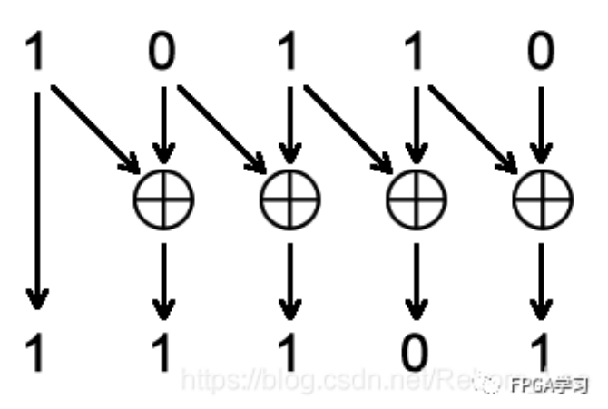

当然了，还有一种更简单的方法：移位法。

```verilog
//二进制码B[n:0],格雷码G[n:0];
assign gray_value = binary_value ^ (binary_value>>1);
```

#### 格雷码转二进制码

转换规则是：(1)最高位保留不变；(2)其余位格雷码与二进制对应位的前一位相异或，得到二进制的对应位。

代码表述就是：

```verilog
//格雷码G[n:0],二进制码B[n:0];
B[n] = G[n];
B[i - 1] = G[i - 1] ^ B[i];(1<= i <= n)
```

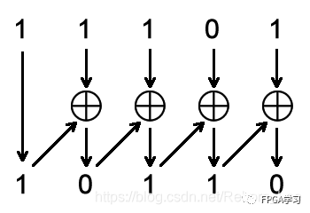

用Verilog代码实现如下：

```verilog
module gray2bin #(
  parameter N = 4
)(
  input [N-1:0] gray,
  output [N-1:0] bin
    );
  assign bin[N-1] = gray[N-1];
  genvar i;
  generate
  for(i = N-2; i >= 0; i = i - 1) begin: gray_2_bin
    assign bin[i] = bin[i + 1] ^ gray[i];
  end
  endgenerate
endmodule
```

不过，异步FIFO中并没有用到格雷码转二进制码。

## 代码实现异步FIFO

```verilog
module asy_fifo#(
    parameter   WIDTH = 8,
    parameter   DEPTH = 8
)(
    input   [WIDTH - 1 : 0] wr_data,
    input                   wr_clk,
    input                   wr_rstn,
    input                   wr_en,
    input                   rd_clk,
    input                   rd_rstn,
    input                   rd_en,
    output                  fifo_full,
    output                  fifo_empty,
    output  [WIDTH - 1 : 0] rd_data
);
    //定义读写指针
    reg [$clog2(DEPTH) : 0]  wr_ptr, rd_ptr;

    //定义一个宽度为WIDTH，深度为DEPTH的fifo
    reg [WIDTH - 1 : 0] fifo    [DEPTH - 1 : 0];

    //定义读数据
    reg [WIDTH - 1 : 0] rd_data;

    //写操作
    always @ (posedge wr_clk or negedge wr_rstn) begin
        if(!wr_rstn)
            wr_ptr <= 0;
        else if(wr_en && !fifo_full) begin
            fifo[wr_ptr] <= wr_data;
            wr_ptr <= wr_ptr + 1;
        end
        else
            wr_ptr <= wr_ptr;
    end

    //读操作
    always @ (posedge rd_clk or negedge rd_rstn) begin
        if(!rd_rstn) begin
            rd_ptr <= 0;
            rd_data <= 0;
        end
        else if(rd_en && !fifo_empty) begin
            rd_data <= fifo[rd_ptr];
            rd_ptr <= rd_ptr + 1;
        end
        else
            rd_ptr <= rd_ptr;
    end

    //定义读写指针格雷码
    wire [$clog2(DEPTH) : 0] wr_ptr_g;
    wire [$clog2(DEPTH) : 0] rd_ptr_g;

    //读写指针转换成格雷码
    assign wr_ptr_g = wr_ptr ^ (wr_ptr >>> 1);
    assign rd_ptr_g = rd_ptr ^ (rd_ptr >>> 1);


    //定义打拍延迟格雷码
    reg [$clog2(DEPTH) : 0] wr_ptr_gr, wr_ptr_grr;
    reg [$clog2(DEPTH) : 0] rd_ptr_gr, rd_ptr_grr;

    //写指针同步到读时钟域
    always @ (posedge rd_clk or negedge rd_rstn) begin
        if(!rd_rstn) begin
            wr_ptr_gr <= 0;
            wr_ptr_grr <= 0;
        end
        else begin
            wr_ptr_gr <= wr_ptr_g;
            wr_ptr_grr <= wr_ptr_gr;
        end
    end

    //读指针同步到写时钟域
    always @ (posedge wr_clk or negedge wr_rstn) begin
        if(!wr_rstn) begin
            rd_ptr_gr <= 0;
            rd_ptr_grr <= 0;
        end
        else begin
            rd_ptr_gr <= rd_ptr_g;
            rd_ptr_grr <= rd_ptr_gr;
        end
    end

    //声明空满信号数据类型
    reg fifo_full;
    reg fifo_empty;

    //写满判断
    always @ (posedge wr_clk or negedge wr_rstn) begin
        if(!wr_rstn)
            fifo_full <= 0;
        else if((wr_ptr_g[$clog2(DEPTH)] != rd_ptr_grr[$clog2(DEPTH)]) && (wr_ptr_g[$clog2(DEPTH) - 1] != rd_ptr_grr[$clog2(DEPTH) - 1]) && (wr_ptr_g[$clog2(DEPTH) - 2 : 0] == rd_ptr_grr[$clog2(DEPTH) - 2 : 0]))
            fifo_full <= 1;
        else
            fifo_full <= 0;
    end

    //读空判断
    always @ (posedge rd_clk or negedge rd_rstn) begin
        if(!rd_rstn)
            fifo_empty <= 0;
        else if(wr_ptr_grr[$clog2(DEPTH) : 0] == rd_ptr_g[$clog2(DEPTH) : 0])
            fifo_empty <= 1;
        else
            fifo_empty <= 0;
    end
endmodule
```

测试文件
```verilog

module asy_fifo_tb;
    parameter   width = 8;
    parameter   depth = 8;

    reg wr_clk, wr_en, wr_rstn;
    reg rd_clk, rd_en, rd_rstn;

    reg [width - 1 : 0] wr_data;

    wire fifo_full, fifo_empty;

    wire [width - 1 : 0] rd_data;

    //实例化
        asy_fifo myfifo (
            .wr_clk(wr_clk),
            .rd_clk(rd_clk),
            .wr_rstn(wr_rstn),
            .rd_rstn(rd_rstn),
            .wr_en(wr_en),
            .rd_en(rd_en),
            .wr_data(wr_data),
            .rd_data(rd_data),
            .fifo_empty(fifo_empty),
            .fifo_full(fifo_full)
        );
    //时钟
    initial begin
        rd_clk = 0;
        forever #25 rd_clk = ~rd_clk;
    end

    initial begin
        wr_clk = 0;
        forever #30 wr_clk = ~wr_clk;
    end
    //赋值
    initial begin
        wr_en = 0;
        rd_en = 0;
        wr_rstn = 1;
        rd_rstn = 1;

        #10;
        wr_rstn = 0;
        rd_rstn = 0;

        #20;
        wr_rstn = 1;
        rd_rstn = 1;

        @(negedge wr_clk)
        wr_data = {$random}%30;
        wr_en = 1;

        repeat(7) begin
            @(negedge wr_clk)
            wr_data = {$random}%30;
        end

        @(negedge wr_clk)
        wr_en = 0;

        @(negedge rd_clk)
        rd_en = 1;

        repeat(7) begin
            @(negedge rd_clk);
        end

        @(negedge rd_clk)
        rd_en = 0;
        #150;
        @(negedge wr_clk)
        wr_en = 1;
        wr_data = {$random}%30;
        repeat(15) begin
            @(negedge wr_clk)
            wr_data = {$random}%30;
        end
        @(negedge wr_clk)
        wr_en = 0;

        #50;
        $finish;
    end

endmodule
```

仿真截图

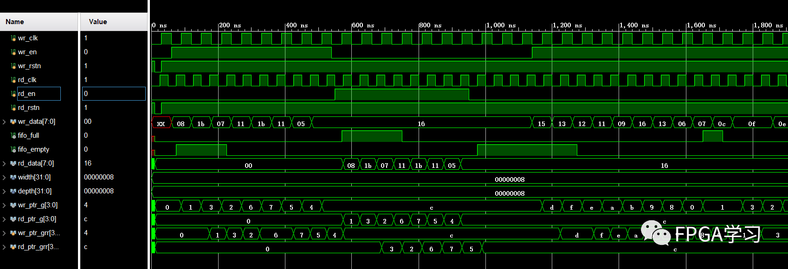

整体仿真图如上图所示，我们来慢慢的分析一下；

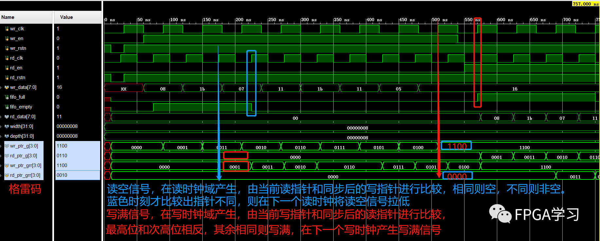

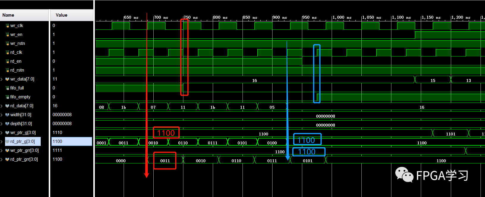

另一边满信号拉低和空信号拉高也是同样的分析方法；

大致上，异步FIFO的设计思路以及基本功能算是实现了。

## 几点思考

* 其实异步FIFO的设计有比较多具体的实现形式，空满判断时可以使用组合逻辑，那么仿真结果又和上图不一样了。

* 出现空或满状态后也可以强行拉低外部写入或读取使能，从FIFO自身就限制不让数据写入，当然，这个功能可以在FIFO之外用逻辑电路实现。

* 此次仿真文件中，假设rd_clk比wr_clk快，通过打两拍同步的方式，慢时钟域同步到快时钟域和快时钟域同步到慢时钟域处理方式是不同的，后面有机会再详细说明(主要是我还没有学到)。

* 如果跨时钟域同步时，同步过来的是一个亚稳态的数据，那么FIFO还能否正常工作呢？

这个问题大概就是，同步过程中格雷码出现了错误情况，因为格雷码每次变化一位，那么传输过程中就算出错最多也是一位数据出错，此时相当于指针信号没有发生变化。

如果是写指针同步失效，用这个错误的写指针在读时钟域进行空判断最多是让空标志在FIFO不是真正空的时候产生，而不会产生空读的情况。

在读指针同步失效时也是一样的道理。

格雷码保证的是同步后的读写地址即使在出错的情况下依然能够保证FIFO功能的正确性。

**注意**: 上述1bit数据不一致的情况只限于相邻两次跳变之间，假若超过两个周期，情况就不一定了。因此，地址总线的bus skew一定不能超过一个周期，否则可能出现gray码多位数据跳变的情况。

* 不同位宽的异步FIFO应该怎么设计呢？又该需要考虑哪些注意事项呢？

* 关于异步FIFO的设计深度相关问题，后续有机会再做讨论。

## 写在后面

当然了，我们学习异步FIFO的设计，主要目的是为了掌握其工作机制和原理，而并不是真的在实际工程中用自己设计的异步FIFO，毕竟各大厂商都有自己的FIFO IP核可以调用，他们的设计远比我们设计出来的更稳定、功能更丰富。