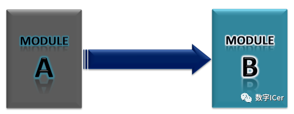
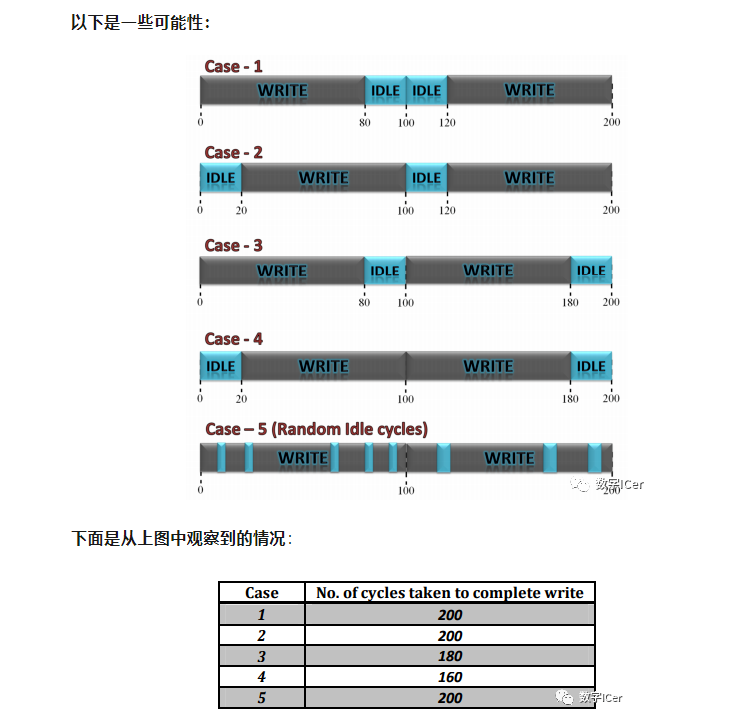
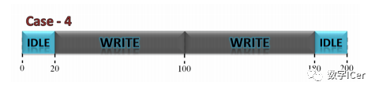
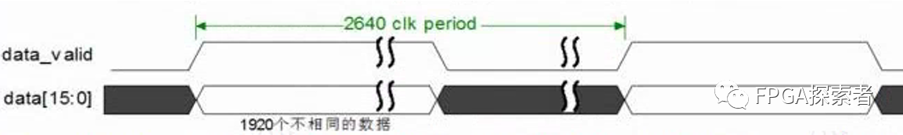
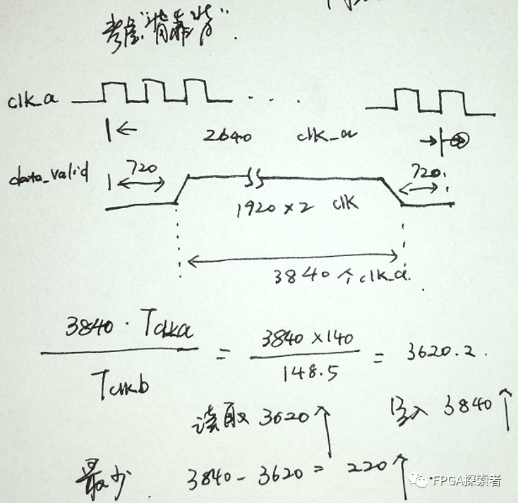
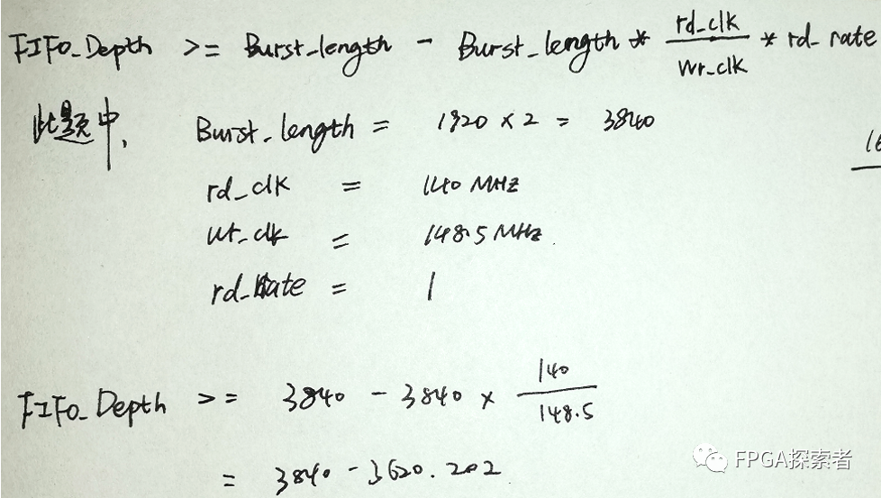
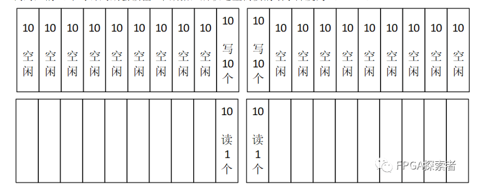
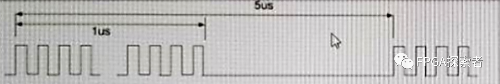
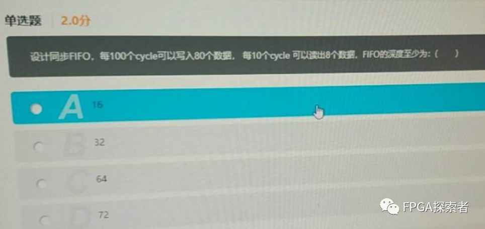

# 【数字IC面试八股文(FIFO相关)】FIFO深度计算

- [ ] Version
    * [x] linhuangnan
    * [x] 2024-03-04 
    * [x] FIFO深度计算
    * [ ] review

!!! info
    * 同步FIFO深度计算
    * 异步FIFO深度计算

## FIFO深度计算

    由于平时我们工作中，FIFO都是直接调用IP核，对于FIFO深度选择并没有很在意，而在笔试面试过程中，经常被问及的问题之一就是如何计算FIFO深度。

当读数据的速率小于写数据的速率时，我们需要先将数据缓存下来，那么我们需要开多大的空间缓存这些数据呢？缓存开大了会浪费资源，开小了会丢失数据，如何去计算最小FIFO深度是本文的重点。

	假如模块A不间断的往FIFO中写数据，模块B同样不间断的从FIFO中读数据，不同的是模块A写数据的时钟频率要大于模块B读数据的时钟频率，那么在一段时间内总是有一些数据没来得及被读走，如果系统一直在工作，那么那些没有被读走的数据会越累积越多，那么FIFO的深度需要是无穷大的;

	但是若写操作是连续的数据流，那么再大的FIFO都无法保证数据不溢出。因此可以认为这种情况下写数据的传输是“突发Burst”的，即写操作并不连续；

	要确定FIFO的深度，关键在于计算出在突发读写这段时间内有多少个数据没有被读走。即FIFO的最小深度就等于没有被读走的数据个数。

### Case1  fa>fb with no idle cycles in both write and read

即写时钟快于读时钟，写和读的过程中没有空闲周期;

**假设：**

    写数据时钟频率fa=80MHz

    读数据时钟频率fb=50MHz

    突发长度= number of data to be transferred = 120

    在突发传输过程中，数据都是连续读写的

那么：

写一个数据所需要的时间 = 1/80MHz = 12.5ns

突发传输中，写完所有数据所需要的时间 = 120*12.5ns = 1500ns

读一个数据所需要的时间 = 1/50MHz = 20ns

所以写完所有的突发传输数据需要花费1500ns

在1500ns内能够读走的数据个数 = 1500ns/20ns = 75

所以在1500ns内还没有被读走的数据个数 = 120-75 = 45

因此FIFO的最小深度为45

### Case2  fa>fb with two clock cycle delay between two successive read and write

即写时钟频率大于读时钟频率，但在读写的过程中存在空闲周期;

	Case2在Case1的基础上增加了一个假设，即读比写慢两拍。这种假设是真正存在的，在异步FIFO设计中，我们需要去判断FIFO的空满来保证逻辑的正确性，判断空满标志需要去比较读写指针，而读指针与写指针处在不同的时钟域中，我们需要采用格雷码和两级同步寄存器去降低亚稳态的概率，而两级同步必然会导致空满标志位的判断至少延迟2个cycle。对于空标志位来说，将写指针同步到读时钟域至少需要花费2个时钟，而在同步这段时间内有可能还会写入新的数据，因此同步后的写指针一定小于或等于（当且仅有同步时间内没有新数据写入的情况下才会等于）当前的写指针，所以此时判断不一定是真空；同理，对于满标志位来说，将读指针同步到读时钟域至少需要花费2个时钟，而在同步这段时间内有可能还会读出新的数据，因此同步后的读指针一定小于或等于当前读指针，所以此时判断并不一定是真满。

通过上述讨论可以知道Case2的FIFO最小深度应该比场景1的FIFO最小深度45略大。

### Case3 fa > fb with idle cycles in both write and read

即写时钟频率大于读时钟频率，但在读写的过程中存在空闲周期；

**假设：**

    写数据时钟频率fa=80MHz

    读数据时钟频率fb=50MHz

    突发长度= number of data to be transferred = 120

    连续写入之间的空闲周期为1。

    连续读取之间的空闲周期为3。

那么：

两个连续写之间的空闲周期为1个时钟周期。它的意思是，在写入一个数据后，模块A等待一个时钟周期，开始下一个写入。因此，可以理解为每两个时钟周期，一个数据被写入;

两个连续读取之间的空闲周期为3个时钟周期。即读取一个数据后，B模块等待3个时钟周期，开始下一次读取。因此，我们可以理解，每四个时钟周期，读取一个数据;

写一个数据所需要的时间 = 2*1/80MHz = 25ns

突发传输中，写完所有数据所需要的时间 = 120*25ns = 3000ns

读一个数据所需要的时间 = 4*1/50MHz = 80ns

所以写完所有的突发传输数据需要花费3000ns

在3000ns内能够读走的数据个数 = 3000ns/80ns = 37.5

所以在3000ns内还没有被读走的数据个数 = 120-37.5 = 82.5

因此FIFO的最小深度为83

### Case4 fa > fb with duty cycles given for wr_enb and rd_enb.

即写时钟频率大于读时钟频率，给定wr_enb和rd_enb的占空比；

**假设：**

    写数据时钟频率fa=80MHz

    读数据时钟频率fb=50MHz

    突发长度= number of data to be transferred = 120

    写使能信号占整个burst时间比重为1/2

    读使能信号占整个burst时间比重为1/4

那么：

此场景与前一个场景(场景3)没有任何不同，因为在本例中，一个数据项将在2个时钟周期内写入，而一个数据项将在4个时钟周期内读取。

因此FIFO的最小深度也为83

### Case5  fA < fB with no idle cycles in both write and read ( the delay between two consecutive writes and reads is one clock cycle)

即写时钟频率小于读时钟频率，且读写过程中没有空闲周期；

**假设：**

    写数据时钟频率fa=30MHz

    读数据时钟频率fb=50MHz

    突发长度= number of data to be transferred = 120

    在突发传输过程中，数据都是连续读写的

那么：

由于读数据比写数据要快，这种情况下永远也不会发生数据丢失的，因此FIFO只起到过时钟域的作用，FIFO的最小深度为1即可；

### Case6 fa < fb with idle cycles in both write and read(duty cycles of wr_enb and rd_enb can also be given in these type of questions).

即写时钟频率小于读时钟频率，给定wr_enb和rd_enb的占空比；

**假设：**

    写数据时钟频率fa=40MHz

    读数据时钟频率fb=50MHz

    突发长度= number of data to be transferred = 120

    连续写入之间的空闲周期为1。

    连续读取之间的空闲周期为3。

那么：

两个连续写之间的空闲周期为1个时钟周期。它的意思是，在写入一个数据后，模块A等待一个时钟周期，开始下一个写入。因此，可以理解为每两个时钟周期，一个数据被写入;

两个连续读取之间的空闲周期为3个时钟周期。即读取一个数据后，B模块等待3个时钟周期，开始下一次读取。因此，我们可以理解，每四个时钟周期，读取一个数据;

写一个数据所需要的时间 = 2*1/40MHz = 50ns

突发传输中，写完所有数据所需要的时间 = 120*50ns = 6000ns

读一个数据所需要的时间 = 4*1/50MHz = 80ns

所以写完所有的突发传输数据需要花费6000ns

在6000ns内能够读走的数据个数 = 6000ns/80ns = 75

所以在6000ns内还没有被读走的数据个数 = 120-75 = 45

因此FIFO的最小深度为45

### Case7 fA = fB with no idle cycles in both write and read ( the delay between two consecutive writes and reads is one clock cycle).

即写时钟频率等于读时钟频率，且读写过程中没有空闲周期；

**假设：**

    写数据时钟频率fa=50MHz

    读数据时钟频率fb=50MHz

    突发长度= number of data to be transferred = 120

    读和写都没有空闲周期，这意味着突发中的所有项都将以连续的时钟周期写入和读取

那么：

如果clkA和clkB之间没有相位差，则不需要FIFO；

如果clkA和clkB之间存在相位差，深度“1”的FIFO就足够了。

### Case8  fA = fB with idle cycles in both write and read (duty cycles of wr_enb and rd_enb can also be given in these type of questions).

即写时钟频率等于读时钟频率，给定wr_enb和rd_enb的占空比；

**假设：**

    写数据时钟频率fa=50MHz

    读数据时钟频率fb=50MHz

    突发长度= number of data to be transferred = 120

    连续写入之间的空闲周期为1。

    连续读取之间的空闲周期为3。

那么：

两个连续写之间的空闲周期为1个时钟周期。它的意思是，在写入一个数据后，模块A等待一个时钟周期，开始下一个写入。因此，可以理解为每两个时钟周期，一个数据被写入;

两个连续读取之间的空闲周期为3个时钟周期。即读取一个数据后，B模块等待3个时钟周期，开始下一次读取。因此，我们可以理解，每四个时钟周期，读取一个数据;

写一个数据所需要的时间 = 2*1/50MHz = 40ns

突发传输中，写完所有数据所需要的时间 = 120*40ns = 4800ns

读一个数据所需要的时间 = 4*1/50MHz = 80ns

所以写完所有的突发传输数据需要花费4800ns

在4800ns内能够读走的数据个数 = 4800ns/80ns = 60

所以在4800ns内还没有被读走的数据个数 = 120-60 = 60

因此FIFO的最小深度为60

### Case9 如果数据速率如下所示

	在前面几种场景中，我们给的条件都是每隔几个时钟读写一次，这种周期性读写在实际中很常见。但是在工程设计中还存在这样一种情形，只给出数据在一段时间内的读写速率，怎么读写完全随机，这种情况我们需要考虑最坏的一种情况避免数据丢失。

	对于最坏的情况，读写之间的数据速率差异应该是最大的。因此，对于写操作，应该考虑最大数据速率，对于读操作，应该考虑最小数据速率。

写数据时钟频率fa=读数据时钟频率fb

在写时钟周期内，每100个周期就有80个数据写入FIFO

在读时钟周期内，每10个周期可以有8个数据读出FIFO

写操作的最大数据速率在上表格中case - 4。(写操作在最小的时间内完成)。因此，考虑case - 4来进行进一步的计算。

	首先这里没有给出数据的突发长度，从假设中可以得出每100个周期就有80个数据写入FIFO，这里可能就有人会说突发长度就是80个数据，其实不是这样的，因为数据是随机写入FIFO的，我们需要考虑做坏的情形，即写速率最大的情形，只有如下图背靠背的情形才是写速率最高的情形，burst length为160；

在读时钟周期内，每10个周期可以有8个数据读出FIFO；即一个周期可以写入 8/10 数据

所以160个时钟读了160*8/10 = 128个数据；

考虑背靠背（20个clk不发数据+80clk发数据+80clk发数据+20clk不发数据的共200个clk）

因此FIFO的最小深度=160 - 128 = 32

### 总结

从上面分析来看，求FIFO的最小深度主要有以下要点：

* 在求解之前需要验证一下在允许的最大时间长度内写入的数据量是否等于读出的数据量，保证有解；

* 求FIFO深度需要考虑最坏的情形，读写的速率应该相差最大，也就是说需要找出最大的写速率和最小的读速率；

* 不管什么场景，要确定FIFO的深度，关键在于计算出在突发读写这段时间内有多少个数据没有被读走；

* 由于FIFO空满标志位的判断延迟，在实际应用中需要预留一些余量。

下面我们来推导一下FIFO深度的求解公式，假设：

写时钟周期为clkw

读时钟周期为clkr

在读时钟周期内，每x个周期内可以有y个数据读出FIFO，即读数据的读数率

在写时钟周期内，每m个周期内就有n个数据写入FIFO

背靠背“的情形下是FIFO读写的最坏情形，burst长度 B = 2*n

由上得到：FIFO的最小深度为 B - B * (clkr/clkw) * (y/x)

### 参考文献

https://hardwaregeeksblog.files.wordpress.com/2016/12/fifodepthcalculationmadeeasy2.pdf

## 异步FIFO练习题

假设**两个异步时钟clk_a和clk_b**，clk_a=148.5M，clk_b=140M。如图所示，clk_a时钟域中连续1920个16bit的数据通过data_valid标记，有效数据之后，紧接着720个无效数据时钟周期。请问，该数据通过异步fifo同步到clk_b时钟域，异步fifo的最小深度是多少？请写出计算过程。

!!! info

    对于读写同时进行的FIFO，有一个简便计算公式

    **FIFO_Depth >= Burst_length -Burst_length* (rd_clk/ wr_clk)*(rd_rate)**

## 同步FIFO练习题

1、设计一个同步fifo，读写时钟相同，每100个时钟写入10个数据，每10个cycle读出1个数据，计算这个同步FIFO的最小深度。

fifo设计中最小深度的要求是不溢出（overflow），考虑极限情况，写入数据最多的时候时候就是需要存储数据最多的时候，也是FIFO深度的下限值，即最小深度。

考虑最大数据情况，考虑写数据的连续200个时钟周期，前一个100个时钟记作TimeA，后一个记作TimeB,写数据的恰好在TimeA的最后和TimeB的最前，即20个时钟周期发生连续的20次写，而对应的20个时钟周期会读出2个数据，所以这里需要的最小深度为20-2=18。

2、ModuleA/ModuleB用的是同个Clock, Clock频率80MHz。ModuleA和ModuleB同时启动，ModuleA产生如下周期性的burst数据给ModuleB,一共产生8次burst. burst rate : 1280Mbit/s，burst持续时间1us。burst内部速率均匀，burst周期5us，余下的4us内没有数据。

ModuleB收到启动信号后，需要花10us做初始化，所以先把module A的数据缓存在ModuleB内部的同步FIFO中，同步FIFO位宽32bits,初始化结束后，ModuleB以640 Mbit/s的均匀速度从FIFO中读取数据。在满足功能需求的前提下，为了节省电路面积，要求FIFO size越小越好，以下四个选项的FIFO深度，选项（）的FIFO深度符合要求：

A: 128

B: 64

C: 96

D: 160

**答案：A**

考虑最大数据情况，在ModuleB启动的10us内，ModuleA一直在传输数据，一共2us有效数据，需要存储 1280Mbit/s * 2us = 2560bit；在第11us，ModuleA传输数据 1280Mbit/s * 1us = 1280bit，ModuleB读取 640 Mbit/s * 1us = 640 bit，需要存储 1280 - 640 = 640 bit，此时共需存储 2560 + 640 = 3200 bit。

考虑整个读写，前15us共写入 3 * 1280=3840，读取 5*640=3200，只需要存储640，目前设置存储3200，所以满足要求。

综合考虑，最大需要存3200bit，深度需要 3200 / 32 = 100，选A的128较为合适。

3、

可以得出：

（1）写入最频繁的情况下，是连续的200个时钟内，有连续的160个时钟在写，即最大突发写长度Burst_length = 160；

（2）读时钟等于写时钟，rd_clk = wr_clk；

（3）读取速率rd_rate，每10个时钟周期读取8个数据，所以rd_rate = 8/10=0.8；

所以：

FIFO_Depth >= Burst_length -Burst_length* (rd_clk/ wr_clk)*(rd_rate)

= 160 – 160*1*0.8

= 32

