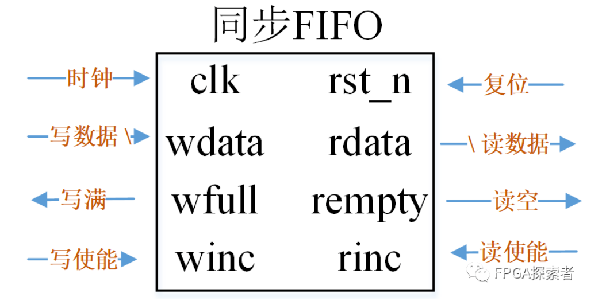
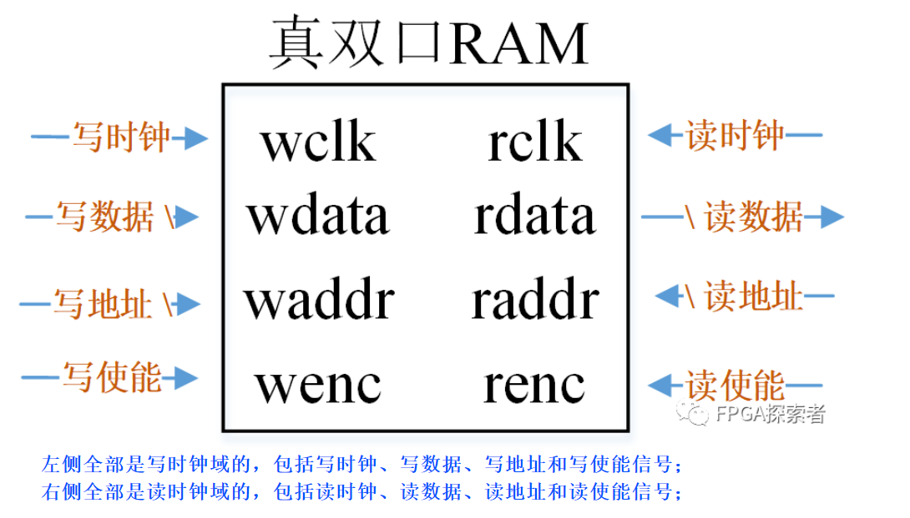
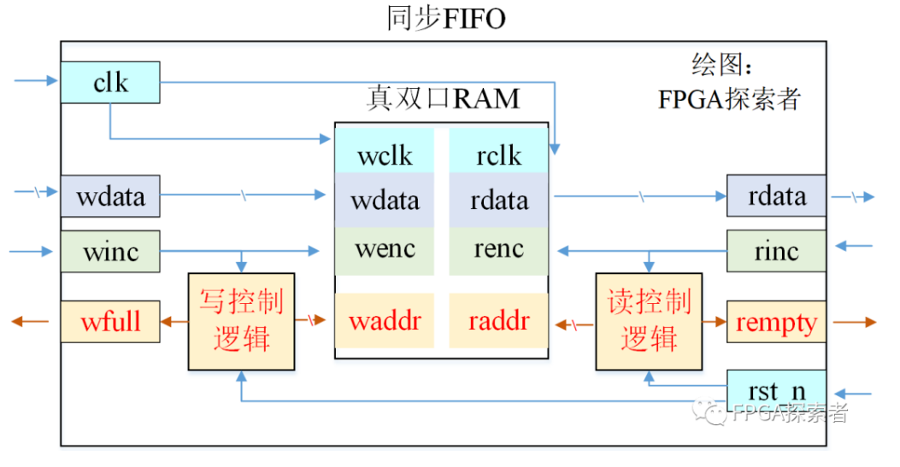
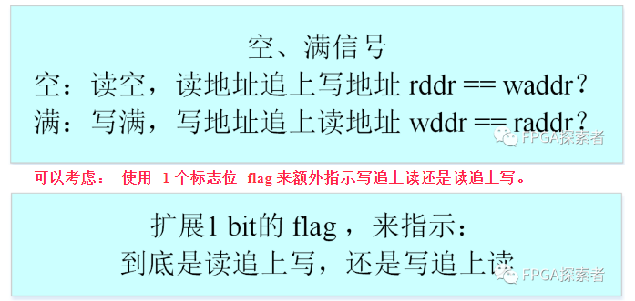
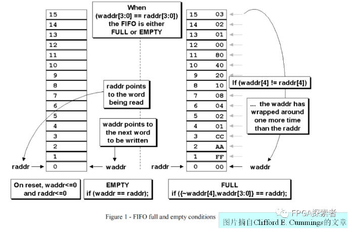
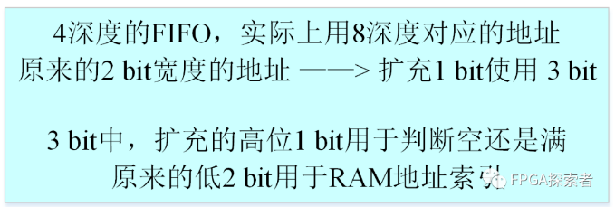
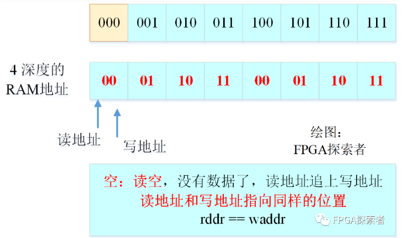
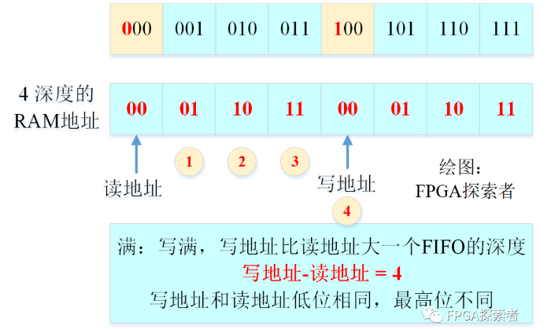
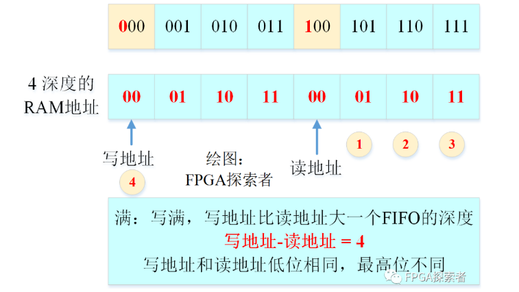

# 【数字IC面试八股文(FIFO相关)】同步FIFO设计详解

- [ ] Version
    * [x] linhuangnan
    * [x] 2024-03-04 
    * [x] 同步FIFO设计
    * [ ] review

!!! info
    * FIFO 简介及用途；
    * 同步 FIFO 接口；
    * 双口 RAM 接口；
    * 基于双口 RAM 的同步 FIFO 结构；
    * 读写地址产生逻辑；
    * 空满信号产生逻辑；
    * 全部代码；
    * 讲解视频；

## FIFO简介

FIFO （先入先出, First In First Out ）存储器，在 FPGA 和数字 IC 设计中非常常用。 根据接入的时钟信号，**可以分为同步 FIFO 和异步 FIFO** 。

**FIFO 底层基于双口 RAM**，同步 FIFO 的读写时钟一致，异步 FIFO 读时钟和写时钟不同。 

**同步时钟主要应用于速率匹配（数据缓冲），类似于乒乓存储提高性能的思想，可以让后级不必等待前级过多时间；**

**异步 FIFO 主要用于多 bit 信号的跨时钟域处理。**

本文讨论同步 FIFO 的结构及控制逻辑设计，并给出代码。

## 同步 FIFO 接口

对于同步 FIFO ，包含必要的接口如下图所示：



（1） clk ： 时钟信号，读写共用；

（2） rst_n ： 复位信号，视具体设计和芯片采用同步复位还是异步复位，此处默认使用异步低电平复位；

（3） wdata ： 写数据信号，信号后带“ \ ”表示是多 bit 信号；

（4） rdata ： 读数据信号，信号后带“ \ ”表示是多 bit 信号；

（5） wfull ： 满信号，指示 FIFO 写满了，不能再写了，如果再写会覆盖掉还没读出的写入数据，造成数据丢失；

（6） rempty ： 空信号，指示 FIFO 读空了，不能在读了，如果再读相当于有的数据重复读了第二遍，造成数据错误；

（7） winc ： 写使能信号，写使能有效时表示希望能写入数据；

（8） rinc ： 读使能信号，读使能有效时表示希望能读出数据；

## 双口 RAM 接口

在实现 FIFO 时，无论是同步 FIFO 还是异步 FIFO ，通常会通过双口 RAM （ Dual Port RAM ）并添加一些必要的逻辑来实现。双口 RAM 的接口如下图所示。



## 基于双口 RAM 的同步 FIFO 

根据同步 FIFO 的接口和双口 RAM 的接口，在借助双口 RAM 实现同步 FIFO 时，如下图所示结构，

**只需要加入读、写控制逻辑即可。在写逻辑中，用于产生写地址和写满信号；** 

**在读逻辑中，用于产生读地址和读空信号。 读写控制逻辑还需要受到读写使能信号的控制。**



## 读写地址产生逻辑

读写地址什么时候能够递增？

显然，对于写地址必须满足：

（1） 写使能有效（要写入）；

（2） 没写满（能写入）；

```verilog
always @ (posedge clk or negedge rst_n) 
begin
  if(~rst_n) begin
    waddr <= 'b0;
  end 
  else begin
    if( winc && ~wfull ) begin
      waddr <= waddr + 1'b1;
    end 
    else begin
      waddr <= waddr;    
    end 
  end 
end 
```

对于读地址必须满足：

（1） 读使能有效（要读出）；

（2） 没读空（能读出）；

```verilog
always @ (posedge clk or negedge rst_n) 
begin
  if(~rst_n) begin
    raddr <= 'b0;
  end 
  else begin
    if( rinc && ~rempty ) begin
      raddr <= raddr + 1'b1;
    end 
    else begin
      raddr <= raddr;    
    end 
  end 
end
```

## 空满信号产生逻辑

搞定了读写地址的控制逻辑，还差最后一步也是最关键的信号：空满信号如何产生。

空： 读空，读地址追上写地址；

满： 写满，写地址追上读地址。

问题来了： 怎么判地址断追上了呢？ 如果地址相等那应该是追上了，即 raadr == waddr 或者 wddr == raddr 。 如果按照这种判断，显然这两个地址追上对方的判断是等效的，无法区分出来到底是写追上读还是读追上写。



参考前人的文献，判断空满的方式有多种，非常常用的一种是 Clifford E. Cummings 文章中提到的扩展 **1 bit 的读写地址方法**，也就是说，将前面提到的 flag 指示信号和原本 N 位的读写地址结合，**使用 N+1 位的读写地址，其中最高位用于判断空满信号，其余低位还是正常用于读写地址索引。**



以一个 4 深度的 FIFO 实例来说明， 4 深度原本需要 2 bit 的读写地址，现在扩展成 3 bit 。



使用低 2 位来进行双口 RAM 的地址索引，高位用于判断空满。 对于空信号，可以知道当 FIFO 里没有待读出的数据时产生。 **也就是说，此时读追上了写，把之前写的数据刚刚全部都出，读地址和写地址此时指向相同的位置，读地址 - 写地址 =0** ，即

```verilog
raddr == waddr 
```



对于写满信号，**当写入后还没被读出的数据恰好是 FIFO 深度的时候，产生满信号，即写地址 - 读地址 = FIFO 深度 = 4** 。 对照下图可以发现，此时对于双口 RAM 的 2 bit 的地址来说，读写地址一致； 对于最高位来所，写是 1 而读是 0 。



再考虑下图所示的一种情况，写入待读出的数据仍然是 4 个，此时也是 4 深度的 FIFO 已经满了。 读写地址的低位相同，高位是写 0 读 1 。



对于写满的 2 种情况，总结下来，都是低位相同，最高位相反。

```verilog
raddr[N] = = ~waddr[N]    
raddr[N-1:0] = = waddr[N-1:0]
```

也就是：

```verilog
raddr == {~waddr[N], waddr[N-1:0]}
```

所以，空满逻辑产生的代码为：

```verilog
always @ (posedge clk or negedge rst_n) 
begin
  if(~rst_n) begin
    wfull <= 'b0;
    rempty <= 'b0;
  end 
  else begin
    wfull <= (raddr == {~waddr[ADDR_WIDTH], waddr[ADDR_WIDTH-1:0]});
    rempty <= (raddr == waddr);
  end 
end 
```

## 全部代码
```verilog

`timescale 1ns/1ns  

module sfifo#(
  parameter  WIDTH = 8,
  parameter   DEPTH = 16
)(
  input           clk    , 
  input           rst_n  ,
  input           winc  ,
  input            rinc  ,
  input     [WIDTH-1:0]  wdata  ,

  output reg        wfull  ,
  output reg        rempty  ,
  output wire [WIDTH-1:0]  rdata
);
  // 用localparam定义一个参数，可以在文件内使用
    localparam ADDR_WIDTH = $clog2(DEPTH);

    reg [ADDR_WIDTH:0] waddr;
    reg [ADDR_WIDTH:0] raddr;
    always @ (posedge clk or negedge rst_n) begin
        if(~rst_n) begin
            waddr <= 'b0;
        end 
        else begin
            if( winc && ~wfull ) begin
                waddr <= waddr + 1'b1;
            end 
            else begin
                waddr <= waddr;    
            end 
        end 
    end 

    always @ (posedge clk or negedge rst_n) begin
        if(~rst_n) begin
            raddr <= 'b0;
        end 
        else begin
            if( rinc && ~rempty ) begin
                raddr <= raddr + 1'b1;
            end 
            else begin
                raddr <= raddr;    
            end 
        end 
    end 

    always @ (posedge clk or negedge rst_n) begin
        if(~rst_n) begin
            wfull <= 'b0;
            rempty <= 'b0;
        end 
        else begin
            wfull <= (raddr == {~waddr[ADDR_WIDTH], waddr[ADDR_WIDTH-1:0]});
            rempty <= (raddr == waddr);
        end 
    end 

// 带有 parameter 参数的例化格式    
dual_port_RAM  
    #(
        .DEPTH(DEPTH),
        .WIDTH(WIDTH)
    )
    dual_port_RAM_U0 
    (
        .wclk(clk),
      .wenc(winc),
        .waddr(waddr[ADDR_WIDTH-1:0]), 
      .wdata(wdata),        
      .rclk(clk),
        .renc(rinc),
        .raddr(raddr[ADDR_WIDTH-1:0]), 
      .rdata(rdata)     
);       
endmodule

/**************RAM 子模块*************/
module dual_port_RAM #(parameter DEPTH = 16,
             parameter WIDTH = 8)(
   input wclk
  ,input wenc
  ,input [$clog2(DEPTH)-1:0] waddr  //深度对2取对数，得到地址的位宽。
  ,input [WIDTH-1:0] wdata        //数据写入
  ,input rclk
  ,input renc
  ,input [$clog2(DEPTH)-1:0] raddr  //深度对2取对数，得到地址的位宽。
  ,output reg [WIDTH-1:0] rdata     //数据输出
);

reg [WIDTH-1:0] RAM_MEM [0:DEPTH-1];

always @(posedge wclk) begin
  if(wenc)
    RAM_MEM[waddr] <= wdata;
end 

always @(posedge rclk) begin
  if(renc)
    rdata <= RAM_MEM[raddr];
end 

endmodule
```

## 刷题地址
https://www.nowcoder.com/exam/oj?tab=Verilog%E7%AF%87&topicId=302&fromPut=pc_zh_s_1540795715