# 【数字IC(竞争冒险、亚稳态、同步)】【亚稳态两级同步器方案详解（建立时间Tsu，保持时间Th，打两拍，上升沿检测，流水线设计）】

- [ ] Version
    * [x] linhuangnan
    * [x] 2024-03-06 
    * [x] 亚稳态
    * [ ] review

!!! info
    * 解释名词：建立时间Tsu、保持时间Th、寄存器输出时间Tco
    * 亚稳态怎么产生的
    * （重点）单bit脉冲慢时钟到快时钟的同步，两级同步器降低亚稳态方法及时序分析；
    * （重点）上升沿检测实现单周期脉冲同步；
    * （探究）快时钟到慢时钟的同步，这个快时钟到底要多快才能算是快时钟？
    * 同步电路会出现亚稳态吗？怎么解决？流水线设计怎么用（重点了解流水线）？

## 建立时间Tsu和保持时间Th

**建立时间Tsu**：在时钟触发沿**来临前**，输入数据D必须保持稳定的最小时间；

**保持时间Th**：在时钟触发沿**来临后**，输入数据D必须保持稳定的最小时间；

**寄存器输出时间Tco**（clk to output delay，也有叫Tck2q，Tclk-q）：clk上升沿至触发器输出Q的时间；

在Tsu和Th的时序窗口内，输入D要稳定不变，否则在无法判定该窗口内输入的数据到底是1还是0，造成输出的不确定，即亚稳态。

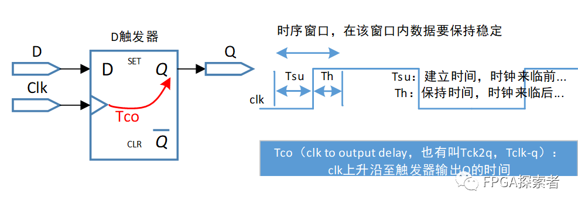

## 亚稳态

数字电路中讲到：单稳态、双稳态概念，比如施密特触发器等，D触发器是典型的双稳态电路，稳定的状态是0状态或者1状态，具有记忆功能。

与“稳态”对立，触发器的输出在某段时间内无法达到确定状态，这段时间称为决断时间Tmeet。当过了这段时间以后，输出【随机】稳定到0状态或者1状态。

在【异步电路】中，数据跳变与时钟触发边沿的关系不固定，有可能【不满足建立/保持时间】，使得触发器进入亚稳态，直到一段时间后恢复到稳态。

**异步电路如何解决亚稳态问题：同步处理，比如打拍、异步FIFO等。**

**理论上，亚稳态不可能消除，只能降低其发生的概率。**一般系统中，对于单Bit的慢时钟域到快时钟域的脉冲信号，使用两级同步器即可将发生的概率降到可以认为几乎不会发生，要求严格的系统也可使用更多级的同步器。

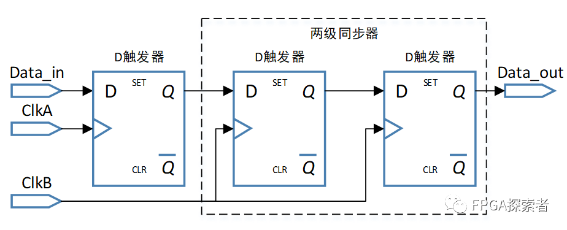

## 两级同步器分析

将两级同步器的中间信号命名为Data_1。

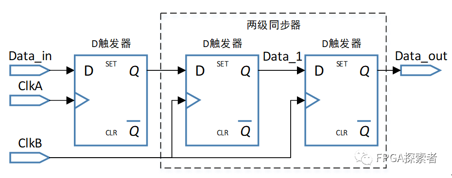

#### 第一种情况：稳态为0

如下图所示，Data_in是ClkA时钟域的一个脉冲信号，在传递到ClkB时钟域时发生了亚稳态。**Data_in随ClkA变化，但是此时低电平到高电平的变化恰好处于ClkB第1个时钟沿的时序窗口内，这样ClkB就无法准确判断第一个D触发器的输入信号到底是0还是1，所以输出Data_1会产生亚稳态（Metastable）。**

在经过一段时间后（该时间小于一个时钟周期），输出Data1会随机稳定到0稳态或者1稳态，下图中所示稳定到0。在ClkB的第二个时钟沿处，Data_in是稳定的1，所以输出Data_1没有亚稳态。

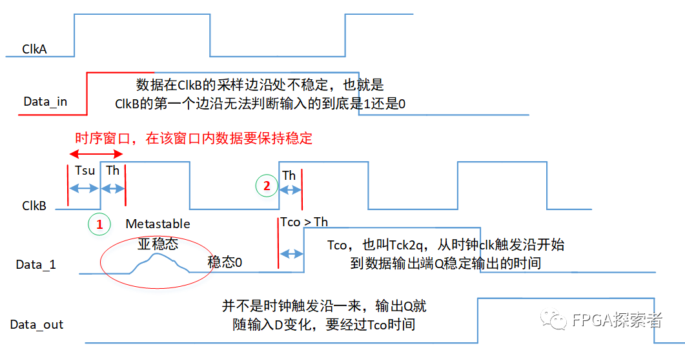

对第二个寄存器来说，输入是Data_1，输出是Data_out。无论是在ClkB的第一个还是第二个时钟边沿，Data_1在时序窗口内都是稳定的。这样，Data_out成功得到一个稳定的脉冲信号。

#### 第二种情况：稳态为1

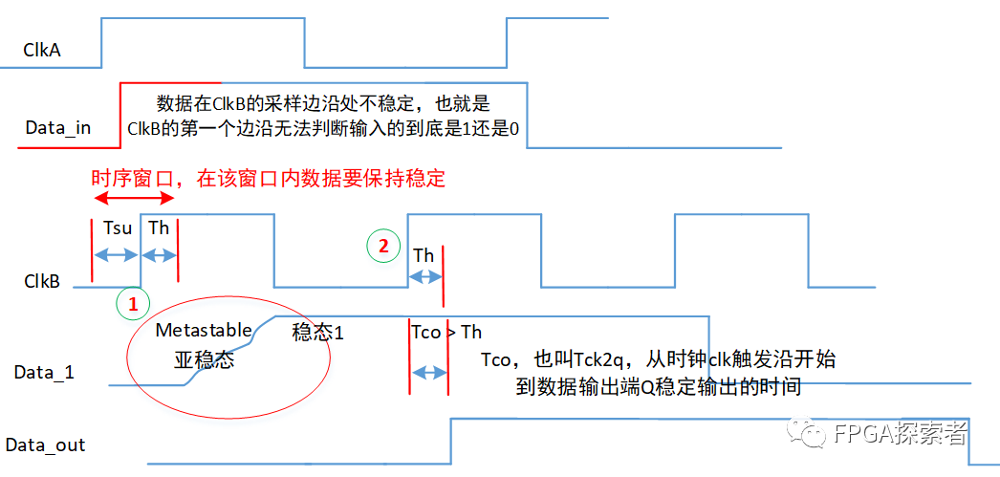

对Data_1来说，当亚稳态后随机稳定到1时，Data_out也能输出高电平脉冲信号，但是可以看到这个脉冲的周期不是1。这部分可以通过边沿检测等方式获得ClkB时钟域的单脉冲信号。

## 上升沿检测实现单周期脉冲同步

在两级同步器以后再加一个D触发器。

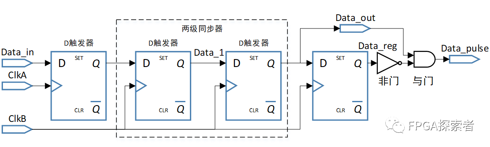

#### 第一种情况：稳态为0

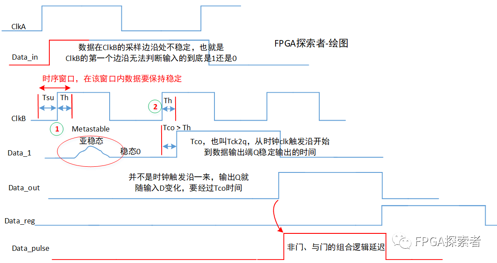

#### 第二种情况：稳态为1

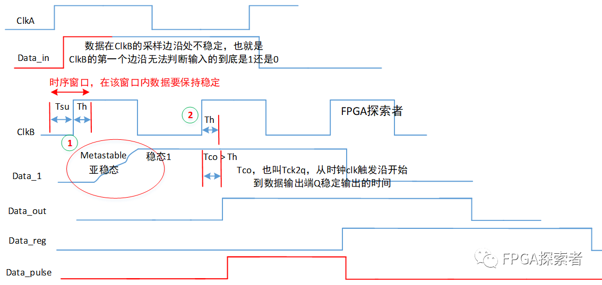

可以看到，两种方式下，均能在ClkB时钟域得到单周期的高电平脉冲信号，区别只在于第二种情况检测到的脉冲比第一种情况晚了一个clk，但是不影响逻辑，且数据均是稳定的，满足时序要求。

由于经过了非门和与门的组合逻辑运算，所以Data_pulse的输出会引入一定的组合逻辑计算时延。

注意：普通的上升沿检测只需要两个D触发器，这里在ClkB时钟域有3个D触发器，前两个是用来做跨时钟同步用的，实际用于上升沿检测是还是2个。那么第一个触发器能不能去掉来节省资源呢？

显然不能，因为这样在做组合逻辑运算时会有亚稳态的输出参与运算，造成亚稳态的传播。

## 快时钟到底有多快？

一直说快时钟——>慢时钟的单bit脉冲控制信号可以用两级同步器（打两拍）的方式同步过去，那么多快是快呢？什么情况下可以认定这是一个快时钟——>慢时钟的信号传递呢？

一般性答案：快时钟至少是慢时钟频率的1.5倍。

探究性答案：具体和脉冲宽度有关，慢时钟域的脉冲宽度至少是快时钟周期的1.5倍。当脉冲是单周期脉冲时，符合上面的一般性答案。

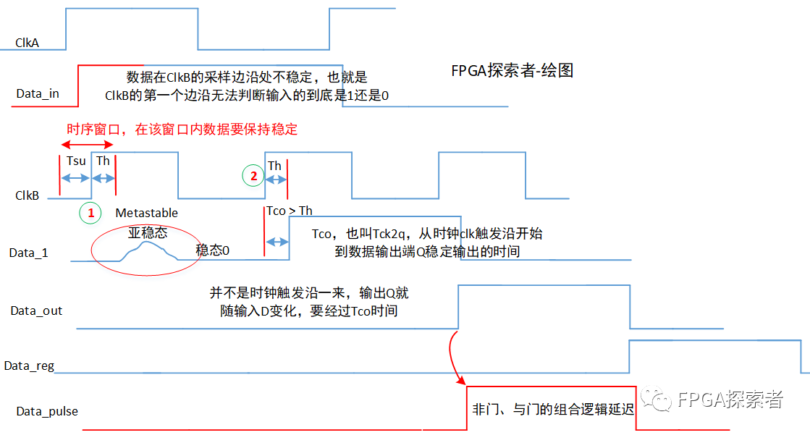

还是拿上面的同步时序图，可以看到，Data_in的脉冲持续时间是大于ClkB的1.5倍的（设周期的一半为clk_half，这里大于3个clk_half）。当亚稳态稳定到0时，ClkB时钟域里只在第2个上升沿检测到高电平，由此才完成脉冲同步。试想一下：如果第2个clk上升沿的时候Data_in已经变成0了呢？

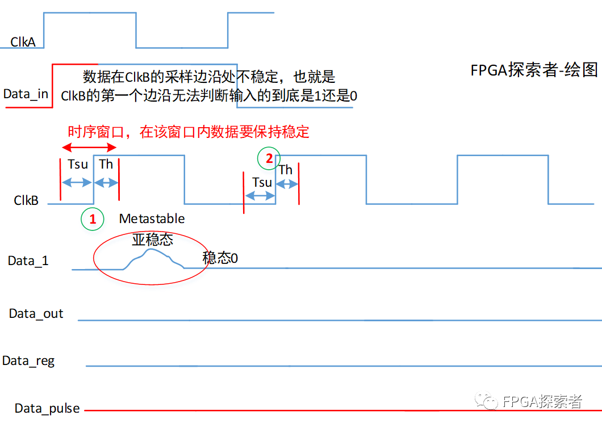

此时，由于亚稳态随即稳定到了0，所以对于第二个寄存器来说，检测到的输入都是稳定的0，输出Data_out也就是0，无法检测出上升沿脉冲。

## 同步电路中会出现亚稳态吗？

如前面所说，亚稳态是因为输入数据不满足建立和保持时间导致的，那么在同步电路中会出现不满足建立/保持时间吗？

答案显示是的，同步电路也可能不满足建立/保持时间，原因是时钟太快、组合逻辑延迟太大、布线延迟等原因造成的，否则的话我们设计成同步逻辑可以跑非常非常高的时钟也没问题了。正是因为太快的时候可能导致数据不满足建立/保持时间，所以才会尽可能的优化时序和设计。

比如下图，时钟200 MHz，周期5 ns，组合逻辑4 ns，建立时间Tsu = 1.5 ns，那么第二个寄存器的输入数据不满足建立/保持时间。

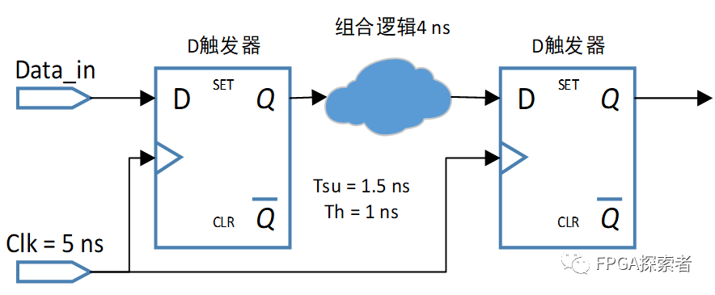

怎么优化呢？

（1）降低组合逻辑延时，可以通过寄存器分割组合逻辑，形成流水线。

拆分组合逻辑后，两个寄存器之间的延时减小，满足建立/保持时间。这个也是非常重要是设计思想：流水线pipeline。

通过流水线设计，实际上能够让最大运行时钟频率进一步提升，也是提高系统运行速度的一个重要方法。

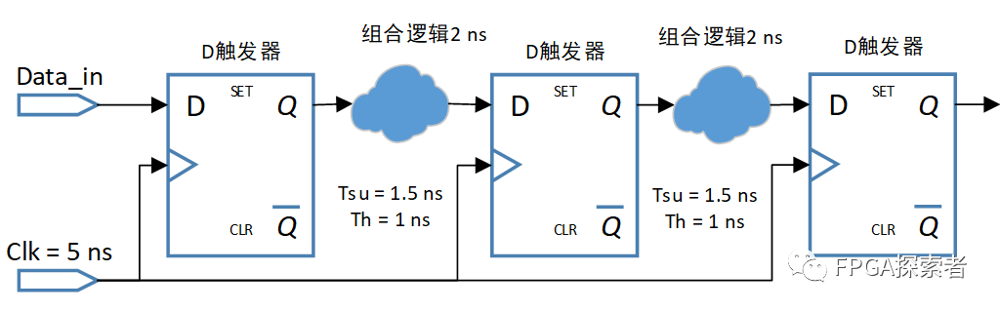

（2）增大时钟周期，也就是降低时钟频率；

（3）换更快的器件，这样Tsu和Th更小；

## FPGA时序分析之关键路径（Critical Path）

**关键路径通常是指同步逻辑电路中，组合逻辑时延最大的路径**（这里我认为还需要加上布线的延迟），**也就是说关键路径是对设计性能起决定性影响的时序路径。**

对关键路径进行时序优化，可以直接提高设计性能。对同步逻辑来说，常用的时序优化方法包括**Pipeline**、**Retiming**、**逻辑复制**、**加法/乘法树**、**关键信号后移**、**消除优先级**等解决。

静态时序分析能够找出逻辑电路的关键路径。通过查看静态时序分析报告，可以确定关键路径。在Vivado工具中，可以通过report_timing_summary 等来查看，如下图所示，**WNS（Worst Nagative Slack）对应最大延迟分析的所有时序路径的最差裕量（Setup）**，显示的Slack为时序裕量，Levels为该条路径上源逻辑驱动的级数，HignFanout为高扇出的值，源和目的，总的延时=逻辑延时+布线延时，这里，使用100MHz的时钟，对应周期10ns，逻辑延时最大0.535ns，布线延时1.950ns。

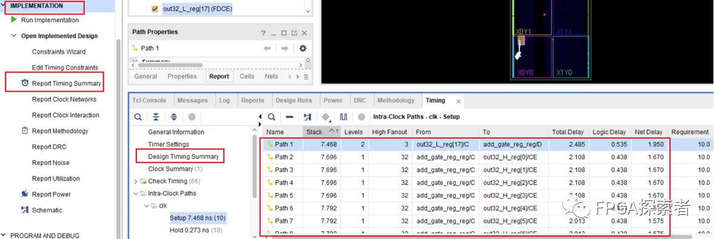

### 组合逻辑中插入寄存器（插入流水线）

组合逻辑的延时过长，就会成为关键路径，这时**可以考虑在该路径上插入额外的寄存器**，这种方法也称为插入流水线，多用于高度流水的设计中，因为这种设计中额外插入寄存器增加的时钟周期延时并不会违反整个设计的规范要求，从而不会影响设计的总体功能性实现，也即额外插入的寄存器在保持吞吐量不变的情况下改善了设计的时序性能。当然，其不可避免地会带来部分面积的增加，如图6-11所示。

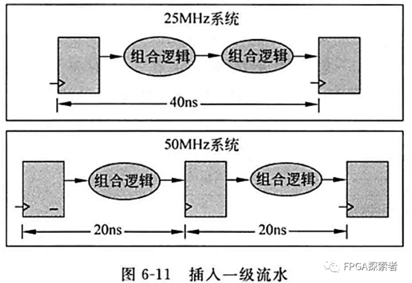

在插入寄存器时，要在组合逻辑中选择合适的位置进行插入，使得插入寄存器后被分割出的几块小的组合逻辑延时基本一致，**也相当于下图所示的先加入寄存器，再对寄存器进行重定时Retiming。**

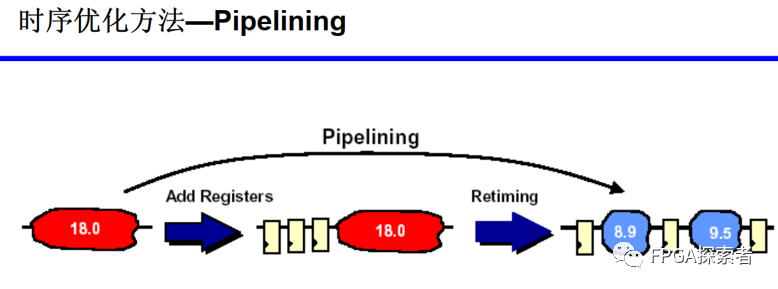

### 寄存器平衡（重定时Retiming）

在不增加寄存器个数的前提下，通过改变寄存器的位置来优化关键路径，可以对比和流水线插入寄存器的不同。

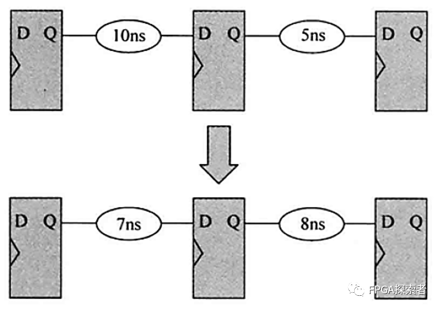

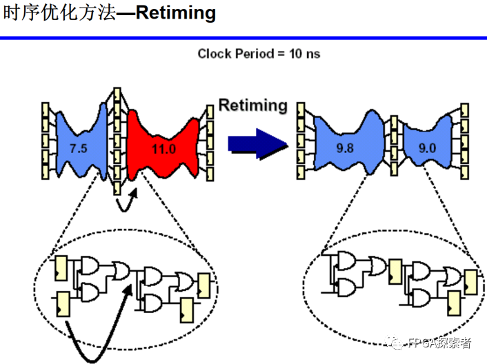

### 操作符平衡（加法树、乘法树）

平衡前，a和b均经过3个乘法器带来的延时，c经历2个，d经历1个，最长延时为3个乘法器延时。平衡后，树形结构，a、b、c、d均经历2个乘法器延时，最长延时为2个乘法器延时。

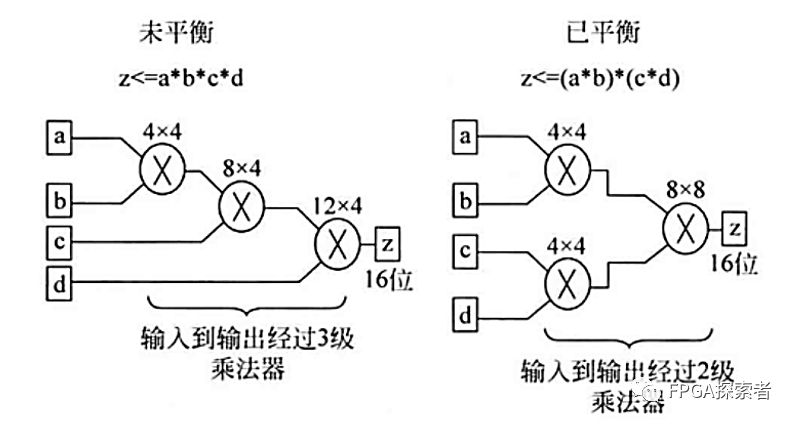

### 消除代码优先级（case代替if…else）

**本身确实不需要优先级的地方，可以使用case代替if…else**，使得顺序执行的语句编程并行执行。如果确实有优先级兵，则不能这样做。这种消除代码中的优先级的策略也称为代码结构平坦化技术，主要针对那些带优先级的编码结构。

### 逻辑复制
当某个信号的扇出fanout比较大时，会造成该信号到各个目的逻辑节点的路径变得过长，从而成为设计中的关键路径，此时可以通过对该信号进行复制来降低扇出。高扇出的危害是大大增加了布局布线的难度，这样其扇出的节点也就无法被布局得彼此靠近，所以就导致了布线长度过大的问题。

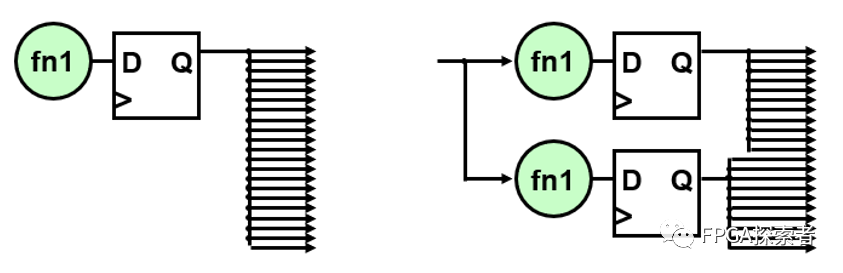

### 关键信号后移

关键输入应该在逻辑最后一级提供，其中关键输入为芯片、Slice、或者LUT提供的时延最大的输入，比如在if…else if…链中，将关键信号放在第一级。

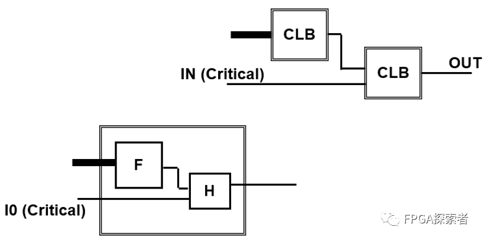
