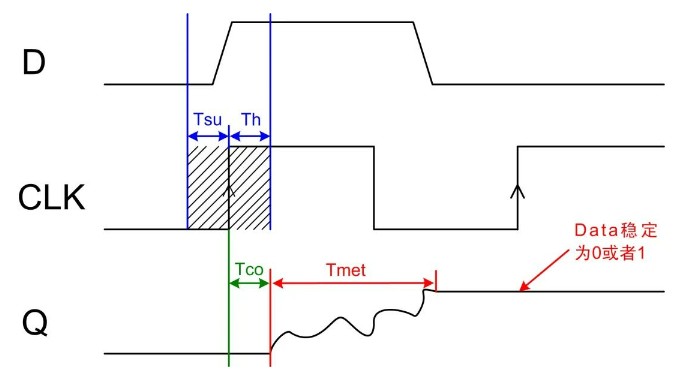
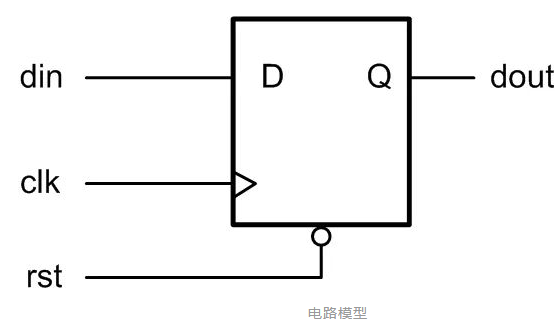
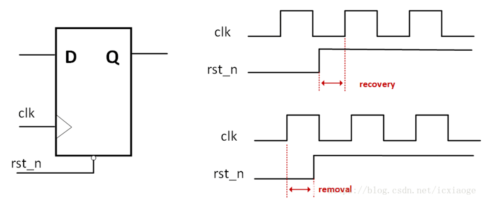
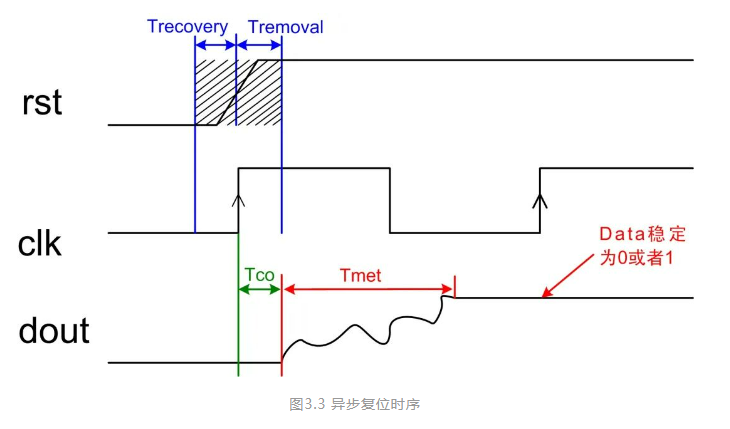
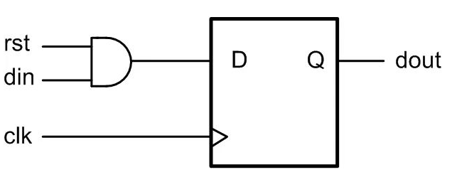
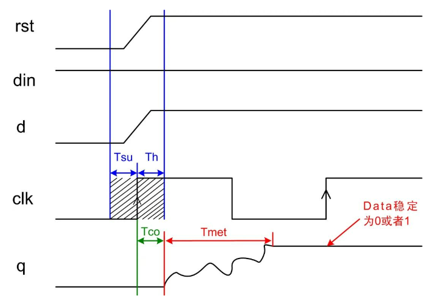
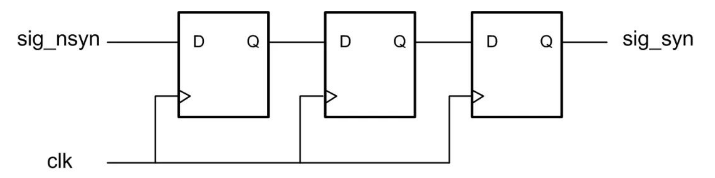
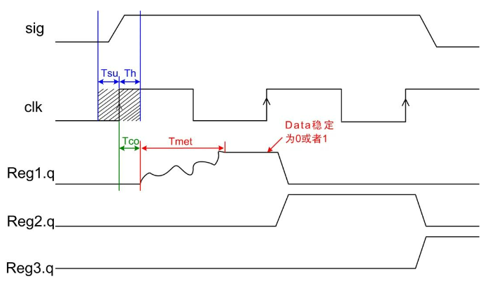
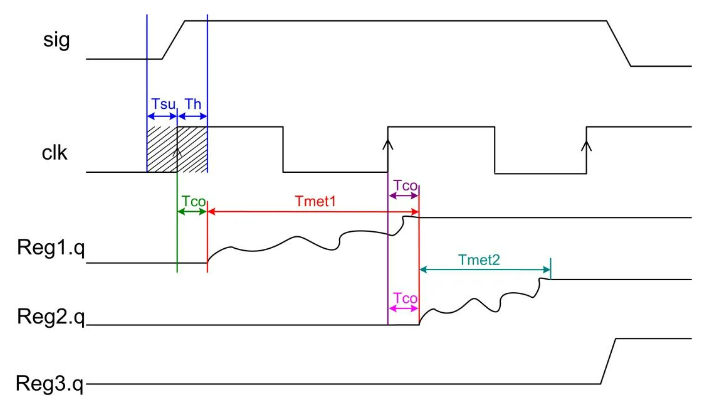

# 【数字IC面试八股文(竞争冒险、亚稳态、同步)】【Tsu建立时间】【Th保持时间】【Tmet决断时间】【recovery恢复时间】【removal移除时间】

- [ ] Version
    * [x] linhuangnan
    * [x] 2024-03-06 
    * [x] 竞争冒险
    * [ ] review

!!! info
    * 应用背景
    * 理论分析
    * 应用分析

## 应用背景

### 亚稳态发生原因

在FPGA系统中，如果数据传输中不满足触发器的 Tsu 和 Th 不满足，或者复位过程中复位信号的释放相对于有效时钟沿的恢复时间（recovery time）不满足，就可能产生亚稳态，此时触发器输出端Q在有效时钟沿之后比较长的一段时间处于不确定的状态，**在这段时间里Q端在0和1之间处于振荡状态，而不是等于数据输入端D的值。这段时间称为决断时间（resolution time）。**经过resolution time之后Q端将稳定到0或1上，但是稳定到0或者1，是随机的，与输入没有必然的关系。

### 亚稳态发生场合

只要系统中有异步元件，亚稳态就是无法避免的，亚稳态主要发生在**异步信号检测**、**跨时钟域信号传输**以及**复位电路**等常用设计中。

### 亚稳态危害

由于产生亚稳态后，寄存器Q端输出在稳定下来之前可能是毛刺、振荡、固定的某一电压值。**在信号传输中产生亚稳态就会导致与其相连其他数字部件将其作出不同的判断，有的判断到“1”有的判断到“0”，有的也进入了亚稳态，数字部件就会逻辑混乱。**

在复位电路中产生亚稳态可能会导致复位失败。怎么降低亚稳态发生的概率成了FPGA设计需要重视的一个注意事项。

## 理论分析

### 信号传输中的亚稳态

在同步系统中，输入信号总是系统时钟同步，能够达到寄存器的时序要求，所以亚稳态不会发生。亚稳态问题通常发生在一些**跨时钟域信号传输**以及**异步信号采集**上。

它们发生的原因如下：

（1）在跨时钟域信号传输时，由于源寄存器时钟和目的寄存器时钟相移未知，所以源寄存器数据发出数据，数据可能在任何时间到达异步时钟域的目的寄存器，所以无法保证满足目的寄存器 Tsu 和 Th 的要求；

（2）在异步信号采集中，由于异步信号可以在任意时间点到达目的寄存器，所以也无法保证满足目的寄存器 Tsu 和 Th 的要求；

当数据在**目的寄存器 Tsu-Th 时间窗口**发生变化，也即**当数据的建立时间或者保持时间不满足时，就可能发生亚稳态现象。**如下图所示



由图可知，当产生亚稳态后 **Tco 时间**后会有**Tmet（决断时间）的振荡时间段**，当**振荡结束回到稳定状态时为“0”或者“1”，这个是随机的**。因此，会对后续电路判断造成影响。

### 复位电路的亚稳态

#### 异步复位电路

在复位电路设计中，复位信号基本都是异步的，常用异步复位电路Verilog描述如下：

```verilog
always @(posedge clk or negedge rst_n)
begin
       if(!rst_n) a <= 1’b0;
       else         a <= b;
end
```

综合出来复位电路模型如下图所示：



 如下图所示，为复位电路复位时序图。如果异步复位信号的撤销时间在Trecovery（恢复时间）和 Tremoval（移除时间）之内，那势必造成亚稳态的产生，输出在时钟边沿的Tco后会产生振荡，振荡时间为Tmet（决断时间），最终稳定到“0”或者“1”，就会可能造成复位失败。

 

**recovery time（恢复时间）：**

撤销复位时，在时钟有效沿来临前，为保证寄存器能有效恢复到置位状态，必须保持稳定的最小时间间隔。

**removal time（清除时间）：**

复位时，在时钟有效沿来临后，为保证寄存器能有效恢复到复位状态，复位电平必须保持稳定的最小时间间隔。



!!! warning
    图中Trecovery和Tremoval画反了

#### 同步复位电路的亚稳态

在复位电路中，由于复位信号是异步的，因此，有些设计采用同步复位电路进行复位，并且绝大多数资料对于同步复位电路都认为不会发生亚稳态，其实不然，同步电路也会发生亚稳态，只是几率小于异步复位电路。

如下面verilog代码对同步复位电路的描述。

```verilog
always @(posedge clk)
begin
       if(!rst_n) a <= 1’b0;
       else         a <= b;
end
```

综合出硬件电路如下图所示



在此，我们不讨论同步复位的消耗资源问题，只讨论同步复位的亚稳态产生情况。

当输入端Din为高电平，而且复位信号的撤销时间在clk的Tsu和Th内时候，亚稳态就随之产生了。如下图时序所示，当复位撤销时间在clk的Tsu和Th内，输入数据为“1”，通过和输入数据相与后的数据也在clk的Tsu和Th内，因此，势必会造成类似异步信号采集的亚稳态情况。



### 亚稳态产生概率以及串扰概率

在实际的FPGA电路设计中，常常人们想的是怎么减少亚稳态对系统的影响，很少有人考虑怎么才能减少亚稳态发生几率，以及亚稳态串扰的概率问题。

#### 亚稳态发生概率

由上面分析得知，**系统亚稳态发生的都是由于 clk 的 Tsu（setup 建立时间）和 Th（hold 建立时间）不满足，又或者是复位信号的移除（Removal）和恢复时间（Recovery）不满足**。常用FPGA器件的Tsu+Th约等于1ns，复位移除和恢复时间相加约等于1ns。

当异步信号不是一组数据，或者信号量较少，那就需要对异步信号进行同步处理，例如对一个异步脉冲信号进行采集，只要脉冲信号变化发生在时钟Tsu和Th窗口内，那就很可能会产生亚稳态，亚稳态产生的概率大概为：

概率 = （建立时间 + 保持时间）/ 采集时钟周期

由公式3-1可以看出，随着clk频率的增加，亚稳态发生的几率是增加的。

例如，为系统采用100M时钟对一个外部信号进行采集，采集时钟周期为10ns，那采集产生亚稳态的概率为：1ns/10ns = 10%

同理采用300M时钟对一个外部信号进行采集，那产生亚稳态的概率为：1ns/3.3ns = 30%

如果采用三相相位差为120°的时钟对一个外部信号进行采集，那产生亚稳态的概率接近90%

所以在异步信号采集过程中，要想减少亚稳态发生的概率：

（1） 降低系统工作时钟，增大系统周期，亚稳态概率就会减小；

（2） 采用工艺更好的FPGA，也就是 Tsu 和 Th 时间较小的FPGA器件；

#### 亚稳态的串扰概率

使用异步信号进行使用的时候，好的设计都会对异步信号进行同步处理，**同步一般采用多级D触发器级联处理**，如下图所示，采用三级D触发器对异步信号进行同步处理。



这种模型大部分资料都说的是第一级寄存器产生亚稳态后，第二级寄存器稳定输出概率为90%，第三极寄存器稳定输出的概率为99%，如果亚稳态跟随电路一直传递下去，那就会另自我修护能力较弱的系统直接崩溃。接下来我们分析这种串扰的概率问题。

下图为一个正常第一级寄存器发生了亚稳态，第二级、第三级寄存器消除亚稳态时序模型。



由上图可以看出，当第一个寄存器发生亚稳态后，经过Tmet的振荡稳定后，第二级寄存器能采集到一个稳定的值。但是为什么第二级寄存器还是可能会产生亚稳态呢？

由于振荡时间Tmet是受到很多因素影响的，所以Tmet时间有长有短，所以当Tmet时间长到大于一个采集周期后，那第二级寄存器就会采集到亚稳态。如下图所示：



 由上图可知，第二级也是一个亚稳态，所以在这种情况下，亚稳态产生了串扰，从第一级寄存器传到了第二级寄存器，同样也可能从第二级寄存器串扰到第三级寄存器。这样会让设计逻辑判断出错，产生亚稳态传输，可能导致系统死机崩溃。

 #### 亚稳态振荡时间Tmet

 亚稳态震荡时间 Tmet 关系到后级寄存器的采集稳定问题，Tmet影响因素包括：器件的生产工艺、温度、环境以及寄存器采集到亚稳态离稳定态的时刻等。甚至某些特定条件，如干扰、辐射等都会造成Tmet增长。

## 应用分析

有亚稳态产生，我们就要对亚稳态进行消除，常用对亚稳态消除有三种方式：

（1） **对异步信号进行同步处理**；

（2） **采用FIFO对跨时钟域数据通信进行缓冲设计**；

（3） **对复位电路采用异步复位、同步释放方式处理**。

### 对异步信号进行同步提取边沿

在异步通信或者跨时钟域通信过程中，最常用的就是对异步信号进行同步提取边沿处理。对一个异步信号进行提取上升沿如下：

**双极寄存器提取边沿**

```verilog
input      sig_nsyn;
wire        sig_nsyn_p;
reg[1:0]   sig_nsyn_r; //sig_nsyn_r[0]相对于sig_nsyn延迟一拍，sig_nsyn_r[1]相对于sig_nsyn_r[0]延迟一拍
always @(posedge clk or negedge rst_n)
begin
       if(!rst_n) sig_nsyn_r <= 2’d0;
       else         sig_nsyn_r <= { sig_nsyn_r [0], sig_nsyn };
end
assign     sig_nsyn_p = sig_nsyn_r[0] & ~sig_nsyn_r[1];
```

**这种边沿提取方式对于一个稳定的系统是不合适的**，例如：**当第一级寄存器采集到亚稳态，那势必造成sig_nsyn_p输出亚稳态**，这样就会对采用sig_nsyn_p的信号进行判断的电路造成影响，甚至判断出错误的值。

根据之前的亚稳态产生概率，如果在100M时钟下那第一级寄存器产生亚稳态的概率约为10%，随着系统采集频率升高，那产生亚稳态的概率也会随之上升。因此，**在进行异步信号跨频提取边沿时候，一般采用多进行一级寄存器消除亚稳态，可能在系统稳定性要求高的情况下，采用更多级寄存器来消除亚稳态，如程序清单 4.2所示，即为采用4级寄存器消除亚稳态**，相应的边沿信号产生的时间就晚了两个时钟周期。

多级寄存器提取边沿信号代码如下
```verilog
input      sig_nsyn;
wire        sig_nsyn_p;
reg[3:0]   sig_nsyn_r;
always @(posedge clk or negedge rst_n)
begin
       if(!rst_n) sig_nsyn_r <= 4’d0;
       else         sig_nsyn_r <= { sig_nsyn_r [2::0], sig_nsyn };
end
 
assign     sig_nsyn_p = sig_nsyn_r[2] & ~sig_nsyn_r[3];
```

### FIFO进行异步跨频数据处理

当数据流从一个时钟域到另一个时钟域的时候，绝大多数情况下都采用FIFO来作为中间缓冲，采用双时钟对数据缓冲，就可以避免亚稳态的发生。

#### 异步复位，同步释放

对于**复位情况下的亚稳态，常常是由于恢复时间和移除时间不满足造成的**，因此，最常用的处理方式是采用**异步复位、同步释放**。常用电路模型如下所示。采用第二级寄存器输出作为全局复位信号输出。

```verilog
wire        sys_rst_n;
reg [1:0]  rst_r;
always @(posedge clk or negedge rst_n)
begin
       if(!rst_n) rst_r <= 2’d0;
       else         rst_r <= {rst_r[0], 1’b1};
end
assign     sys_rst_n = rst_r[1];
```

通过上面三种方式处理异步信号、异步数据、以及异步复位可有效的提高系统的稳定性，减少亚稳态的产生。