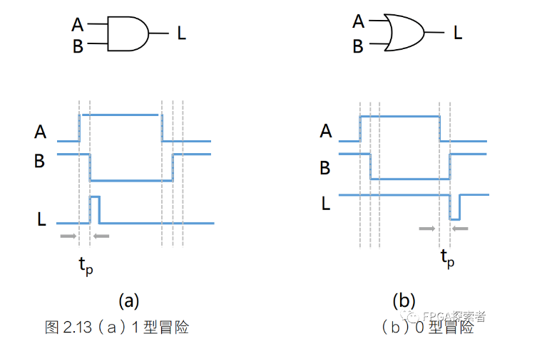
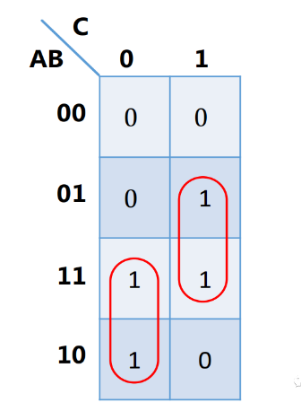
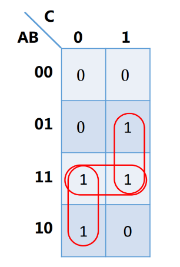

# 【数字IC面试八股文(竞争冒险、亚稳态、同步)】组合逻辑竞争冒险【0型冒险和1型冒险及其消除方法】

- [ ] Version
    * [x] linhuangnan
    * [x] 2024-03-05 
    * [x] 竞争冒险
    * [ ] review

!!! info
    * 什么是竞争和冒险
    * 怎么识别竞争冒险
    * 如何消除冒险

## 什么是竞争和冒险

（大疆2020芯片工程师校招）组合逻辑电路中的冒险是由于（ ）引起的。

A、电路有多个输出

B.、电路未达到最简

C、逻辑门类型不同

D、电路中的时延

答案：D

### 竞争

在一个组合电路当中，当某一个变量经过两条以上的路径到达输出端的时候，由于**每条路径上的延迟时间的不同**，到达终点的时间就会有先有后，这一现象称作竞争。

### 冒险

在具有竞争现象的组合电路中，当某个变量发生变化的时候，比如说从 1 跳到 0，或者说从 0 跳到 1，如果真值表所描述的逻辑关系或者功能遭受到短暂的破坏，**在输出端出现一个不应有的尖脉冲 毛刺，这种现象就叫 冒险。**

冒险是由竞争造成的，而竞争是因为电路中的时延不同，所以选D，

冒险是因为电路中的时延问题导致。

但是有竞争的时候不一定会出现冒险。

## 怎么识别竞争冒险

### 公式法

写出逻辑表达式，**当某些逻辑变量取特定值 0 或 1 时**，

若逻辑表达式能转换为 A·(~A)，则该电路存在1型冒险（该为 0 的时候出现了为 1 的错误数据，1 型冒险）；

若逻辑表达式能转换为 A+(~A)，则该电路存在0型冒险（该为 1 的时候出现了为 0 的错误数据，0 型冒险）。

### 卡诺图法

画出其卡诺图，

若输入变量在卡诺圈内改变时，则输出不会有冒险现象；

若输入变量是在相邻卡诺圈的相邻处发生变化，并且是从一个卡诺圈进入另一个卡诺圈，则有可能产生逻辑冒险现象。（卡诺图相切）

如下图所示，

当A=1、C=0，B由0->1时，在卡诺圈内变化，不会出现冒险；

当B=C=1，A由0>1时，在卡诺圈内变化，不会出现冒险。

当A=B=1，C从0>1时，相当于输入变量A、B、C从110变化到111，此时的变化是从一个卡诺圈变化进入另一个卡诺圈，该电路输出存在冒险现象。

## 如何消除冒险

### 增加冗余项

如下图，增加一个冗余项AB，这样状态变化时也是在卡诺圈内变化，此时逻辑表达式不是最简表达式，但是消除了冒险。

### 增加选通信号（高电平）

输入端加入选通信号，针对 A+(~A) 的 0 型冒险，避开毛刺。

### 引入封锁脉冲（低电平）

输入端加入封锁脉冲信号，针对 A·(~A) 的 1 型冒险，避开毛刺。

### 增加滤波电容

冒险输出的是一个很窄的毛刺，在输出端接滤波电容将其滤除。

### 采用可靠性编码

比如格雷码，每次只变化1位。

其特点是在任意两个连续的数值之间，只有一位二进制数字发生变化。这种编码可以有效地减少竞争冒险，因为在任何给定时间，只改变一个信号位，极大地降低了不同输入信号变化不同步导致冒险的机率。