# 【数字IC(竞争冒险、亚稳态、同步)】【同步后的复位该当作同步复位还是异步复位？——Xilinx FPGA异步复位同步释放】

- [ ] Version
    * [x] linhuangnan
    * [x] 2024-03-06 
    * [x] 竞争冒险
    * [ ] review

!!! info
    * 异步复位同步释放
    * Xilinx复位程序对比
    * 仿真结果

## Xilinx FPGA复位策略

先给出 Xilinx 复位准则：

（1）尽量少使用复位，特别是少用全局复位，能不用复位就不用，一定要用复位的使用局部复位；

（2）如果必须要复位，在同步和异步复位上，则尽量使用同步复位，一定要用异步复位的地方，采用“异步复位、同步释放”；

（3）复位电平选择高电平复位；

（这里说明，由于 Altera 和 Xilinx 器件内部结构的不同，Altera 的 FPGA 推荐低电平复位）


#### Global Reset Isn't Timing-Critical(全局复位不是时序关键)

全局复位的典型驱动：

（1）按键开关：复位信号接一个按键，反应非常慢（ms级别），并且非常不确定（按键抖动？）；

（2）电源状态输出：上电后由电源芯片产生一个监测信号复位系统，可以长时间的保持，直到电源稳定后进行正常工作；

（3）微处理器等控制芯片：控制芯片产生复位脉冲；

以上所有情况下，复位信号似乎是缓慢的，因此，我们也可以有把握地认为，它对时序不会造成关键影响。当为您的FPGA设计指定定时约束时，这个信号通常会被分配一个长周期(低频)。

但是，全局复位不是时序关键的假设并不全对，随着时钟频率的增加，全局复位对时序会带来很大的影响。

虽然复位脉冲可以用比时钟周期更长的持续时间，并保证所有触发器都可以被成功复位，但是复位信号的释放应该被认为是一个时间关键事件。

FPGA内部的全局置位/复位(GSR)信号也是一个全局复位，这也是FPGA器件内部的一个**高扇出网络（high fan-out）**。在一个设计中，虽然启动序列可以与“用户时钟”同步，但不能保证它不能与所有时钟都同步。FPGA器件有多个DLL/DCM/PLL模块，每个模块都能够产生多个不同频率和相位的时钟。

在图1中，一个复位信号在两个时钟边沿之间的某个时间被释放。**复位信号经过一段时间传播到各种触发器，在每个触发器中，复位信号都应该在下一个有效的时钟边沿的“Set-up time”（建立时间）前就无效。很明显，当时钟频率上升时，可以用来分配给复位信号释放的时间就会减少。考虑到复位信号是一个高扇出网络，所以复位释放的时序不易收敛。**

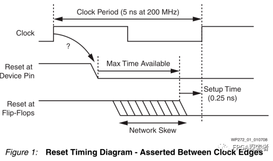

**如果复位的释放与时钟异步(通常就是这种情况)，那么就无法保证所有触发器都能在同一个时钟边缘释放**

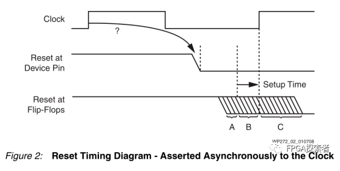

当在A时刻释放reset时，触发器将在第一个时钟边沿检测到有效的释放信号；在C时刻释放reset时，复位的释放将直到下一个时钟边沿才被检测到；B时刻时钟上升沿时触发器检测到的reset状态很难确定（可能高电平，也可能低电平），可能导致亚稳态。

**随着时钟频率的提高和与大型器件潜在的分布倾斜，几乎不可避免的是，无法保证所有的触发器的复位都能在同一个时钟边沿被释放。**

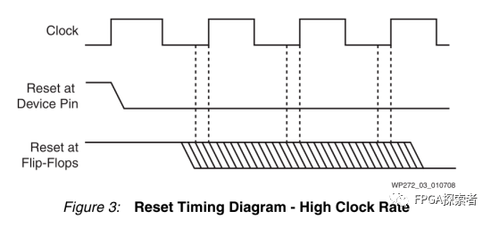

#### Does It Really Matter?

好消息是，在99.99%的情况下，全局复位的异步释放对系统没什么影响，所以大多数电路都能正常工作。如果一个电路不工作，那可能恰好是遇到了另外的0.01%，不幸地在错误的时间释放了复位。

在图4所示的流水线场景中，复位释放的时间并不重要。

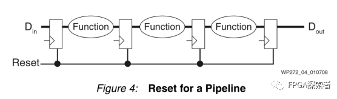

当数据通过流水线进程时，复位的释放时间无关紧要。即使出现了错误，在经过一定时钟周期后整个系统就能恢复。这种情况下，复位是没有意义的。当有效的数据输入时，初始状态或者未知的状态将从系统中清除。

但是，在图5显示了**独热码状态机**场景中复位释放的时间非常重要。

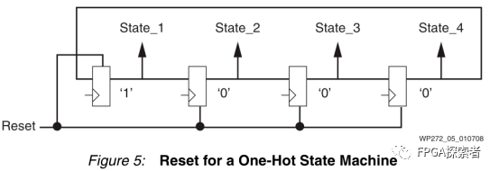

在上面的独热码状态机中，有明显的失败可能性。如果第一个触发器在第二个触发器的前一个时钟周期释放，那么独热码的热状态将丢失，状态机将永远变冷（状态机无法恢复）。将所有的触发器尽可能的靠近布局能够降低错误的发生概率(在局部重置网络上的低倾斜)。然而，除非Set-up timie建立时间得到保证，否则这种错误情况仍有可能发生。如果所有触发器没有在同一个时钟周期中释放，编码后的状态机可能进入意外状态或则会非法状态。

**最后，需要仔细考虑复位的是包含反馈路径的电路。**

**没有反馈的电路实际上根本不需要复位。**

在数字信号处理应用中，有限脉冲响应滤波器(FIR)是没有反馈的。在有效数据填充了所有的抽头之前，输出样本实际上没有有效的值，所以复位抽头寄存器没有任何效果。然而，无限脉冲响应滤波器(IIR)包含反馈。如果因为不干净的复位释放而产生了一些不符合预期的输出，该输出结果又会返回到输入，那么会在很长一段时间内无法获取真实的输出结果（反馈环路互相影响了）。在最坏的情况下，由于不稳定，滤波器可能会完全失效。

#### Automatic Coverage of the 99.99% of Cases

当配置或重配置Xilinx FPGA时，内部所有的单元都被初始化(图6)。这是master reset复位的结果，因为它涉及的远不止简单的触发器。

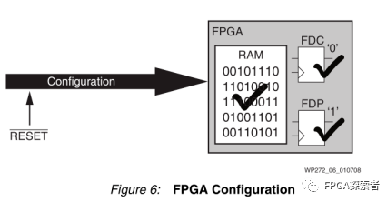

**上电配置与全局复位具有相同的寄存器复位效果，但除此之外，上电的配置还初始化了所有RAM单元。**随着FPGA器件上RAM资源的增加，这是一个非常有用的特性。所有RAM内容的初始状态都是已知的，这对于仿真和操作是非常理想的，并且消除了使用启动序列来清除内存的要求。

由于处理器也嵌入到Xilinx设备中(无论是硬核还是软核)，所有程序和数据区域的初始状态在处理器执行第一条指令之前就已经定义了。在这样的前提下，为了重置一些触发器的初始状态而消耗宝贵的可编程资源是没有意义的。仿真器应该能够对这个初始化(通常称为上电复位)建模，这再次避免了在设计中对复位信号的任何要求。

#### Strategy for the 0.01% of Cases

最重要的是，有一种策略来处理设计中的复位。设计的关键部分在于必须在相关的时钟域**同步释放**，可以插入一个局部的高性能复位网络来控制那些需要**局部复位**的触发器。

图7中的电路是控制局部复位网络的一种可能有用的机制，该电路的优点是使用外部复位信号时的效果和使用器件上电配置产生的效果一样（**异步复位、同步释放，避免了释放带来的亚稳态**）。

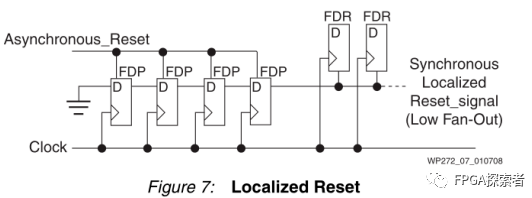

在配置FPGA或异步复位信号期间，链中的所有触发器都预设为1。链上的最后一个触发器几乎立即将一个有效的复位信号驱动到局部复位网络。随着全局置位/复位(GSR)或者异步复位的释放，移位寄存器链开始在每个时钟周期填满0。

链中触发器的数量决定了传输到局部复位网络的复位脉冲的最小持续时间。链路的最后一个触发器进行一个从高电平到低电平的转换，**局部复位与时钟同步释放。复位的触发器可以采用同步置位(FDS)或同步复位(FDR)，从而实现完全同步设计，并易于时序规范和分析。**

#### Reset Costs More Than You Think

在实现设计时，大多忽略了HDL代码中全局复位的代价，但是全局复位的代价可能是巨大的：

（1）布线资源

♦ 减少了其他连接的自由度； 

♦ 可能会降低系统性能，由此需要更高速度等级的FPGA，增加了成本； 

♦ 增加的布线时间；

 

（2）逻辑资源

♦ 触发器专用复位的使用；

♦ 在D输入或专用复位输入之前需要有额外的逻辑门；

♦ 几乎肯定会影响设计的尺寸；

♦ 额外的逻辑层次几乎肯定会影响系统性能；

♦ 增加布局和布线的时间；

 

（3）无法使用高效率的特性，如SRL16E

♦ SRL16E可以在每个LUT中实现多达16个虚拟触发器（Xilinx器件的高效应用）；

♦ 上述实现的虚拟触发器不支持复位，当HDL指定复位时，综合工具就无法使用SRL16E来减少触发器的使用；

♦ 高达16倍的尺寸和产品成本的增加；

♦ 额外的大小可能会降低系统性能；

♦ 增加布局和布线的时间；

关于复位信号如何影响资源利用率的讨论，请参见WP275 Get your Priorities Right - Make your Design Up to 50% small。

#### Summary

**在Xilinx FPGA中实现的设计不需要插入全局复位网络。**对于绝大多数设计，所有触发器和RAM的上电后的初始化状态比任何的逻辑复位都要全面，不需要为了仿真而插入复位，因为没有任何东西是未定义的。由于Xilinx FPGA已经经过了全面测试，因此在设计中不需要扫描逻辑和运行测试向量。因此，全局复位也不需要作为这个过程的一部分。

插入全局重置将影响开发时间和产品成本。随着时钟和完整系统在芯片上实现更高速度的趋势，可靠性问题必须得到重视。**必须确定系统中真正需要复位的关键部件，并且在启动或运行过程中，必须像控制同步电路中的任何其他信号一样小心地控制这些复位的释放。**

当设计每个部分时，都要问一问：“这个部分需要复位吗?”

## 异步复位同步释放

针对异步复位、同步释放，一直没搞明白在使用同步化以后的复位信号时，到底是使用同步复位还是异步复位？

比如针对输入的异步复位信号rst，使用本地时钟clk将其同步化以后得到一个新的复位信号sys_rst，当使用sys_rst时，是将sys_rst作为同步复位信号还是异步复位信号？

```verilog
always @(posedge clk or posedge rst)
begin
  if(rst)begin
    rst_r0 <= 1'b1;
    rst_r1 <= 1'b1;
  end
  else begin
    rst_r0 <= 1'b0;
    rst_r1 <= rst_r0;
  end
end
assign sys_rst = rst_r1;
```

如下图所示，选方式1还是方式2？

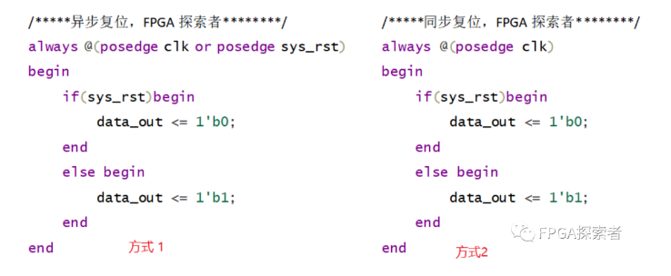

针对此问题查找了很多资料，网络上多是将sys_rst继续按照方式1异步复位使用，Xilinx复位白皮书wp272中提到的异步复位同步释放。

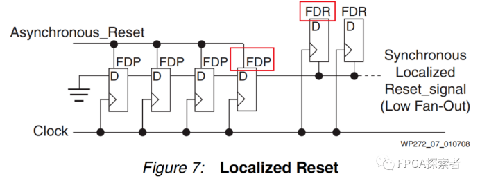

对于输入的异步复位Asynchronous Reset，首先使用了4个触发器来做同步（一般用2个即可，4个出现亚稳态的概率更小），触发器类型为FDP（异步置位），同步化以后的复位信号去使用时综合出的触发器类型为FDR（同步复位），**即在Xilinx中是将sys_rst按照方式2同步复位使用。**

使用FDP异步置位的原因是因为Xilinx推荐高电平复位，当异步复位信号到来时，输出复位电平“1”，即异步置位FDP，当复位消失后，D触发器在每个时钟边沿输出前一级触发器的值，一定周期后，最后一级的FDP稳定输出“0”。

**使用Xilinx A7系列FPGA实现异步复位、同步释放代码，确定同步化后的复位使用情况。**

## Xilinx复位程序对比

#### 将同步化后的复位当作异步复位信号
```verilog
always @(posedge clk or posedge rst_async)
begin
    if(rst_async == 1'b1) begin
        rst_sync_reg1 <= 1'b1;
        rst_sync_reg2 <= 1'b1;
        rst_sync_reg3 <= 1'b1;
        rst_sync_reg4 <= 1'b1;
    end
    else begin
        rst_sync_reg1 <= 1'b0;
        rst_sync_reg2 <= rst_sync_reg1;
        rst_sync_reg3 <= rst_sync_reg2;
        rst_sync_reg4 <= rst_sync_reg3;
    end
end  

wire sys_rst;
assign sys_rst = rst_sync_reg4;

always @(posedge clk or posedge sys_rst)
begin
    if(sys_rst == 1'b1) begin
        data_out_rst_async <= 1'b0;
    end
    else begin
        data_out_rst_async <= a & b & c & d;
    end
end
```

综合并布局布线后的原理图如图所示，显然，综合后对sys_rst复位，将其作为异步复位综合出**FDCE同步使能异步复位**（这里不考虑使能），和白皮书WP272给出的参考电路显然不一致。

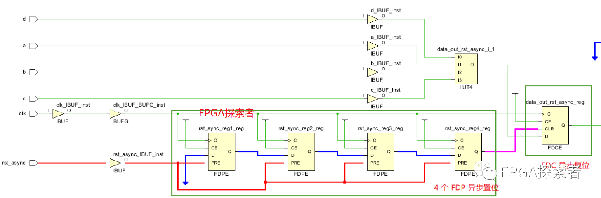

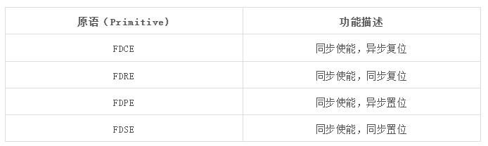

#### 将同步化后的复位当作同步复位信号

```verilog
always @(posedge clk or posedge rst_async)
begin
    if(rst_async == 1'b1) begin
        rst_sync_reg1 <= 1'b1;
        rst_sync_reg2 <= 1'b1;
        rst_sync_reg3 <= 1'b1;
        rst_sync_reg4 <= 1'b1;
    end
    else begin
        rst_sync_reg1 <= 1'b0;
        rst_sync_reg2 <= rst_sync_reg1;
        rst_sync_reg3 <= rst_sync_reg2;
        rst_sync_reg4 <= rst_sync_reg3;
    end
end  

wire sys_rst;
assign sys_rst = rst_sync_reg4;

always @(posedge clk)
begin
    if(sys_rst == 1'b1) begin
        data_out_rst_async <= 1'b0;
    end
    else begin
        data_out_rst_async <= a & b & c & d;
    end
end
```

综合并布局布线后的原理图如图所示，显然，综合后对sys_rst复位，将其作为同步复位综合出FDRE同步使能同步复位（这里不考虑使能）

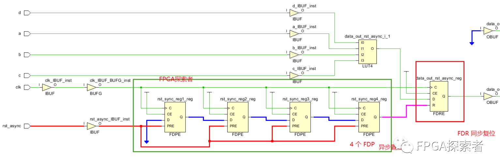

异步复位相比较同步复位，在Xilinx的FPGA中资源是一致的，异步复位的优势在于复位信号一来就能检测到，不需要保持至少一个时钟周期才能在时钟边沿检测到，通过仿真来验证上述电路是否能实现异步复位一来就能检测到。

## 仿真结果

设置时钟50MHz，时钟周期20ns，给一个持续时间3ns的异步复位信号，且持续时间均不出现在时钟上升沿检测期间，可以看到：

（1）rst_async异步复位一旦给出，用于同步的4个寄存器rst_sync_reg1~4立刻输出高电平“1”，在下一个时钟上升沿检测到同步复位并将输出data_out_rst_async复位；

（2）异步复位信号释放后，经过同步的sys_rst经过一定周期后在时钟边沿同步释放；

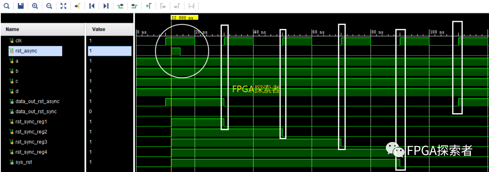

按照同样的复位，将sys_rst看作异步复位，仿真结果如下，相比于上图，区别在于异步复位信号rst_async一旦产生，输出立刻复位，且同样是同步释放，好像这种处理才更符合异步复位、同步释放。

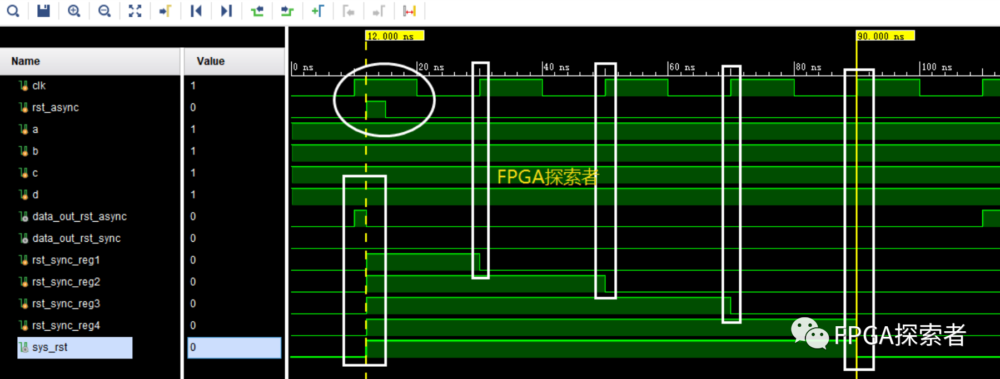

那么为什么Xilinx白皮书还是将sys_rst按照同步复位去做的呢？难道写错了？

综合考虑可能有这样的因素：

（1）当作同步复位的差别只在于复位时间会稍晚一些，要在时钟的下一个边沿检测到，但是还是能够识别到输入的rst_async异步复位信号，所以从复位角度来说，都能够后实现复位效果；

（2）根据Xilinx复位准则，我们知道同步复位相比异步复位有很多好处，具体参见：Xilinx FPGA 复位策略白皮书，既然两者对后级复位没有功能上的差别，那么优先选择同步复位；

经过异步复位同步释放处理后，相比于纯粹的异步复位，降低了异步复位信号释放导致亚稳态的可能性；相比同步复位，能够识别到同步复位中检测不到的复位信号（如上图所示的rst_async在同步复位是检测不到的）；综合两者的优势，异步复位同步释放。

## Altera复位

Altera还是把这个同步后的复位当作异步复位来用的，且推荐低电平复位。

从上面的分析来看，这里当作异步复位还是同步复位对于复位结果本身没有太大的影响，区别在于**Xilinx是推荐同步复位来节省资源**（比如DSP48E或BRAM，异步复位比同步复位耗资源），而Altera的FPGA中带异步复位的触发器，想要同步复位需要消耗更多的资源。

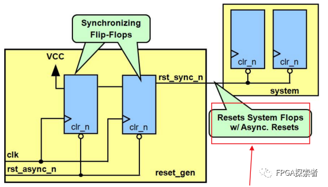

## 练习
设计异步复位同步释放电路，异步复位低电平有效

（1）异步复位同步释放的优势；

（2）D 触发器搭建电路；

（3）Verilog 语言描述

#### 异步复位同步释放的优势


使用 2 个带异步复位的寄存器，D端输入逻辑 1（VCC）。

当异步复位无效（rst_async_n = 1）时，同步后的复位信号 rst_sync_n 也为 1；

当异步复位有效（rst_async_n = 0）时，同步后的复位信号 rst_sync_n 立刻为 0，即实现了“异步复位”，但是会在时钟上升沿来临时恢复为 1，实现“同步释放”；

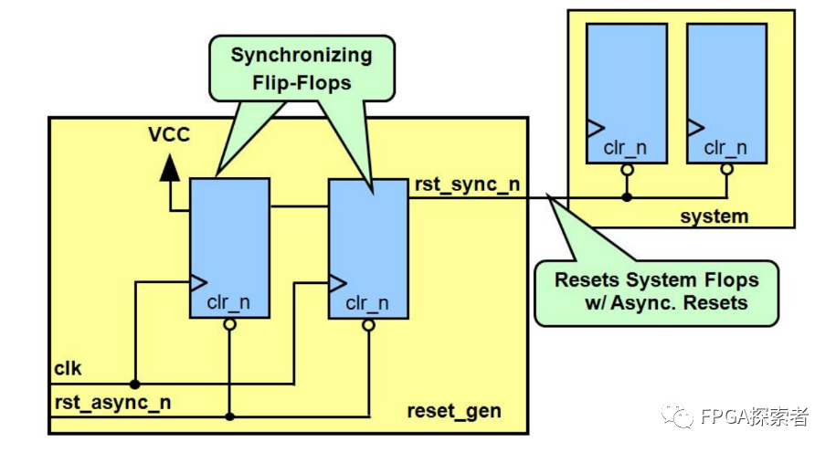

第一级触发器的输入 D 接电源，即高电平1’b1。

第一级触发器的输出，很可能存在亚稳态，使用两级触发器做同步。

#### verilog代码
```verilog
reg rst_n_1 = 1'b1;
reg rst_n_2 = 1'b1;
always @ (posedge clk or negedge rst_async_n) 
begin 
if( !rst_async_n ) begin 
rst_n_1 <= 1'b0;
rst_n_2 <= 1'b0;
end 
else begin 
rst_n_1 <= 1'b1;
rst_n_2 <= rst_n_1;
end 
end 

assign rst_sync_n = rst_n_2; 
```

#### 总结

针对 Xilinx 的 FPGA：

（1）对于同一个触发器逻辑，因为同时支持异步和同步复位，所以异步复位并不会节省资源；

（2）对于其他的资源，比如 DSP48 等，同步复位更加节省资源。

首先，对于 DSP48，其内部还带有一些寄存器（只支持同步复位），如果使用异步复位，则会额外使用外部 Slice 中带异步复位的寄存器，而使用同步复位时，可以利用 DSP48 内部的寄存器；

Xilinx 的 FPGA，对于 DSP48、BRAM 资源，使用同步复位比异步复位更节省资源。