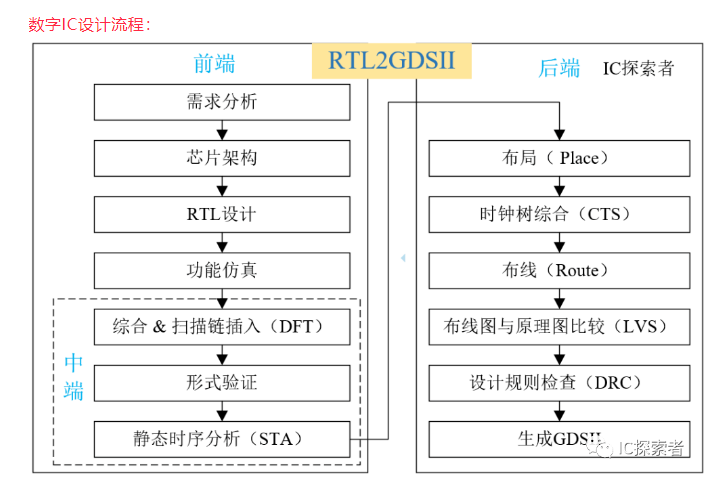
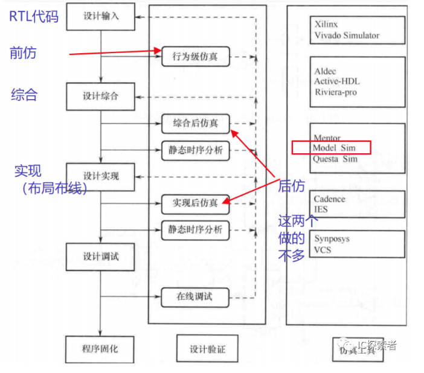
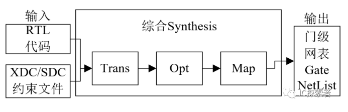
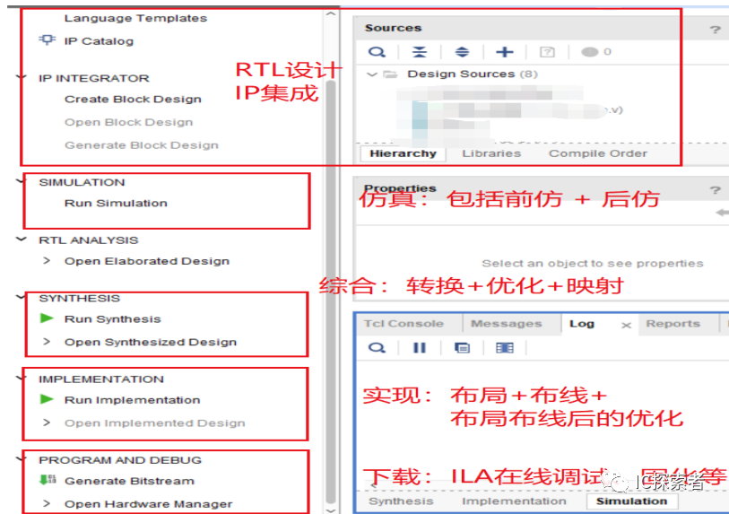
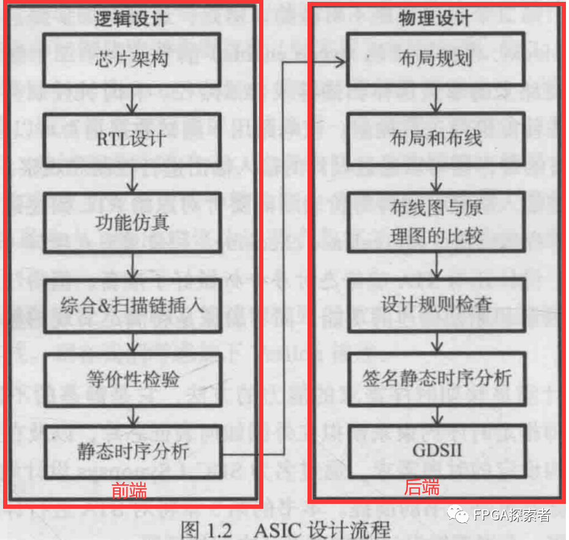
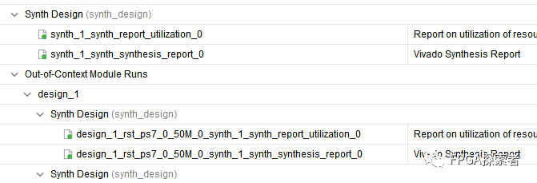
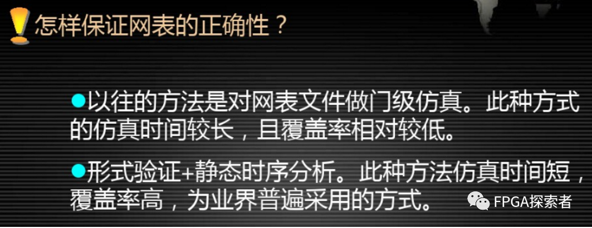
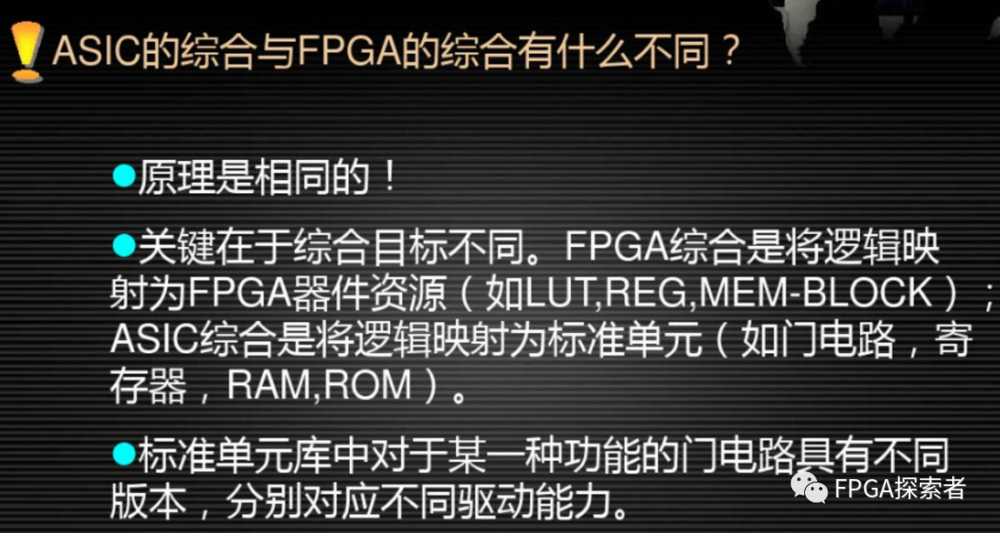

# 【必备基础——数字IC流程、专业术语】数字IC前端设计流程及工具【RTL设计+功能仿真】【综合】【DFT】【形式验证】【STA静态时序分析】

- [ ] Version
    * [x] linhuangnan
    * [x] 2024-03-07 
    * [x] 数字IC流程
    * [ ] review

!!! info
    * 数字IC设计流程；
    * FPGA设计流程

## 数字IC设计流程

**需求分析**：这是整个设计过程的起点，在这一步中，工程师确定产品需要满足的性能指标、功耗、面积、速度等参数。

**芯片架构**：在需求清楚后，设计团队会定义硬件架构，包括处理器核心、存储器、I/O接口等高层次的组成部分，以及它们之间的互联方式。

**RTL设计**：利用硬件描述语言（HDL），如Verilog或VHDL，来编写可执行的芯片逻辑设计，称为寄存器传输级（RTL）设计。

**功能仿真**：通过模拟器运行RTL代码，验证逻辑设计在不同测试条件下是否正确实现了预定功能。

**综合 & 扫描链插入（DFT）**：将RTL设计转换成门级网表，同时进行设计可测试性（Design for Testability, DFT）的改造，如添加扫描链以便于后续的测试。

**形式验证**：对比RTL设计和综合后的门级网表，确保转换过程中逻辑功能没有变化。

**静态时序分析(STA)**：分析在最坏情况下信号传输延迟是否满足设计要求，确保数据稳定地在时钟周期内到达目的地。

**布局(Place)**：将各种逻辑单元放置到芯片的物理位置上，并优化布局以提高性能并减少功耗和面积。

**时钟树综合（CTS）**：设计时钟网络以供应整个芯片所需的时钟信号，同时平衡不同部分的时钟延迟，确保系统同步。

**布线(Route)**：在完成布局后连接各个逻辑单元，创建金属连线，以完成电气连接。

**布线图与原理图比较（LVS）**：Layout Versus Schematic（LVS）检查用于验证布线图（即实际的物理设计）是否与原理图（即设计意图）一致。

**设计规则检查（DRC）**：检查物理设计是否符合制造工艺的要求，如线宽、空间距离等方面的规范，确认芯片可以被成功制造。

**生成GDSII**：最后生成版图设计文件，通常是GDSII格式，这是一个标准电子设计交换格式，用于芯片制造。

!!! tip
    对于数字IC设计：

    图中省略了后仿真等，静态时序分析STA在后端也会做，布局布线后可做STA分析布线后的时序，此处省略了该步骤，STA可在上述很多步骤中进行。

    从综合开始这部分划分比较细的也称中端，有些是专门做综合的。

## FPGA开发流程

**设计输入**：RTL代码设计、IP调用集成等；

**行为级仿真**：前仿真，Behavioral Simulation，只仿真功能，所以也叫**功能仿真**，需要**TestBench**仿真激励文件；不包含任何的走线延时，不引入寄存器输入输出等延时，仿真速度快；

**设计综合**：Synthesis，包括Translation转换 + Optimization优化 + Gate Mapping映射；

* **Translation转换**：RTL代码转换成门级电路；

* **Optimization优化**：面积优化和时序优化，去除不必要的逻辑、合并逻辑、降低扇出等；

* **Mapping映射**：将电路映射为门级网表；

如下图所示

综合的输入是：**RTL代码 + 约束文件（物理约束+时序约束）**

综合后输出的是：**门级网表Gate NetList**

**设计实现**：主要是**布局（Place）**和**布线（Route）**；

**时序仿真**：后仿真，针对是综合后（加入约束，延时等信息）的网表文件，在前仿的基础上加入了延时信息的功能仿真，同时验证了设计的时序以及功能都正确。

Modelsim仿真中既可以功能仿真（静态），也可以时序仿真（动态），时序仿真时利用网表文件”.vo”和延时文件”.sdo”；

后仿的速度慢，有时候直接下板测试了。

**静态时序分析**：Static Timing Analysis，STA；通过加入一些时序约束指令，由工具分析时序是否满足约束；

**设计调试**：通过ILA等集成逻辑分析仪在线调试；

**固化程序**：FPGA一般是基于SRAM的，掉电后程序需要重新下载，可以使用Flash等器件，将程序固化在Flash中，每次上电后FPGA从Flash中加载要执行的程序；

比如，Xilinx的Vivado集成设计工具：

## 与FPGA设计流程对比

对于数字IC设计：

图中省略了后仿真等，静态时序分析STA在后端也会做，布局布线后可做STA分析布线后的时序，此处省略了该步骤，STA可在上述很多步骤中进行。

从综合开始这部分划分比较细的也称中端，有些是专门做综合的。

与FPGA设计流程不同的地方：

（1）**DFT扫描链插入**，Design for Test，插入一些选择器用于使能控制等，方便测试；

（2）**时钟树综合（CTS）**，FPGA中的时钟树相对固定；

（3）最后生成的是GDSII文件，可用于流片Tapout。

整个过程是RTL代码到GDSII的过程，也成为RTL2GDSII。

**形式验证（等价性检验）**，验证综合后的门级网表的功能是否与综合前的RTL代码功能一致，保证**功能**上可行；

综合后的**STA静态时序分析**：验证综合后的**时序**是否满足要求；

布局布线后的STA：验证布局布线引入了布线延迟后，时序是否满足要求；

**形式验证与动态仿真的不同**：

形式验证通过工具验证两个设计的功能和结构是等价的，运行时间非常短，覆盖率100%；

动态仿真只能验证部分路径，运行时间长，无法覆盖所有路径；

## 常用工具

**DC**：Design Compiler，综合工具，RTL代码转变为门级网表；

**ModelSim/QuestSim**：仿真工具，Mentor公司的，支持功能仿真、时序仿真，一般常用的是功能仿真，高级版的可以做代码覆盖率收集（验证范畴）；

**VCS**：与ModelSim类似，Synopsys公司的；

**PT**：Prime Time，静态时序分析工具，Synopsys公司的；

## 练习

（联发科技-2021年校招-数字IC-卷A）

请说明 IC 前端整合（RTL To Netlist）所包含的流程，并简要说明一下 Synthesis 的主要任务，以及 Synthesis 的输入和输出。

以门级网表（Netlist）生成为分界线，之前称为前端，之后称为后端。

布局布线之前可以认为是前端，布局布线到流片是后端。

**前端：逻辑设计，RTL ——》 Netlist 门级网表；**

**后端：物理设计，Netlist 门级网表 ——》 物理版图；**

**答案**

Synthesis：综合，主要任务是将 RTL 代码 转成 门级网表；

典型的网表文件由单元（Cell）、引脚（Pin）、端口（Port）、网络（Net）组成。

Synthesis 输入：RTL 代码，工艺库，约束

Synthesis 输出：Netlist 门级网表（用于布局布线），标准延迟文件（用于时序仿真）；综合后的报告；

##### 功能仿真

验证 RTL 代码设计的**功能正确性，没有加入延时信息**，又叫**前仿真**，工具有 Mentor 的 **Modelsim**，Synopsys 的**VCS**，Candence 的 NC-Verilog。在综合、布局布线以后，有加入延时的**后仿真（时序仿真）**。

##### Synthesis 综合

逻辑综合的结果（目的）是把 HDL 代码翻译成门级网表 netlist，工具有 Synopsys 的 **Design Compiler（简称 DC）**，门级网表拿去布局布线。

##### DFT 可测性设计

**DFT（Design for Test）可测性设计**，为了测试而加入的设计，常见技术 ：

（1）**Scan Chain（扫描链）**，针对时序电路，测试寄存器（Flip-Flop）和组合逻辑；

（2）**MBIST（Memory Bulit-in Self Test，内建自测试）**，测试芯片中存储资源， rom 和 ram，在设计中插入内建自测试逻辑；

（3）**Boundary Scan（边界扫描）**，测试封装与 IO、芯片间互联，主要逻辑有 TAP Controller 和 Boundary Scanchain）、JTAG（JTAG 是boundary scan design中用到的一个基本结构）。

ATPG（Automatic Test Pattern Generation，自动测试向量生成，基于扫描链，根据算法推算出应该加载到扫描链上的激励序列和期望序列，这样的序列称为**测试向量**）；

DFT 构建硬件结构，ATPG 生成测试向量。

##### 形式验证

**形式验证，属于验证范畴**，从 **功能上** 对综合后的网表进行验证，常用的是**等价性检验**，以功能验证后的 HDL 设计为参考，对比综合后的网表功能，检验是否在功能上存在等价性，**保证综合后没有改变原先 HDL 描述的功能**。

形式验证工具有 Synopsys 的 Formality。

##### STA 静态时序分析

**STA 静态时序分析（Static Timing Analyse）**，属于验证范畴，从**时序上**对综合后的网表进行验证，检查电路是否存在建立时间、保持时间等违例。

注意 STA 和 形式验证的不同，**STA 从时序上验证，形式验证从功能上验证**。

STA 工具有 Synosys 的 Prime Time。

