# Xilinx FPGA AXI4总线（四）——自定义 AXI-Lite 接口的 IP 及源码分析

- [ ] Version
    * [x] linhuangnan
    * [x] 2024-03-11 
    * [x] AXI总线
    * [ ] review

!!! info
    * 在 Vivado 中自定义 AXI4-Lite 接口的 IP，实现一个简单的 LED 控制功能
     
    * 并将其挂载到 AXI Interconnect 总线互联结构上，通过 ZYNQ 主机控制
     
    * 对 Xilinx 提供的整个 AXI4-Lite 源码进行分析。

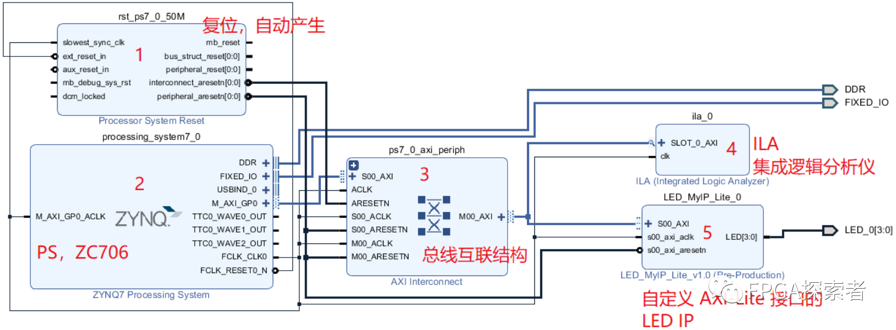

## 封装 AXI-Lite 协议的 IP

#### 1. 新建一个工程

#### 2. 打包 IP 工程

Tools 下选择创建并打包一个新的 IP。

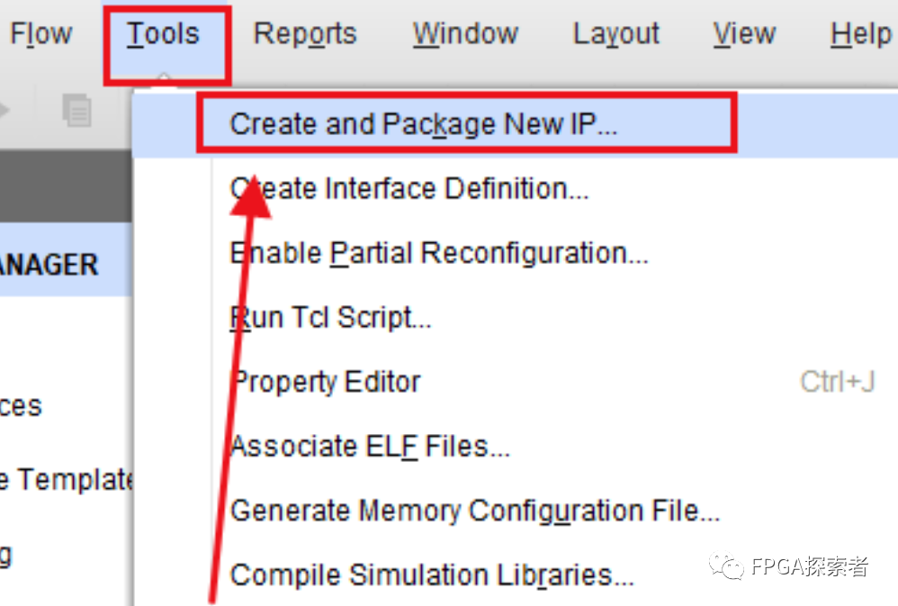

选择创建一个新的带AXI4总线的 IP。

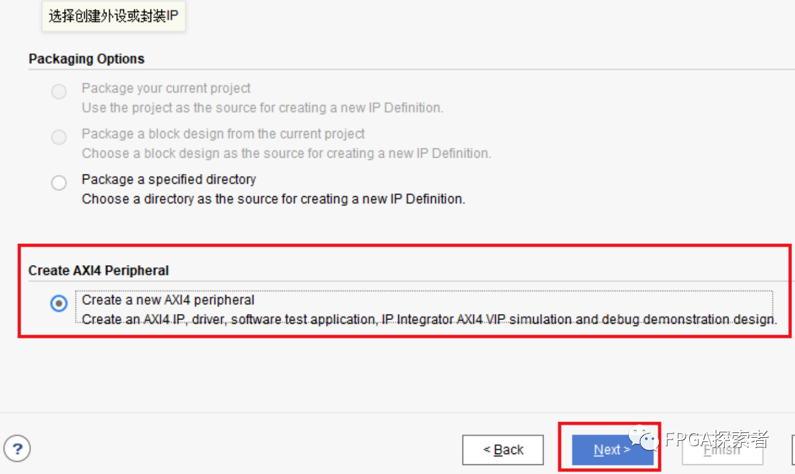

IP命名。

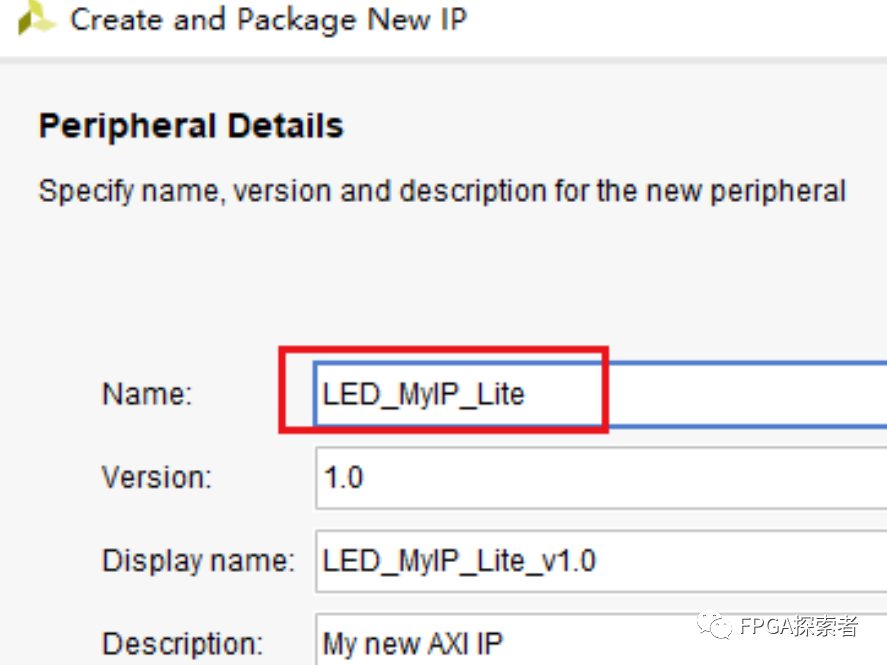

**IP 的 AXI4-Lite 总线的配置**：

（1）选择 Lite 总线；

（2）选择 Slave 设备从机模式，这里考虑到我们的实际应用，以 ZYNQ 的 PS 做主机 Master，来读写自定义的从机LED IP；

（3）数据位宽 32-bit；

（4）内部寄存器最少为4个，这里选择4，实际上本例中只使用了 1 个，这里的 4 就代表内部由 4 个 32 位的寄存器，依次命名为 slv_reg0 ~ slv_reg3。

按照微机寻址的思想，当找到设备的基地址后，加上偏移地址能够找到设备的内部寄存器。这里，当偏移地址为 0 时，表示 slv_reg0，偏移地址为 4 时（4 个字节，32-bit），表示 slv_reg1，8 代表 slv_reg3，12 代表 slv_reg4。

例子中只使用 slv_reg0，偏移地址为0，这个在 ZYNQ 的 PS 端编程时使用。

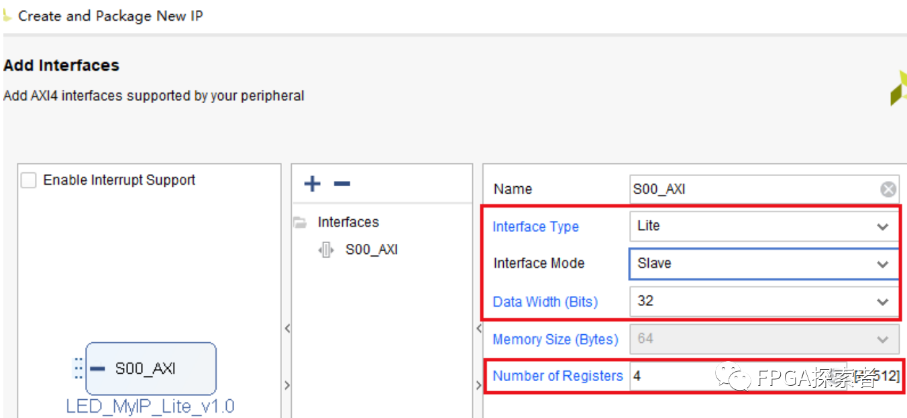

上述配置完成后，编辑IP，会自动打开一个新的工程，在 AXI-Lite 接口协议基础上，添加自定义的端口和用户逻辑。

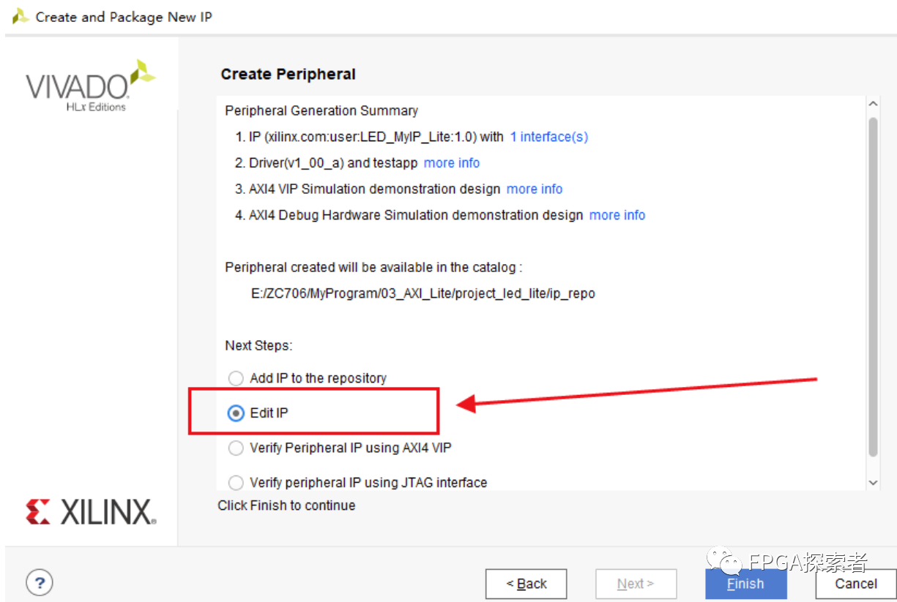

#### 3. 修改 IP

打开底层的代码，**在第18行添加自己需要的输出端口**。

ZC706的 PL 侧有 4 个 LED 可供操作，这里定义输出 4 位去控制 LED。

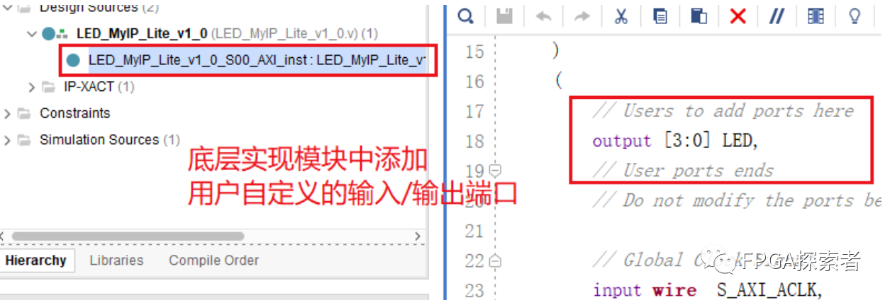

中间的实现逻辑先不看，是 AXI-Lite 协议中的 Valid、Ready 握手信号的产生以及读、写、响应等操作，后面再进行具体的分析。

**找到尾部第401行，添加用户逻辑**，上面我们已经说了PS 侧向 slv_reg0 写入 LED 的控制信息，这里从 slv_reg 读出控制信息，低 4 位为需要的有效控制信息。

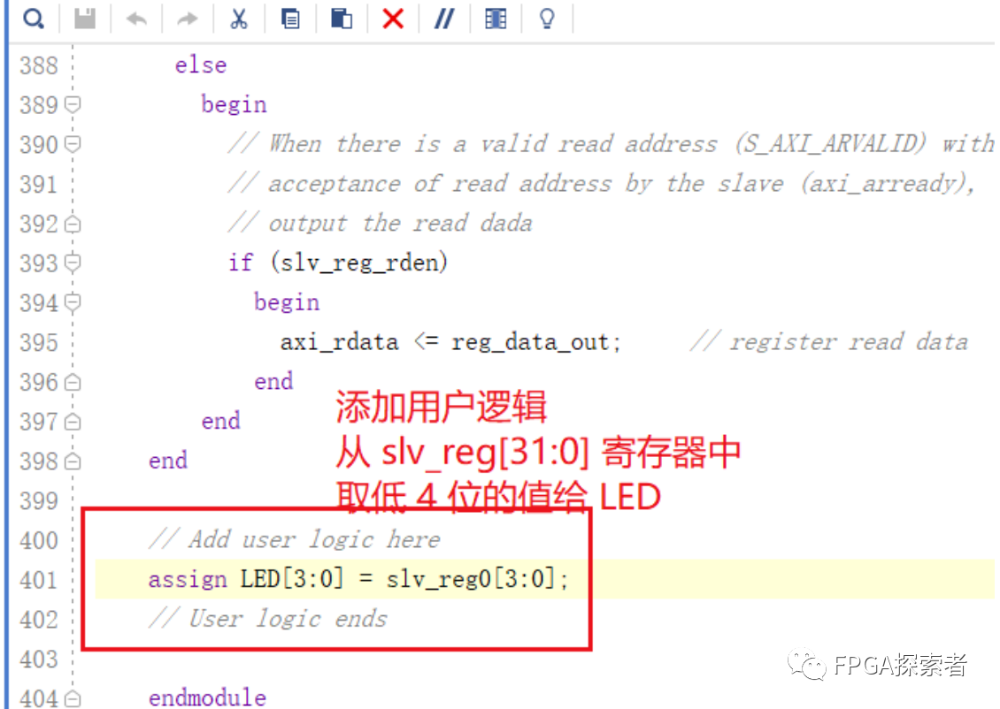

完成底层的端口和用户逻辑后，**在顶层中第 18 行也加入输出端口，并在例化底层时第 51 行将新加入的端口进行连接。**

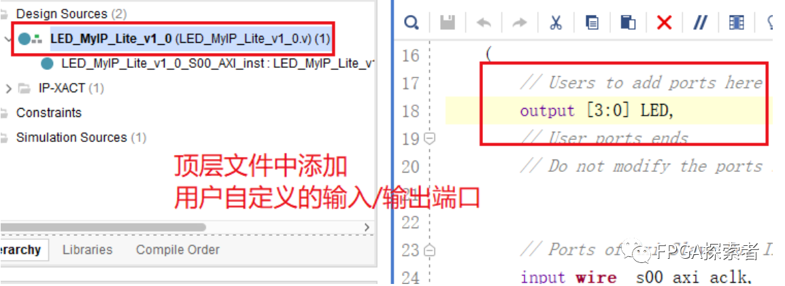

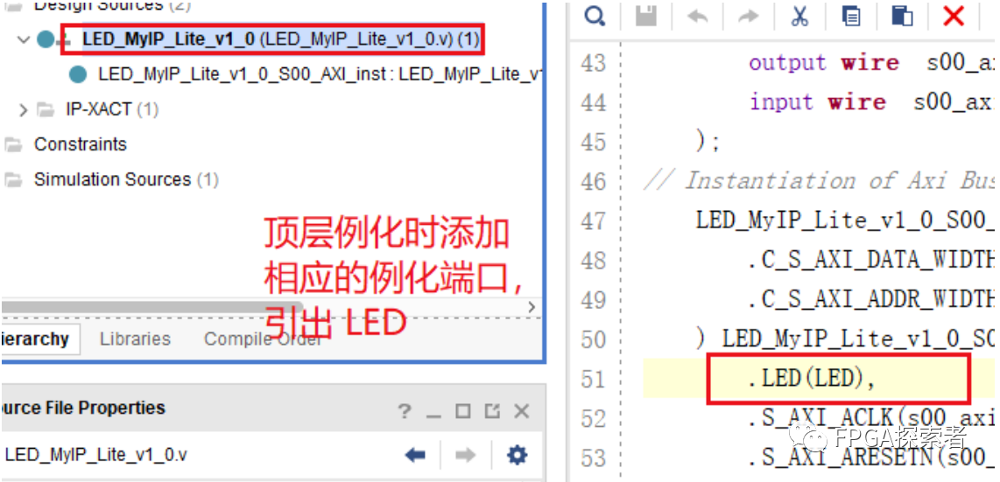

修改后，打包 IP 时可能出现如 1处所示的编辑图样，在 2 处点击蓝色字体会自动更新，点击 3 处打包。

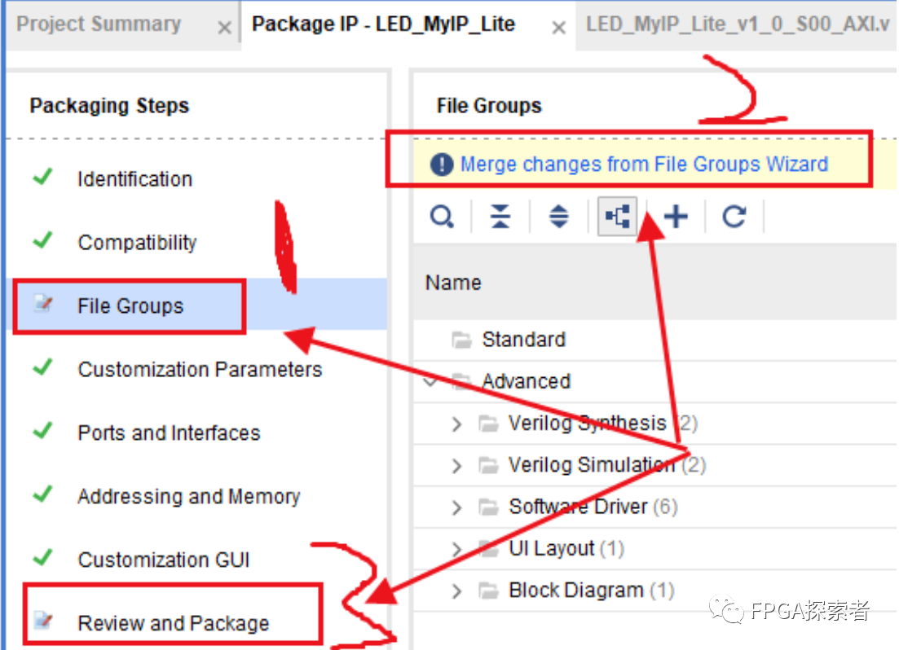

## 使用自定义的 AXI-Lite的IP

找到开始时的新建工程，新建一个 Block Design 原理图设计文件，添加 IP 时就可以搜索到自定义的 LED_MyIP_Lite。

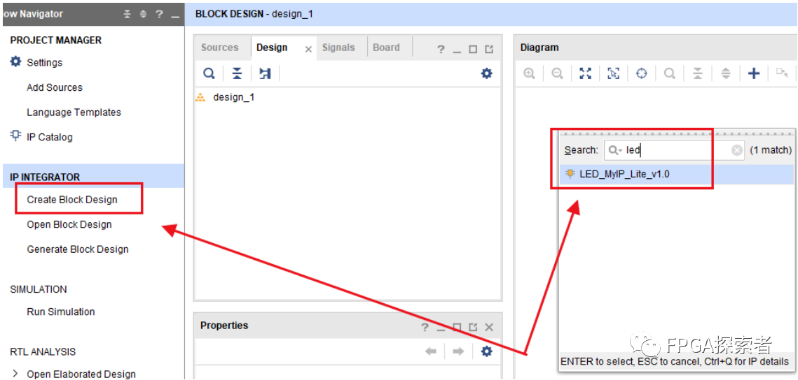

添加 ZYNQ，使用自动连接会自动添加复位逻辑和 AXI总线互联结构，添加一个 ILA 集成逻辑分析仪，并设置成 AXI4 LITE 接口，引出 LED 输出，原理图文件右键生成顶层 wrapper。

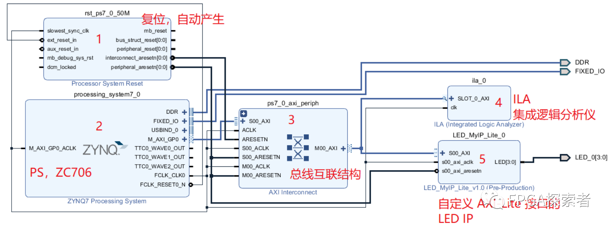

对 ILA 的配置

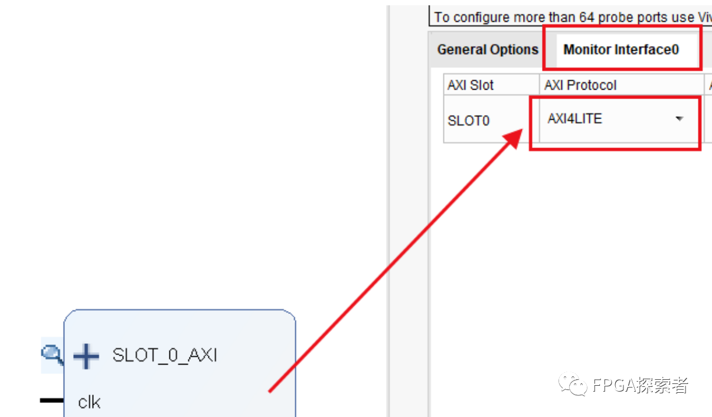

新建约束文件，增加 4 个 LED的物理约束，由于使用的是 Xilinx 的 FPGA评估版，其他引脚的约束已经由系统自动完成。

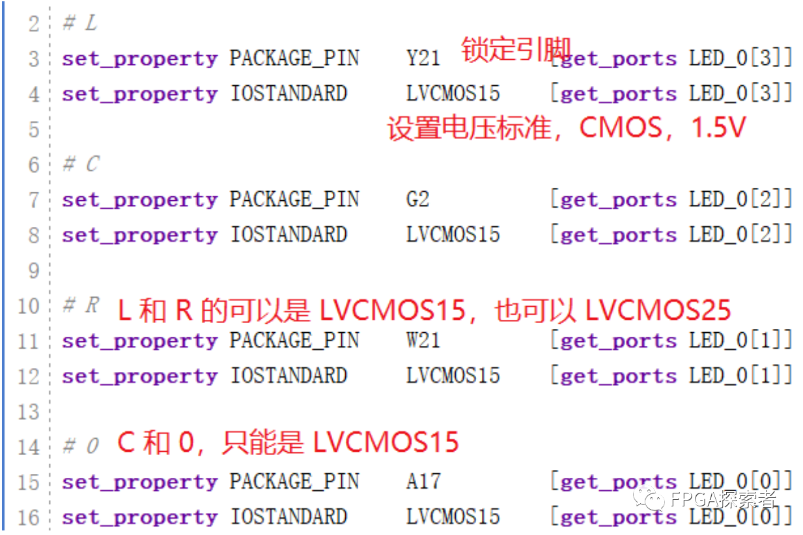

可以打开阅读一下 Xilinx 给的一些约束，如下图所示，**首先对时钟频率和抖动进行时序约束，然后对输入输出引脚进行物理约束，最重要的是“电平标准”和“引脚位置”**。

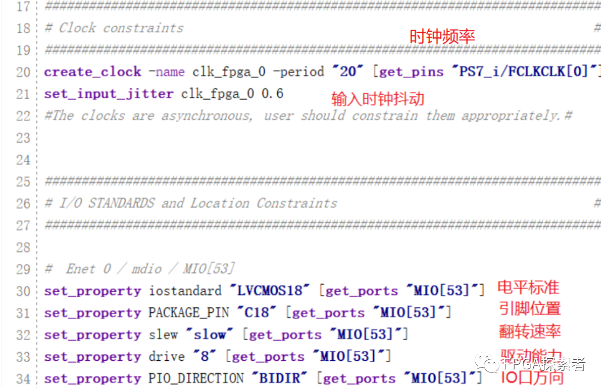

综合、布局布线、生成 bitstream 后，导出硬件到 SDK。

新建 SDK 工程，加入代码如下，设置基地址和偏移地址。

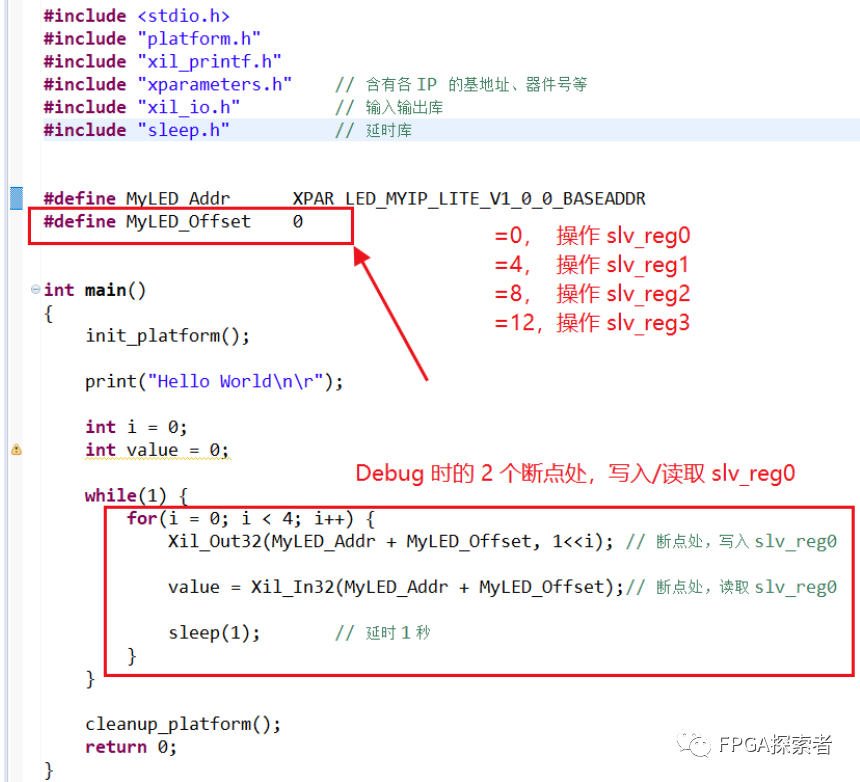

## 运行结果

Run As 下载观察流水灯效果。

Debug As 下载，Vivado 中连接硬件，打开 ILA。

**对于写事务，设置 WVALID和 WREADY 两个均为 1 时触发**。

**对于读事务，设置检测 RVALID 和 RREADY 都为 1，两个断点处单步运行**。

#### （1）初始化

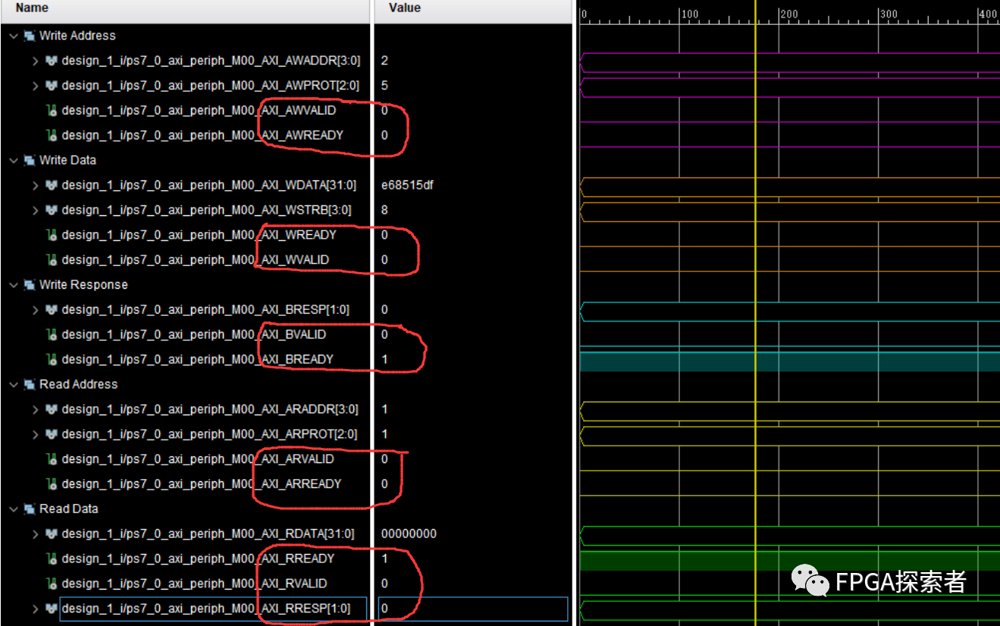

#### （2）写事务

写事务涉及到写地址通道、写数据通道和写响应通道。测试时，ZYNQ 的 PS 主机向 slv_reg0 写 1。

#### （3）读事务

**读事务涉及到读地址通道和读数据通道**。测试时，ZYNQ 的 PS 主机向 slv_reg0 写 1，然后读取该寄存器。

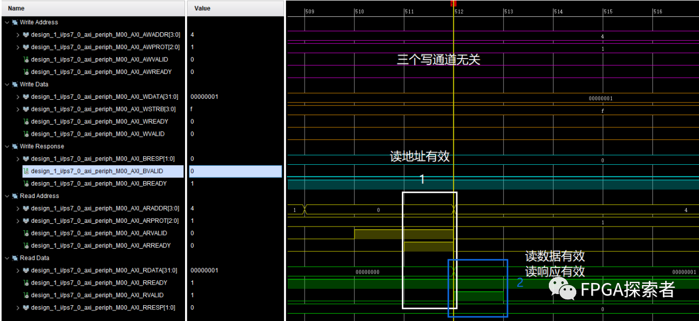

## AXI4-Lite源码分析

### （1）写事务

写事务涉及到写地址通道、写数据通道和写响应通道。

#### （a）AWADDR[3:0] 写地址

AWADDR[3:0] = 0，表示写 slv_reg0。

主机（ZYNQ的PS）给出从机的基地址 0x43C00000 和 偏移地址 0x0，其中基地址主要用于对整个从机的寻址，偏移地址用于对从机内部寄存器的寻址。

偏移地址为0，对应 AXI_AWADDR[3:0] = 0，在 32 位 WDATA 写数据配置下，AXI_AWADDR[3:2] 表示选择写哪个寄存器，

=0  时写 slv_reg0；

=1 时写 slv_reg1；

=2 时写 slv_reg2；

=3 时写 slv_reg3；

对应到 AXI_AWADDR[3:0] 就是 0 / 4 / 8 / 12。

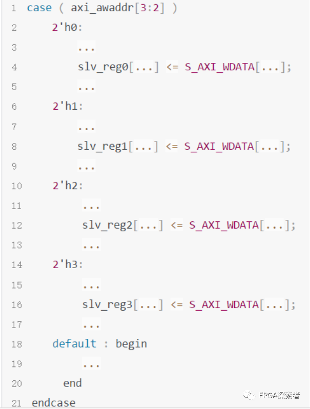

#### （b）AWPORT[2:0] 写保护

AWPORT[2:0] = 1，即 3'b001，表示特权且安全的写入数据信息。

AWPORT[2:0] 提供三种级别的写入保护，提供用于禁止非法传输事务的访问权限：

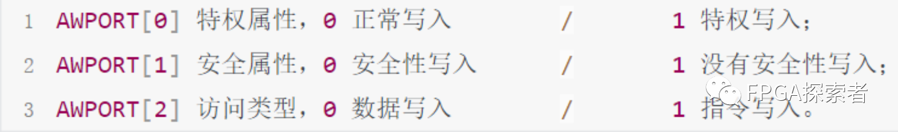

#### （c）AWREADY 和 WREADY 准备好

根据 Xilinx 的 AXI-Lite 源码，对于从机部分，当检测到主机发出的 AWVALID 写地址有效 和 WVALID 写数据有效同时有效的下一个时钟的上升沿，将从机部分的 AWREADY 和 WREADY 拉起接收写地址和写数据。

对 AWREADY 写地址准备好：

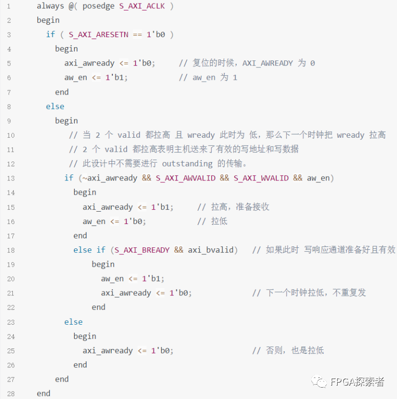

对 WREADY 写数据准备好：

