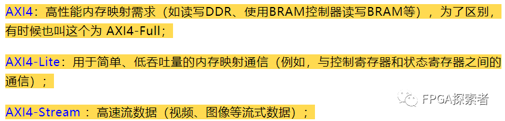
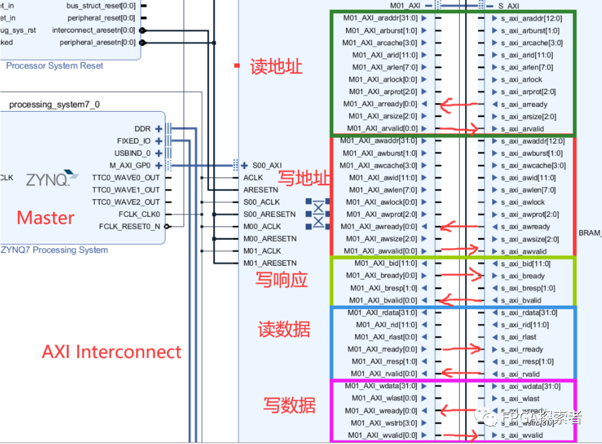
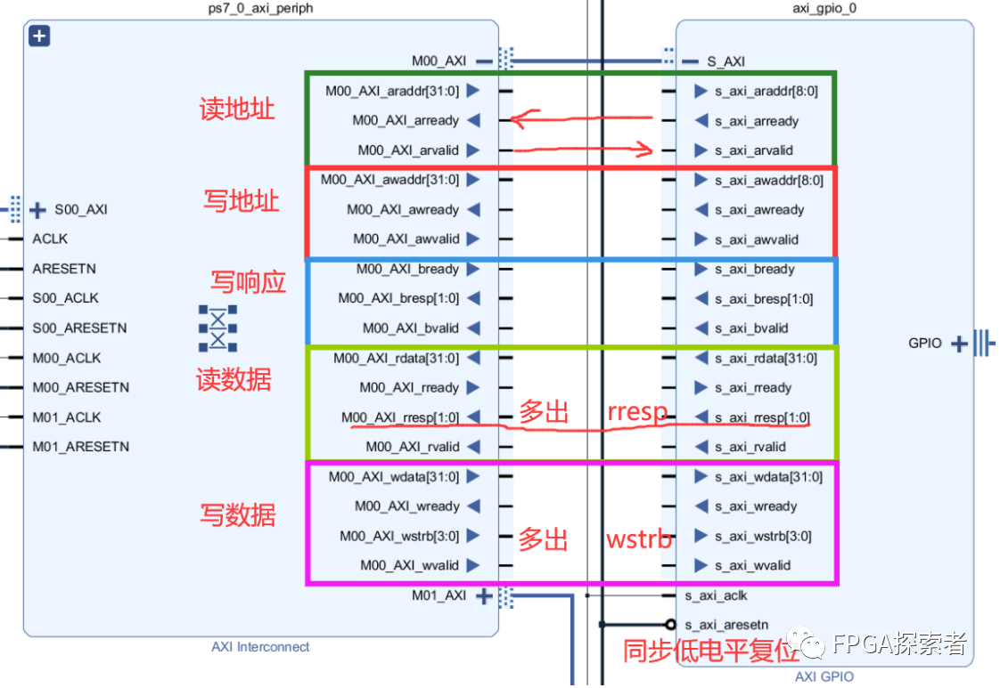
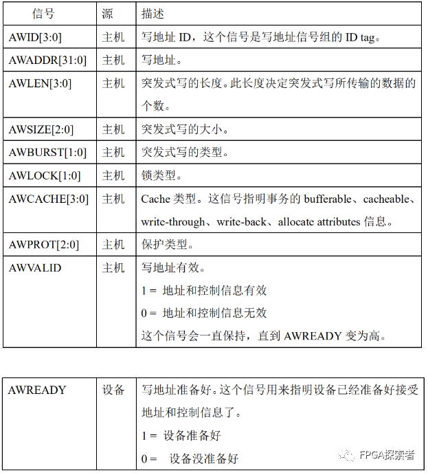
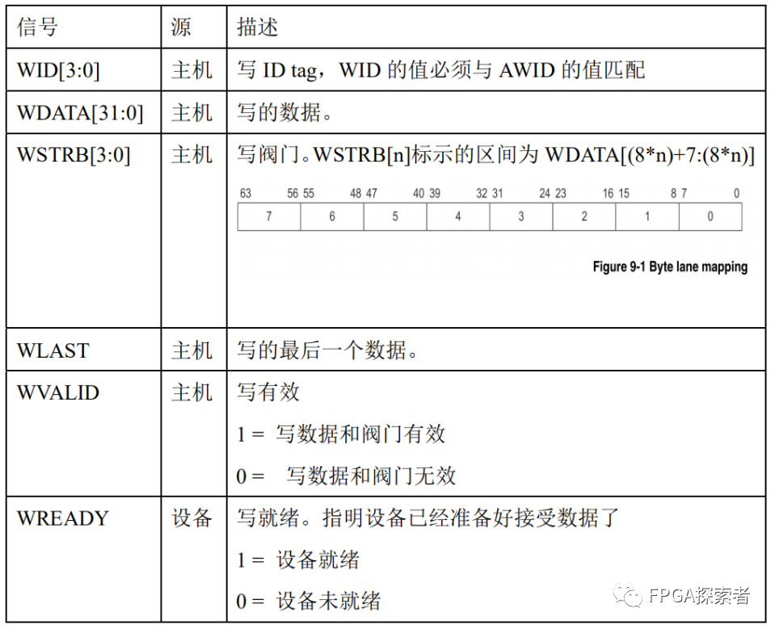
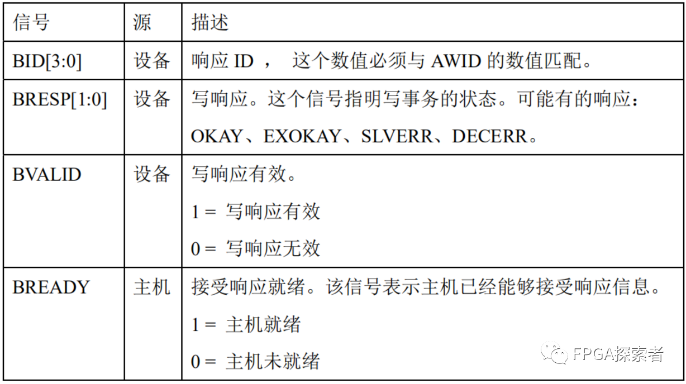
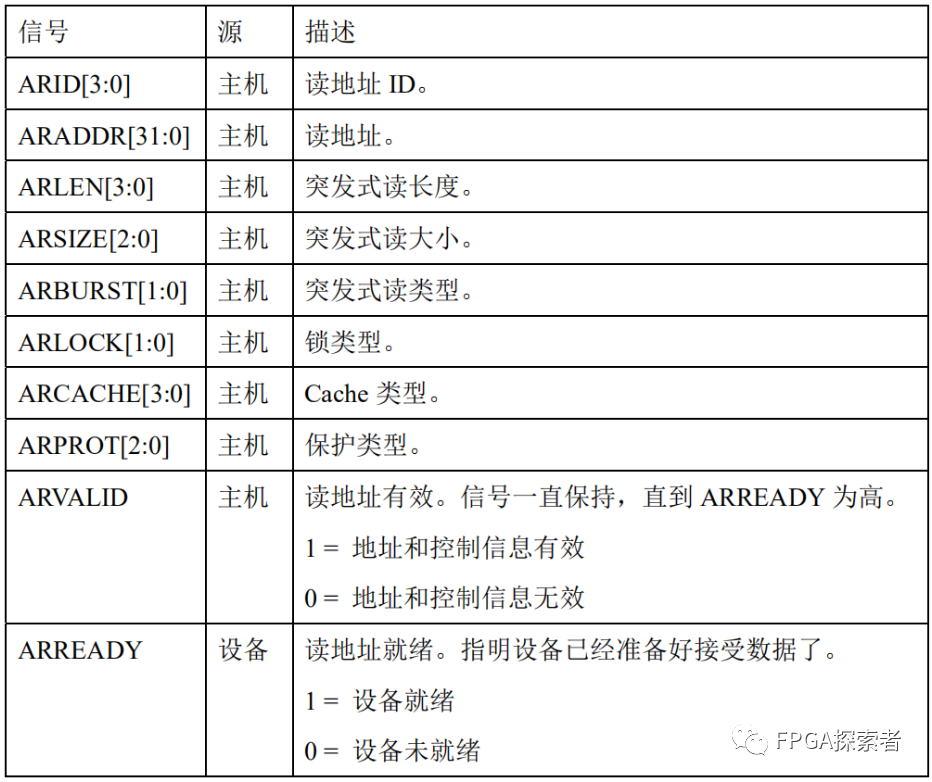
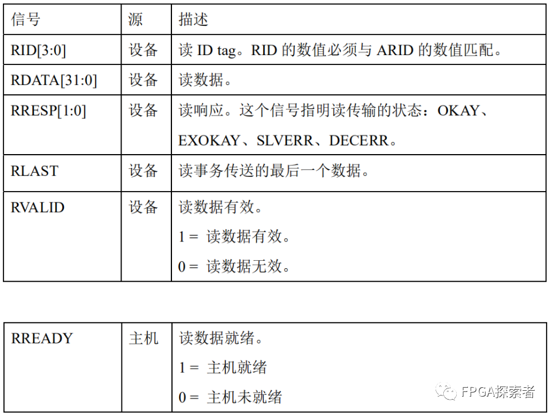
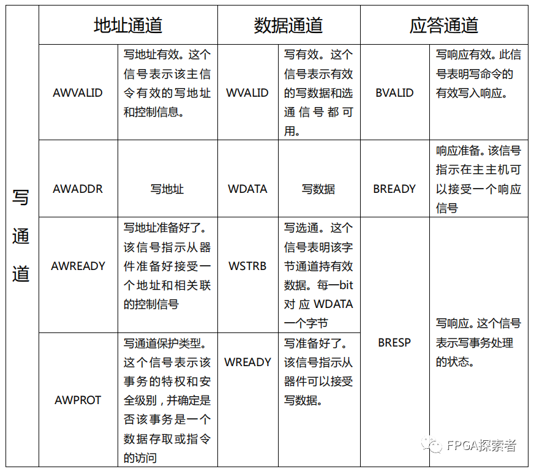
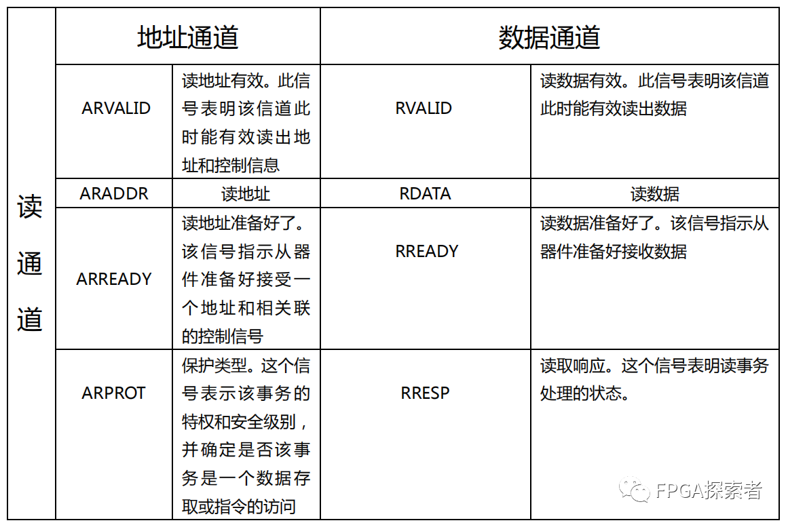

# Xilinx FPGA AXI4总线（二）用实例介绍 5 个读写通道

- [ ] Version
    * [x] linhuangnan
    * [x] 2024-03-11 
    * [x] AXI总线
    * [ ] review

!!! info
    * 介绍原理；

    * 用 FPGA 的实例看下 AXI4 和 AXI4-Lite 的握手；

    * 自定义一个 AXI-Lite 的 IP 作为从机设备 Slave，并将其挂载到 AXI Interconnect 上，由 ZYNQ 的 PS 侧作为主机来控制 LED；

    * 对 AXI-Lite 作源码分析。

## 三种AXI4

AXI4协议是一个点对点的主从接口协议，数据可以同时在主机（Master）和从机（Slave）之间**双向传输**，且数据传输大小可以不同。    

AXI4中的限制是一个突发事务（Burst）最多可以传输256个数据，AXI4-Lite只允许每个事务传输1个数据。

**主机接口具有发起读写的权限，从机被主机控制。**

**AXI4 和 AXI4-Lite 都有 5 个通道，AXI4-Stream协议为流数据的传输定义了单个通道，与AXI4不同，AXI4-Stream接口可以突发无限数量的数据。**

## AXI4实例

对于 AXI4 和 AXI4-Lite 的 5 个通道： 

如下图所示为一个 **AXI4 的实例，用于高性能内存映射需求（DDR、BRAM等）**。

Xilinx 的 ZYNQ 系列 FPGA 通过总线互联AXI Interconnect 连接到 AXI BRAM Controller 控制 BRAM 存储器资源，五种颜色的框分别表示一个通道，从上至下依次为**读地址通道**（araddr）、**写地址通道**（awaddr）、**写响应通道**（bresp）、**读数据通道**（rdata）和**写数据通道**（wdata），**每个通道中均有valid和ready握手信号**。

**读地址/写地址通道**，主机通过这两个通道向从机写入地址和控制信息，通道的方向为主机Master向从机Slave传输，通道内除了ready信号外的其余信号均为输出，valid为高电平时表示主机认为自己输出的数据有效，ready信号为输入信号，由从机Slave给出，当ready为高时表示从机已经准备好接收主机的数据，ready和valid同时为高时代表从机准备好接收主机数据且主机此时发送了有效的数据，正确的传输开始。除了传输地址外，arlen[7:0]代表突发传输的长度，8位可表示0~255，代表传输长度1~256。

**写响应通道**，从机通过该通道向主机发送响应，valid由从机发出，ready由主机发出。

**读数据通道**，从机通过该通道向主机发送读取出来的数据，valid由从机发出，ready由主机发出，含有一个last信号用来指示每个事务传输过程中的最后一个数据，表示当前事务传输结束。

**此外，与写数据通道对比可知，读数据还多了一个读响应信号，省去了单独的读响应通道。**

对 AXI4 的读数据/写数据通道，支持数据位宽 8 / 16 / 32 / 64 / 128 / 256 / 512 / 1024 bits。

使用AXI Interconnect互联结构时，对AXI4，支持地址位宽最大64位（默认32位），总线的数据位宽 32 / 64 / 128 / 256 / 512 / 1024 bits；对 AXI4-Lite，总线的数据位宽 32 bits。（参考资料[1]）

**对于传输的数据位宽不足总线位宽的**，比如使用 32 bit 的总线传输 8 bit 的信息，则使用写通道的 WSTRB[3:0] 来表示有效的写字节，WSTRB[n] 对应 WDATA[8n+7 : 8n]，当 WSTRB[3:0] = 4’b0001 时，表示 WDATA[7:0] 有效，属于窄传输的一种。

## AXI4-Lite 实例

**对AXI4-Lite协议，ZYNQ使用该协议驱动AXI GPIO，读写少量的控制、状态寄存器。与AXI4相比，AXI4-Lite是AXI4的删减版，适合轻量级的应用**，也是包含5个通道，不同的是每个通道都进行了简化，去掉了对突发传输的支持（Burst）。

使用AXI Interconnect互联结构时，对AXI4-Lite，支持地址位宽最大64位（默认32位），数据位宽 32 / 64 bits。

## AXI4 的 5 个通道

### 写地址通道

主要涉及突发传输：

突发类型 AWBURST[1:0]

**FIXED**： 突发过程中地址固定不变，用于 FIFO 访问；

**INCR**： 增量突发，突发过程中地址递增，增加量取决于 AxSIZE 的值，支持突发长度 1 ~ 256；

**WRAP**： 回环突发，和 INCR 类似，但是会在特定高地址的边界处回到低地址处，支持突发长度 2/4/8/16，传输的首地址和每次传输的大小对齐，最低的地址和整个传输的大小对齐，回环边界等于 AxSIZE*AxLEN。

### 写数据通道

**非对齐传输**

非对齐传输是指写入或读取的数据地址并不是总线宽度的整数倍。比如，在32位数据总线上，理论上每次传输都应该从地址0x00, 0x04, 0x08等开始（即按4字节对齐），但非对齐传输可能会从例如0x02这样的地址开始进行数据访问。这种传输通常需要额外的硬件逻辑来处理，因为它可能涉及多个总线周期。

**WSTRB[3:0]**

对应写字节，WSTRB[n] 对应 WDATA[8n+7 : 8n]。

WVALID 为低电平时，WSTRB 可以为任意值，WVALID 为高电平有效时，WSTRB 为高的字节线必须指示有效的数据。

WSTRB 是AXI协议中的一个信号，用于指示写数据传输时有效的字节。在32位数据总线上，WSTRB 是一个4位的向量，其中每一位对应于8位数据的有效性。如果某一位为高电平（1），则表示相应的字节包含有效数据；如果为低电平（0），则表示对应的字节不被写入。

例如，若 WSTRB 的值为 0b0001，只有最低的8位（WDATA[7:0]）是有效的，其他24位将被忽略。WVALID 信号表示整个写数据（包括 WDATA 和 WSTRB）是否准备好被写入，并且当 WVALID 为高电平时，WSTRB 中为高的位必须对应有效的数据。

**窄传输**：

窄传输发生在数据总线宽度大于所需传输数据宽度的情况下。例如，在32位总线上进行8位数据传输。此时，需要用到 WSTRB 信号来指明哪部分数据是有效的。地址信号用于指定哪个具体的字节被访问。

**INCR 和 WRAP**

在使用增量（INCR）或回环（WRAP）突发模式时，窄传输意味着每次突发中的每次传输可能只涉及一部分字节。在这种情况下，WSTRB 将用于指示哪些特定的字节是有效的，而 AWBURST 或 ARBURST 信号将指示如何在地址空间里面递增或回环。

综上所述，非对齐传输和窄传输允许AXI协议支持更灵活的数据传输方式，提高资源利用率，同时也增加了接口实现的复杂性。

### 写响应通道

读传输的响应信息是附加在读数据通道上的，写传输的写响应有专门的写响应通道。

RRESP[1:0]：读响应；

BRESP[1:0]：写响应

OKAY（'b00） ：表示正常的访问成功。这是最常见的响应，意味着没有错误发生，数据已被成功读取或写入。

EXOKAY（'b01） ：表示独占访问成功。EXOKAY 专用于独占（Exclusive）和锁定（Locked）交易，这些是AXI中可以支持原子操作的特殊类型交易。当一个主设备执行独占访问并且成功地获取到锁定时，从设备将使用 EXOKAY 响应表示该事务成功完成。这样的机制允许实现像读-修改-写这样的复合操作，而不会被其他主设备中断。

SLAVERR（'b10） ：从机错误，表明访问已经成功到了从机，但是从机希望返回一个错误的情况给主机；

DECERR（'b11） ：译码错误，一般是由互联组件给出，表明没有对应的从机地址；

### 读地址通道

与写地址一样

### 读数据通道

**多出了读响应**，其他与写数据一样，读传输的响应信息是附加在读数据通道上的。

读事务和写事务均有响应，对于读事务，读响应和读数据一起发给主机，而写事务则通过写响应通道传送。响应类型有 OKAY、EXOKAY、SLAVERR、DECERR。

上述响应分别表示：正常读写成功、独占式读写、设备错误、译码错误。

**协议规定：请求的需要传输的数据数量必须执行，即使出现了错误报告，在一次突发式读写的剩余数据也不会被取消。**

## AXI4-Lite 的 5 个通道

**AXI4-Lite 是 AXI4 的精简版，保留了 5 个通道的基本功能**，取消了突发，每次只能传输 1 个数据。

对于写地址/写数据/写响应通道：

取消了和突发传输相关的 AxBURST 信号以及突发长度等。

对于读地址/读数据通道：

