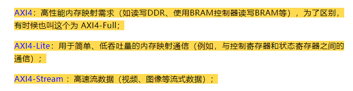
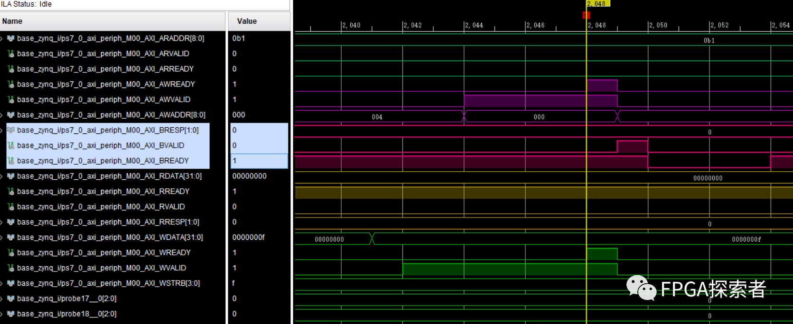
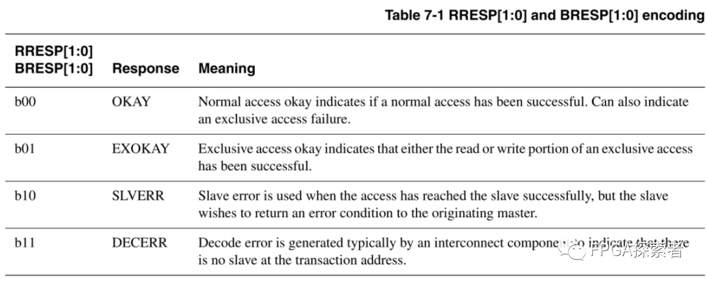
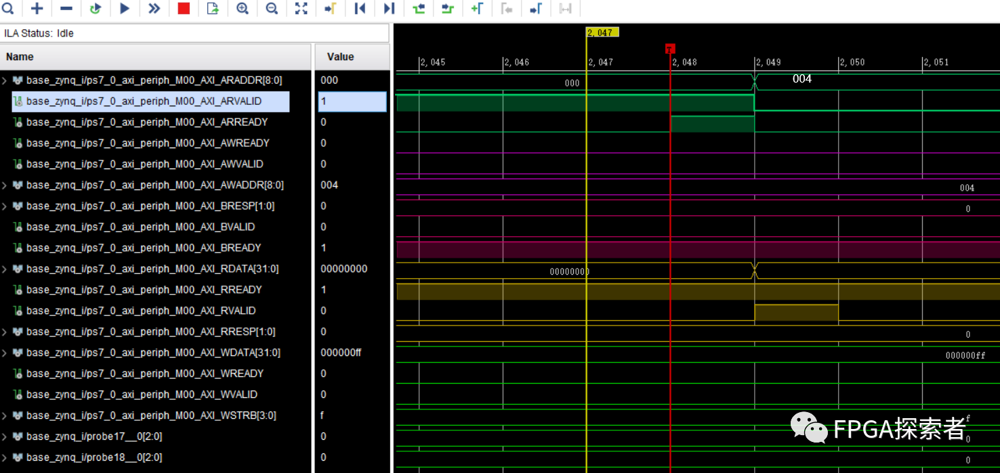
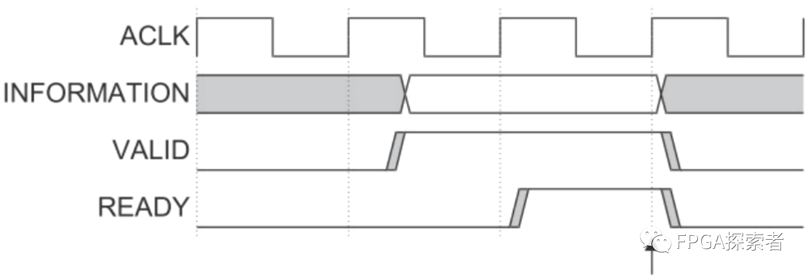
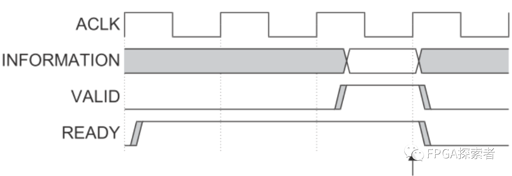
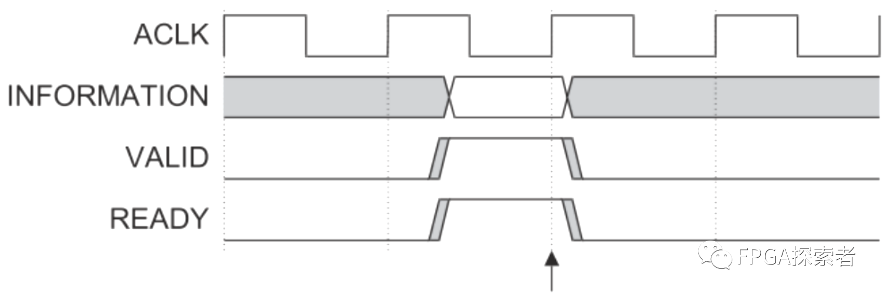
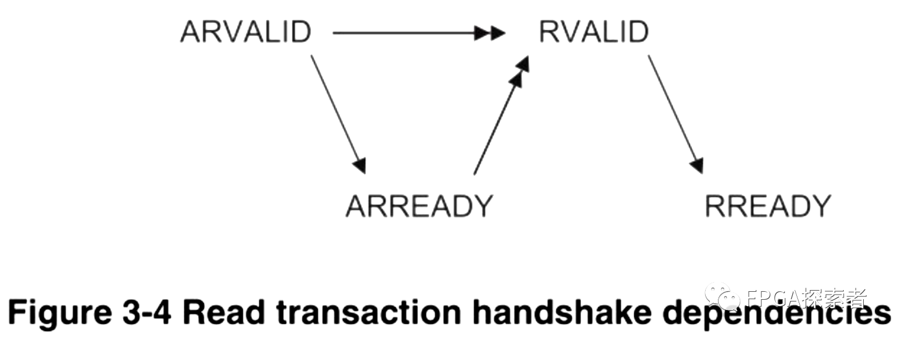
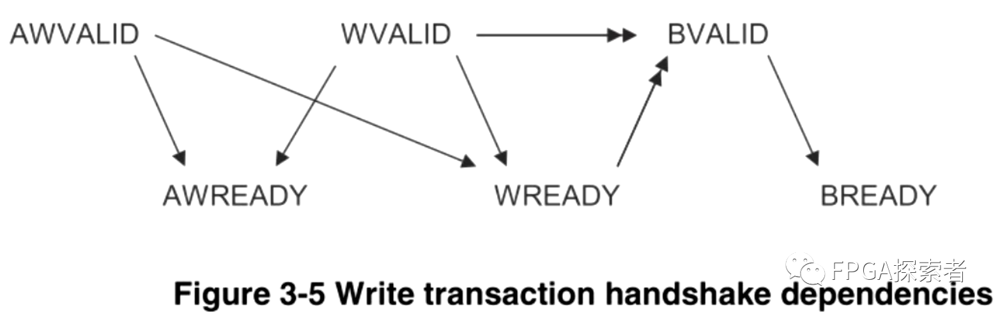

# Xilinx FPGA AXI4总线（三）——握手机制、通道依赖性及AXI-Lite握手实例

- [ ] Version
    * [x] linhuangnan
    * [x] 2024-03-11 
    * [x] AXI总线
    * [ ] review

!!! info
    * 介绍原理；

    * 用 FPGA 的实例看下 AXI4 和 AXI4-Lite 的握手；

    * 自定义一个 AXI-Lite 的 IP 作为从机设备 Slave，并将其挂载到 AXI Interconnect 上，由 ZYNQ 的 PS 侧作为主机来控制 LED；

    * 对 AXI-Lite 作源码分析。

**AXI4、AXI4-Lite和AXI4-Stream均使用Ready、Valid握手机制进行通信。**

**信息传输的发起者使用Valid 信号指示数据何时有效，接收端产生 Ready 信号来表明已经准备好接收数据，当两者均为高时，启动传输。**

AXI4 总线和 AXI4-Lite 总线都有 5 个通道（AXI4-Stream 取消了通道），AXI4 和 AXI4-Lite 通道的相同部分：

（1）**写地址通道（AW）**，包含AWVALID，AWADDR，AWREADY信号；

（2）**写数据通道（W）**，包含WVALID，WDATA，WSTRB，WREADY信号；

（3）**写应答通道（B）**，包含BVALID，BRESP，BREADY信号；

（4）**读地址通道（AR）**，包含ARVALID，ARADDR，ARREADY信号；

（5）**读数据通道（R）**，包含RVALID，RDATA，RREADY，RRESP信号；

**以 AXI-Lite 总线为例**，Xilinx ZYNQ 通过 AXI4-Lite 总线控制 8 个 GPIO 的输出，先写入 0x0F 测试写入操作，再写入 0xFF 后读取写入的值，测试读操作。

**本操作是 ZYNQ 作为主机 Master，AXI-Lite GPIO 作为从机 Slave，使用 Xilinx 的 AXI Interconnect 总线互联结构互联。**

**AXI4-Lite** 是 AXI4 的删减版，适合轻量级的应用，也是包含 5 个通道，不同的是每个通道都进行了简化，**去掉了对突发传输的支持（Burst）**。

## 写事务握手实例

使用写地址通道、写数据通道和写响应通道。

（1）**在写数据通道上**，主机给出要写的数据 0x0F，并在一个时钟周期后将数据有效信号 WVALID 拉高，等待从机的 WREADY 写准备好信号拉高；

（2）**在写地址通道上**，主机给出写地址 0x00（GPIO 通道 1 的输出数据的控制寄存器），并将地址有效信号 AWVALID 拉高，等待从机的 AWREADY 写准备好信号拉高；

（3）当 WVALID 和 WREADY 信号同时拉高后，数据成功写入 GPIO 从机；当 AWVALID 和 AWREADY 信号同时拉高后，地址成功写入 GPIO 从机；

（4）一个时钟周期后，**在写响应通道上**，给出响应（BRESP 为 0），从机告诉主机已经成功写入；

此外，对于写响应信道，BREADY 由主机主动给出，一直保持在准备好接收响应的状态，当从机发来一个 BVALID 信号指示一个有效的响应后，BREADY 拉低一段时间后处理该响应信息，处理完成后又恢复到准备好接收响应状态。

RRESP/BRESP 读/写响应信号的含义，2-bit 信号，分别代表读写成功、独占式读写、从设备错误、译码错误。

## 读事务握手实例

**先向地址 0x00 写入数据 0xFF，再读出，使用读地址通道、读数据通道。**

（1）**在读地址通道上**，主机给出要读取的地址 0x00（GPIO 通道1  的输出数据的控制寄存器），并将地址有效信号 AWVALID 拉高，等待从机的 AWREADY 写准备好信号拉高后，成功将要读取的地址写入从机；

（2）**在读数据通道上**，从机给出读出的数据 0xFF，并将数据有效信号 RVALID 拉高，此阶段主机的 RREADY 读准备好信号一直拉高，数据在两个信号同时为高时传输，将 0xFF 写入主机，此时读响应 RRESP[1:0] 为 0，代表读取成功；

（3）当 ARVALID 和 ARREADY 信号同时拉高后，地址成功写入 GPIO 从机；

当 RVALID 和 RREADY 信号同时拉高后，数据成功返回给 ZYNQ 主机；

**注意：RRESP和RDATA用的是同一个valid和ready信号**

## AXI4 总线握手机制

AXI4、AXI4-Lite和AXI4-Stream均使用Ready、Valid握手机制进行通信。

信息传输的发起者使用Valid 信号指示数据何时有效，接收端产生 Ready 信号来表明已经准备好接收数据，当两者均为高时，启动传输。

上面的实例给出了两种 Valid 和 Ready 出现的情况，一种是 Valid 先为高，另一种是 Ready 先为高，实际上，Valid 和 Ready 一共有三种可能情况：

### （1）Valid 先为高 Ready 后为高

如前文实例中写地址和写数据通道所示，时序图如下，传输发生在箭头所指处（在时钟 ACLK 的上升沿检测到同时为高）：

Master 主机发送端首先发出数据或者控制信息，并将自己的 Valid 有效信号拉高，指示信息（information）有效；

发送端的信息（information）和 Valid 信号保持稳定，直到 Slave 从机接收端的 Ready 信号拉高，指示接收端已经接收到 information。

### （2）Ready 先为高 Valid 后为高

如写响应通道所示，时序图如下，传输发生在箭头所指处（在时钟 ACLK 的上升沿检测到同时为高）：

Slave 从机接收端首先表明自己准备好接收数据或者控制信息，将自己的 Ready 准备好信号拉高；

Master 发送端的信息（information）一旦有效，传输立刻开始。

### （3）Ready 和 Valid 同时为高

时序图如下，传输发生在箭头所指处（在时钟 ACLK 的上升沿检测到同时为高）：

## AXI4 总线通道依赖

### （1）读事务（读地址通道、读数据通道）

* 主机先发送 ARADDR 和 ARVALID 给从机；

* 从机回发 ARREADY，通知主机该地址有效；

* 当 ARVALID 和 ARREADY 均为高电平时，主设备拉高 RREADY，表示主设备准备好接收读数据和读响应信号；

* 从设备发送 RVALID、RDATA 以及 RRESP，当 RVALID 和 RREADY 均为高电平时，数据成功写入主设备。

图中的单箭头表示：箭头两端的信号没有依赖关系，谁先拉高都行；

图中的双箭头表示：箭头起始信号拉高之后，箭头指向的信号才可以拉高。

下图可以看出，读地址的 Valid 和 Ready 两者谁先拉高都可以，读数据的 Valid 和 Ready 两者谁先拉高也没关系，但是读数据必须在读地址完成后才可以拉高。

### （2）写事务（写地址通道、写数据通道、写响应通道）

在写操作过程中，主机向从机发送AWADDR、AWVALID、WVALID和WDATA，当 WVALID 和 WREADY 都为高电平时数据写入从机。

主设备发送的 AWVALID 和 WVALID 要有重叠区。

!!! note

    1、对于一个写操作来说，必须建立两种类型的握手：

    （1）地址握手：由 AWVALID 和从设备响应的 AWREADY 信号构成。当这两个信号同时为高电平时，表明地址已经被成功接收。

    （2）数据握手：由 WVALID 和从设备响应的 WREADY 信号构成。当这两个信号同时为高电平时，表明数据已经被成功接收。

    2、为了维护高效和正确的数据传输，协议规定 AWVALID 和 WVALID 需要有一段时间的重叠。这就是所谓的“重叠区”。存在以下几个原因：

    （1）流水线操作：AXI协议支持流水线操作，允许下一次写操作的地址阶段 (AW*) 在当前数据阶段 (W*) 之前开始，提高总线利用率。如果没有重叠，则每次写操作都必须等待上一次完全完成，这会增加延迟并降低吞吐量。

    在 AXI 协议（高级可扩展接口）的上下文中，流水线操作使得在数据总线上可以同时处理多个写事务的不同部分。AXI 写事务至少由两个主要阶段组成：

    地址阶段（AW*）：主设备将目标地址信息放在总线上，并通过 AWVALID 信号告知从设备该地址是有效的。
    
    数据阶段（W*）：主设备将写入的数据放在总线上，并通过 WVALID 信号告知从设备数据是有效的。
    
    在一个非流水线操作中，每一个写事务都必须按序完成：地址阶段完成后，数据阶段才能开始；并且当前事务的数据阶段完成之前，下一个事务的地址阶段不能开始。这会导致等待时间增加，因为在进行下一个事务之前，每一个事务都必须完全完成。

    相比之下，在流水线操作中，您可以在前一个事务的数据阶段还没有完成时就开始下一个事务的地址阶段。换句话说，当第一个事务的数据正在被传输时，主设备就可以开始发送下一个事务的地址。这样，当第一个事务的数据阶段结束，并且从设备已经准备好接收新数据时，第二个事务的地址已经到位，可以立即进入其数据阶段。这种方式类似于流水线上的“预装载”，它减少了闲置时间，提高了总线利用率。

    重叠区的存在允许这种流水线运作，因为在任何给定时间内，多个写事务的不同部分可以同时在总线上进行。如果没有重叠，每个写事务将不得不等待前一个事务完全完成，从而造成额外的延迟，并降低了数据传输的吞吐量。总体来说，流水线操作可以显著提高系统性能，特别是在高速且繁忙的总线上。

    （2）避免死锁：如果没有重叠区，可能出现从设备等待数据而主设备等待地址确认的情况，导致通信死锁。通过确保地址和数据阶段有一定的重叠，可以防止这种情况发生。

    （3）简化设计：使得设计者不必实现复杂的控制逻辑去检测何时可以发送 AW* 和 W* 信号。只要保证一定的重叠区，就能够确保写操作的连贯性和有效性。

    因此，重叠区是 AXI 写传输协议设计中的关键部分，它确保了写操作的有效性和总线的高效使用。

