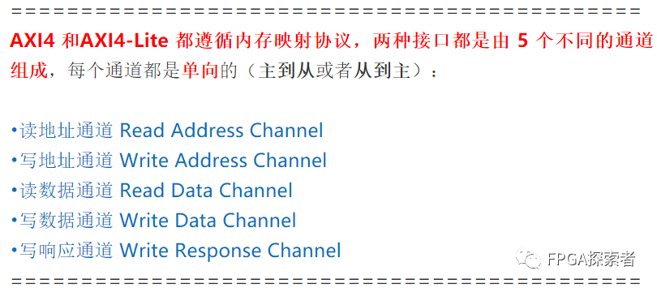

# Xilinx FPGA AXI4总线（一）介绍【AXI4】【AXI4-Lite】【AXI-Stream】

- [ ] Version
    * [x] linhuangnan
    * [x] 2024-03-11 
    * [x] AXI总线
    * [ ] review

!!! info
    * 主要先把我博客的介绍原理的文章搬过来；

    * 用 FPGA 的实例看下 AXI4 和 AXI4-Lite 的握手；

    * 自定义一个 AXI-Lite 的 IP 作为从机设备 Slave，并将其挂载到 AXI Interconnect 上，由 ZYNQ 的 PS 侧作为主机来控制 LED；

    * 对 AXI-Lite 作源码分析。

AMBA® AXI4（高级可扩展接口 4）是 ARM® 推出的第四代 AMBA 接口规范，AMBA（Advanced Microcontroller Bus Architecture）是片上总线标准，包含AHB（Advanced High-performance Bus）、ASB（Advanced System Bus）和 APB（Advanced Peripheral Bus）。

**AXI（Advanced eXtensible Interface），高性能、高带宽、低延迟片内总线。**

**AXI4**：高性能内存映射需求（如读写DDR、使用BRAM控制器读写BRAM等），为了区别，有时候也叫这个为 AXI4-Full；

**AXI4-Lite**：用于简单、低吞吐量的内存映射通信（例如，与控制寄存器和状态寄存器之间的通信）；

**AXI4-Stream** ：高速流数据（视频、图像等流式数据）；

## 1.AXI4

AXI4 (Advanced eXtensible Interface 4) 是 ARM AMBA 规范中的一部分，用于芯片内部总线互联。它是 AXI3 协议的后继版本，提供了更高效、更灵活的互联性能。这些增强功能使得AXI4协议特别适合于需要高带宽和低延迟的复杂集成电路设计，如片上系统(SoC)或大型FPGA设计。下面对您列出的增强功能进行解释：

#### 支持高达 256 个突发长度：

在 AXI3 中，最长的突发传输是 16 次数据传输。AXI4 增加了突发传输的最大长度，允许单个突发传输高达 256 次数据传输。这种能力可以在减少启动传输的次数的同时，提高数据吞吐量，尤其是在传输大量数据时。

#### 服务质量信令（Quality of Service, QoS）：

AXI4 引入了 QoS 信号，这些信号允许事务根据其紧急程度或者优先级进行标记。这些信息可以被用来在互连中管理不同主设备的带宽和延迟，保证关键数据流（例如视频或音频流）获得足够的资源，即便在高负载时也能维持性能。

#### 支持多个区域接口（Region Interface）：

AXI4 协议支持“区域”概念，它允许将地址空间分成不同的区域，并且可以为每个区域设置不同的属性。这有助于优化互连资源，提高安全性和数据处理效率。例如，你可以为某个区域指定更高的访问权限或者不同的缓存策略。
此外，AXI4 还包括了其他的改进，比如降低了连接的复杂性，引入了可选的窄传输等，以满足更广泛的系统设计需求。

## 2. AXI4-Lite

AXI4-Lite 是 AXI4 接口规范的简化版本，旨在为那些不需要高带宽和复杂功能的应用提供一种更简单、轻量级的通信协议。AXI4-Lite 通常用于处理器与小型外设或控制寄存器之间的通信。

#### 所有处理的突发长度为 1：

在AXI4中，支持多长度的突发传输模式，这意味着一个事务可以包含多次连续的数据传输。而在AXI4-Lite中，所有突发操作的长度限定为1，即每个读写操作都只涉及单个数据项。这简化了硬件实现，因为不需要为突发操作管理额外的逻辑。

#### 所有数据存取的大小等同于数据总线宽度：

这意味着每次传输的数据量恰好匹配总线宽度。例如，如果总线宽度是32位，那么每次读写操作都将是32位宽。在AXI4中，总线可以管理不同宽度的数据传输，但AXI4-Lite中的这一限制使得接口可以更加简单和直观，减少了设计的复杂性。

#### 不支持独占访问：

独占访问（或锁定事务）是标准AXI4接口中的一个特性，允许一个主设备进行原子操作来防止其他主设备同时操作相同的内存区域。AXI4-Lite 去掉了对独占访问的支持，因为独占访问涉及到更复杂的同步机制，并且通常不用于简单的控制寄存器访问。

以上这些特性使得AXI4-Lite接口非常适合于较小、资源受限的系统设计，它提供了足够的功能来支持基本的读写操作，同时保持了实现上的简单性和低成本。

!!! tip

    AXI4 和 AXI4-Lite 都是基于内存映射的通信协议，主要用于处理器和外设之间的数据交换。在这样的协议中，外设被映射到处理器的地址空间中，这样处理器可以通过读写内存地址来读取和控制外设。这些协议定义了一组规则，用于如何发送地址、数据以及如何接收响应。

    AXI4 和 AXI4-Lite 协议都包含以下五个不同的单向通道：

    **读地址通道 (Read Address Channel)**:

    主设备使用此通道向从设备发送读操作的地址信息。这意味着它告诉从设备处理器想要读取哪个位置的数据。

    **写地址通道 (Write Address Channel)**:

    类似地，主设备使用此通道向从设备发送写操作的地址信息。这告诉从设备处理器想要写入数据到哪个地址位置。

    **读数据通道 (Read Data Channel)**:

    从设备通过此通道将被请求的数据发送回主设备。当主设备发起一个读请求后，从设备将相应位置的数据放在此通道上，返回给主设备。

    **写数据通道 (Write Data Channel)**:

    主设备使用此通道向从设备发送数据。当主设备想往某个地址写数据时，将数据放置在此通道上发送给从设备。

    **写响应通道 (Write Response Channel)**:

    从设备通过此通道告知主设备写操作已经完成，并且报告写操作的状态（成功、错误等）。这为写操作提供了必要的握手，确保数据完整性。

    在这两个协议中，每个通道都是独立的，并且具有单向性质：只能从主设备到从设备，或者从从设备到主设备。这种设计使得交易可以同时在多个通道上并行进行，提高了总线利用率和系统吞吐量。虽然 AXI4-Lite 是更简化的版本，但它保留了 AXI4 的基本通信架构和通道分离的特点，只是在一些特性上做了简化，以适应简单外设的需求和降低实现复杂性。

## 3. AXI4-Stream