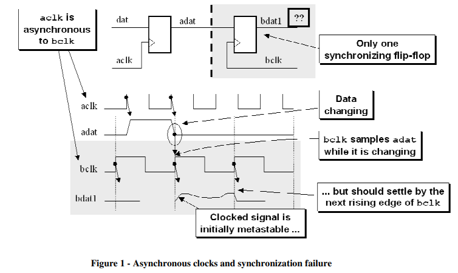
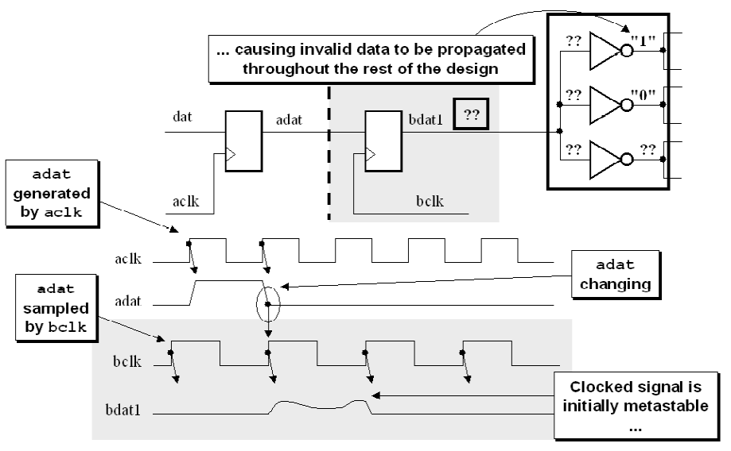

# 《Clock Domain Crossing》 翻译与理解（1）亚稳态

- [ ] Version
    * [x] lin
    * [x] 2024-01-05 
    * [x] CDC亚稳态
    * [ ] review

## 亚稳态

亚稳性是指在设计的正常操作过程中的某个时间段内，在某些时间段内未呈现稳定的0或1状态的信号。 在多时钟设计中，无法避免亚稳性，但是可以抵消亚稳性的不利影响。

在静态时序分析时我们经常提到建立时间和保持时间，本质是寄存器硬件的反应时间，如果时间太短，硬件的上升沿来临时不足以准确判断此时的0\1状态，那么就会采集错误信号，甚至失败。

Figure 1 shows a synchronization failure that occurs when a signal generated in one clock domain is sampled too close to the rising edge of a clock signal from a second clock domain.Synchronization failure is caused by an output going metastable and not converging to a legal stable state by the time the output must be sampled again.

## 亚稳态的影响

那么，为什么亚稳是一个问题呢？ 图2显示，在接收时钟域中遍历其他逻辑的亚稳输出可能会导致非法信号值在整个设计的其余部分中传播。 由于CDC信号可能会波动一段时间，因此接收时钟域中的输入逻辑可能会将波动信号的逻辑电平识别为不同的值，从而将错误信号传播到接收时钟域中。

所以，建立时间和保持时间的窗口十分重要，该窗口可以保证数据翻转的时间与采样时钟的到来有足够的余量，防止亚稳态的产生。