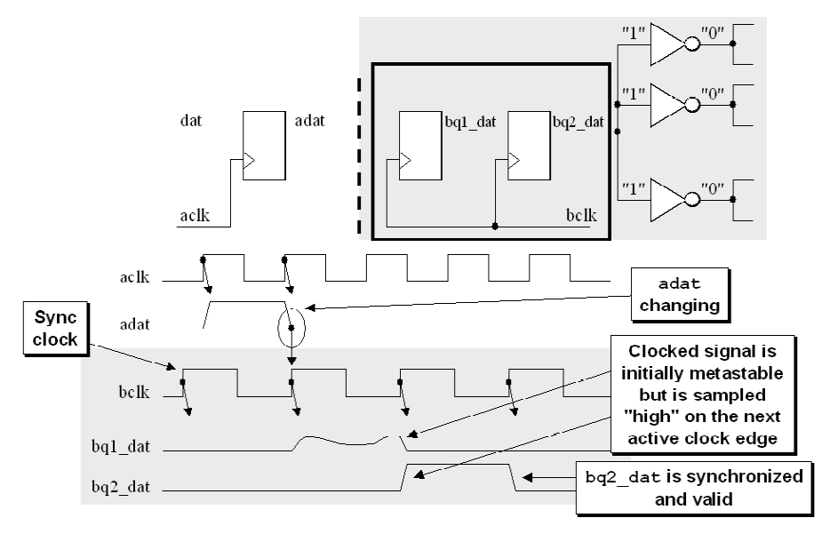
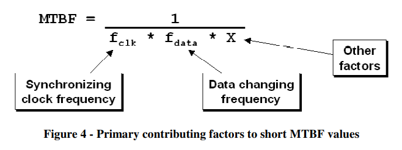
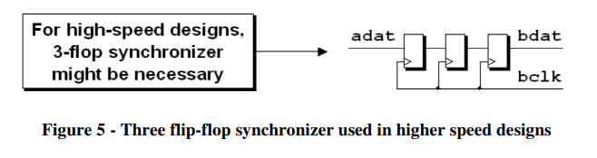

# 《Clock Domain Crossing》 翻译与理解（2）打两拍

- [ ] Version
    * [x] lin
    * [x] 2024-01-05 
    * [x] CDC打两拍
    * [ ] review

## 同步器

!!! Quote
    "A synchronizer is a device that samples an asynchronous signal and outputs a version of the signal that has transitions synchronized to a local or sample clock."

## 两种同步场景

当在不同的时钟域（Clock Domains）之间传递信号时，一个关键问题是：是否需要采样从一个时钟域传到另一个时钟域的每个信号值？

在跨越时钟域交叉（CDC, Clock Domain Crossing）边界时，有两种可能的场景，确定适用于你设计的场景很重要：

* 允许在时钟域间遗漏一些样本。

* 必须采样通过时钟域传递的每个信号。

第一种场景：有时候并不需要采样每一个值，但重要的是确保采样到的值是准确的。例如，在标准异步FIFO（先进先出队列）设计中使用的格雷码计数器。在一个设计良好的异步FIFO模型中，同步的格雷码计数器不需要捕获来自对面时钟域的每一个合法值，但至关重要的是必须准确捕获样本值，以便能够识别FIFO的满和空条件是否发生。

第二种场景：一个CDC信号在允许变化前，必须被正确识别或识别并确认。这意味着在信号可以改变之前，接收方必须确认已经接收到该信号，并且根据信号所指示的条件做出响应。这通常涉及到握手协议，确保两个时钟域可以安全地同步和传递信息。

在这两种场景下，CDC信号都将需要某种形式的同步机制到接收时钟域。

## 打两拍同步器

第一级触发器：异步输入信号首先被采样到新时钟域的第一级触发器。这意味着该信号在新时钟边缘上被锁存进入第一级触发器。

等待一个时钟周期：在这个触发器产生的输出信号上等待一个完整的时钟周期，目的是让如果存在的任何亚稳态现象有足够的时间衰减。亚稳态并不会立即消失，但在一定时间内，其概率会降低到可以接受的水平。

第二级触发器：经过第一级触发器锁存并等待一个时钟周期后，这个信号再次被相同的新时钟域的时钟信号采样到第二级触发器。这个步骤的预期目标是确保输出的第二级信号已经是稳定和有效的，并且已经与新的时钟域同步，准备在此时钟域内部分发。

!!! quote
    The first flip-flop samples the asynchronous input signal into the new clock domain and waits for a full clock cycle to permit any metastability on the stage-1 output signal to decay, then the stage-1 signal is sampled by the same clock into a second stage flip-flop, with the intended goal that the stage-2 signal is now a stable and valid signal synchronized and ready for distribution within the new clock domain.

但是，也有可能第一级采集到错误数据，第二级仍然采集到亚稳态数据，并将错误结果传播到后级，这个时候就引入了概率计算公式MTBF(mean time before failure)。

**For most synchronization applications, the two flip-flop synchronizer is sufficient to remove all likely metastability.**

##  MTBF - mean time before failure
MTBF是概率公式，该公式代表数据在跨时钟域时，经过第一级寄存器产生亚稳态数据，由于数据不稳定，同步到第二级寄存器时也可能产生亚稳态数据，所以该公式就是计算这种连续两级寄存器同步后结果仍然是错误的概率。MTBF数值越大，代表两次失败间隔越长，相反，越短代表错误发生频率越高。

Dally和Poulton给出了一个很好的方程式，并对计算进行了非常彻底的分析，可以计算出同步电路的MTBF。 在不重复方程式和分析的情况下，应该指出，直接影响同步器电路MTBF的两个最重要因素是采样时钟频率（将信号采样到接收时钟域的速度）和数据更改频率（跨越CDC边界的数据更改速度有多快）。公式如下图所示：

上图可知，数据原时钟频率和采样时钟频率越高，MTBF越小，错误概率越高。

## 打三拍

对于某些非常高速的设计，如果打两拍时间太短，可以考虑打三拍来降低MTBF发生概率。
