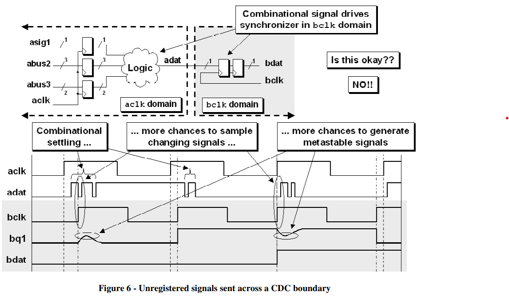
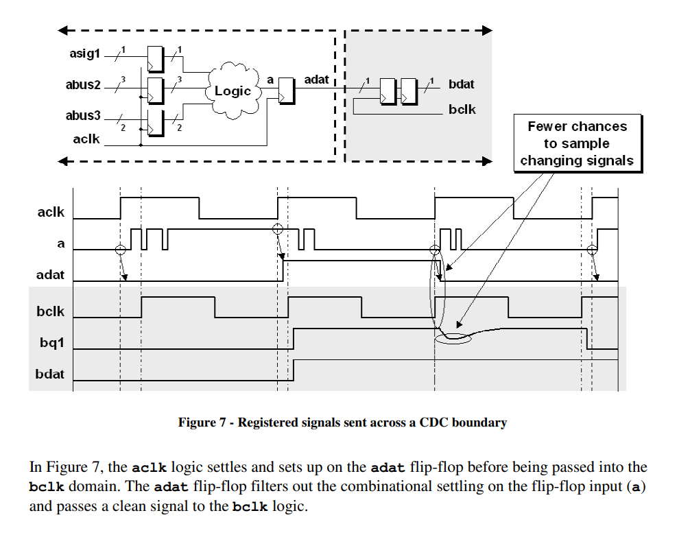

# 《Clock Domain Crossing》 翻译与理解（3）寄存器处理输出端口

- [ ] Version
    * [x] lin
    * [x] 2024-01-05 
    * [x] CDC寄存器处理输出端口
    * [ ] review

问题：在跨时钟域时，在发射时钟域输出的信号，是否需要通过寄存器输出？

答案：建议在跨时钟域时，输出信号以寄存器形式输出，而不是组合电路直接输出，原因如下图所示：

原因在于组合逻辑的输出不稳定，存在毛刺和震荡，会增加采样时钟采到不稳定信号的概率，从而导致更多的亚稳态信号生成概率。

所以建议在跨时钟域时，用寄存器的形式输出信号，其结果如下图所示：

