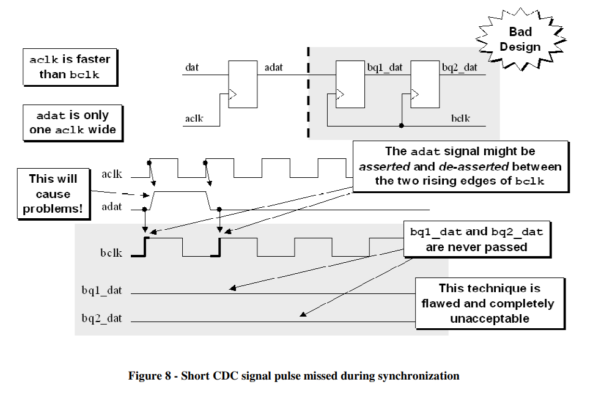
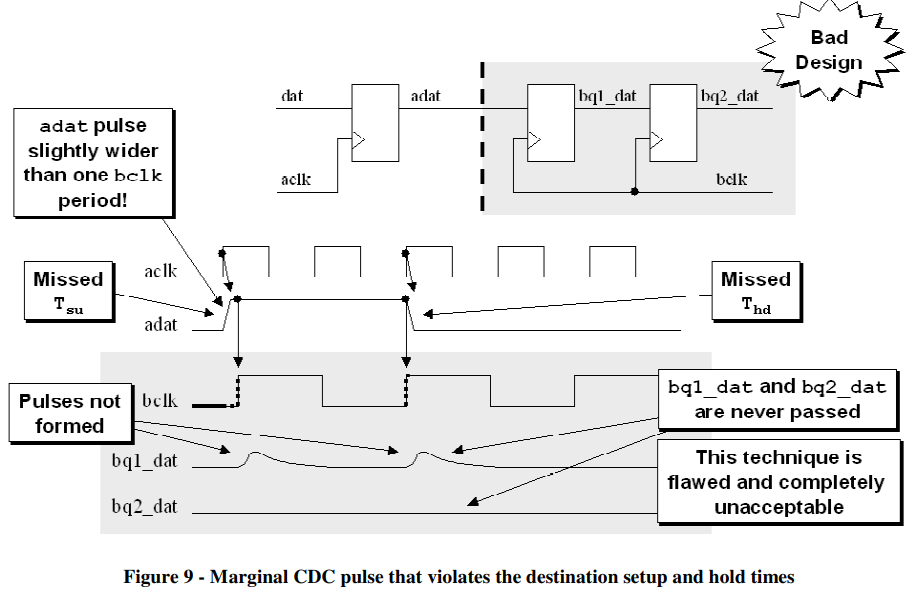
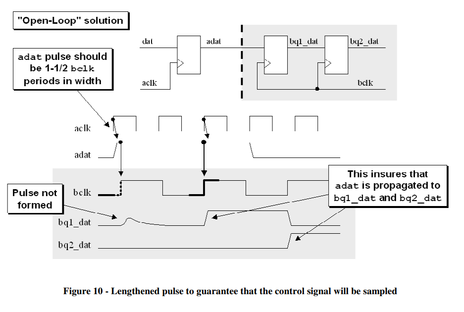
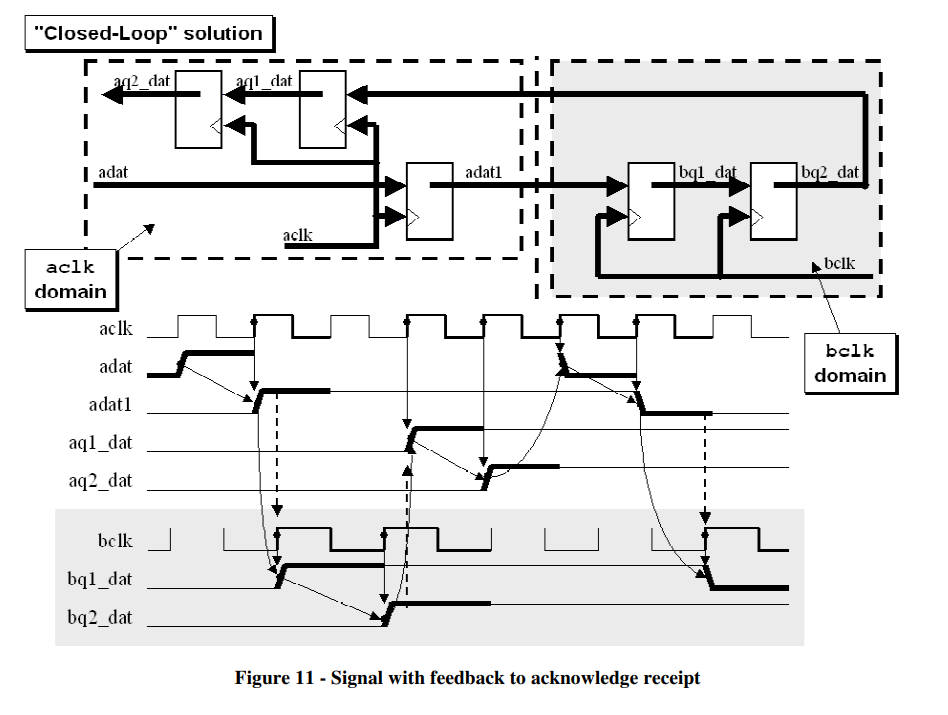

# 《Clock Domain Crossing》 翻译与理解（4）快时钟到慢时钟数据传输

- [ ] Version
    * [x] lhn
    * [x] 2024-01-06
    * [x] 快时钟到慢时钟数据传输
    * [ ] review

如果在时钟域之间传递的CDC（时钟域交叉）信号不能被跳过，那么考虑信号宽度或当它们在时钟域间传递时使用同步技术就显得很重要。这里关注的CDC信号指的是需要从一个时钟域安全地传递到另一个时钟域的信号。

CDC信号同步时可能遇到的一个问题是，发送时钟域的信号可能在被慢时钟域采样前改变两次，或者信号改变的时间点可能与慢时钟域的采样边缘太接近。这种可能性在将信号从一个时钟域发送到另一个时钟域时必须予以考虑，并且需要确定对当前设计来说，错过信号是否构成问题。

当不允许错过样本时，通常有两种解决方法：

(1) 开环解决方案
开环解决方案确保信号能够无需确认就被捕获。在这种方案中，发送端不等待接收端的任何反馈，只是按照预定的协议发送信号。设计者必须确保发送信号的频率和宽度适配接收端的采样频率，以避免信号在没有被正确采样之前就发生变化。此方法简单，但通常依赖于对数据路径和时钟行为的深入理解来降低丢失信号的风险。

(2) 闭环解决方案
闭环解决方案要求确认收到了跨越CDC边界的信号。这涉及到一个握手协议，发送端在收到接收端确认信号后才会继续发送下一个信号。这种方式允许接收端控制数据传输的速率，确保每个信号都被正确采样和处理。这可以通过使用握手信号、应答机制或其他形式的反馈来实现。

在闭环系统中，由于存在确认机制，这减少了信号丢失的风险，因而在设计中更加健壮。然而，它也可能会引入额外的延迟，因为现在发送方需要等待接收方确认每个信号。

## 在时钟域之间可靠传递信号的需求

将较慢的控制信号同步到更快的时钟域通常不是问题，如果更快的时钟域的频率至少是较慢时钟域的1.5倍（或更高），因为更快的时钟信号将有机会对慢的CDC信号进行一次或多次采样。因此将较慢的信号采样到更快的时钟域比将更快的信号采样到较慢的时钟域产生的潜在问题要少，根据这一事实，通过使用简单的两级D触发器（flip-flop）同步器来在时钟域之间传递单个CDC信号。

## "三边缘"要求
在通过两级D触发器同步器将一个CDC信号从一个时钟域传递到另一个时钟域时，CDC信号的宽度必须超过接收域时钟周期宽度的1-1/2倍。Litterick将这个要求描述为“输入数据值必须在三个目标时钟边缘上稳定”。

对于极长的源和目标时钟频率，这个要求很可能可以放宽到接收时钟域周期时间的1-1/4倍或更少，但“三边缘”准则是最安全的初始设计条件，并且通过使用SystemVerilog断言比在仿真期间动态测量CDC信号的分数宽度更容易证明。

在这里，“三边缘”要求指的是为了确保信号稳定性和同步的可靠性，源时钟域中的信号在传递到目标时钟域之前，必须在目标域的时钟周期内保持稳定足够长的时间，即至少要覆盖目标时钟的三个上升（或下降）边缘。这样可以保证接收时钟域的同步器在任何给定时间只捕获到一个稳定的信号值，而不是在变化中的值。

对于开环传输方案，设计者必须手动确保符合“三边缘”要求。对于闭环传输方案，由于存在确认机制，该要求通常会自然得到满足，因为发送端必须等待接收端的确认才能发送下一个信号，这使得每个信号在接收时钟域中都能保持足够的稳定性。

## 快时钟到慢时钟

下图展示了一种失败的设计：

数据宽度和原时钟宽度相同，采样时钟域属于慢时钟，那么就会导致无法正确采集到数据，错过了数据的有效位置。

下图展示了一种设计，数据宽度略大于采样时钟宽度，这样由于建立时间或者保持时间不够导致亚稳态信号的产生。

## 开环设计
如果能够保证数据宽度是慢时钟的1.5倍，即可使用开环设计，如下图所示：

优点：开环设计是快时钟到慢时钟数据传输最高效的方法，设计中可以通过数据延展来实现。

缺点：代码维护可能出现问题，新的工程师来了之后可能不理解你的延展意图，而更改此方案。方法是可以在设计中加入systemverilog的断言机制，即SVA，判断数据宽度是否经历了3个沿（1.5*bclk）。

## 闭环设计
针对跨时钟域信号传递问题的第二种潜在解决方案是发送一个使能控制信号，将其同步到新时钟域中，然后将这个已同步的信号通过另一个同步器返回给发送时钟域作为确认信号。

该方法属于握手反馈机制，优点是最安全的数据传输手段，缺点是数据延迟较大，影响性能。
