# 《Clock Domain Crossing》 翻译与理解（5）多信号跨时钟域传输
- [ ] Version
    * [x] lin
    * [x] 2024-01-05 
    * [x] 多信号跨时钟域传输
    * [ ] review

## 多信号跨时钟域传输

多信号传输和多比特数据跨时钟域传输是不完全相同的，多信号通常指的是多个单比特控制或使能信号，跨时钟域后对某个寄存器或者触发器进行控制，当然本文介绍的传输方法也适用于多比特数据跨时钟域传输。

由于多个信号其中每一个信号都是单比特，所以很多人选择单比特信号打两拍处理来进行跨时钟域同步。但是由于原时钟域的多个信号彼此之间存在skew，也许很小的时钟偏斜在跨时钟域被采样时钟采集时，会导致信号的相位延迟，而带来错误的结果。

## 多比特 CDC策略

多bit控制信号跨时钟域传输时，可以将通用策略分为三类：

* 多比特信号融合，如果可以的话，在跨时钟域之前先将多信号进行融合，前提是这些信号作用相同，这样融合后再跨时钟域就相当于单比特跨时钟域了。

* 多周期路径规划，用1个同步后的加载信号，来安全地传输多比特CDC信号。

* 使用格雷码。

## 多比特信号融合

当控制信号的顺序或对齐是重要的，在将信号正确传递到新的时钟域时必须非常小心。

### 情况1——2个同步控制信号

下图展示了一种2个同步控制请求信号在跨时钟域传输时，由于时钟偏斜所导致的数据传输失败案例。

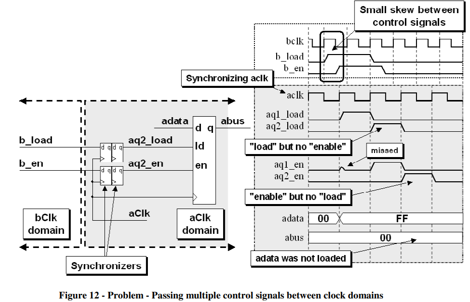

b_load和b_en信号是bclk的加载和使能信号，需要跨时钟域传输，但是由于存在时钟偏斜，尽管分别都进行了打两拍处理，但是从上图这种情况可以看出来，偏移了一个时钟，导致最终数据加载失败。

### 解决方法——融合

既然两个控制信号需求相同，同时拉高与拉低，那么可以将两个信号合并，作为一个信号再打两拍进行跨时钟域，其结果如下图所示：

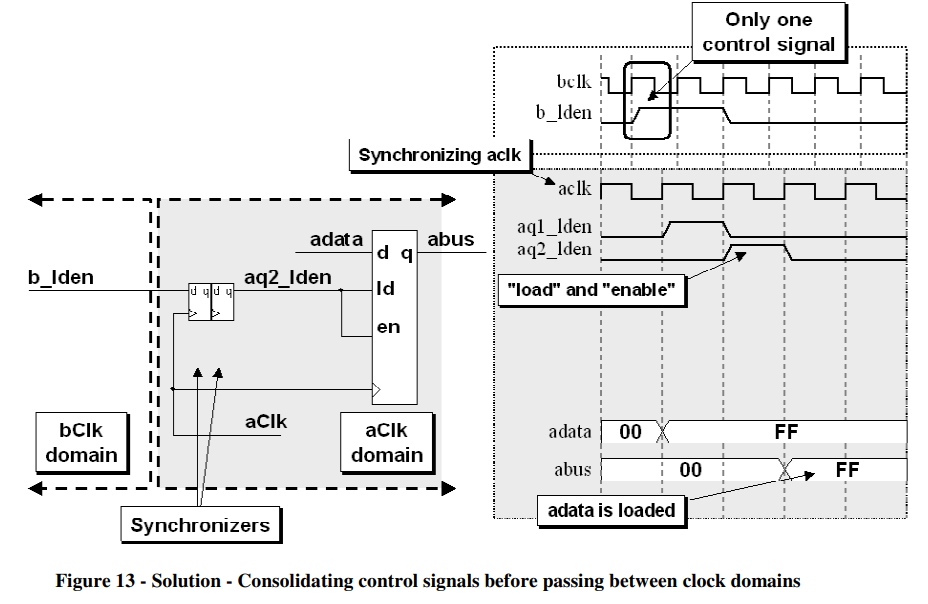

### 情况2——2个含有相位差的控制信号

原时钟域输出2个控制信号，这两个控制信号存在相位差值，目的是在目标时钟域上可以延迟1拍，错开1个cycle实现对于2个寄存器的控制，但是可能在2个控制信号分别打拍时，出现亚稳态信号，延迟1拍输出有效信号，导致数据加载错误，如下图所示：

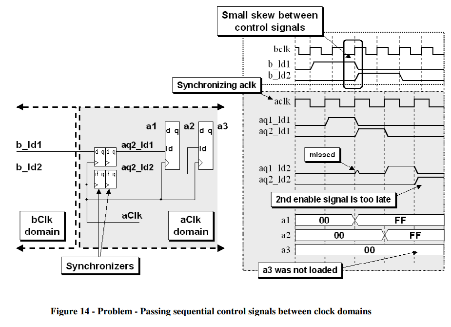

### 解决方法——融合并增加1个寄存器

上图需求是延迟的控制信号分别控制目标时钟域的2个寄存器，那么可以修改为在原时钟域进行控制信号融合，然后在目标时钟域打两拍，输出信号控制1个寄存器，再打一拍输出延迟信号控制另一个寄存器，如下图所示：

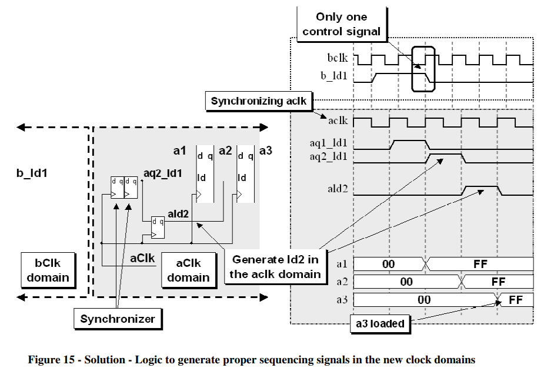

### 情况3——多比特跨时钟信号

当原信号不能进行融合时，就需要考虑多比特跨时钟域，下图所示是2-4译码器，对2输入分别进行打拍处理，会发现存在时序错误，具体如下图所示：

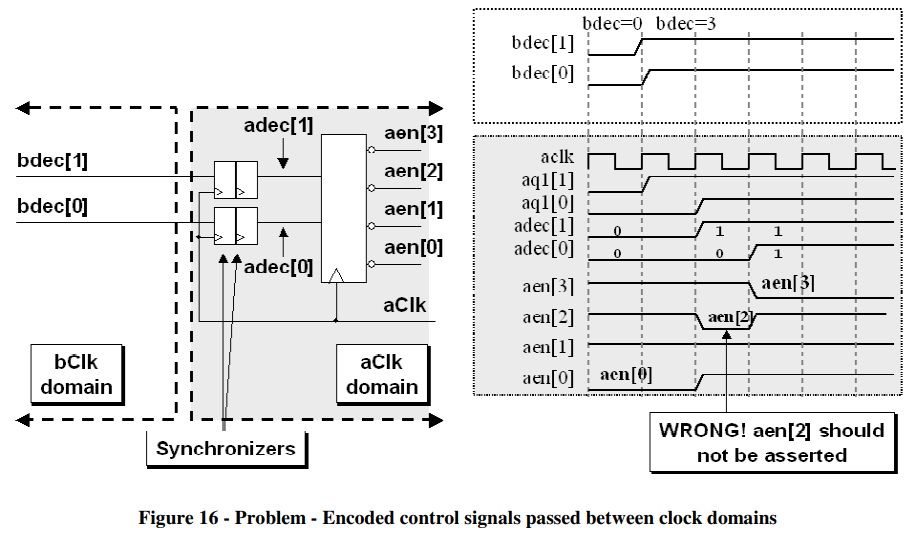

由上图可见，由于输入信号存在时钟偏斜，导致跨时钟域时分别打拍被采集到数据的时间不同，导致译码单元输出错误结果。

### 解决方法——多周期路径规划和FIFO

对于多比特数据跨时钟域传输，常用方法有多周期路径规划和FIFO。

对于多周期路径规划，一种是不需要握手反馈的闭环控制，这个前提是接收时钟域是一直ready的，可以持续接收发射时钟域的信号；另一种是需要握手反馈的闭环控制，这个特点是发射和接收时钟域都有各自的状态机，存在反压控制。

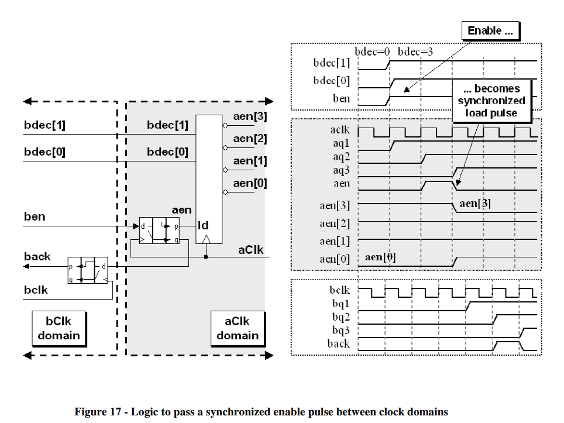

如上图所示，ben作为打包信号，对它进行跨时钟域打两拍同步，以第二拍的脉冲信号作为译码器的敏感信号，当它升高的时候对输入信号进行判断，此时要保证输入多比特信号不能改变，所以这时候输出反馈信号，反馈信号打拍后回到原时钟域，这时候可以改变多比特信号，这就是一种典型的多周期路径规划电路结构。

## 多周期路径规划——适用于多比特数据传输

多周期路径规划指的是，用一个使能信号传输未同步数据到目的时钟域，其中使能信号和数据信号同步输入到目的时钟域，数据信号不需要跨时钟域处理，可以直接给目的时钟域的寄存器，而使能信号在进入目的寄存器之前需要打两拍进行同步。

优点：

* 发射时钟域不需要计算目的时钟域时钟宽度，来进行数据保持；

* 发射时钟域只需要发出一个使能信号，来指示接收时钟域什么时候可以采集数据，这个使能信号可以反馈给发射时钟域，也可以不反馈（如果数据保持时间较长）。

重点：

* 数据不需要同步处理而可以直接进行跨时钟域传输，使能信号需要打两拍同步；

* 数据在被采集之前不允许变化；

* 这种方式传输多比特数据非常安全。

### 同步使能并产生脉冲信号

多周期路径规划中常用使能信号进行指示接收时钟域采集跨时钟的数据信息，常用的一种电路结构是，将使能信号打三拍，将第二拍和第三拍异或，这样可以在第二拍的时候输出一个脉冲指示信号，该信号就可以作为采样时钟域采样使能信号，其具体电路结构如下图所示：

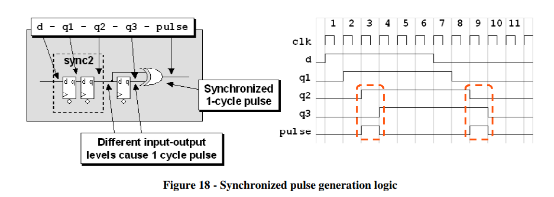

另外，对于带有握手反馈信号的闭环多周期路径规划，对于反馈信号一般使用第三个同步寄存器的输出，将该输出反馈到发射时钟域，打两拍之后进行使用，其具体电路结构如下所示：

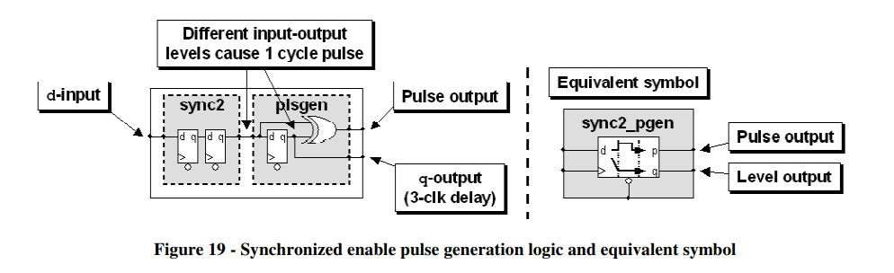

另一种方法是发射时钟域发射脉冲使能信号，相当于数据和脉冲使能信号同步输出，然后在接收时钟域对该使能信号进行打拍同步，当接收到有效使能信号后即可对数据进行采样，但是这样需要保证接收时钟域可以采样到脉冲信号，如果是跨时钟域到慢时钟域可能会产生问题，其具体电路结构如下所示：

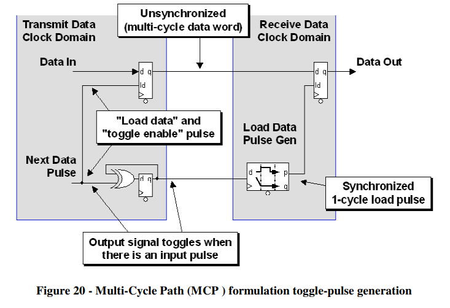

### 带反馈机制的多周期路径规划

多周期路径规划中的发射时钟域需要发射反馈信号给接收时钟域，如果接收时钟域时刻准备好接收上一级信号输入，那么这个时候反馈信号在接收时钟域进行状态机控制后即可作为使能信号发射下一次数据，其具体电路结构如下所示：

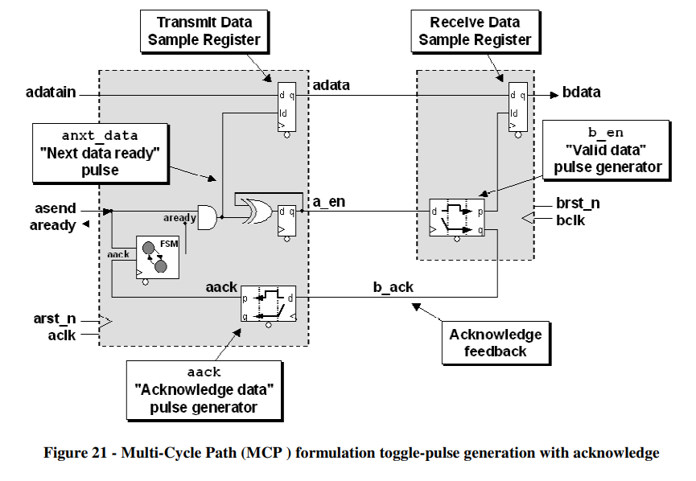

反馈信号先在接收时钟域进行同步，然后给状态机作为输入，状态机输出信号作为给前一级的ready，然后与前一级的asend（valid）信号相与，作为数据加载使能信号，准备下一次的发射。

the acknowledge feedback signal (**b_ack**) generates an acknowledge pulse (**aack**) that is used as an input to a small **READY-BUSY**, 1-state FSM block that generates a ready signal (**aready**) to indicate that it is now safe to change the data input (**adatain**) value again. Once the **aready** signal goes high, the sender is free to send new data (**adatain**) and the accompanying asend control signal.

This is an automatic feedback path that assumes that the receiving clock domain will always be ready for the next data word synchronized through an MCP formulation.

### 带握手反馈机制的多周期路径规划

如果多周期路径规划模块处于中间级，其与上下级都存在握手与反压，那么这个时候就需要把握手机制引入多周期路径规划，在接收时钟域也要多一个状态机，负责和下一级进行交互，这时候反馈信号要在接收时钟域准备好之后才能发出，所以需要经过其状态机控制，该电路也在实际项目中更为常用，值得牢记，如下图所示：

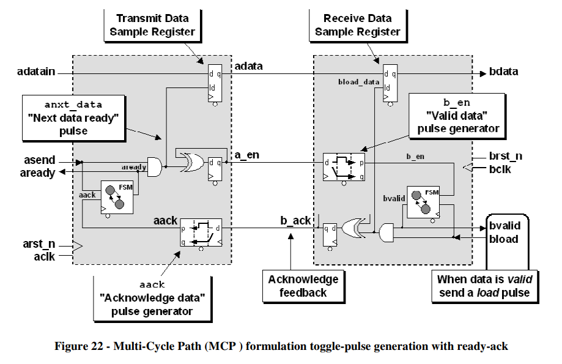

只有当接收时钟域acknowledges receipt of the data，并且发出一个bload信号，接收端才会发出一个b_ack应答信号给发送域。

## 格雷码

当跨时钟传输的数据是连续计数的数据时，可以考虑用格雷码，格雷码的特性是相邻两个连续数据每次都只变化1位，这样在跨时钟域时就可以降低亚稳态发生的概率，尽管这种方法没有多周期路径规划安全，但是在某些设计中，并不需要每一个时钟都要采样到正确数据，比如在异步FIFO中，我们用格雷码和打两拍的方式进行地址转换，不需要其中每一次地址都转换正确，只需要在空满判断时可以采集到正确数据即可，所以综合时间性能和安全性，有的时候格雷码在跨时钟域传输时也是一个很好的选择。但是，值得注意的是，要保证数据连续变化，否则格雷码不能保证每次只改变1比特。

!!! quote "verilog实现格雷码与二进制的转化"
    1）自然二进制码转换为格雷码的方法

        自然二进制码转换成二进制格雷码，其法则是保留自然二进制码的最高位作为格雷码的最高位，而次高位格雷码为二进制码的高位与次高    位相异或，而格雷码其余各位与次高位的求法相类似。     

    原理: 若二进制码表示为: B[N-1]B[N-2]...B[2]B[1]B[0];

    相应地, 则二进制格雷码表示为: G[N-1]G[N-2]...G[2]G[1]G[0].

    其中最高位保留: G[N-1] = B[N-1];

    其他各位: G[i] = B[i+1] xor B[i]. (i = 0, 1, 2, ..., n-2)

    图示如下：

    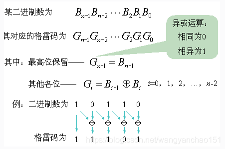

    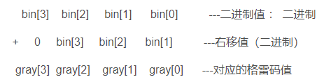

    总结：格雷码的值只需要在原来的二进制的基础上右移一位再异或原来的二进制值即可得到。

    ```verilog
    module  binary2grey #(
            parameter   N       =       4
    )(
            input         [N-1: 0]   binary                 ,
            output  wire  [N-1: 0]   grey
    );
    //=====================================================================\
    // ********** Define Parameter and Internal Signals *************
    //=====================================================================/
    
    
    //======================================================================
    // ***************      Main    Code    ****************
    //======================================================================
    assign  grey    =       {1'b0,binary[N-1:1]}^binary;

    ```

     2）格雷码转换为二进制码的实现方法

    二进制格雷码转换成自然二进制码,其法则是保留格雷码的最高位作为自然二进制码的最高位，而次高位自然二进制码为高位自然二进制       码与次高位格雷码相异或，而自然二进制码的其余各位与次高位自然二进制码的求法相类似。      

    原理: 若二进制格雷码表示为: G[N-1]G[N-2]...G[2]G[1]G[0];

    相应地, 则二进制码表示为: B[N-1]B[N-2]...B[2]B[1]B[0].

    其中最高位保留: B[N-1] = G[N-1];

    其他各位: B[i-1] = G[i-1] xor B[i]. (i = 1, 2, ..., n-1)

    图示如下：

    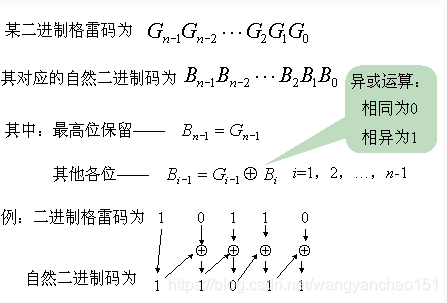

    ```verilog
        module  grey2binary #(
            parameter   N       =       4
    )(
            input         [N-1: 0]   grey                   ,
            output  wire  [N-1: 0]   binary
    );
    //=====================================================================\
    // ********** Define Parameter and Internal Signals *************
    //=====================================================================/
    
    
    
    //======================================================================
    // ***************      Main    Code    ****************
    //======================================================================
    assign  binary[N-1]     =       grey[N-1];
    
    generate
    genvar  i;
        for(i=N-2; i>-1; i=i-1) begin:b2g
            assign  binary[i]     =       grey[i]^binary[i+1];
        end
    endgenerate
    
    
    endmodule
    ```

    ## 2比特深度FIFO
    异步FIFO搭建原理通常是读写使能升高，对应读写指针增加，然后将读写指针转换为格雷码，再通过打两拍转换到各自的时钟域进行空满判断，其数据保存在双口RAM里，所以本身就是一个天然的跨时钟域数据传输手段，所以在传输数据时可以考虑使用FIFO来进行跨时钟域处理。


