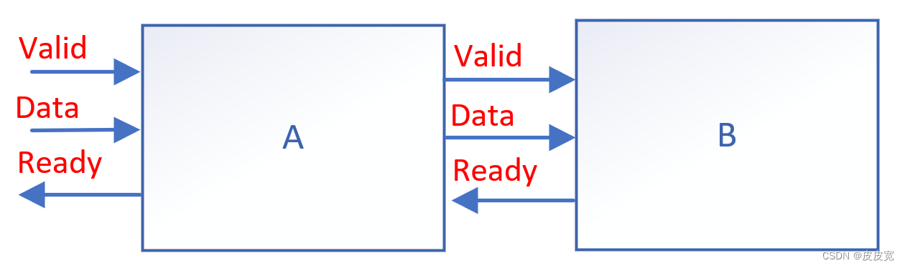
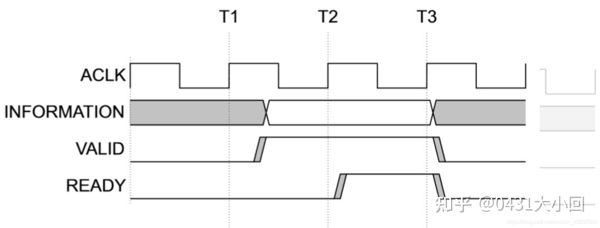
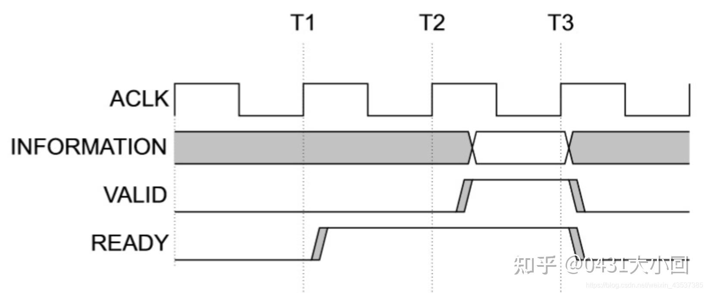
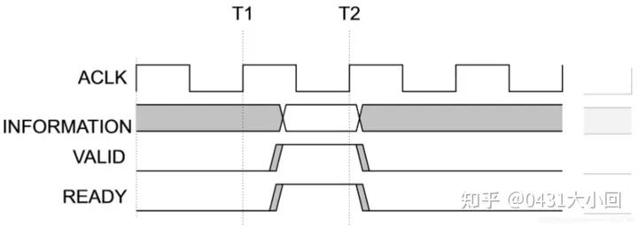
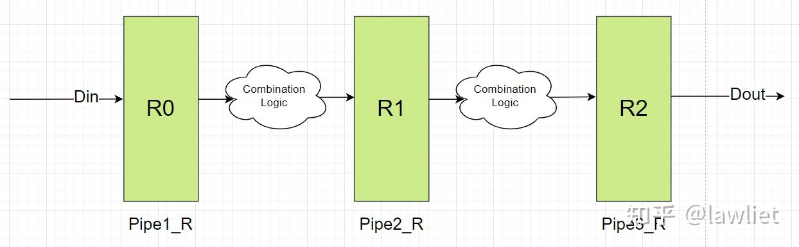
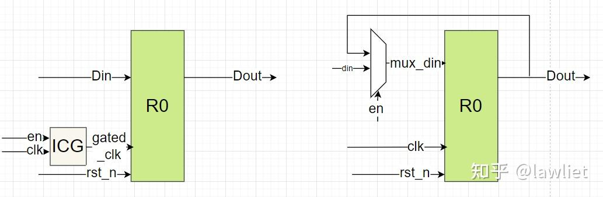
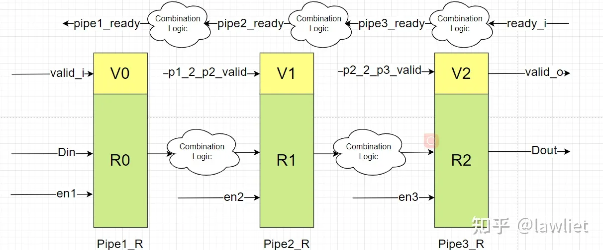
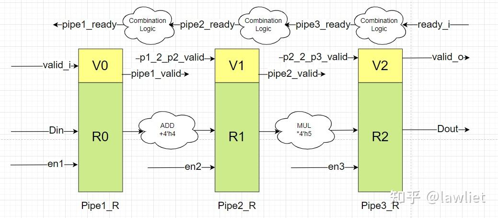

# 数字芯片设计——握手与反压

- [ ] Version
    * [x] linhuangnan
    * [x] 2023-01-08 
    * [x] 师兄组会汇报
    * [ ] review

!!! info
    * 握手协议
    * 握手与反压

在芯片设计或者FPGA设计过程中，流水设计是经常用到的，为了考虑数据安全性，避免数据被覆盖等情况，需要与前后级模块进行握手通信，这时候就需要对流水数据进行反压处理。

## 握手协议

### 定义



如图所示，信号从输入端到A，经过模块A处理后，再送入到B模块进行处理。为了防止B错误读取A中的数据，A与B之间添加了信号Valid，只有当Valid信号为真时，A输出的数据才是有效数据，同时，为了防止B出现问题，A与B之间还加入了一个引脚Ready，B拉高该电平时，表明当前B模块可以接收、处理信号。只有当A送给B的信号有效(Valid为真)，B此时做好准备可以接收A的数据了（Ready为真），此时，数据才被顺利的送入B中，这个过程就叫做‘握手’。

如果B没能及时的处理完A送达的数据，就会将Ready拉低，提醒A模块不要再传输数据了。此时A模块接收到B的指令，为了不让数据丢失，在B模块读取当前数据前，A模块不会更新自己输出的Data内容。由于A目前不能更新输出值，因此需要告诉A的上级模块停止数据传输，因此A模块也会拉低自己的Ready输出信号，提醒上一级暂停数据的传输。这种当后面的模块未能及时处理上级模块的输入数据时，通过一个Ready信号告诉自己前面的模块暂停数据传输的方法被称之为‘反压’。

### 三种握手情况
valid-ready握手，以下列出三种握手情况，解释清楚握手的时序。

valid先发起请求:



ready先发起请求



同时发起请求



仔细观察上述3幅时序图，我们了解valid-ready握手机制需要注意三件事：

- valid与ready不可过度依赖，比如valid不可以等待ready到达再拉高，但是在axi协议中的握手信号，ready是可以等待valid拉高再拉高的，valid不可依赖ready的原因是防止死锁（deadlock），本文的代码他俩彼此可以互相独立发出请求拉高；

- valid拉高时与有效数据同步，时钟要对齐；

- 当数据计算好后，valid可以拉高等待ready拉高，但是每当握手成功之后，数据需要更新，如果此时没有新的有效数据，valid要拉低。

### 非阻塞型流水线

如果没有握手与反压机制会怎么样？

输入DIN先通过寄存器打一拍，然后经过第一级组合逻辑运算以后再打一拍，然后再经过第二级组合逻辑运算再打一拍。然后输出到Dout。看上去能够很好的满足要求，但是如果：

* Dout所连接的模块或其内部的某一级无法接收新的数据；（下游接收不了数）
* 中间的组合逻辑一拍运算不完；（上游数据没有准备好）

就会出现相应的问题，**该例子中的寄存器在任何情况下，都会在时钟上升沿采样新的数据**，但很多时候我们还没有准备好数据，或者是下游还不能接收新的数据。这样的情况都会导致运算结果出错，**因此我们需要考虑使用带enable的寄存器**，在我们想要的时候，才进行数据的更新，至于这个enable信号如何规定，我们后面再讲，我们先看一下带Enable的DFF长什么样子。



### 阻塞型流水线

### DFF模型

需要在想要的情况再赋值给DFF，我们就需要用到带有enable的DFF，其RTL代码大致如下所示：
```verilog
reg [31:0] dout;
always@(posedge clk or negedge rst_n) begin
    if(!rst_n)
        dout<=32'h0;
    else if(en)
        dout<=din;
end
```

可以看到，在这种情况下，只有enable拉高使能的时候，才会把新的din输出给dout，否则dout维持不变。一般有两种方式，一种是保持数据不变，另外一种是关闭时钟，通常称为门控时钟。分别如下图所示，其中门控时钟的策略更加适用于高速低功耗的电路中。



#### 阻塞流水线

正因为非阻塞流水线无法实现我们预期的功能。因此我们需要借助enable信号来实现阻塞流水线，从而引出我们的握手与反压。这里我们首先考虑不使用FIFO的反压机制。

如下图所示，为阻塞型流水线。其中的Enable有两种机制：

* 全局使能，只要某一级发生阻塞了，整个流水线都会停住，这样会存在某几级流水线可以正常工作，但无法发数和接收数据。存在性能浪费。

* 独立使能，逐级反压。只要我自己的后级可以接收数据，我就把数往后发，再往前或者再往后是怎样的情况和我没关系。



#### 阻塞型流水线设计实例

我们考虑pipe1->pipe2的组合逻辑是一个加法器，为单周期指令。而pipe2->pipe3的组合逻辑是一个乘法器，为多周期运算，需要三个时钟周期。



此例子中存在后级反压前级的情况，因此我们就需要根据握手协议来选择合适的时候传递数据，核心思想就是保证每一级寄存器的数据安全，不要当前的值还没有使用，就被新的值给覆盖掉了。

这种情况我们没有使用FIFO，但实际上我们可以把每一级寄存器当成一个深度为1的FIFO，下一级有无数据可以看下一级对应的valid信号。下一级无数据或者下一级已经准备好了，那么就可以向上一级取数据。

下面的代码实例是前向打拍，因此ready的时序会比较差，此外正常情况，我们多周期指令实际上会拆成多级流水线，用这样的一级流水线加内部状态记录使能ready的情况很少见。实际上这样性能会比较差，因为存在断流。大家感兴趣可以自己写细粒度流水线的例子。


