# 脉动阵列 - 因Google TPU获得新生

- [ ] Version
    * [x] lhn
    * [x] 2024-01-24
    * [x] 单端口和双端口RAM
    * [ ] review

## Why systolic architectures?

要真正理解脉动阵列，首先要问的就是发明者的初衷。这正好也是1982年H. T. Kung论文的题目[H. T. Kung, ＂Why systolic architectures?＂, IEEE Computer, Vol. 15, N°1, pp 37-46, 1982.]。对于为什么要设计这样的架构，作者给出了三个理由：

- **Simple and regular design**：

可以说，**简单和规则**是脉动阵列的一个重要原则。

而这样的设计主要是从“成本”的角度来考虑问题的。

“Cost-effectiveness has always been a chief concern in designing special-purpose systems; their cost must be low enough to justify their limited applicability.”换言之，由于一个专用系统往往是功能有限的，因此它的成本必须足够低才能克服这一劣势。这也是设计专用处理器的一个基本考虑。

更进一步，作者把成本分成两部分：`nonrecurring cost`（设计 design） 和`recurring cost`（器件 parts）。器件成本对于专用设计和通用设计基本是一样的，因此决定性的是设计成本。而设计一个合理的架构（appropriate architectures）是降低设计成本的一个重要方法。

Google的TPU可以说很好的证明了这一点。通过采用脉动阵列这个简单而规则的硬件架构，Google在很短的时间内完成了芯片的设计和实现。从另一个角度来说，硬件设计相对简单，尽量发挥软件的能力，也是非常适合Google的一种策略。

- **Concurrency and communication**：

构建一个快速计算机系统有两个基本方式：**使用快速组件**或**并发使用多个处理元素**。

过去十年里，计算机组件的成本和体积降低了一个数量级，但组件速度只是增加了一点。

由于技术趋势明显表明组件速度的增长率在减小，因此任何在计算速度上的重大改进必须依赖于并行使用多个处理元素。特定用途系统中的并发程度很大程度上由底层算法决定。如果算法设计得当，可以引入高度的流水线技术和多处理技术来实现大规模并行。

- **Balancing computation with I/O**：

由于特定用途系统通常通过连接到宿主机来接收数据和输出结果，I/O的考虑影响了整体性能。

特定用途系统的最终性能目标应该只是——也正是与宿主机提供的I/O带宽相匹配的计算速率。

由于在复杂系统中事先准确估计可用的I/O带宽通常是不可能的，特定用途系统的设计应该是模块化的，以便其结构可以轻松调整以匹配各种I/O带宽。

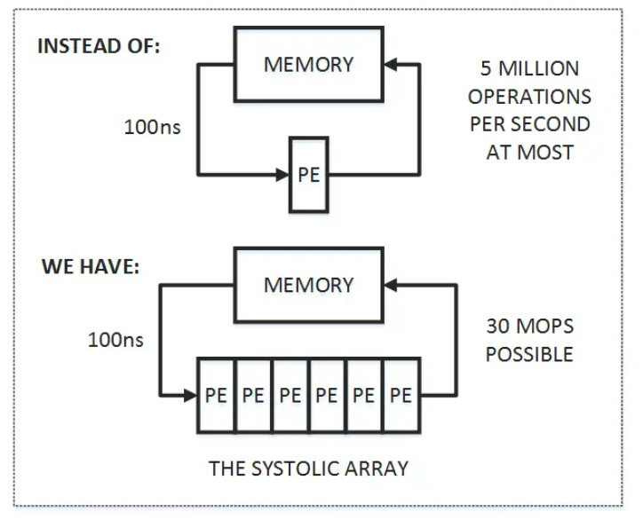

首先，图中上半部分是传统的计算系统的模型。一个处理单元（PE）从存储器（memory）读取数据，进行处理，然后再写回到存储器。这个系统的最大问题是：**数据存取的速度往往大大低于数据处理的速度**。因此，整个系统的处理能力（MOPS，每秒完成的操作）很大程度受限于访存的能力。这个问题也是多年来计算机体系结构研究的重要课题之一，可以说是推动处理器和存储器设计的一大动力。而脉动架构用了一个很简单的方法：**让数据尽量在处理单元中多流动一会儿**。

正如上图的下半部分所描述的，第一个数据首先进入第一个PE，经过处理以后被传递到下一个PE，同时第二个数据进入第一个PE。以此类推，当第一个数据到达最后一个PE，它已经被处理了多次。所以，脉动架构实际上是多次重用了输入数据。因此，**它可以在消耗较小的memory带宽的情况下实现较高的运算吞吐率**。当然，脉动架构还有其它一些好处，比如模块化的设计容易扩展，简单和规则的数据和控制流程，使用简单并且均匀的单元（cell），避免了全局广播和扇入（fan-in），以及快速的响应时间等等。

总结起来，脉动架构有几个特征：

1. 由多个同构的PE构成，可以是一维或二维，串行、阵列或树的结构（现在我们看到的更多的是阵列形式）；

2. PE功能相对简单，系统通过实现大量PE并行来提高运算的效率；

3. PE只能向相邻的PE发送数据（在一些二维结构中，也可能有对角线方向的数据通道）。数据采用流水线的方式向“下游”流动，直到流出最后的PE。

到这里不难看出，脉动架构是一种很特殊的设计，结构简单，实现成本低。但它灵活性较差，只适合特定运算。而作者认为，卷积运算是展示脉动架构特点的理想应用，因此在文章中用了很大篇幅介绍了脉动架构实现卷积运算的方法。首先看看作者对卷积运算的定义：

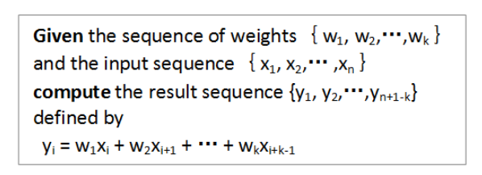

下面是作者给出的一种方法（**broadcast inputs, move results, weights stay**）:

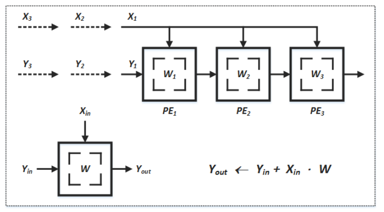

在这个例子中，X值广播到各个运算单元，W值预先存储在PE中并保持不动，而部分结果Y采用脉动的方式在PE阵列间向右传递（初始值为零）。不难看出，经过三个时刻，最右边的PE的输出就是X和W两个序列的卷积运算的第一个结果，这之后就会不断输出Y值。

文中还给出了其它几种实现卷积的方式，如broadcast inputs, move weights, results stay；fan-in results, move inputs, weights stay。这几种都算作“(Semi-) systolic convolution arrays with global data communication”。另外还有一大类是“(Pure-) systolic convolution arrays without global data communication”，包括results stay, inputs and weights move in opposite directions；results stay, inputs and weights move in the same direction but at different speeds；weights stay, inputs and results move in opposite direction；weights stay, inputs and results move in the same direction but at different speeds。建议大家好好看看，还是挺有启发的。

那么二维的脉动阵列如何做矩阵相乘呢？下面这个例子比较清楚。A和B都是3x3矩阵，T表示时刻。

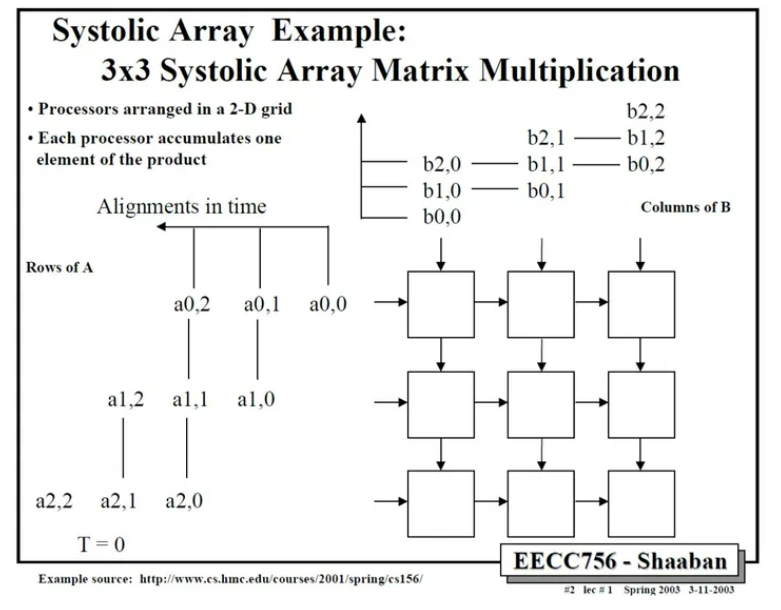

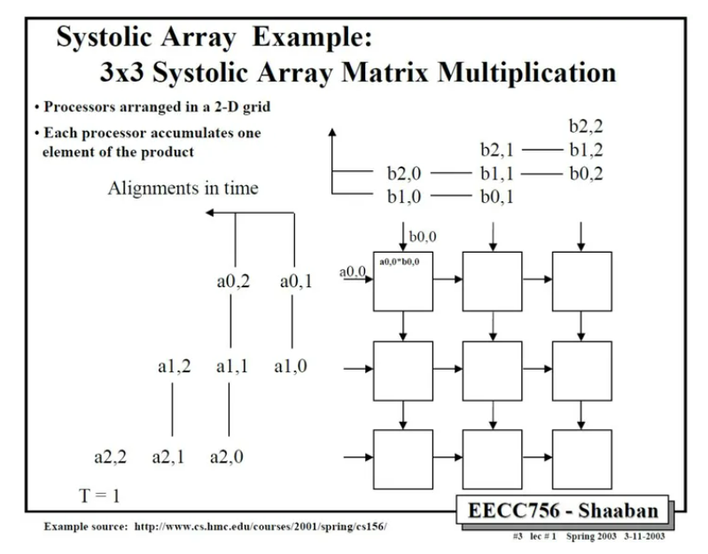

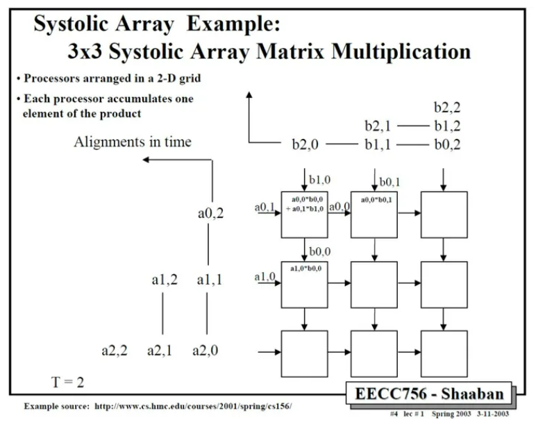

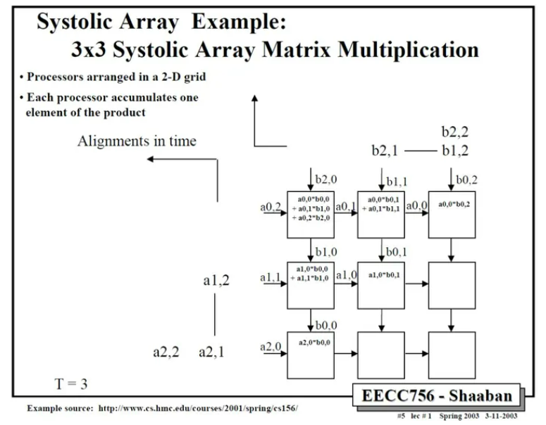

依此类推，中间省略几步，可以得到最后结果。

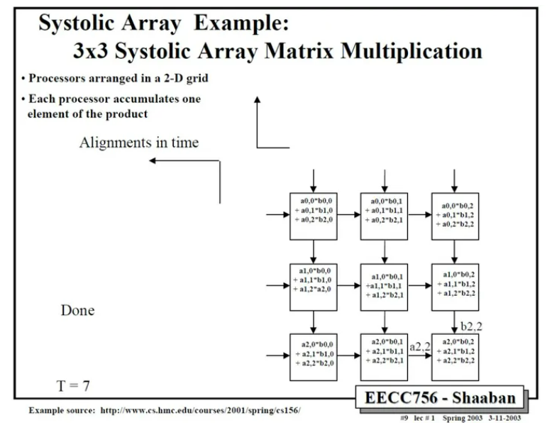

这里值得注意的是，要实现正确的矩阵运算，数据进入脉动阵列需要调整好形式，并且按照一定的顺序。这就需要对原始的矩阵进行一些reformat，这也增加了额外的操作。在后面对Google TPU的讨论中，我们可以更清楚的看到这一问题。

除了卷积运算，作者在文章中还说明的脉动架构适合的其它运算，主要包括信号和图像处理（signal and image processing），矩阵算术（matrix arithmetic）和一些非数值型应用（non-numeric application）。不过，由于脉动架构的灵活性较差，加之当时半导体技术的限制，它在被发明之后并没有得到广泛的应用。

时至今日，在我们设计Deep Learning处理器的时候，面对的一个主要矛盾仍然是I/O和处理不平衡的问题。这种不平衡既体现在速度上，也体现在功耗上。而一种减少I/O操作的思路 “…discuss how dataflows can increase data reuse from low cost memories in the memory hierarchy”，和脉动架构的方法是类似的。而另一方面，深度神经网络中大量使用了卷积运算和矩阵运算，这正好也是是脉动架构的优势。所以，在很多DL处理器中我们都可以看到脉动架构的影子（虽然有或多或少的变化和改进）。而Google TPU的设计更是让脉动阵列成了大家关注的焦点。

## Google TPU Implementation

下面我们看看Google在TPU设计中是怎么实现脉动阵列的。

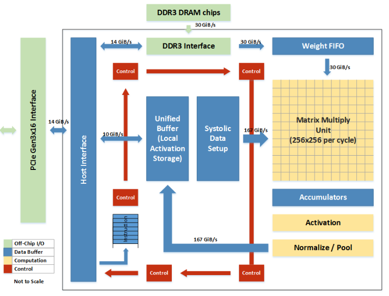

首先，从整体来看，整个TPU的核心就是Matrix Multiply Unit，它正是一个256X256的脉动阵列。而整个芯片的其它部分，都是围绕这个脉动阵列来运转的，目的就是能够让脉动阵列尽量高效的运作（不过从TPU论文来看，实际效率并不算很高）。

TPU（张量处理单元）的核心结构以及其设计理念。

**值得注意的两点：**

**1、低I/O带宽**： 

Google的TPU实现了相对较低的I/O带宽，达到了30GiB/s。这意味着相比其他系统来说，TPU在单位时间内可以处理更少的数据传输。

大量MAC单元： 64K（即64,000）个MAC（Multiply-Accumulate操作）单元可能是目前公开资料中提到的最大数量。这些MAC单元在TPU内负责执行复杂的数学运算，尤其是在深度神经网络的推断过程中。

**2、脉动阵列的优势和设计选择**：

脉动阵列的设计有效地平衡了输入/输出和计算过程，允许数据在计算单元间以有序的方式传递，减少了数据移动所需的时间和能量。

TPU使用了相对简单的处理单元（Processing Elements，PEs），也称为cell，它们构成了上述的脉动阵列。

另一个关键设计决策是TPU采用8位定点的MAC单元，这些单元支持16位的运算。这种定点计算通常比浮点计算要快，且对于许多深度学习任务来说精度足够。

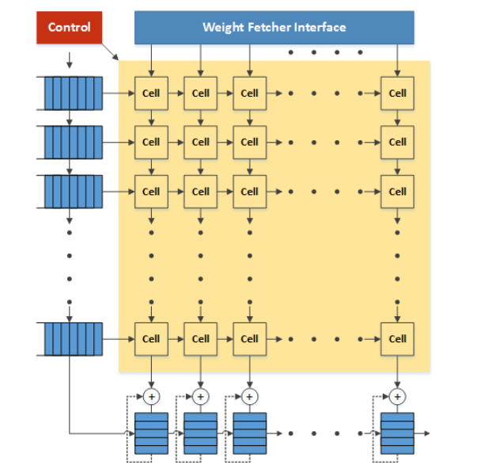

根据Google的专利，matrix单元就是一个典型的脉动阵列。weight由上向下流动，activation数据从左向右流动。在最下方有一些累加单元，主要用于weight矩阵或者activation矩阵超出matrix单元范围的时候保存部分结果。控制单元实际上就是把指令翻译成控制信号，控制weight和activation如何传入脉动阵列以及如何在脉动阵列中进行处理和流动。由于指令比较简单，相应的控制也是比较简单的。

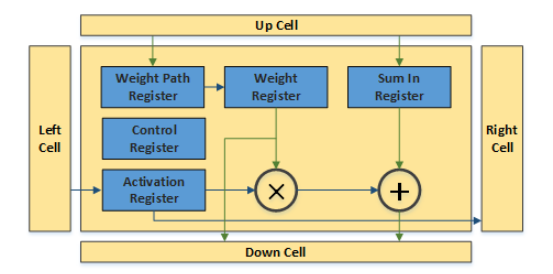

脉动阵列中的一个cell也非常简单。几组寄存器分别存储weight，activation和来自上方cell的部分和。weight从上向下传播，可以在weight path register中存储，保持不动或者传输给weight register进行运算。weight register可以把数据发到乘法器进行处理，也可以直接传递给下方的cell；同样activation register也可以把数据发到乘法器进行处理，或者直接传递给右侧的cell。乘法器的输出和Sum in register的数值求和并传递给下方的cell。所有运算和传递都由控制寄存器控制（通过指令决定）。

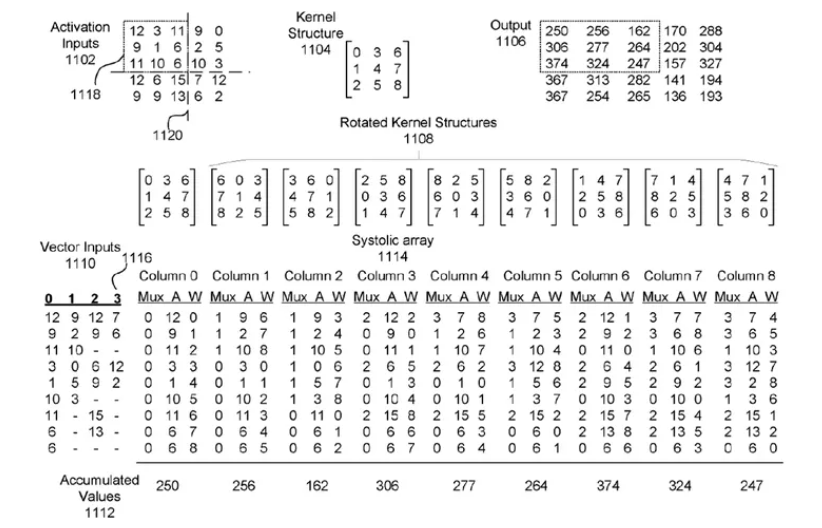

那么，在这样一个大规模的脉动阵列中怎么实现卷积操作呢？在Google的专利中有这样一个例子，可以看出一些端倪。如下图所示，activation输入被转换成一定的向量形式，作为脉动阵列的行输入。而3x3卷积核（Kernel）经过旋转，变成9个矩阵分别输入到脉动阵列的9个列。第一列计算的是卷积核和activation矩阵左上角的9个数据的卷积，得到输出矩阵的左上角的第一个数据，依此类推。

不难看出，为了要体现脉动阵列的运算效率（“keep the matrix unit busy”），需要对weight和activation进行很多形式上的转换。从TPU论文来看，似乎这项工作是由software stack中的“User Space driver”来完成，“It sets up and controls TPU execution, reformats data into TPU order, translates API calls into TPU instructions, and turns them into an application binary.”这项工作的运算量也不小，具体是怎么优化的就不得而知了。