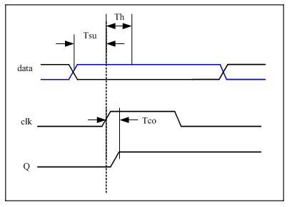
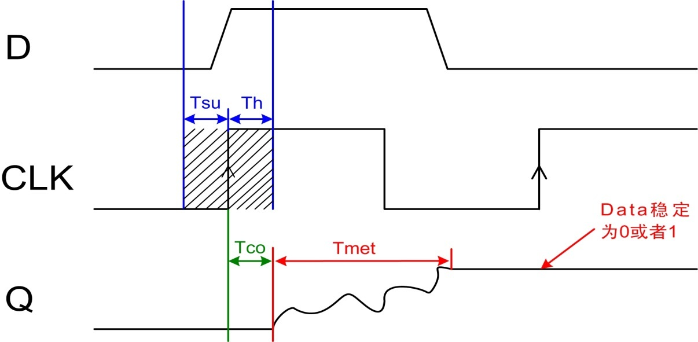
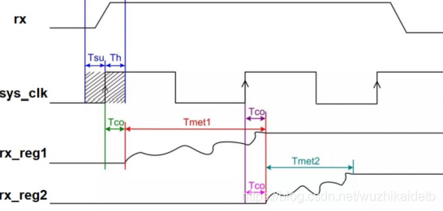

# FPGA设计的“打拍（寄存）”和“亚稳态”

- [ ] Version
    * [x] lin
    * [x] 2024-01-05 
    * [x] FPGA的打拍和亚稳态
    * [ ] review

## 触发器的建立时间和保持时间 

时序电路的基础是触发器（FF、Flip-Flop），触发器正常工作需要满足建立时间和保持时间的时序要求。

### 建立时间（Tsu：set up time）　　

　　是指在触发器的时钟信号上升沿到来以前，数据稳定不变的时间，如果建立时间不够，数据将不能在这个时钟上升沿被稳定的打入触发器，Tsu就是指这个最小的稳定时间

### 保持时间（Th：hold time）　　

　　是指在触发器的时钟信号上升沿到来以后，数据稳定不变的时间，如果保持时间不够，数据同样不能被稳定的打入触发器，Th就是指这个最小的保持时间

## 亚稳态(Metastability)

亚稳态 （Metastability）：如果数据传输中不满足触发器的Tsu和Th不满足，就可能产生亚稳态，此时触发器输出端Q在有效时钟沿之后比较长的一段时间处于不确定的状态，在这段时间里Q端在0和1之间处于振荡状态，而不是等于数据输入端D的值。这段时间称为决断时间Tmet（resolution time）。经过resolution time之后Q端将稳定到0或1上，但是稳定到0或者1，是随机的，与输入没有必然的关系。

亚稳态振荡时间 Tmet 关系到后级寄存器的采集稳定问题，Tmet 影响因素包括：器件 的生产工艺、温度、环境以及寄存器采集到亚稳态里稳定态的时刻等。甚至某些特定条 件，如干扰、辐射等都会造成 Tmet 增长。

只要系统中有异步元件，亚稳态就是无法避免的，亚稳态主要发生在异步信号检测、跨时钟域信号传输以及复位电路等常用设计中。

!!! tip
    **异步信号检测**：当检测并处理来自系统外部或者不同时钟域下的信号时，由于这些信号和本地时钟不同步，抓取这些信号的边沿可能会导致目标寄存器进入亚稳态。

    **跨时钟域信号传输**：在数字系统中，不同模块可能工作在不同的时钟频率下，信号从一个时钟域传递到另一个时钟域时，若未经过适当的同步机制，可能产生亚稳态。

    **复位电路**：复位信号用于将系统恢复到已知状态。如果复位信号没有和系统时钟同步，它可能会在任意时间释放，这也可能引起亚稳态。

由于产生亚稳态后，寄存器Q端输出在稳定下来之前可能是毛刺、振荡、固定的某一电压值。在信号传输中产生亚稳态就会导致与其相连其他数字部件将其作出不同的判断，有的判断到“1”有的判断到“0”，有的也进入了亚稳态，数字部件就会逻辑混乱。

## 如何防止亚稳态

预防亚稳态的方法就是将输入信号（单bit信号）打拍，也就是在要使用的时钟域下，将信号寄存。

 rx是相对于时钟域sys_clk的异步信号，rx_reg1、rx_reg2分别是rx在时钟域sys_clk打一拍（寄存一次、可以理解为延迟一个时钟周期 ）、打两拍（寄存两次、可以理解为延迟两个时钟周期）的信号。可以看到rx_reg1可能还存在低概率的亚稳态现象，当然rx_reg2虽然在示意图里是稳定的，不过实际过程中也仍然存在亚稳态发生的概率。

 单比特信号从慢速时钟域同步到快速时钟域需要使用打两拍的方式消除亚稳态。 第一级寄存器产生亚稳态并经过自身后可以稳定输出的概率为 70%~80%左右，第二级寄存 器可以稳定输出的概率为 99%左右，后面再多加寄存器的级数改善效果就不明显了，所以 数据进来后一般选择打两拍即可。
 
 这里注意，**该方法仅仅适用单比特信号从慢速时钟域同步到快速时钟域，单比特信号从快速时钟域同步到慢速时钟域还仅仅使用打两拍的方式则会漏采数据。**
