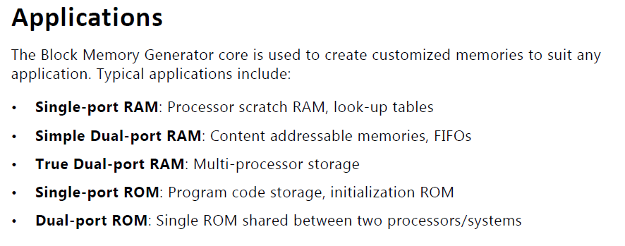
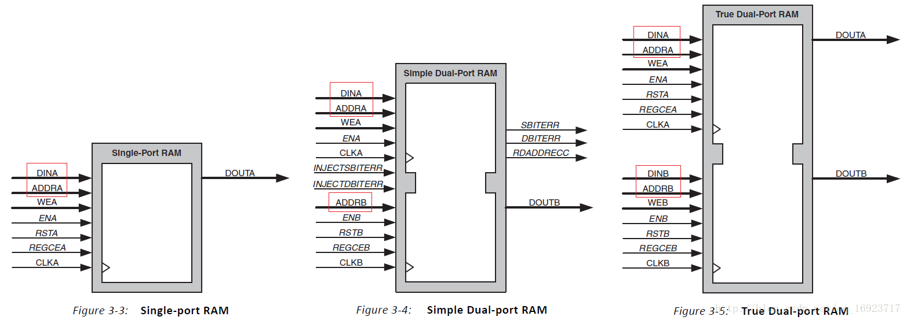
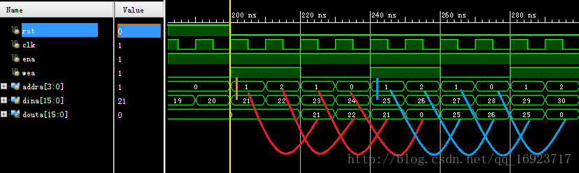
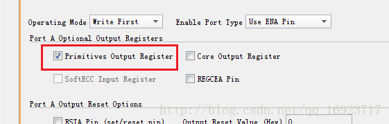
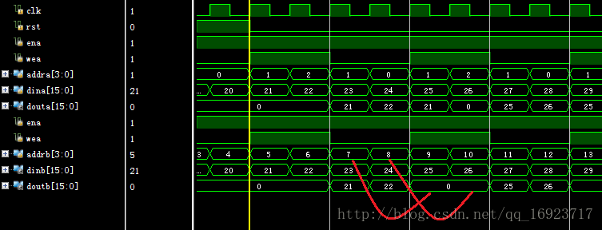
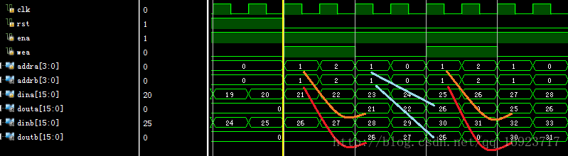
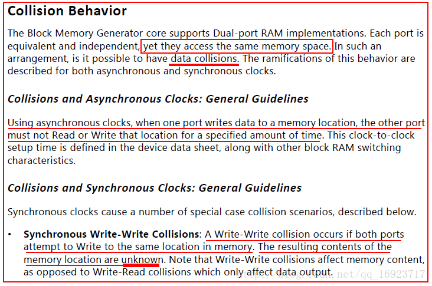
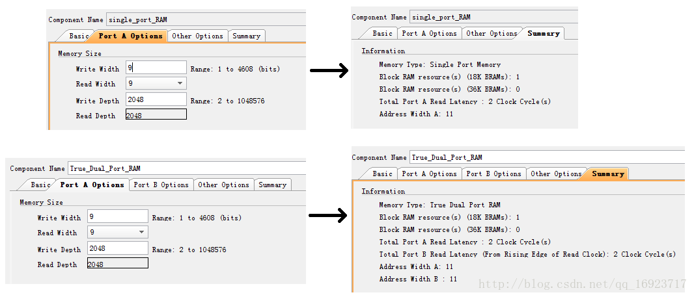
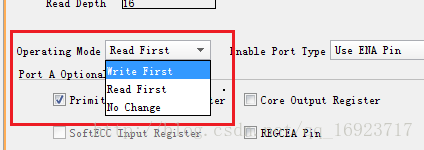

# 单端口和双端口RAM

- [ ] Version
    * [x] lhn
    * [x] 2024-01-24
    * [x] 单端口和双端口RAM
    * [ ] review

## Xilinx的BMG：单端口和双端口RAM的区别

真双口 RAM 有两个时钟（clka & clkb）、两组输入输出数据线（dina & douta & dinb & doutb）、两组地址线（addra & addrb），两个使能端（ena & enb）、两个写使能端（wea & web）。两个端口都可以进行读写操作（Port a 和 Port b 可以一起读或者一起写或者一个读一个写）。整体上，读、写可以同时进行。

BMG即Block Memory Generator，是Xilinx配置BRAM的IP核，可将BRAM配置成如图所示的5种类型

RAM分三种，单端口RAM、伪双端口RAM（Simple Dual）和双端口RAM（True Dual），它们之间的区别是什么呢？先看看它们的接口。

可以看到它们的接口区别

| RAM类型      | 官方解释 | 数据读写接口数量    |  地址接口数量  |
| :---        |    :----:   |          ---: |          ---: |
| 单端口      | 允许通过一个端口对存储进行读写访问      | 1  |   1   |
| 伪双端口   | 提供了两个端口A和B，通过端口A进行写访问，通过端口B进行读访问 | 1    | 2 |
| 双端口   | 提供两个端口A和B，这两个端口都可以对存储进行读写访问 | 2   | 2 |

**伪双端口RAM**很好理解，相当于读写分开，addra、dina和wea完成写，addrb和doutb完成读，你读你的，我写我的，互不干扰。
**单端口RAM**的通过一个端口对存储进行读写访问是什么意思呢？通过下图的仿真可以看到，数据读端口douta一直都有输出对应地址的数据，当wea拉高时，会将数据写入对应的地址，因为该仿真选择的Operating Mode是Write First，所以wea拉高时douta输出的数据与此时写入的数据是一致的。所以单端口RAM的读写不能同时进行，在读的时候需要重新生成对应的读地址给addra，并且disable掉wea。

输出douta对应地址addra的延时为2个时钟周期，这是因为默认勾选了Output Register选项的原因，RAM在输出前打了一拍，如果去掉这个选项，延时则变为1个时钟周期。

**双端口RAM**有两个端口独立，那它们是操作不同的Memory还是操作同一个Memory呢？如果是同一个Memory不会冲突吗？先看第一个仿真，仿真条件如下：

* 写使能web与wea相同

* 地址addra和addrb不同

* 输入数据dina和dinb相同

从图中可以看到addra和addrb都同时在访问Memory，因为地址不同，所以好像没有什么冲突，那如果他们同时操作一个地址会怎么样呢？

* 写使能web与wea相同

* 地址addra和addrb相同

* 输入数据dina和dinb不同

从曲线看端口A和B好像是操作的不同的Memory，而注意看直线的话，会发现在wea拉高时，端口A向地址1写的是21，端口B向地址1写的是26，而wea拉低时，端口A输出的却是26，这里就可以确认端口A和B访问的是同一块Memory了。

所以通过以上仿真我们得到的结论是双端口其实是两组地址对同一块Memory进行读写。

仿真里看到当两个端口同时写一个地址的时候，写入该地址的是端口B的数据，但仿真毕竟不是真实的情况，实际上是该地址的结果是未知的。ug058里有提到

pg058中还有这么一段话：

The Simple Dual-Port RAM is like a true dual-port RAM where only the Write interface of the A port and the Read interface of B port are connected.

所以对于双端口RAM，我们在外部控制的时候如果只把A端口用作写，B端口用作读，那其实就和伪双端口RAM一样了。

所以结论是：

无论是单端口RAM、伪双端口RAM还是双端口RAM，他们都只有一块Memory，通过下图同样深度和宽度设置的单端口和双端口RAM的资源消耗也可以说明。并且他们都是通过寻址的方式访问这块Memory，区别对应Memory的接口数量不同，也即是所谓的端口不同。

**寻址**就是输入地址，输出对应地址中存储的数据，且如果写使能wea有效，则同时将与该地址同步的输入端din的数据写入该地址。同时读写的时候会有冲突，该冲突的解决方式与选择的Operating Mode有关，详情请查看Xilinx产品指南pg058。

!!! summary
    **单端口RAM**只有一个地址接口addra，对应有一对读写的数据接口dina和douta；
    
    **伪双端口RAM**有两个地址接口addra和addrb，但却只有一对读写的数据接口dina和doutb，所以叫他伪双端口；
    
    **双端口RAM**则拥有两个地址接口，并且每个地址接口都有对应的读写数据接口，所以叫真双端口RAM，真双端口RAM支持两个端口同时对Memory进行访问，有效的提高了访问速度。同样的，对于双端口的ROM，我们可以通过两个端口同时读取ROM中的数据，所以如果两个processor是访问同样的一组数据的话，就不需要例化两个相同的ROM了。