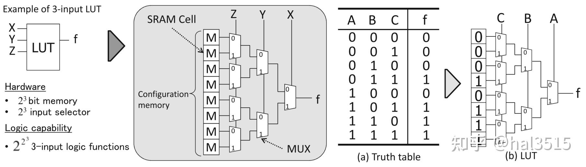
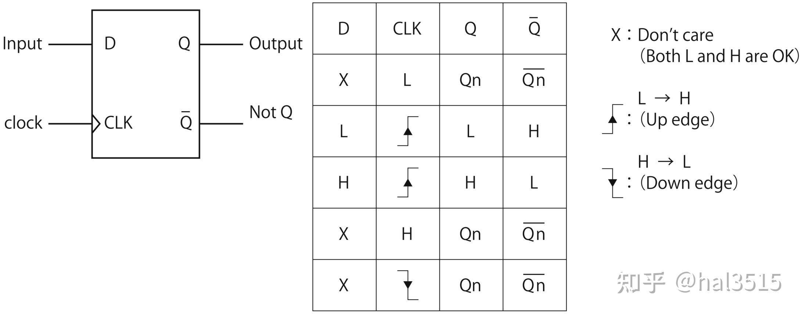
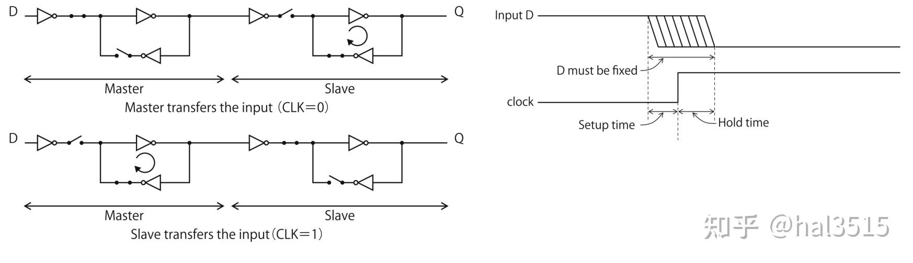
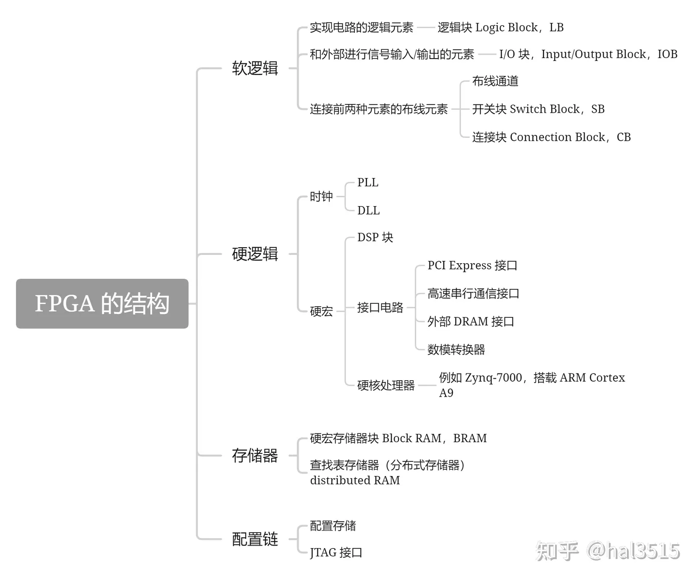
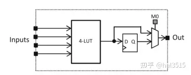
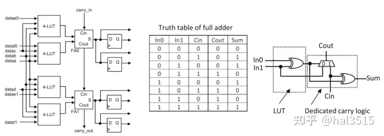
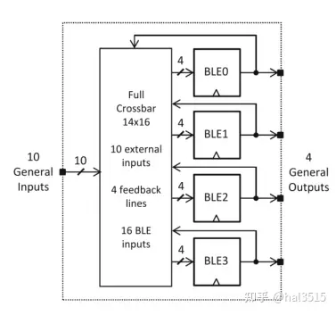
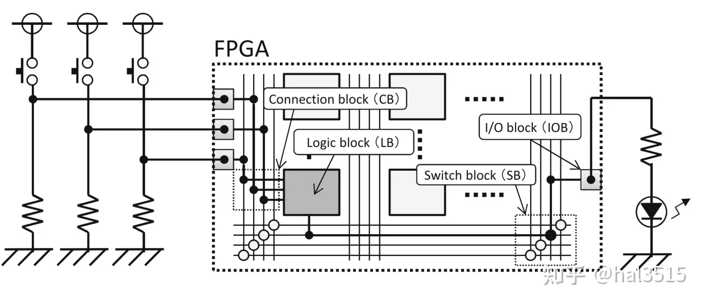

# 深入理解 FPGA 的基础结构
- [ ] Version
    * [x] LHN
    * [x] 2023-8-6 
    * [x] learning something about fpga
    * [ ] review

!!! info
    * 查找表(LUT)
    * D触发器

## FPGA的两个基本单元

组成 FPGA 的两个最基本的部分是组合逻辑以及时序逻辑，分别实现这两个基本部分的结构就是 FPGA 的基本单元。组合逻辑部分一般采用查找表（Look-Up-Table，LUT）的形式，时序逻辑部分一般采用触发器（Flip-Flop，FF）的形式。

### 组合逻辑的基本单元

根据数电中的知识，任何一个组合逻辑都可以表示成真值表的形式（逻辑输入对应逻辑输出），也就是任意的真值表所反映的内容都能由组合逻辑实现，查找表（LUT）就能完成这个任务。

这张图给出了一个 3 输入的查找表，可以实现任意 3 输入的逻辑函数。一般 k 输入的查找表由$2^k$个 SRAM 单元和一个$2^k$输入的数据选择器组成，可以实现$2^{2^k}$种逻辑函数。

!!! example
    例如：k = 2 时为 16 种，k = 3 时为 256 种，k = 4 时为 65536 种逻辑函数。右边这张图给出 AB + AC + BC 的一个逻辑示例，使用查找表时需要先根据查找表的输入对真值表进行转换，然后将数值栏（f 栏）直接写入配置内存。当所要实现的逻辑函数的输入数比查找表的输入数多时，可以联合使用多个查找表来完成。

### 时序逻辑的基本单元

时序逻辑的基本单元采用 D 触发器，这种触发器是一种在时钟的上升沿（或下降沿）将输入信号的变化转送至输出的边沿触发器。

这里需要简单说明一下 D-FF 的原理，因为理解这件事才可以更好的理解建立时间与保持时间的概念。

左边这张图是 D-FF 的原理图。当 CLK=0 时，主锁存器工作，将输入信号从 D 保存进来，输出信号 Q 不变；当 CLK=1 时，从锁存器工作，将主锁存器保存的信号输出到 Q，输入信号被隔断，因此不发生变化。由于这个过程中的传输门的工作不是完全理想的，因此就会需要建立时间与保持时间这两个概念。

* **建立时间（setup-time）**：如果在 CLK=0 时，由于门的传输延时，输入信号没有稳定的保存到主锁存器中，那么当 CLK 从 0 变到 1，输入关闭，输出打开时，主锁存器就只能给输出端口提供一个不稳定的信号。为了避免这种情况的发生，需要输入信号在上升沿到来前已经稳定。

* **保持时间（hold-time）**：当 CLK 从 0 变到 1，由于门的传输延时，门不可能立刻关闭，如果此时发生输入信号的变化，那当门关闭后实际保存的信号就可能是变化后的信号（相当于下一时刻的信号将我们需要的当前信号覆盖了）。为了避免这种情况的发生，需要输入信号在上升沿到来后保持一段时间的稳定。

## FPGA的结构

### 软逻辑

#### 逻辑块 (Logic Blocks)

逻辑块是 FPGA 中用于实现用户定义的逻辑功能的基本单元。逻辑块通常包含以下部分：

* 查找表 (Lookup Tables, LUTs)：这是一种用作数字记忆体的组件，可以实现任意的组合逻辑函数。一个典型的LUT可以有几个输入和一个输出，通过配置其内部存储的位来定义输出对各种输入组合的响应。
* 触发器 (Flip-flops, FFs)：用于存储状态信息，实现时序逻辑。
* 逻辑单元 (Logic Units)：可能还包括其他逻辑运算单元，如加法器或多路选择器等。
* 局部互连 (Local Interconnects)：逻辑块内部的连接资源，用于将LUTs、FFs和其他逻辑单元相互连接，以及与外部逻辑块连接。

一个逻辑块可以被配置来执行简单的逻辑操作（如AND、OR等），也可以组合起来实现更复杂的功能，比如加法器或者寄存器。

!!! note
    逻辑块的结构如下：

    大部分的逻辑块的基本要素都包含基本逻辑单元 BLE （Basic Logic Element）。BLE 由实现组合电路的查找表，实现时序电路的触发器，以及数据选择器构成。数据选择器在存储单元 M0 的控制下决定直接输出查找表的值还是输出 FF 中存储的值。

    

    为了提高算术运算电路的性能，FPGA 逻辑块中还包含专用的进位电路。

    

    左图中两个全加器（Full Adder，FA）为专用进位逻辑，FA0 的进位输入（carry_in）连接到相邻逻辑块的进位输出（carry_out）。这条路径称为高速进位链，可以为多位算术运算提供高速的进位信号传输。右图是 Xilinx 公司 FPGA 的专用进位逻辑，Xilinx 没有设计专用的全加器电路，而是使用查找表和进位生成电路的组合来实现加法。

    为了在不增加查找表输入数的前提下提高逻辑块的功能性，设计了逻辑簇结构。

    

    逻辑簇的最大优势就是在增加逻辑块功能性的同时又不会大幅影响 FPGA 的整体面积。查找表的面积会随着输入 k 的增大呈指数级增长，而增加逻辑簇中 BLE 的数量 N，逻辑块的面积只按二次函数增长。

#### IO 块 (Input/Output Blocks)
IO 块是FPGA中的接口单元，负责连接外部信号到FPGA内部的逻辑块以及反向操作。IO块的主要组成部分包括：

* 引脚 (Pins)：物理连接点，用于连接FPGA与外部世界。
* 缓冲器 (Buffers)：用于信号电平转换，提供驱动能力，或者用来防止信号回流。
* 配置逻辑 (Configurable Logic)：用于设置引脚的工作模式，如输入、输出或双向模式；并配置其他参数，如电压水平、驱动强度、施密特触发器选项等。

#### 开关块 (Switch Block)
开关块主要负责 FPGA 内部逻辑块之间的信号路由

#### 连接块 (Connection Block)
连接块更多地涉及 IO 引脚与 FPGA 内部逻辑之间的连接。

#### 可重复逻辑模块（tile）
相邻的逻辑块、连接块、开关块组成一个可重复逻辑模块（tile）

### 硬逻辑
