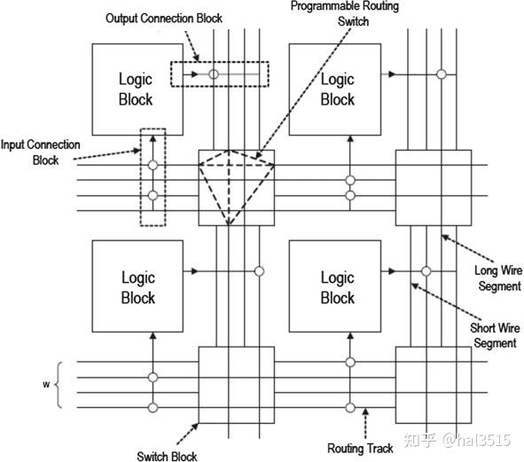
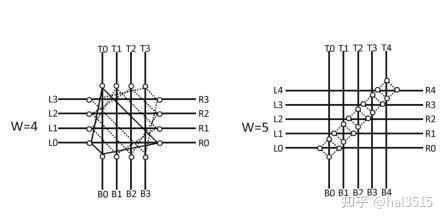
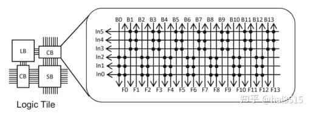
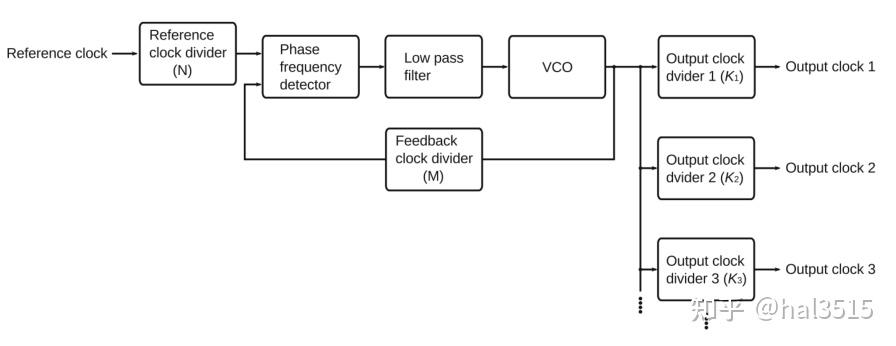
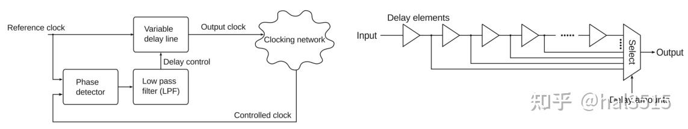

# 深入理解 FPGA 的基础结构
- [ ] Version
    * [x] LHN
    * [x] 2023-8-6 
    * [x] learning something about fpga
    * [ ] review

!!! info
    * 查找表(LUT)
    * D触发器

## FPGA的两个基本单元

组成 FPGA 的两个最基本的部分是组合逻辑以及时序逻辑，分别实现这两个基本部分的结构就是 FPGA 的基本单元。组合逻辑部分一般采用查找表（Look-Up-Table，LUT）的形式，时序逻辑部分一般采用触发器（Flip-Flop，FF）的形式。

### 组合逻辑的基本单元

根据数电中的知识，任何一个组合逻辑都可以表示成真值表的形式（逻辑输入对应逻辑输出），也就是任意的真值表所反映的内容都能由组合逻辑实现，查找表（LUT）就能完成这个任务。

这张图给出了一个 3 输入的查找表，可以实现任意 3 输入的逻辑函数。一般 k 输入的查找表由$2^k$个 SRAM 单元和一个$2^k$输入的数据选择器组成，可以实现$2^{2^k}$种逻辑函数。

!!! example
    例如：k = 2 时为 16 种，k = 3 时为 256 种，k = 4 时为 65536 种逻辑函数。右边这张图给出 AB + AC + BC 的一个逻辑示例，使用查找表时需要先根据查找表的输入对真值表进行转换，然后将数值栏（f 栏）直接写入配置内存。当所要实现的逻辑函数的输入数比查找表的输入数多时，可以联合使用多个查找表来完成。

### 时序逻辑的基本单元

时序逻辑的基本单元采用 D 触发器，这种触发器是一种在时钟的上升沿（或下降沿）将输入信号的变化转送至输出的边沿触发器。

这里需要简单说明一下 D-FF 的原理，因为理解这件事才可以更好的理解建立时间与保持时间的概念。

左边这张图是 D-FF 的原理图。当 CLK=0 时，主锁存器工作，将输入信号从 D 保存进来，输出信号 Q 不变；当 CLK=1 时，从锁存器工作，将主锁存器保存的信号输出到 Q，输入信号被隔断，因此不发生变化。由于这个过程中的传输门的工作不是完全理想的，因此就会需要建立时间与保持时间这两个概念。

* **建立时间（setup-time）**：如果在 CLK=0 时，由于门的传输延时，输入信号没有稳定的保存到主锁存器中，那么当 CLK 从 0 变到 1，输入关闭，输出打开时，主锁存器就只能给输出端口提供一个不稳定的信号。为了避免这种情况的发生，需要输入信号在上升沿到来前已经稳定。

* **保持时间（hold-time）**：当 CLK 从 0 变到 1，由于门的传输延时，门不可能立刻关闭，如果此时发生输入信号的变化，那当门关闭后实际保存的信号就可能是变化后的信号（相当于下一时刻的信号将我们需要的当前信号覆盖了）。为了避免这种情况的发生，需要输入信号在上升沿到来后保持一段时间的稳定。

## FPGA的结构

### 软逻辑

#### 逻辑块 (Logic Blocks)

逻辑块是 FPGA 中用于实现用户定义的逻辑功能的基本单元。逻辑块通常包含以下部分：

* 查找表 (Lookup Tables, LUTs)：这是一种用作数字记忆体的组件，可以实现任意的组合逻辑函数。一个典型的LUT可以有几个输入和一个输出，通过配置其内部存储的位来定义输出对各种输入组合的响应。
* 触发器 (Flip-flops, FFs)：用于存储状态信息，实现时序逻辑。
* 逻辑单元 (Logic Units)：可能还包括其他逻辑运算单元，如加法器或多路选择器等。
* 局部互连 (Local Interconnects)：逻辑块内部的连接资源，用于将LUTs、FFs和其他逻辑单元相互连接，以及与外部逻辑块连接。

一个逻辑块可以被配置来执行简单的逻辑操作（如AND、OR等），也可以组合起来实现更复杂的功能，比如加法器或者寄存器。

!!! note
    逻辑块的结构如下：

    大部分的逻辑块的基本要素都包含基本逻辑单元 BLE （Basic Logic Element）。BLE 由实现组合电路的查找表，实现时序电路的触发器，以及数据选择器构成。数据选择器在存储单元 M0 的控制下决定直接输出查找表的值还是输出 FF 中存储的值。

    

    为了提高算术运算电路的性能，FPGA 逻辑块中还包含专用的进位电路。

    

    左图中两个全加器（Full Adder，FA）为专用进位逻辑，FA0 的进位输入（carry_in）连接到相邻逻辑块的进位输出（carry_out）。这条路径称为高速进位链，可以为多位算术运算提供高速的进位信号传输。右图是 Xilinx 公司 FPGA 的专用进位逻辑，Xilinx 没有设计专用的全加器电路，而是使用查找表和进位生成电路的组合来实现加法。

    为了在不增加查找表输入数的前提下提高逻辑块的功能性，设计了逻辑簇结构。

    

    逻辑簇的最大优势就是在增加逻辑块功能性的同时又不会大幅影响 FPGA 的整体面积。查找表的面积会随着输入 k 的增大呈指数级增长，而增加逻辑簇中 BLE 的数量 N，逻辑块的面积只按二次函数增长。

#### IO 块 (Input/Output Blocks)
IO 块是FPGA中的接口单元，负责连接外部信号到FPGA内部的逻辑块以及反向操作。IO块的主要组成部分包括：

* 引脚 (Pins)：物理连接点，用于连接FPGA与外部世界。
* 缓冲器 (Buffers)：用于信号电平转换，提供驱动能力，或者用来防止信号回流。
* 配置逻辑 (Configurable Logic)：用于设置引脚的工作模式，如输入、输出或双向模式；并配置其他参数，如电压水平、驱动强度、施密特触发器选项等。

#### 布线元素的结构

连接逻辑块和布线通道的连接块（CB）有输入用和输出用两种，纵向和横向布线通道的交叉处有开关块（SB）。

##### 开关块 (Switch Block)
开关块位于横向和纵向布线通道的交叉处，通过可编程开关来控制布线路径。下面给出不相交型开关块的拓扑图，白色圆点相连部分有可编程开关，T0，R0，B0，L0 这四个端口之间可以相互连接，其余类似。

##### 连接块 (Connection Block)
连接块也由可编程开关构成，其功能是连接布线通道和逻辑块的输入/输出。需要注意的是，单纯采用全交叉开关矩阵来实现，连接块的面积就会非常大，因此一般使用节省掉一些开关的稀疏矩阵来实现。上面这个示意图中的连接块由单向线组成，包括正向连线 14 根，反向连线 14 根以及 6 个逻辑块的输入。

#### 可重复逻辑模块（tile）
相邻的逻辑块、连接块、开关块组成一个可重复逻辑模块（tile）

### 硬逻辑

在FPGA中，硬逻辑指的是那些固化在芯片上、性能和功能都已经确定不变的部分。

#### PLL （PhaseLocked Loop）

生成时钟信号的核心部分是压控传感器 VCO，VCO 是能根据所加的电压调整频率的振荡器。鉴相器可以比较外部输入的基准时钟和 VCO 自身输出时钟间的相位差。如果两个时钟一致则维持 VCO 电压；如果不一致则需要通过控制电路对 VCO 电压进行调整，最终让输出时钟和基准时钟达到一致。为了让输出时钟的频率具有一定的选择性，因此增加参考时钟分频器 N，反馈时钟分频器 M，输出时钟分频器 $K_i$，并且可以得到基准频率和输出频率的关系如下：

$$F_i= \frac{M}{N*K_i}*F_{ref}$$

!!! tip
    PLL主要由三个基本部分组成：

    1、相位比较器（Phase Detector, PD）：

    * 作用：相位比较器负责比较输入信号与由VCO（电压控制振荡器）产生的反馈信号之间的相位差异，并且将这种差异转换为电压或电流的形式。如果两个信号的相位不一致，相位比较器产生一个误差信号，该信号的极性和大小取决于相位差的方向和幅度。

    2、环路滤波器（Loop Filter, LF）：

    * 作用：环路滤波器对来自相位比较器的误差信号进行处理，通常是平滑处理以去除噪声或高频成分。其目标是产生一个稳定的控制电压供给VCO，以便调整其频率。滤波器的设计对PLL的稳定性、动态响应特性及最终能够跟踪到的相位误差有着重要的影响。
    
    3、电压控制振荡器（Voltage-Controlled Oscillator, VCO）：

    * 作用：VCO接收环路滤波器输出的控制电压，并根据该电压产生一个特定频率的输出信号。当控制电压改变时，VCO的输出频率也会相应地增加或减少。VCO的输出又被送回到相位比较器进行反馈，形成一个闭环控制系统。

#### DLL （Delaylocked Loop）

DLL 的作用是消除分配时钟与参考时钟之间存在相位差。工作原理是在参考时钟（Reference Clock）和反馈时钟（Controlled Clock）之间插入延迟，直到两个时钟的上升边缘对齐，使两个时钟错位360度 (意味着它们是同步的)。右图是一个可变延迟线的示意图，可以通过选择器选择所需延迟量的路径，从而控制具体的延迟量。DLL 网络也可以进行分频，具体的方式与 PLL 相同。

### 存储结构

#### 硬宏存储器

硬宏型存储器被称为块存储器（Block RAM，BRAM），实现方法就是以硬宏的形式在架构中嵌入存储器块。

#### 查找表存储器

查找表存储器被称为分布式存储器（Distributed RAM，分布式 RAM），使用 SLICEM 逻辑块查找表中的真值表作为小型的存储器，能实现 BRAM 不能实现的异步访问，但是一般需要小规模存储器时才采用这种方法（不能占用太多的用来实现逻辑的查找表资源）。

!!! note
    当LUT被用作存储器时，其工作原理如下：

    在编程阶段，会将所需的数据模式加载到LUT的存储单元中。
    在运行阶段，输入地址（相当于普通RAM中的地址线）会选择对应的存储单元并检索存储的数据。
    数据可以通过LUT的输出立即获得，因此访问时间很短。
    由于LUT的大小固定，因此利用LUT实现的存储器也具有固定的容量。例如，一个4位LUT能够存储16位信息；每个输入组合指向一个唯一的存储位置。这样的存储方式特别适用于需要快速访问小量数据的情况，如查找表、状态机的状态存储、小型缓存等。

### 配置链

将电路编程到 FPGA 上的过程叫做配置，向 FPGA 写入的电路信息叫做配置数据。配置数据中包含在 FPGA 上实现电路的所有信息，比如查找表中真值表的数据、开关块中各个开关的开闭状态等。

#### 配置存储器

FPGA 需要一种在芯片上存储配置数据的机制，一般采用 SRAM 存储配置信息。优点是没有重写次数的限制，但 SRAM 是易失性存储器，断电后 FPGA 上的电路信息会丢失。因此一般需要在芯片外部另行准备非易失存储器，在上电时自动将配置信息写入 FPGA。

#### JTAG 接口 
使用 JTAG 接口进行配置时，要先将配置数据一位一位序列化，再通过边界扫描用的移位寄存器写入 FPGA。这条移位寄存器的路径就称为配置链。