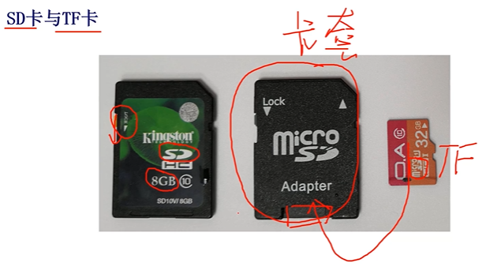
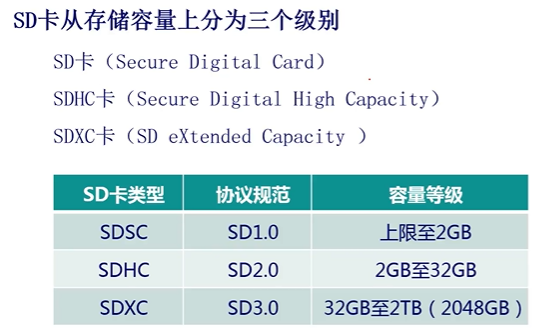
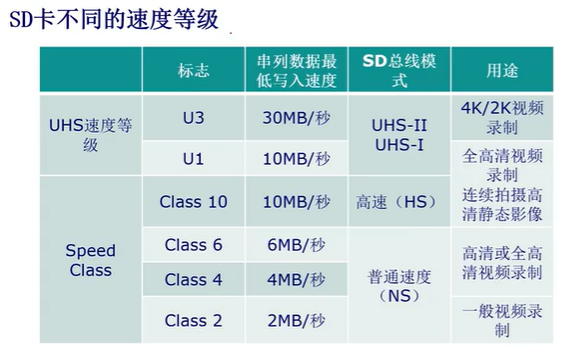
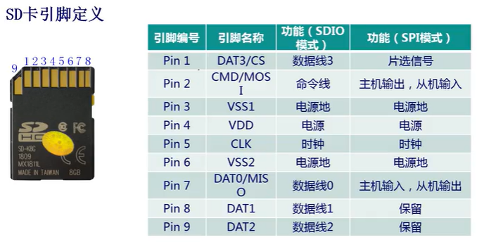
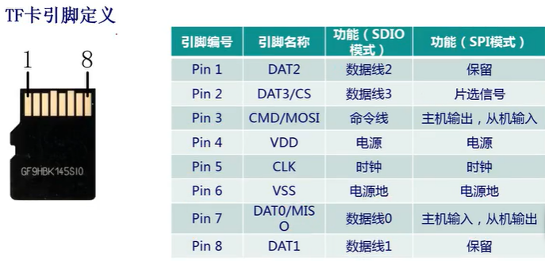
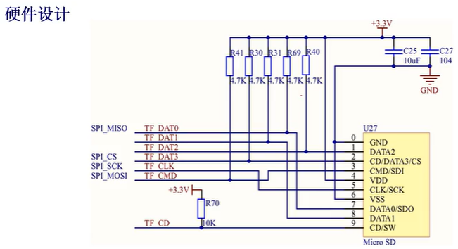

# 【Verilog SD卡读取器】SD卡简介

- [ ] Version
    * [x] linhuangnan
    * [x] 2024-02-14 
    * [x] Verilog SD卡读取器
    * [ ] review

!!! info
    * SD卡概述
    * SD卡引脚定义
    * SD卡文件系统

## SD卡概述

### 概述
SD卡（Secure Digital Card--安全数字卡）一般是指大卡，上面标记着丝印SD，大的SD卡一般用在数码相机上。

手机上使用的一般是Micro SD卡，也叫TF卡，一般用于便携式设备上。

特点是体积小，容量大，传输速度快，支持热插拔。

SD卡上有个lock标记，按下可以支持写保护，TF卡没有lock标记。

SD卡在MMC(MultiMedia Card,多媒体卡)的基础上发展而来，增加了更高的安全性和更快的读写速度。

### SD卡分类

近年来6K/8K/全景视频规格的提出，以及未来VR领域无限应用的可能，SD协会正式发布了全新的SD5.0标准。最大的变化是新增了视频速度等级标准（Vedio Speed Class）。

## SD卡引脚定义

SD卡支持两种模式，一种是`SDIO模式`，另一种是`SPI模式`。引脚定义如下图所示：

**SD卡默认工作在SD模式下，如果想让其工作在SPI模式下，需要做一些初始化配置。**

**SDIO模式有4根数据线，因此传输速度更快**

开发板硬件原理图如下：

9号引脚CD信号为卡检测信号，当SD卡的座子没有连接TF卡时，CD被上拉到高电平，当TF卡插入时，CD引脚连接到GND，变为低电平。

## SD卡文件系统

### 什么是文件系统
负责管理和存储文件信息的软件机构称为文件管理系统，简称文件系统。即在磁盘上组织文件的方法。

!!! 常用的文件系统
    * FAT/FATFS
    * NTFS:基于安全性的文件系统，是Windows NT所采用的独特的文件系统结构
    * CDFS: CDFS是大部分的光盘的文件系统
    * exFAT