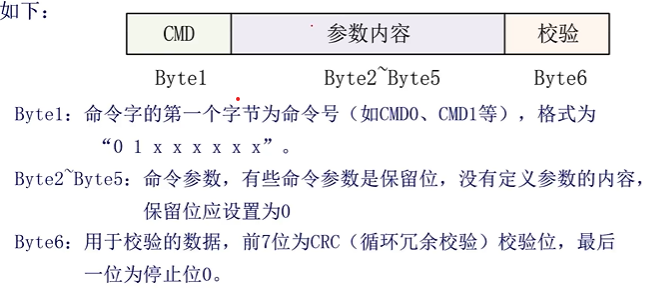
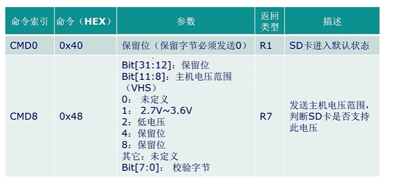
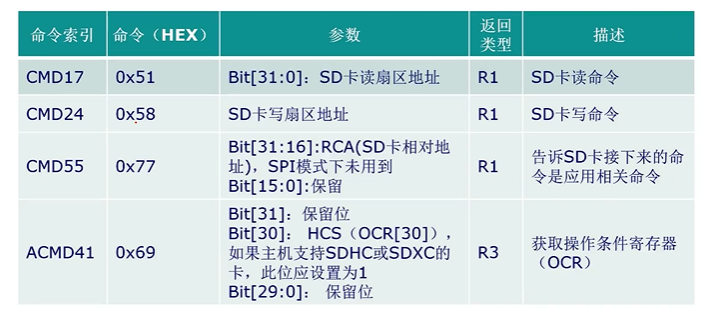
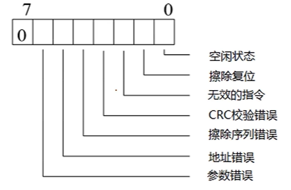
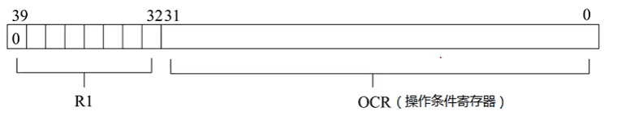
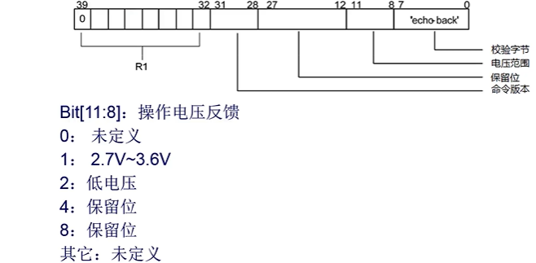

# 【Verilog SD卡读取器】SD卡常用命令

- [ ] Version
    * [x] linhuangnan
    * [x] 2024-02-15 
    * [x] Verilog SD卡读取器
    * [ ] review

!!! info
    * SD卡常用命令解析
    * SD卡返回命令解析

## 1、SD卡常用命令解析

### 1.1 SD卡写入命令格式
SD卡的命令格式由6个字节组成，发送数据时高位在前，SD卡的写入命令格式如下：

!!! note
    以发送`CMD55`命令为例
    
    55为十进制，因此把55转换为十六进制则为37，即为00111111。
    
    而命令的前两位固定是01，因此CMD55命令其实发送的是01111111。

!!! note
    SDIO模式下要求对前面的字节进行校验，而SPI模式下并不要求对前面的数据进行校验，因此Byte6可以是任意值。

    但是SD卡默认是SDIO模式，因此发送初始化命令CMD0是需要对前面的五个字节的数据进行校验的，同理CMD8也需要进行校验。

### 1.2 SD卡的常用命令

SD卡的常用命令总结如下：

!!! note
    CMD8命令参数的Bit[7:0]是校验字节，假如发送0xAA，那么R7类型的返回消息中也会返回0xAA。
    
    且仅SD2.0协议支持该命令。

!!! note
    CMD55其实是告诉SD卡，接下来要发送的是应用相关的命令。比方说先发送CMD55,再发送CMD41，其实SD卡解析到的命令是ACMD41。

!!! note
    ACMD41命令返回的R3类型的消息，其实是在告诉FPGA，SD卡是否有初始化成功。我们初始化时可以通过循环发送CMD55和CMD41命令来判断FPGA是否已经初始化成功了。

## 2、SD卡返回命令解析

**SD卡返回R1命令格式如下**

**SD卡返回R3命令格式如下**

**SD卡返回R7命令格式如下**

  

