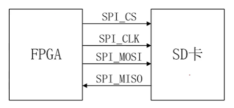
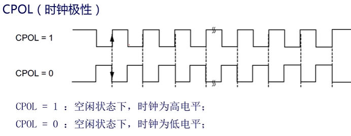
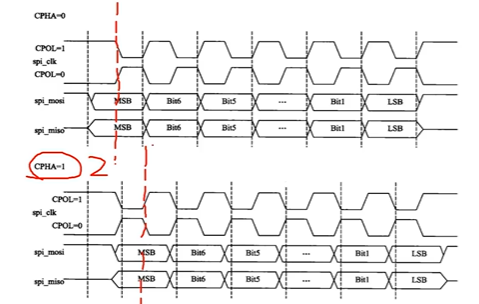

# 【Verilog SD卡读取器】SPI接口与时序

- [ ] Version
    * [x] linhuangnan
    * [x] 2024-02-15 
    * [x] Verilog SD卡读取器
    * [ ] review

!!! info
    * SPI接口
    * SPI时序

## 1、SPI接口

### 1.1 SPI协议简介
SPI：Serial Peripheral Interface

串行外围设备接口

是一种`高速`、`全双工`、`同步`的通信总线

SPI在芯片管脚上只占用了四根线(CS、CLK、MISO、MOSI)，节约了芯片的管脚，主要应用在FLASH，还有数字信号处理器和数字信号解码器之间。

!!! note

    SPI和UART还有I2C的区别

    SPI和I2C都有CLK，属于同步的通信。而UART只有TX和RX两根线，没有CLK，属于异步的通信。

    I2C只有CLK和DATA两个数据线，因此是半双工的通信，通信速率小于SPI

### 1.2 SPI和外部器件的连接

SPI的通信原理比较简单，它以主从方式工作，通常有一个主设备（此处指FPGA）和一个或多个从设备（此处指SD卡）。

## 2、SPI时序

### 2.1 SPI通信模式

SPI的通信模式是由CPOL（时钟极性）和CPHA（时钟相位）来决定的，四种通信模式如下：

模式0：CPOL = 0,CPHA = 0;

模式1：CPOL = 0,CPHA = 1;

模式2：CPOL = 1,CPHA = 0;

模式3：CPOL = 1,CPHA = 1;

如果时钟极性CPOL=0，串行同步时钟的空闲状态为低电平；如果CPOL=1，串行同步时钟的空闲状态为高电平。

如果时钟极性CPHA=0，在串行同步时钟的第一个跳变沿（上升或下降）数据被采样；如果CPHA=1，在串行同步时钟的第二个跳变沿（上升或下降）数据被采样。

!!! note
    SD卡固定采用通信模式3，即CPOL = 1,CPHA = 1，即时钟在空闲状态下为高电平，且在同步时钟的第二个跳变沿被采样。

    **从时序图中可以看出，MOSI和MISO上面的数据在时钟的上升沿被采样，因此我们需要在时钟的下降沿更新数据**

    片选信号为低电平有效，数据传输需要在片选信号为低电平时进行。

    在SD2.0版本的协议中，SPI_CLK时钟频率可以达到50MHz。

    **SD卡也是在时钟的下降沿改变MISO数据线上面的值，因此FPGA要在时钟的上升沿对MISO数据线进行采样**

