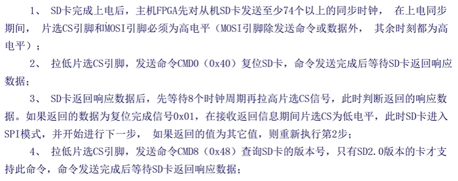
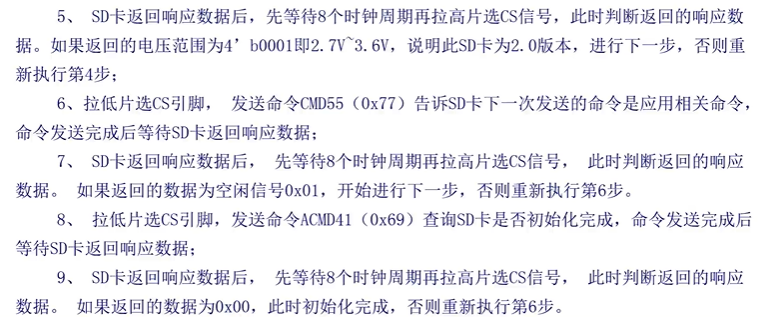
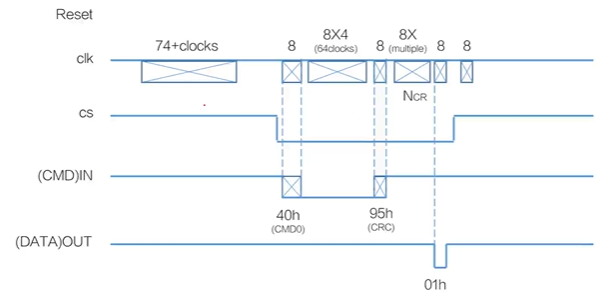
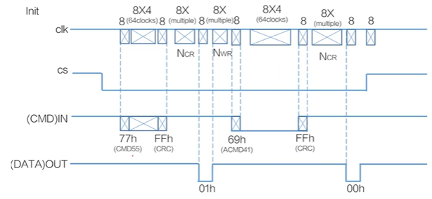
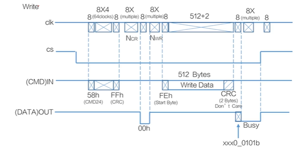
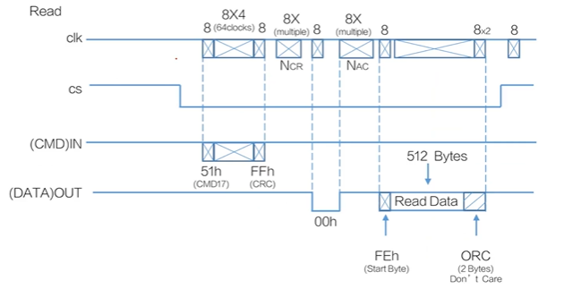

# 【Verilog SD卡读取器】SD卡的操作时序

- [ ] Version
    * [x] linhuangnan
    * [x] 2024-02-15 
    * [x] Verilog SD卡读取器
    * [ ] review

!!! info
    * SD卡初始化操作时序
    * SD卡读写操作时序

## 1、SD卡初始化操作时序

### 1.1 确定SD卡类型

只有SD2.0协议版本的SD卡才支持CMD8命令，所以响应此命令的SD卡可以判断为SD2.0版本协议的卡，否则为SD1.0版本协议的SD卡或者MMC卡；

对于CMD8无响应的情况，可以发送CMD55+CMD41命令，如果返回0，则表示SD1.0协议初始化成功，如果返回错误，则确定为MMC卡；在确定为MMC卡后，继续向卡发送CMD1命令，如果返回0，则MMC卡初始化成功，否则判断为错误卡。

### 1.2 SD卡初始化步骤（默认是SD2.0协议）

!!! note
总而言之

1、先发送CMD0（初始化SD卡）

2、再发送CMD8（确认是SD2.0版本协议的卡），循环发送直至响应成功

3、再发生CMD55+CMD41（确认初始化成功），循环发送直至响应成功

时序图如下：

SD卡复位的时序图如下

**注意：8*4是32个时钟，时序图中64应该改为32个时钟。**

NCR为不确定，因为要等待SD卡返回，不确定有多少个时钟周期。

SD卡初始化时序图如下（发送CMD8的时序图省略）

**注意：8*4是32个时钟，时序图中64应该改为32个时钟。**

**注意：SPI模式下只有CMD0和CMD8需要进行校验。**

## 2、SD卡读写操作时序

## 2.1 SD卡写操作时序

**注意：8*4是32个时钟，时序图中64应该改为32个时钟。**

**注意：写入数据需要先写入一个命令头FEh，然后写入512个字节，最后紧跟着两个字节的CRC校验值，然后SD卡会返回一个响应的字节，之后拉低MISO引脚，表示忙状态，直至MISO引脚拉高，表示SD卡进入空闲状态。**

## 2.2 SD卡读操作时序

**注：可以通过CMD16设置单个数据块的长度，比如1024，2048等等，这样增加返回数据的个数**

**注：可以通过CMD18来连续读出数据块**

!!! warning
    **注意，SD卡在初始化的时候，SPI_CLK的时钟频率不能超过400kHz，在初始化完成之后，再将SPI_CLK的时钟频率切换到SD卡的最大时钟频率即50MHz。**

