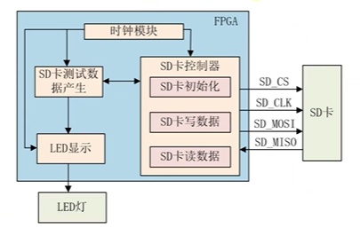
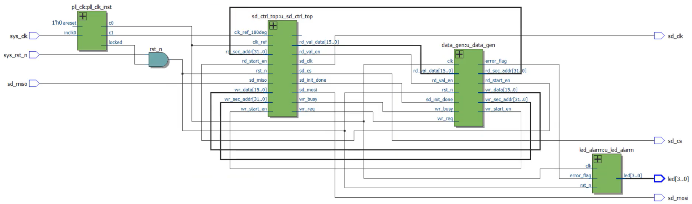

# 【Verilog SD卡读取器】SD卡读写测试实验模块框图

- [ ] Version
    * [x] linhuangnan
    * [x] 2024-02-15 
    * [x] Verilog SD卡读取器
    * [ ] review

!!! info
    * 系统框图
    * 顶层模块原理图

## 实验任务

使用FPGA开发板向SD卡指定的扇区地址中写入512个字节的数据，写完后将数据读出，并验证数据是否正确。

## 系统框图

实验的系统框图如下

时钟模块使用PLL产生两个50MHz的时钟，相位偏移为180°，一个时钟用作sd_clk，在sd_clk的上升沿采集数据，在另一个时钟的上升沿（对应sd_clk的下降沿）更新数据。

## 顶层模块原理图

顶层模块的原理图如下：

