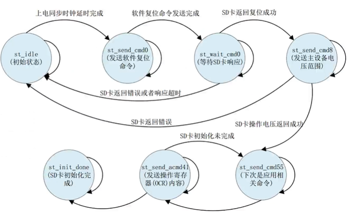
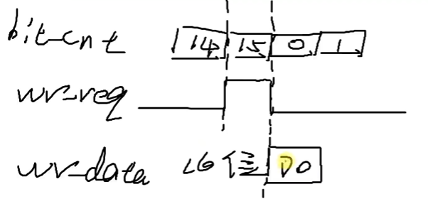

# 【Verilog SD卡读取器】SD卡控制器模块RTL代码(sd_init.v、sd_read.v、sd_write.v)

- [ ] Version
    * [x] linhuangnan
    * [x] 2024-02-15 
    * [x] Verilog SD卡读取器
    * [ ] review

!!! info
    * sd_init.v
    * sd_read.v
    * sd_write.v

## 1、SD卡初始化模块

```verilog
module sd_init(
    input          clk_ref       ,  //时钟信号
    input          rst_n         ,  //复位信号,低电平有效
    
    input          sd_miso       ,  //SD卡SPI串行输入数据信号
    output         sd_clk        ,  //SD卡SPI时钟信号
    output  reg    sd_cs         ,  //SD卡SPI片选信号
    output  reg    sd_mosi       ,  //SD卡SPI串行输出数据信号
    output  reg    sd_init_done     //SD卡初始化完成信号
    );

//parameter define
//SD卡软件复位命令,由于命令号及参数为固定值,CRC也为固定值,CRC = 8'h95
parameter  CMD0  = {8'h40,8'h00,8'h00,8'h00,8'h00,8'h95};
//接口状态命令,发送主设备的电压范围,用于区分SD卡版本,只有2.0及以后的卡才支持CMD8命令
//MMC卡及V1.x的卡,不支持此命令,由于命令号及参数为固定值,CRC也为固定值,CRC = 8'h87
parameter  CMD8  = {8'h48,8'h00,8'h00,8'h01,8'haa,8'h87};
//告诉SD卡接下来的命令是应用相关命令，而非标准命令, 不需要CRC
parameter  CMD55 = {8'h77,8'h00,8'h00,8'h00,8'h00,8'hff};  
//发送操作寄存器(OCR)内容, 不需要CRC
parameter  ACMD41= {8'h69,8'h40,8'h00,8'h00,8'h00,8'hff};
//时钟分频系数,初始化SD卡时降低SD卡的时钟频率,50M/250K = 200 
parameter  DIV_FREQ = 200;
//上电至少等待74个同步时钟周期,在等待上电稳定期间,sd_cs = 1,sd_mosi = 1，保险起见发送5000个同步时钟
parameter  POWER_ON_NUM = 5000;
//发送软件复位命令时等待SD卡返回的最大时间,T = 100ms; 100_000us/4us = 25000
//当超时计数器等于此值时,认为SD卡响应超时,重新发送软件复位命令
parameter  OVER_TIME_NUM = 25000;
                        
parameter  st_idle        = 7'b000_0001;  //默认状态,上电等待SD卡稳定
parameter  st_send_cmd0   = 7'b000_0010;  //发送软件复位命令
parameter  st_wait_cmd0   = 7'b000_0100;  //等待SD卡响应
parameter  st_send_cmd8   = 7'b000_1000;  //发送主设备的电压范围，检测SD卡是否满足
parameter  st_send_cmd55  = 7'b001_0000;  //告诉SD卡接下来的命令是应用相关命令
parameter  st_send_acmd41 = 7'b010_0000;  //发送操作寄存器(OCR)内容
parameter  st_init_done   = 7'b100_0000;  //SD卡初始化完成

//reg define
reg    [6:0]   cur_state      ;
reg    [6:0]   next_state     ; 
                              
reg    [7:0]   div_cnt        ;    //分频计数器
reg            div_clk        ;    //分频后的时钟         
reg    [12:0]  poweron_cnt    ;    //上电等待稳定计数器
reg            res_en         ;    //接收SD卡返回数据有效信号，拉高表示已经接收到了SD返回的所有的数据
reg    [47:0]  res_data       ;    //接收SD卡返回数据，无论返回R1，R3或者R7，都统一当成返回6个字节来处理，最长是5个字节，多接收一个字节是为了多等8个时钟周期，这样接收完成之后就可以直接发送下一个命令了
reg            res_flag       ;    //当MISO拉低时，将res_flag拉高，表明开始接收返回数据
reg    [5:0]   res_bit_cnt    ;    //接收位数据计数器，用来计数接收了几位数据
                                   
reg    [5:0]   cmd_bit_cnt    ;    //发送指令位计数器
reg   [15:0]   over_time_cnt  ;    //超时计数器  
reg            over_time_en   ;    //超时使能信号 
                                   
wire           div_clk_180deg ;    //时钟相位和div_clk相差180度

//*****************************************************
//**                    main code
//*****************************************************

assign  sd_clk = ~div_clk;         //sd_clk，输出给sd_ctrl_top.v,进而输出给SD卡，在div_clk的上升沿采样数据
assign  div_clk_180deg = ~div_clk; //相位和DIV_CLK相差180度的时钟，在div_clk_180deg的上升沿改变CS信号和操作MOSI引脚上的数据

//时钟分频,div_clk = 250KHz
always @(posedge clk_ref or negedge rst_n) begin
    if(!rst_n) begin
        div_clk <= 1'b0;
        div_cnt <= 8'd0;
    end
    else begin
        if(div_cnt == DIV_FREQ/2-1'b1) begin
            div_clk <= ~div_clk;
            div_cnt <= 8'd0;
        end
        else    
            div_cnt <= div_cnt + 1'b1;
    end        
end

//上电等待稳定计数器
always @(posedge div_clk or negedge rst_n) begin
    if(!rst_n) 
        poweron_cnt <= 13'd0;
    else if(cur_state == st_idle) begin
        if(poweron_cnt < POWER_ON_NUM)
            poweron_cnt <= poweron_cnt + 1'b1;                   
    end
    else
        poweron_cnt <= 13'd0;    
end    

//接收sd卡返回的响应数据
//在div_clk_180deg(sd_clk)的上升沿锁存数据
//观察发现，无论返回R1,R3或者R7命令，最高位总是以0开始，因此可是通过判断MISO信号线拉低来开始接收响应数据
always @(posedge div_clk_180deg or negedge rst_n) begin
    if(!rst_n) begin
        res_en <= 1'b0;
        res_data <= 48'd0;
        res_flag <= 1'b0;
        res_bit_cnt <= 6'd0;
    end    
    else begin
        //sd_miso = 0 开始接收响应数据
        if(sd_miso == 1'b0 && res_flag == 1'b0) begin //res_flag复位之后就是低电平，因此只要sd_miso拉低之后，就意味着开始接收数据了
            res_flag <= 1'b1;
            res_data <= {res_data[46:0],sd_miso};
            res_bit_cnt <= res_bit_cnt + 6'd1;
            res_en <= 1'b0;
        end    
        else if(res_flag) begin
            //R1返回1个字节,R3 R7返回5个字节
            //在这里统一按照6个字节来接收,多出的1个字节为NOP(8个时钟周期的延时)
            res_data <= {res_data[46:0],sd_miso};     
            res_bit_cnt <= res_bit_cnt + 6'd1;
            if(res_bit_cnt == 6'd47) begin
                res_flag <= 1'b0;
                res_bit_cnt <= 6'd0;
                res_en <= 1'b1; 
            end                
        end  
        else
            res_en <= 1'b0;         
    end
end                    

//div_clk和sd_clk相差180°，在div_clk的上升沿改变MOSI引脚上面的数据

//第一段的状态机
always @(posedge div_clk or negedge rst_n) begin
    if(!rst_n)
        cur_state <= st_idle;
    else
        cur_state <= next_state;
end

//第二段状态机
always @(*) begin
    next_state = st_idle;
    case(cur_state)
        st_idle : begin
            //上电至少等待74个同步时钟周期
            if(poweron_cnt == POWER_ON_NUM)          //默认状态,上电等待SD卡稳定
                next_state = st_send_cmd0;
            else
                next_state = st_idle;
        end 
        st_send_cmd0 : begin                         //发送软件复位命令
            if(cmd_bit_cnt == 6'd47)
                next_state = st_wait_cmd0;
            else
                next_state = st_send_cmd0;    
        end               
        st_wait_cmd0 : begin                         //等待SD卡响应
            if(res_en) begin                         //SD卡返回响应信号
                if(res_data[47:40] == 8'h01)         //SD卡返回复位成功
                    next_state = st_send_cmd8;
                else
                    next_state = st_idle;
            end
            else if(over_time_en)                    //SD卡响应超时
                next_state = st_idle;
            else
                next_state = st_wait_cmd0;                                    
        end    
        //发送主设备的电压范围,检测SD卡是否满足
        st_send_cmd8 : begin 
            if(res_en) begin                         //SD卡返回响应信号  
                //返回SD卡的操作电压,[19:16] = 4'b0001(2.7V~3.6V)
                if(res_data[19:16] == 4'b0001)       
                    next_state = st_send_cmd55;
                else
                    next_state = st_idle;
            end
            else
                next_state = st_send_cmd8;            
        end
        //告诉SD卡接下来的命令是应用相关命令
        st_send_cmd55 : begin     
            if(res_en) begin                         //SD卡返回响应信号  
                if(res_data[47:40] == 8'h01)         //SD卡返回空闲状态
                    next_state = st_send_acmd41;
                else
                    next_state = st_send_cmd55;    
            end        
            else
                next_state = st_send_cmd55;     
        end  
        st_send_acmd41 : begin                       //发送操作寄存器(OCR)内容
            if(res_en) begin                         //SD卡返回响应信号  
                if(res_data[47:40] == 8'h00)         //初始化完成信号
                    next_state = st_init_done;
                else
                    next_state = st_send_cmd55;      //初始化未完成,重新发起 
            end
            else
                next_state = st_send_acmd41;     
        end                
        st_init_done : next_state = st_init_done;    //初始化完成 
        default : next_state = st_idle;
    endcase
end

//第三段状态机，实现对片选信号和MISO信号的赋值
//SD卡在div_clk_180deg(sd_clk)的上升沿锁存数据,因此在sd_clk的下降沿输出数据
//为了统一在alway块中使用上升沿触发,此处使用和sd_clk相位相差180度的时钟
always @(posedge div_clk or negedge rst_n) begin
    if(!rst_n) begin
        sd_cs <= 1'b1;
        sd_mosi <= 1'b1;
        sd_init_done <= 1'b0;
        cmd_bit_cnt <= 6'd0;
        over_time_cnt <= 16'd0;
        over_time_en <= 1'b0;
    end
    else begin
        over_time_en <= 1'b0;
        case(cur_state)
            st_idle : begin                               //默认状态,上电等待SD卡稳定
                sd_cs <= 1'b1;                            //在等待上电稳定期间,sd_cs=1
                sd_mosi <= 1'b1;                          //sd_mosi=1
            end     
            st_send_cmd0 : begin                          //发送CMD0软件复位命令
                cmd_bit_cnt <= cmd_bit_cnt + 6'd1;        
                sd_cs <= 1'b0;                            
                sd_mosi <= CMD0[6'd47 - cmd_bit_cnt];     //先发送CMD0命令高位
                if(cmd_bit_cnt == 6'd47)  //cmd_bit_cnt == 6'd47时，第二段状态机会判断cmd_bit_cnt的值，因此就跳转到了下一个状态了              
                    cmd_bit_cnt <= 6'd0;                  
            end      
            //在接收CMD0响应返回期间,片选CS拉低,进入SPI模式                                     
            st_wait_cmd0 : begin                          
                sd_mosi <= 1'b1;             
                if(res_en)                                //SD卡返回响应信号
                //接收完成之后再拉高,进入SPI模式                     
                    sd_cs <= 1'b1;                                      
                over_time_cnt <= over_time_cnt + 1'b1;    //超时计数器开始计数
                //SD卡响应超时,重新发送软件复位命令
                if(over_time_cnt == OVER_TIME_NUM - 1'b1)
                    over_time_en <= 1'b1; 
                if(over_time_en)
                    over_time_cnt <= 16'd0;                                        
            end                                           
            st_send_cmd8 : begin                          //发送CMD8
                if(cmd_bit_cnt<=6'd47) begin
                    cmd_bit_cnt <= cmd_bit_cnt + 6'd1;
                    sd_cs <= 1'b0;
                    sd_mosi <= CMD8[6'd47 - cmd_bit_cnt]; //先发送CMD8命令高位       
                end
                else begin
                    sd_mosi <= 1'b1;
                    if(res_en) begin                      //SD卡返回响应信号
                        sd_cs <= 1'b1;
                        cmd_bit_cnt <= 6'd0; 
                    end   
                end                                                                   
            end 
            st_send_cmd55 : begin                         //发送CMD55
                if(cmd_bit_cnt<=6'd47) begin
                    cmd_bit_cnt <= cmd_bit_cnt + 6'd1;
                    sd_cs <= 1'b0;
                    sd_mosi <= CMD55[6'd47 - cmd_bit_cnt];       
                end
                else begin
                    sd_mosi <= 1'b1;
                    if(res_en) begin                      //SD卡返回响应信号
                        sd_cs <= 1'b1;
                        cmd_bit_cnt <= 6'd0;     
                    end        
                end                                                                                    
            end
            st_send_acmd41 : begin                        //发送ACMD41
                if(cmd_bit_cnt <= 6'd47) begin
                    cmd_bit_cnt <= cmd_bit_cnt + 6'd1;
                    sd_cs <= 1'b0;
                    sd_mosi <= ACMD41[6'd47 - cmd_bit_cnt];      
                end
                else begin
                    sd_mosi <= 1'b1;
                    if(res_en) begin                      //SD卡返回响应信号
                        sd_cs <= 1'b1;
                        cmd_bit_cnt <= 6'd0;  
                    end        
                end     
            end
            st_init_done : begin                          //初始化完成
                sd_init_done <= 1'b1;
                sd_cs <= 1'b1;
                sd_mosi <= 1'b1;
            end
            default : begin
                sd_cs <= 1'b1;
                sd_mosi <= 1'b1;                
            end    
        endcase
    end
end

endmodule
```

状态机状态跳转图如下：



## 2、SD卡写模块

```verilog
module sd_write(
    input                clk_ref       ,  //时钟信号
    input                clk_ref_180deg,  //时钟信号,与clk_ref相位相差180度
    input                rst_n         ,  //复位信号,低电平有效
    //SD卡接口
    input                sd_miso       ,  //SD卡SPI串行输入数据信号
    output  reg          sd_cs         ,  //SD卡SPI片选信号  
    output  reg          sd_mosi       ,  //SD卡SPI串行输出数据信号
    //用户写接口    
    input                wr_start_en   ,  //开始写SD卡数据信号
    input        [31:0]  wr_sec_addr   ,  //写数据扇区地址
    input        [15:0]  wr_data       ,  //写数据                          
    output  reg          wr_busy       ,  //写数据忙信号
    output  reg          wr_req           //写数据请求信号,告诉外部可以开始写入数据了，外部模块在采集到写请求信号的上升沿之后会更新wr_data上面的信号 
    );

//parameter define
parameter  HEAD_BYTE = 8'hfe    ;         //数据头
                             
//reg define                    
reg            wr_en_d0         ;         //wr_start_en信号延时打拍
reg            wr_en_d1         ;   
reg            res_en           ;         //接收SD卡返回数据有效信号      
reg    [7:0]   res_data         ;         //接收SD卡返回数据                 
reg            res_flag         ;         //开始接收返回数据的标志
reg    [5:0]   res_bit_cnt      ;         //接收位数据计数器                   
                                
reg    [3:0]   wr_ctrl_cnt      ;         //写控制计数器
reg    [47:0]  cmd_wr           ;         //写命令
reg    [5:0]   cmd_bit_cnt      ;         //写命令位计数器
reg    [3:0]   bit_cnt          ;         //写数据位计数器
reg    [8:0]   data_cnt         ;         //写入数据数量
reg    [15:0]  wr_data_t        ;         //寄存写入的数据，防止发生改变
reg            detect_done_flag ;         //检测写空闲信号的标志
reg    [7:0]   detect_data      ;         //检测到的数据

//wire define
wire           pos_wr_en        ;         //开始写SD卡数据信号的上升沿

//*****************************************************
//**                    main code
//*****************************************************

assign  pos_wr_en = (~wr_en_d1) & wr_en_d0;

//wr_start_en信号延时打拍
always @(posedge clk_ref or negedge rst_n) begin
    if(!rst_n) begin
        wr_en_d0 <= 1'b0;
        wr_en_d1 <= 1'b0;
    end    
    else begin
        wr_en_d0 <= wr_start_en;
        wr_en_d1 <= wr_en_d0;
    end        
end 

//接收sd卡返回的响应数据
//在clk_ref_180deg(sd_clk)的上升沿锁存数据
always @(posedge clk_ref_180deg or negedge rst_n) begin
    if(!rst_n) begin
        res_en <= 1'b0;
        res_data <= 8'd0;
        res_flag <= 1'b0;
        res_bit_cnt <= 6'd0;
    end    
    else begin
        //sd_miso = 0 开始接收响应数据
        if(sd_miso == 1'b0 && res_flag == 1'b0) begin
            res_flag <= 1'b1;
            res_data <= {res_data[6:0],sd_miso};
            res_bit_cnt <= res_bit_cnt + 6'd1;
            res_en <= 1'b0;
        end    
        else if(res_flag) begin
            res_data <= {res_data[6:0],sd_miso};
            res_bit_cnt <= res_bit_cnt + 6'd1;
            if(res_bit_cnt == 6'd7) begin
                res_flag <= 1'b0;
                res_bit_cnt <= 6'd0;
                res_en <= 1'b1; 
            end                
        end  
        else
            res_en <= 1'b0;       
    end
end 

//写完数据后检测SD卡是否空闲
always @(posedge clk_ref or negedge rst_n) begin
    if(!rst_n)
        detect_data <= 8'd0;   
    else if(detect_done_flag)
        detect_data <= {detect_data[6:0],sd_miso};
    else
        detect_data <= 8'd0;    
end        

//SD卡写入数据，一段式状态机
always @(posedge clk_ref or negedge rst_n) begin
    if(!rst_n) begin 
        sd_cs <= 1'b1;
        sd_mosi <= 1'b1; 
        wr_ctrl_cnt <= 4'd0;
        wr_busy <= 1'b0;
        cmd_wr <= 48'd0;
        cmd_bit_cnt <= 6'd0;
        bit_cnt <= 4'd0;
        wr_data_t <= 16'd0;
        data_cnt <= 9'd0;
        wr_req <= 1'b0;
        detect_done_flag <= 1'b0;
    end
    else begin //等待外部写使能信号的上升沿
        wr_req <= 1'b0;
        case(wr_ctrl_cnt)
            4'd0 : begin
                wr_busy <= 1'b0;                            //写空闲
                sd_cs <= 1'b1;                                 
                sd_mosi <= 1'b1;                               
                if(pos_wr_en) begin                            
                    cmd_wr <= {8'h58,wr_sec_addr,8'hff};    //写入单个命令块CMD24
                    wr_ctrl_cnt <= wr_ctrl_cnt + 4'd1;      //控制计数器加1
                    //开始执行写入数据,拉高写忙信号
                    wr_busy <= 1'b1;                      
                end                                            
            end   
            4'd1 : begin //开始按位发送写命令，并且接收
                if(cmd_bit_cnt <= 6'd47) begin             
                    cmd_bit_cnt <= cmd_bit_cnt + 6'd1;
                    sd_cs <= 1'b0;
                    sd_mosi <= cmd_wr[6'd47 - cmd_bit_cnt]; //先发送高字节                 
                end    
                else begin
                    sd_mosi <= 1'b1;
                    if(res_en) begin                        //SD卡响应
                        wr_ctrl_cnt <= wr_ctrl_cnt + 4'd1;  //控制计数器加1 
                        cmd_bit_cnt <= 6'd0;
                        bit_cnt <= 4'd1;
                    end    
                end     
            end                                                                                                     
            4'd2 : begin                                       
                bit_cnt <= bit_cnt + 4'd1;     
                //bit_cnt = 0~7 等待8个时钟周期
                //bit_cnt = 8~15,写入数据头8'hfe        
                if(bit_cnt>=4'd8 && bit_cnt <= 4'd15) begin
                    sd_mosi <= HEAD_BYTE[4'd15-bit_cnt];    //先发送高字节
                    if(bit_cnt == 4'd14)                       
                        wr_req <= 1'b1;                   //提前拉高写数据请求信号，并且只持续一个时钟周期
                    else if(bit_cnt == 4'd15)                  
                        wr_ctrl_cnt <= wr_ctrl_cnt + 4'd1;  //控制计数器加1   
                end                                            
            end                                                
            4'd3 : begin                                    //写入数据
                bit_cnt <= bit_cnt + 4'd1;                     
                if(bit_cnt == 4'd0) begin                      
                    sd_mosi <= wr_data[4'd15-bit_cnt];      //先发送数据高位     
                    wr_data_t <= wr_data;                   //寄存数据   
                end                                            
                else                                           
                    sd_mosi <= wr_data_t[4'd15-bit_cnt];    //先发送数据高位
                if((bit_cnt == 4'd14) && (data_cnt <= 9'd255)) 
                    wr_req <= 1'b1;                          
                if(bit_cnt == 4'd15) begin                     
                    data_cnt <= data_cnt + 9'd1;  
                    //写入单个BLOCK共512个字节 = 256 * 16bit             
                    if(data_cnt == 9'd255) begin
                        data_cnt <= 9'd0;            
                        //写入数据完成,控制计数器加1          
                        wr_ctrl_cnt <= wr_ctrl_cnt + 4'd1;      
                    end                                        
                end                                            
            end       
            //写入2个字节CRC校验,由于SPI模式下不检测校验值,此处写入两个字节的8'hff                                         
            4'd4 : begin                                       
                bit_cnt <= bit_cnt + 4'd1;                  
                sd_mosi <= 1'b1;                 
                //crc写入完成,控制计数器加1              
                if(bit_cnt == 4'd15)                           
                    wr_ctrl_cnt <= wr_ctrl_cnt + 4'd1;            
            end                                                
            4'd5 : begin                                    
                if(res_en)                                  //SD卡响应   
                    wr_ctrl_cnt <= wr_ctrl_cnt + 4'd1;         
            end                                                
            4'd6 : begin                                    //等待写完成           
                detect_done_flag <= 1'b1;                   
                //detect_data = 8'hff时,SD卡写入完成,进入空闲状态
                if(detect_data == 8'hff) begin              
                    wr_ctrl_cnt <= wr_ctrl_cnt + 4'd1;         
                    detect_done_flag <= 1'b0;                  
                end         
            end    
            default : begin
                //进入空闲状态后,拉高片选信号,等待8个时钟周期
                sd_cs <= 1'b1;   
                wr_ctrl_cnt <= wr_ctrl_cnt + 4'd1;
            end     
        endcase
    end
end            

endmodule
```

提前拉高wr_req的原因如下图所示



## 3、SD卡读模块

```verilog

module sd_read(
    input                clk_ref       ,  //时钟信号
    input                clk_ref_180deg,  //时钟信号,与clk_ref相位相差180度
    input                rst_n         ,  //复位信号,低电平有效
    //SD卡接口
    input                sd_miso       ,  //SD卡SPI串行输入数据信号
    output  reg          sd_cs         ,  //SD卡SPI片选信号
    output  reg          sd_mosi       ,  //SD卡SPI串行输出数据信号
    //用户读接口    
    input                rd_start_en   ,  //开始读SD卡数据信号
    input        [31:0]  rd_sec_addr   ,  //读数据扇区地址                        
    output  reg          rd_busy       ,  //读数据忙信号
    output  reg          rd_val_en     ,  //读数据有效信号
    output  reg  [15:0]  rd_val_data      //读数据
    );

//reg define
reg            rd_en_d0      ;            //rd_start_en信号延时打拍
reg            rd_en_d1      ;                                
reg            res_en        ;            //接收SD卡返回数据有效信号      
reg    [7:0]   res_data      ;            //接收SD卡返回数据                  
reg            res_flag      ;            //开始接收返回数据的标志            
reg    [5:0]   res_bit_cnt   ;            //接收位数据计数器                  
                             
reg            rx_en_t       ;            //接收SD卡数据使能信号
reg    [15:0]  rx_data_t     ;            //接收SD卡数据
reg            rx_flag       ;            //开始接收的标志
reg    [3:0]   rx_bit_cnt    ;            //接收数据位计数器
reg    [8:0]   rx_data_cnt   ;            //接收的数据个数计数器
reg            rx_finish_en  ;            //接收完成使能信号
                             
reg    [3:0]   rd_ctrl_cnt   ;            //读控制计数器
reg    [47:0]  cmd_rd        ;            //读命令
reg    [5:0]   cmd_bit_cnt   ;            //读命令位计数器
reg            rd_data_flag  ;            //准备读取数据的标志

//wire define
wire           pos_rd_en     ;            //开始读SD卡数据信号的上升沿

//*****************************************************
//**                    main code
//*****************************************************

assign  pos_rd_en = (~rd_en_d1) & rd_en_d0;

//rd_start_en信号延时打拍
always @(posedge clk_ref or negedge rst_n) begin
    if(!rst_n) begin
        rd_en_d0 <= 1'b0;
        rd_en_d1 <= 1'b0;
    end    
    else begin
        rd_en_d0 <= rd_start_en;
        rd_en_d1 <= rd_en_d0;
    end        
end  

//接收sd卡返回的响应数据
//在clk_ref_180deg(sd_clk)的上升沿锁存数据
always @(posedge clk_ref_180deg or negedge rst_n) begin
    if(!rst_n) begin
        res_en <= 1'b0;
        res_data <= 8'd0;
        res_flag <= 1'b0;
        res_bit_cnt <= 6'd0;
    end    
    else begin
        //sd_miso = 0 开始接收响应数据
        if(sd_miso == 1'b0 && res_flag == 1'b0) begin
            res_flag <= 1'b1;
            res_data <= {res_data[6:0],sd_miso};
            res_bit_cnt <= res_bit_cnt + 6'd1;
            res_en <= 1'b0;
        end    
        else if(res_flag) begin
            res_data <= {res_data[6:0],sd_miso};
            res_bit_cnt <= res_bit_cnt + 6'd1;
            if(res_bit_cnt == 6'd7) begin
                res_flag <= 1'b0;
                res_bit_cnt <= 6'd0;
                res_en <= 1'b1; 
            end                
        end  
        else
            res_en <= 1'b0;        
    end
end 

//接收SD卡有效数据
//在clk_ref_180deg(sd_clk)的上升沿锁存数据
always @(posedge clk_ref_180deg or negedge rst_n) begin
    if(!rst_n) begin
        rx_en_t <= 1'b0;
        rx_data_t <= 16'd0;
        rx_flag <= 1'b0;
        rx_bit_cnt <= 4'd0;
        rx_data_cnt <= 9'd0;
        rx_finish_en <= 1'b0;
    end    
    else begin
        rx_en_t <= 1'b0; 
        rx_finish_en <= 1'b0;
        //数据头0xfe 8'b1111_1110，所以检测0为起始位
        if(rd_data_flag && sd_miso == 1'b0 && rx_flag == 1'b0)    
            rx_flag <= 1'b1;   
        else if(rx_flag) begin
            rx_bit_cnt <= rx_bit_cnt + 4'd1;
            rx_data_t <= {rx_data_t[14:0],sd_miso};
            if(rx_bit_cnt == 4'd15) begin 
                rx_data_cnt <= rx_data_cnt + 9'd1;
                //接收单个BLOCK共512个字节 = 256 * 16bit 
                if(rx_data_cnt <= 9'd255)                        
                    rx_en_t <= 1'b1;  
                else if(rx_data_cnt == 9'd257) begin   //接收两个字节的CRC校验值
                    rx_flag <= 1'b0;
                    rx_finish_en <= 1'b1;              //数据接收完成
                    rx_data_cnt <= 9'd0;               
                    rx_bit_cnt <= 4'd0;
                end    
            end                
        end       
        else
            rx_data_t <= 16'd0;
    end    
end    

//寄存输出数据有效信号和数据
always @(posedge clk_ref or negedge rst_n) begin
    if(!rst_n) begin
        rd_val_en <= 1'b0;
        rd_val_data <= 16'd0;
    end
    else begin
        if(rx_en_t) begin
            rd_val_en <= 1'b1;
            rd_val_data <= rx_data_t;
        end    
        else
            rd_val_en <= 1'b0;
    end
end              

//读命令
always @(posedge clk_ref or negedge rst_n) begin
    if(!rst_n) begin
        sd_cs <= 1'b1;
        sd_mosi <= 1'b1;        
        rd_ctrl_cnt <= 4'd0;
        cmd_rd <= 48'd0;
        cmd_bit_cnt <= 6'd0;
        rd_busy <= 1'b0;
        rd_data_flag <= 1'b0;
    end   
    else begin
        case(rd_ctrl_cnt)
            4'd0 : begin
                rd_busy <= 1'b0;
                sd_cs <= 1'b1;
                sd_mosi <= 1'b1;
                if(pos_rd_en) begin
                    cmd_rd <= {8'h51,rd_sec_addr,8'hff};    //写入单个命令块CMD17
                    rd_ctrl_cnt <= rd_ctrl_cnt + 4'd1;      //控制计数器加1
                    //开始执行读取数据,拉高读忙信号
                    rd_busy <= 1'b1;                      
                end    
            end
            4'd1 : begin
                if(cmd_bit_cnt <= 6'd47) begin              //开始按位发送读命令
                    cmd_bit_cnt <= cmd_bit_cnt + 6'd1;
                    sd_cs <= 1'b0;
                    sd_mosi <= cmd_rd[6'd47 - cmd_bit_cnt]; //先发送高字节
                end    
                else begin                                  
                    sd_mosi <= 1'b1;
                    if(res_en) begin                        //SD卡响应
                        rd_ctrl_cnt <= rd_ctrl_cnt + 4'd1;  //控制计数器加1 
                        cmd_bit_cnt <= 6'd0;
                    end    
                end    
            end    
            4'd2 : begin
                //拉高rd_data_flag信号,准备接收数据
                rd_data_flag <= 1'b1;                       
                if(rx_finish_en) begin                      //数据接收完成
                    rd_ctrl_cnt <= rd_ctrl_cnt + 4'd1; 
                    rd_data_flag <= 1'b0;
                    sd_cs <= 1'b1;
                end
            end        
            default : begin
                //进入空闲状态后,拉高片选信号,等待8个时钟周期
                sd_cs <= 1'b1;   
                rd_ctrl_cnt <= rd_ctrl_cnt + 4'd1;
            end    
        endcase
    end         
end

endmodule

```