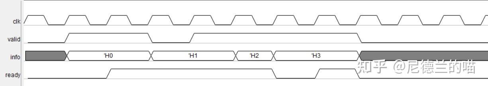
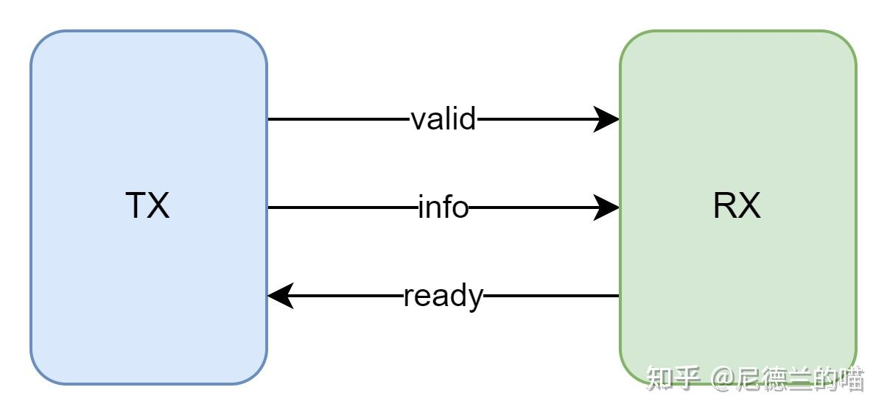

# 【握手协议1】valid-ready握手协议的介绍与时序说明

- [ ] Version
    * [x] linhuangnan
    * [x] 2024-01-03 
    * [x] 学习握手协议专栏
    * [ ] review

!!! info
    * valid-ready握手协议的介绍
    * 时序说明

## valid-ready握手协议的介绍
### 握手协议定义
!!! quote
    "Valid-Ready" 握手协议是一种常用于数字电路中的接口协议，用于控制数据的传输和处理。这种协议通常在两个设备（如芯片、模块或模块间的通信）之间使用，以确保数据的有效传输和正确处理。

### Valid-Ready 握手协议的特点和优势

#### 握手协议特点
* **有效数据传输**： "Valid-Ready" 握手协议通过有效信号（Valid）来指示数据是否有效，Ready信号来指示接收方是否已准备好接收数据。只有在Valid和Ready信号都为高电平时，数据传输才会发生，从而确保数据在正确的时机传输。
* **流控制**： Ready信号可以起到流量控制的作用。如果接收方没有准备好接收数据，它可以将Ready信号置低，从而停止发送方的数据传输，以防止数据拥塞。
* **同步性**： "Valid-Ready" 握手协议提供了同步机制，确保发送和接收之间的时序一致性。数据传输只会在双方都准备好的情况下进行，避免了数据的不同步问题。
* **灵活性**： 握手信号的有效和准备状态可以根据具体的应用需求来控制。这使得协议可以适应不同的数据传输速率和处理速度。
* **错误检测**： 在有效信号中，还可以包含错误检测位，以便接收方可以验证传输的数据的正确性。

#### 握手协议优势

* **简单可靠**： "Valid-Ready" 握手协议相对简单，易于实现和调试。它的工作原理直观清晰，使得设计者和开发者能够更容易地理解和管理数据传输流程。
* **节约资源**： 与其他复杂的通信协议相比，"Valid-Ready" 握手协议在硬件资源和时钟周期方面的需求较低。这使得它在资源受限的系统中具有优势。
* **适应性强**： 由于其简单性，"Valid-Ready" 握手协议可以适应不同类型的通信和数据处理需求。它可以用于内部芯片通信，模块之间的通信，以及许多其他数字电路场景。
* **实时性好**： 由于有效和准备信号的即时性，"Valid-Ready" 握手协议通常能够满足实时数据传输的需求，特别适用于需要低延迟的应用。

## 时序说明

### 时序图
握手协议是通过valid控制信号发送，通过ready控制信号接收，通过若干info承载信息的一种接口总线，其典型时序图如下：

### 信号线
对于发射模块而言，valid/data为输出，ready为输入。对于接收模块而言，valid/data为输入，ready为输出：

### 注意点

对于握手协议的时序，有如下几条较为通用的要求：

* 发送方在准备好发送数据之后，需要将valid信号置高，表示数据有效，在接收方的ready置高前（包括当拍）valid不可拉低；
* 接收方在准备好接收数据时，需要将ready信号置高，表示已准备好接收数据；
* 在数据传输期间，valid 和ready信号需要保持同步，数据传输只能在valid和ready信号同时为高电平时进行；
* 解复位后（工作期间）valid不可为不定态，即仿真中valid不允许出现X态和Z态，必须为高/低电平；
* 解复位后（工作期间）ready不可为不定态，即仿真中valid不允许出现X态和Z态，必须为高/低电平，注意ready的定态要求不如valid严格，ready的x/z态主要对仿真环境有影响，对RTL实际功能一般没有影响；
* info在valid为1时不可为不定态，在valid为0时无约束；
* 在valid置起为1后，到valid和ready进行握手前（包括当拍），info值不能跳变；
!!! tip
    即在valid跳变为1时，info同步跳变为发送值，一直维持到握手，握手的下一拍info才能跳变
* valid的产生逻辑中不可包含或隐式包含ready信号；
!!! tip
    valid的置高与ready信号无关，而valid的置低与ready信号有关。valid的置低不是和当拍的ready有关哈，是和上一拍的ready（准确的说是握手与否）有关。
* ready的产生逻辑中可以包含valid信号；

当然了，以上是相对通用的要求，是否需要遵守可以根据实际情况来判断。比如果接收模块需要5拍来处理一个info，那么数据传输就不必非要在valid和ready同时为高时进行，可以在valid拉高后就开始处理，处理完成时再拉高ready接收并丢弃info。

!!! tip
    在某些设计中，可以容忍 valid 在 ready 拉高之前就被拉高。例如，如果接收模块在处理当前数据同时也能开始接受下一份数据，那么它可以不用等到完全处理完当前数据再拉高 ready。这种情况下，valid 拉高后，接收模块就可以开始处理新的信息。

