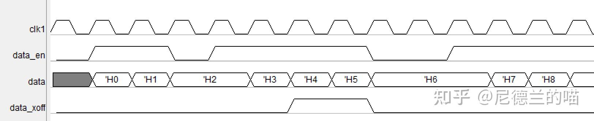
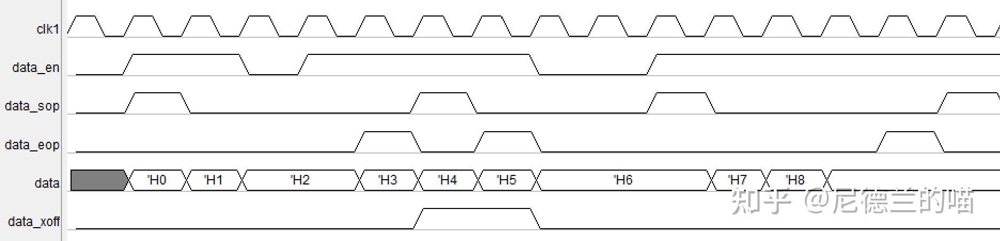
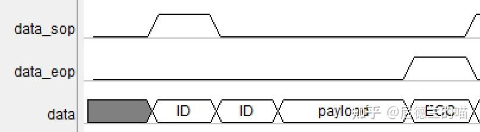
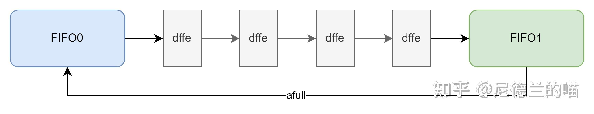
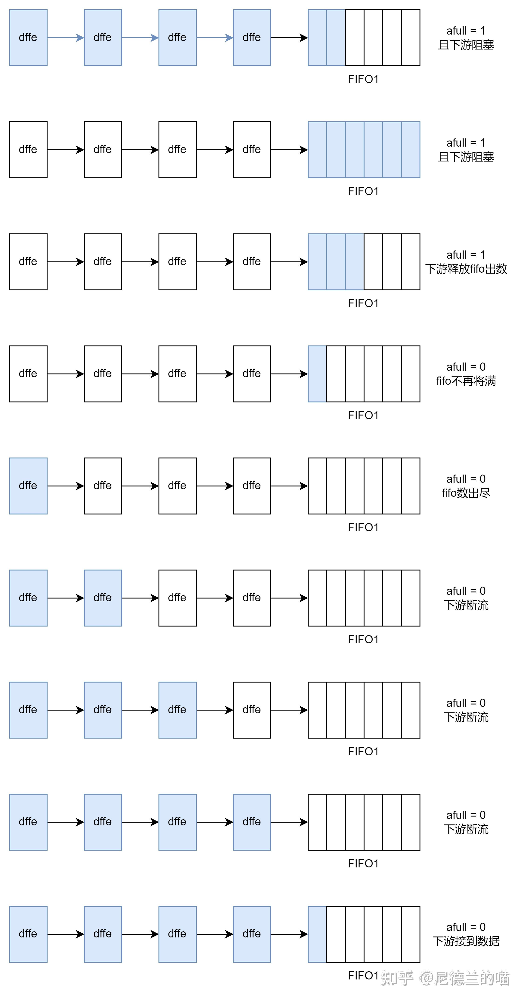
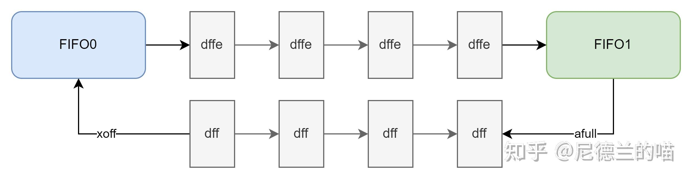

# 【握手协议2】valid-ready接口与enable-xoff/bp接口的对比

- [ ] Version
    * [x] linhuangnan
    * [x] 2024-01-03 
    * [x] 学习握手协议专栏
    * [ ] review

主要对比下valid-ready握手协议和enable-xoff/bp协议，这个对比仅限于同时钟域下的信号传输

这种协议的典型特点是通过enable信号标记数据有效，通过xoff信号进行反压，比较典型的波形如下：

上面的波形中呢，data_en就是使能信号，为1时表明上游的传输数据有效；data_xoff为反压信号，为1时表明下游的接收端无法接收数据，此时数据传输不会立即停止，而是会继续传输N拍，N的大小称为过冲。

还有另外一种常见场景：

这种波形的特点是，数据不再是单拍有效的，而是若干拍组成一个“包”，data_sop是包头标志，data_eop为包尾标志，data_sop和date_eop之间（左右均包含）data_en有效的数据即为整个包的数据。这种包传输很常见的场景是包头为多层ID，包尾为ECC校验，中间为payload：

这种包传输起反压时，可能有两种场景：一是过冲若干拍，二是过冲若干个包。具体的要求就要看上下游模块的协议要求了。这种场景比较复杂暂不过多讨论，只看一下最见到的单拍enable-xoff接口，可以发现其与valid-ready最大的区别在于，后者ready拉低时数据传输时强制停止的，只有valid和ready同时高有效才完成了一个数据的传输。而前者则不然，enable信号高有效时就完成了一个数据的传输，而xoff为1后（起反压，类似于ready拉低的效果）仍然会过冲几个数据，知道enable拉低后才停止数据传输。

单纯从代码实现的角度看，valid-ready型接口的valid信号必然是会看上一拍是否握手，如果握手了就可以立刻开始下一个数据的发送（而不需要关心本拍ready的情况），不握手就一直维持高有效；而enable-xoff则是在感知到xoff后主动停止发送（单接口上不一定是立即停止），直到xoff降为0后在重新开始发送数据（而不能维持enable信号为1）。

比较典型的enable-xoff就是两个fifo级联的电路结构，从这个结构也能看出为什么xoff为高后接口不会立即停止数据发送而是会过冲几个数据。在这种结构中，下级的fifo将afull（将满）信号作为xoff输入给上一级，afull信号参与fifo0的rd_en逻辑中，当afull为1时rd_en会为0。

那么显然，即使fifo0在第一时间停止数据发送了，那么由fifo0到fifo1的路上还有4个寄存器呢呀，极端场景这4个寄存器里都有有效数据，那么下级的fifo1是必须得能够把数据收下来的（要不然不就丢数了吗），所以fifo1入口的接口协议就是：xoff为1之后，最多允许过冲4个数据（包括xoff为1的当拍）。

顺便延伸一下，那么这个时候fifo1的afull什么时候应该设置为1呢？必然是N-4，N为fifo深度对吧。那么继续深入一下，N的值最小应该为多少？答案是，N最小值应该为8，大于8肯定是没有关系的。为什么要这么设置呢，我们来看一下**下游阻塞-恢复场景**（不纠结于具体的时序，只看行为）：

下游阻塞 -> fifo将满，起反压 -> fifo接收路径上的过冲，等待下游通流 -> 下游通流，fifo出数 -> fifo不再将满，撤销反压 -> 上游恢复发送数据，那么如果在fifo1里面将满水线以下的数据发送完成之前，上游的数据没能补充过来（路上有流水），那么必然会造成下游的断流现象，也就是非阻塞断流。

这对于对带宽、延迟、抖动有要求的芯片而言是不可接受的。因此fifo的将满水线必须设置合理，太浅会丢数，太深会断流。对于验证而言，这里的性能验证也是重中之重，而这一关过去后还有包反压过冲场景的性能问题以及反压流水场景：

!!! tip "Summary"
    在芯片设计中，"valid-ready握手接口"和"enable-xoff使能接口"都是用于控制数据传输和通信的接口，但它们在功能和用途上有一些差异。

    Valid-Ready握手接口：
    "Valid" 和 "Ready" 是两个信号线，用于在数据传输过程中进行握手和同步。
    "Valid" 信号表示数据是否有效。当数据准备好并可以传输时，"Valid" 信号置高。
    "Ready" 信号表示接收方是否准备好接收数据。当接收方准备好接收数据时，"Ready" 信号置高。
    握手的基本原则是：当发送方的 "Valid" 信号为高且接收方的 "Ready" 信号也为高时，数据可以传输。

    Enable-XOFF使能接口：
    "Enable" 和 "XOFF" 是两个信号线，用于控制数据流的启用和停止。
    "Enable" 信号用于启用数据传输，当 "Enable" 为高时，数据传输可以进行。
    "XOFF" 信号用于停止数据传输，当 "XOFF" 为高时，数据传输被暂停。
    通常，"XOFF" 信号用于流量控制，以避免数据过载，允许接收方在处理数据之前进行暂停。
    在实际应用中，选择使用哪种接口取决于项目的需求和设计目标。"Valid-Ready握手接口"通常用于高速数据传输，以确保数据的准确性和同步性。"Enable-XOFF使能接口"则更适用于控制数据流，避免数据传输过程中的拥塞和溢出。不同的设计场景可能会选择不同的接口来满足特定的通信需求。
