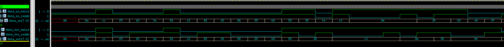

# 【握手协议5】ready时序优化即backward打拍介绍

- [ ] Version
    * [x] lin
    * [x] 2024-01-05 
    * [x] 学习握手协议专栏
    * [ ] review

这篇文章是探讨对接收端进行优化（即ready打拍，或称backward打拍）的方式。

ready本身是不携带任何随路信息的，但如果因此就觉得可以简单把ready打一拍来进行时序优化那就大错特错了，要不然可以试一试看看错的多离谱。无论valid打拍还是ready打拍，都需要将控制信号（valie或ready）和传输信息（data）进行寄存，因此二者的资源消耗是没有明显区别的。因此我们还是要借助两个寄存器：

```verilog
module dffse #(
	parameter WIDTH = 1
)(
	input 			clk,
	input 			rst_n,
	input  	[WIDTH -1:0]	d,
	input			en,
	output reg[WIDTH -1:0]	q
);
always @(posedge clk or negedge rst_n)begin
	if(~rst_n)  q <={WIDTH{1'b1}};
	else if(en) q <= d;
end
endmodule

module dffe#(
	parameter WIDTH = 1
)(
	input 			clk,
	input  	[WIDTH -1:0]	d,
	input	    		en,
	output reg[WIDTH -1:0]	q
);
always @(posedge clk)begin
	if(en) q <= d;
end
endmodule
```

这次用了dffse寄存器，说白了就是复位值为全1寄存器。

那么对于ready打拍，关键点显然就是data_in_ready的控制逻辑，不过这个逻辑不是太容易理解，所以咱们镜像着data_in_valid的打拍来看,fw_pipe的代码如下：
```verilog
wire in_valid_en = data_in_ready;
wire in_valid_d  = data_in_valid;
wire in_valid_q;
dffre #(.WIDTH(1))
u_in_valid_dffre(
	.clk(clk),
	.rst_n(rst_n),
	.d(in_valid_d),
	.en(in_valid_en),
	.q(in_valid_q)
);
assign data_in_ready  = data_out_ready || (~in_valid_q);
assign data_out_valid = in_valid_q;
```

镜像的来做bw_pipe中data_in_ready的逻辑应该是：
```verilog
wire out_ready_en = data_out_valid;
wire out_ready_d  = data_out_ready;
wire out_ready_q;
dffse #(.WIDTH(1))
u_out_ready_dffse(
	.clk(clk),
	.rst_n(rst_n),
	.d(out_ready_d),
	.en(out_ready_en),
	.q(out_ready_q)
);
assign data_out_valid = data_in_valid || (~out_ready_q);
assign data_in_ready = out_ready_q;
```

在fw_pipe中u_in_valid_dffre寄存的状态是发送端是否有发送数据的请求，那么对应的bw_pipe中u_out_ready_dffse寄存的状态是什么呢？自然是接收端是否有接收数据的能力，因此这个寄存器的复位值应该为1（就算上来下游就堵住了，pipe里至少能缓存一拍数）。因此当该寄存器值为1时表明pipe内是空的，为0时表示pipe内有一笔数，所以也就构成了data_out_valid的一部分逻辑。

当out_ready_q(其实就是data_in_ready) == 0时表明pipe中有一笔数那么data_out_valid必然为1，此外无论out_ready_q什么状态只要data_in_valid == 1那么也表明向下游传输的数据已经准备好了，data_out_valid也需要为1（对ready打拍，那么必然valid是存在bypass通路的。你想在对valid进行打拍时，ready是不是有一条bypass通路）。

而out_ready_d = data_out_ready就需要感受一下了，如果这拍向下游握手成功了那么无论如何下一拍bw_pipe也是空的了。data_out的逻辑如下：
```verilog
wire 		 data_en = data_in_valid && data_in_ready;
wire [WIDTH -1:0]data_d  = data_in;
wire [WIDTH -1:0]data_q;
dffe #(.WIDTH(WIDTH))
u_in_data_dffe(
	.clk(clk),
	.d(data_d),
	.en(data_en),
	.q(data_q)
);

assign data_out       = out_ready_q ? data_in : data_q;
```

如果当拍out_ready_q == 0（bw_pipe内有数）则取走data_q，否则直接通过bypass通路取走data_in。那是不是意味着，只有对下游握手了，下一拍的bw_pipe中就一定没有数了！

完整的代码如下：
```verilog
module bw_pipe #(
	parameter WIDTH = 8)
(
	input clk,
	input rst_n,
	
	input [WIDTH -1:0]data_in,
	input 		  data_in_valid,
	output		  data_in_ready,
	
	output[WIDTH -1:0]data_out,
	output		  data_out_valid,
	input		  data_out_ready
);

wire out_ready_en = data_out_valid;
wire out_ready_d  = data_out_ready;
wire out_ready_q;
dffse #(.WIDTH(1))
u_out_ready_dffse(
	.clk(clk),
	.rst_n(rst_n),
	.d(out_ready_d),
	.en(out_ready_en),
	.q(out_ready_q)
);

wire 		 data_en = data_in_valid && data_in_ready;
wire [WIDTH -1:0]data_d  = data_in;
wire [WIDTH -1:0]data_q;
dffe #(.WIDTH(WIDTH))
u_in_data_dffe(
	.clk(clk),
	.d(data_d),
	.en(data_en),
	.q(data_q)
);

assign data_out_valid = data_in_valid || (~out_ready_q);
assign data_out       = out_ready_q ? data_in : data_q;
assign data_in_ready  = out_ready_q;

endmodule
```

当然了我们会发现一个特性，bw_pipe不像fw_pipe那样会至少对数据打一拍，bw_pipe在通路畅通时data_in_valid/data_in是直接bypass到下游的，而通路阻塞时才会将数据在bw_pipe中寄存。



