# Modelsim手动仿真

## Change Directory
因为modelsim使用的是绝对路径，因此使用之前要先切换目录

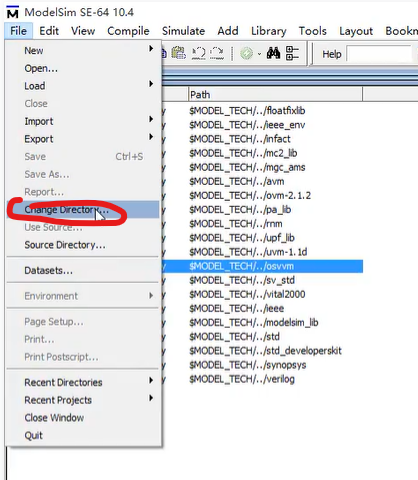

选择该路径

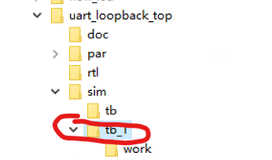

## 创建新工程

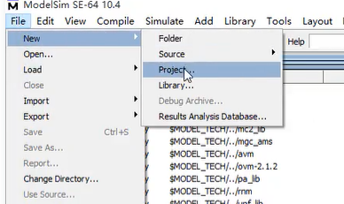

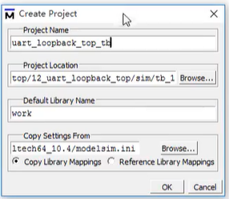

## 设计源文件的输入

在空白处右击Add to Project添加文件

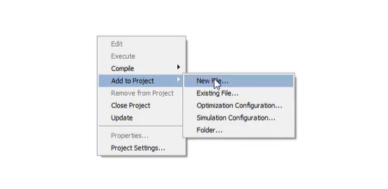

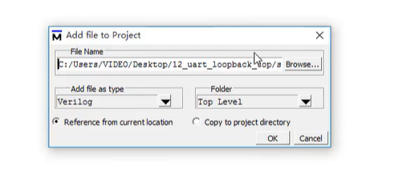

在modelsim中编辑修改源文件

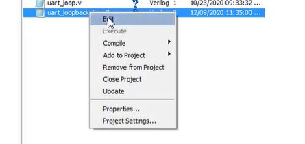

## 对文件进行编译

Compile Selected编译某个文件，Compile All全编译 

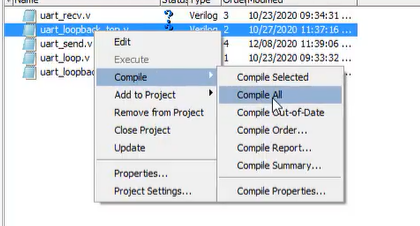

有个三角形说明有个警告，可以双击文件查看警告内容

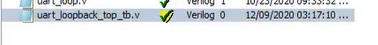

## 启动仿真

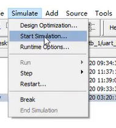

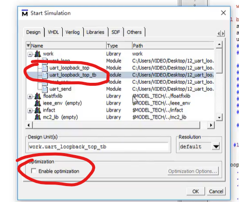

## 将信号添加到波形

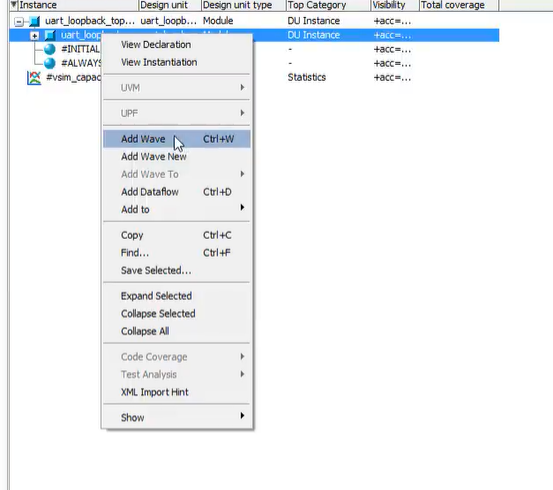

点击Run开始运行

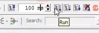

对波形时间刻度进行调整

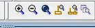

## 使用命令行运行

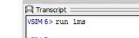

.main clear 清空

