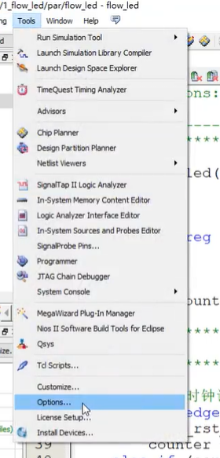
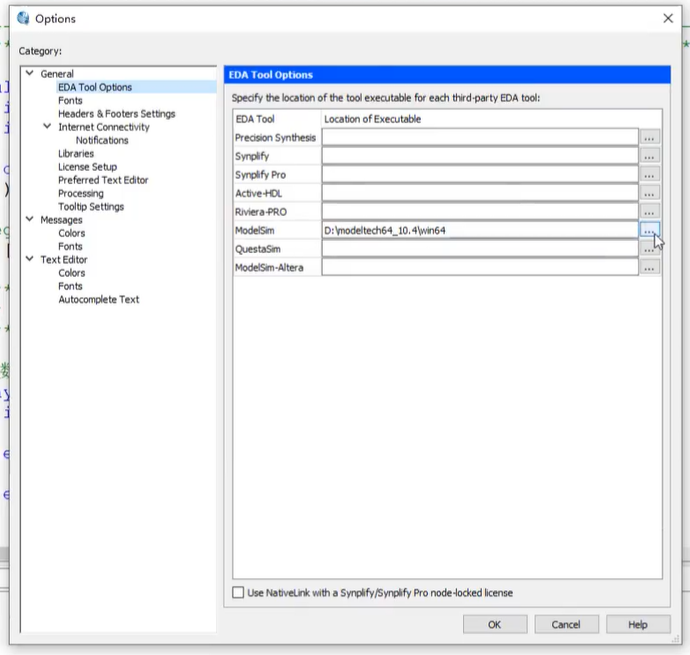
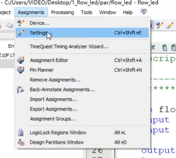
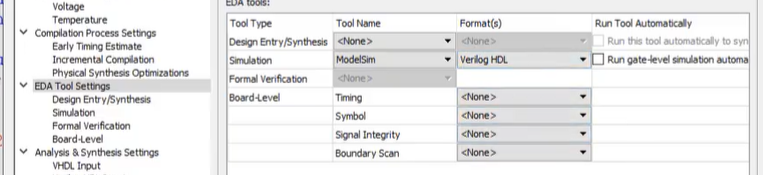
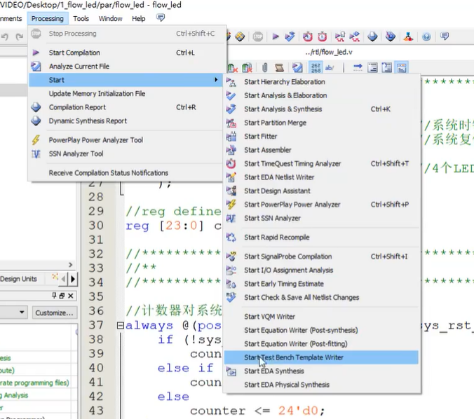
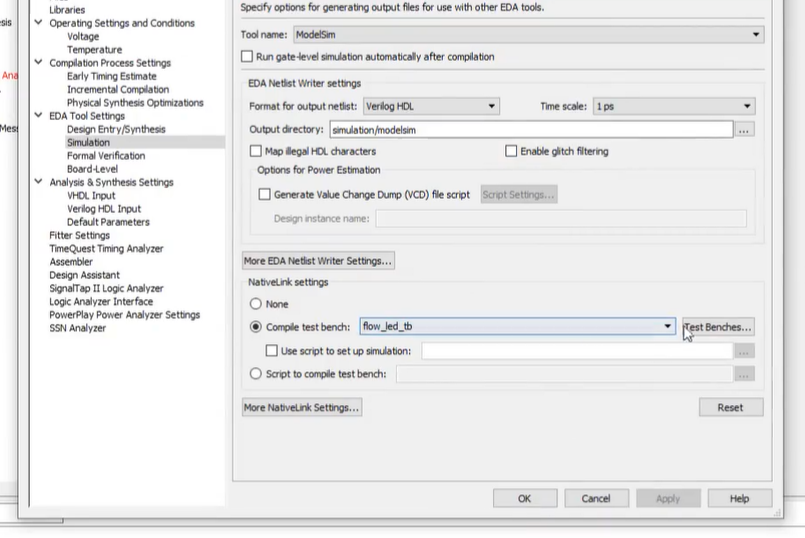
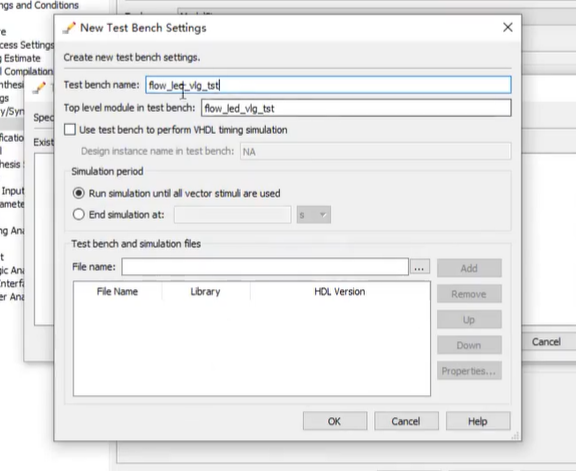

# Modelsim联合仿真

## 将开发环境和仿真环境连接起来

Simulation选择modelsim，ModelSim Altera是其精简版本 

## 生成testbench模板

## 添加TB文件

Assignments -> Settings

testbench name选择和module一样的名字

添加Test bench and simulation files
