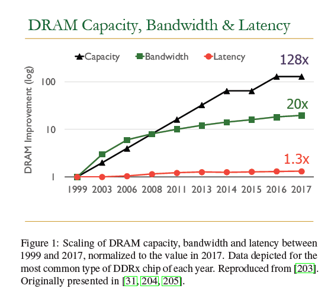
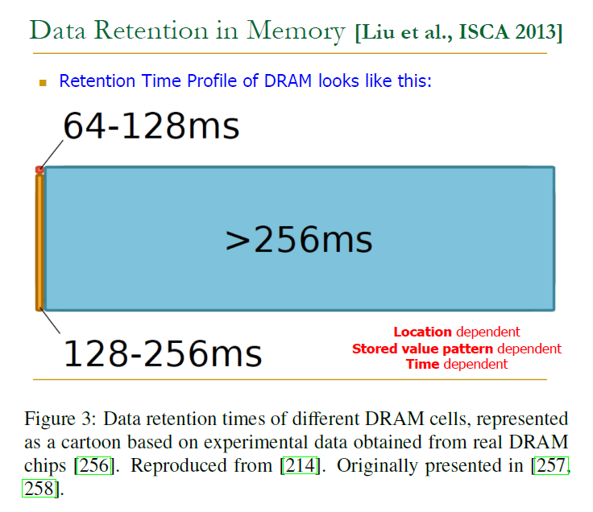
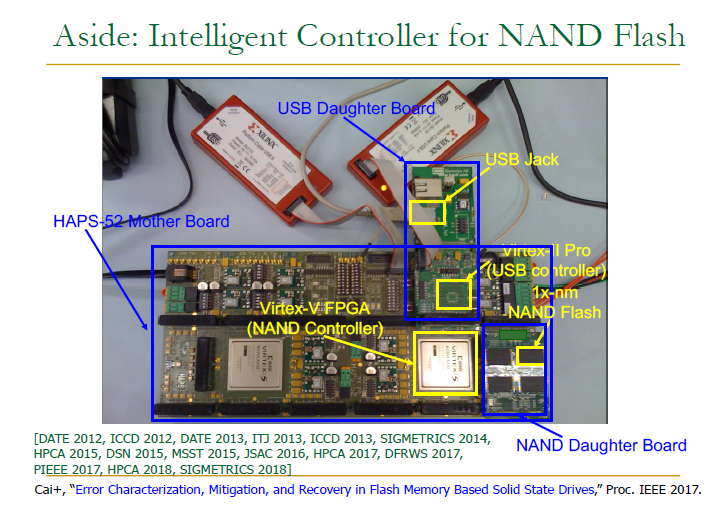
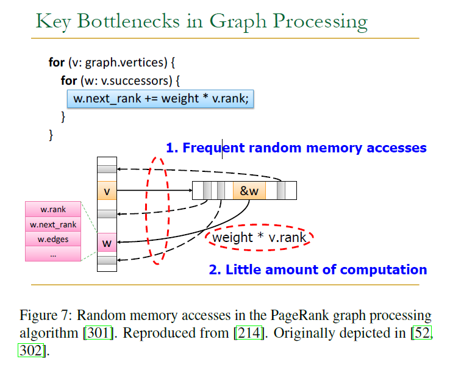
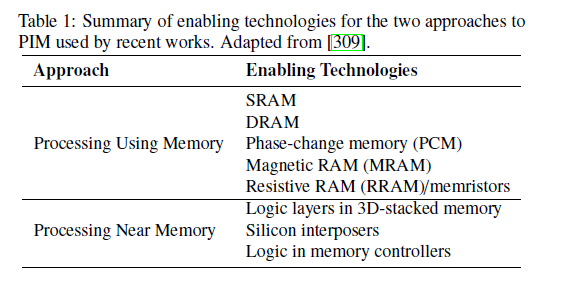

# 【PIM】A Modern Primer on Processing in Memory

- [ ] Version
    * [x] linhuangnan
    * [x] 2024-03-04 
    * [x] 存内计算综述
    * [ ] review

!!! info
    * What is PIM
    * The Need for Intelligent Memory Controllers to Enhance Memory Scaling
    * Demonstrate project mode design flow features
    * Perils of Processor-Centric Design
    * Processing-in-Memory (PIM): Technology Enablers and Two Approaches

## 什么是PIM

"Processing in Memory"（PIM）即“内存中处理”，是一种计算机系统架构的概念，其核心思想是在内存模块中集成处理能力。这种设计允许数据在不离开内存的情况下直接被处理，可以显著减少数据在中央处理单元（CPU）和主存之间传输的时间，从而降低延迟并提高整体性能。

## 摘要

现代计算系统中一个显著的设计选择：将数据移动到计算单元进行处理。

这种设计选择与至少三个导致`性能`、`可扩展性`和`能源瓶颈`的关键趋势背道而驰：

* **数据访问是主要瓶颈**：许多重要应用程序日益依赖于大量数据，而内存带宽和能耗并没有很好地随之扩展。

* **能量消耗是几乎所有计算平台的限制因素**：尤其是在服务器和移动系统中，能源限制尤为严峻。

* **数据移动非常消耗资源**：特别是从芯片外到芯片内的数据移动，在带宽、能耗和延迟方面的成本远高于计算本身。

在数据密集型的服务器和受能源限制的移动系统中，这些趋势特别突出。

同时，传统的内存技术在可靠性、能效和性能方面也面临着众多技术扩展挑战。因此，内存系统架构师开始考虑以更高的成本来以不同的方式组织内存并使其更加智能化。3D堆栈内存加逻辑层的出现、在最新的DRAM芯片中采用纠错码、主内存标准和专用芯片（例如图形处理、低功耗、高带宽、低延迟）的多样化，以及设计新解决方案来应对严重的可靠性和安全问题（如RowHammer现象），都证明了这一趋势。

!!! tip
    RowHammer现象是一种硬件安全漏洞，主要影响基于动态随机存取内存（DRAM）的计算机系统。它源自于DRAM芯片的物理特性和缩小的制造工艺。

    **RowHammer的工作原理：**

    DRAM内存中存储数据的单元被组织成行（row）。当一个DRAM行频繁地进行读操作时（即“hammering”），由于电气耦合效应，相邻行上存储的数据可能发生意外翻转。换句话说，频繁地访问同一行可以干扰临近行，导致这些临近行的位发生错误。

    **RowHammer的影响：**

    这个问题在理论上可能被恶意利用来破坏系统安全。攻击者可以通过精心构造的程序重复访问某些内存地址，诱发RowHammer错误，从而篡改其他程序或操作系统的数据，甚至获取更高的系统权限。

    例如，攻击者可能使用RowHammer技术来破坏内存中的关键数据结构，如页表项，使得攻击者能够控制虚拟地址映射到物理地址的过程，进而获得对整个系统的控制权。

    **防御RowHammer：**

    为了防御RowHammer攻击，内存制造商和系统设计者已经采取了多种措施。包括增加内存刷新率、使用错误检测和纠正代码（ECC），以及在硬件层面实现更高级的监测与预防机制。此外，操作系统和固件也被更新以降低这类攻击的风险。然而，随着DRAM技术的持续发展，新一代内存可能需要更先进的解决方案来应对这一挑战。

    RowHammer是对硬件设计师、软件开发者和安全研究人员的一个警示，说明硬件设备的物理属性可能会产生意想不到的安全后果，并且随着技术的发展，新的漏洞有可能不断出现。

此文讨论的章节着重介绍了将计算单元置于数据附近以实现计算的最新研究，这种方法称为处理在内存（PIM）。PIM旨在将计算机制放置于数据存储的位置（即内存芯片内部、3D堆栈内存的逻辑层或内存控制器中），从而减少或消除计算单元与内存之间的数据移动。虽然PIM的总体想法并不新鲜，但文章讨论了在应用程序和内存电路/技术中的驱动趋势，这些趋势大大增加了在现代计算系统中启用它的需求。

文章检视了至少两种有前景的新方法来设计PIM系统，以加速重要的数据密集型应用程序：

* **利用内存进行处理**：利用DRAM芯片的模拟操作属性，以低成本变更执行内存中的大规模并行操作。

* **在内存附近进行处理**：利用3D堆栈内存技术设计，为内存逻辑提供高带宽和低延迟的内存。

在这两种方法中，文章描述并解决了相关跨层的研究、设计和采纳挑战，包括设备、架构、系统和编程模型。文章专注于发展可以在真实计算平台中以低成本被采纳的内存处理设计，并总结讨论了解决PIM实际采用中的关键挑战的工作。

## 引入

**主存储器**，基于动态随机访问内存（DRAM）技术构建，是现代计算系统的重要组成部分，包括服务器、云平台和移动设备等。随着应用程序数据工作集大小的增长以及对快速数据分析需求的提升，主存储器的性能成为了这些系统的瓶颈。解决这个瓶颈需要在跨代的技术进步中实现内存容量、效率、成本和性能的平衡扩展。但是，尤其在过去十年，这些方面变得越来越难以扩展，导致主存储器瓶颈问题加剧。

主存储器瓶颈的一个主要原因是数据移动带来的高能耗和延迟。在现代计算机中，CPU处理数据前必须从主存储器中检索数据，这一过程耗时且耗能。由于很多缓存数据并未被CPU重用，这进一步增大了数据移动的成本。

当前计算系统中心化处理器设计中的这个根本问题，随着新型应用日益数据中心化，导致了性能、能效和成本上的低效率。近年来，技术进步使得在存储器中集成逻辑变得可行，促使人们重新审视存储器内处理（PIM）的概念。PIM的核心思想是在数据存储位置或附近放置计算机制，减少或消除数据移动。

PIM已经有五十多年的历史，但过去由于各种原因并未广泛采用。随着近年3D堆叠存储和其他内存架构技术的进步，PIM再次受到关注，可以分为两种方法：**一种是“使用内存进行处理”，利用现有DRAM设计进行类似批量操作；另一种是“近内存处理”，利用3D堆叠存储技术的逻辑层进行更通用的计算。**

无论采取哪种PIM方法，都需要克服系统架构和编程上的挑战，以便PIM能在各种计算环境中广泛采用。

## 影响主存的主要趋势

主存储器是所有计算系统的核心组件，包括云和服务器平台、桌面电脑、移动设备、嵌入式设备和传感器。它与处理元素（如CPU核心、GPU核心、加速器或可重配置设备）和通信元素（例如互连、网络接口和网络处理单元）共同构成了计算平台的主要支撑。

由于其成本效益和低延迟，动态随机访问内存（DRAM）已经成为构建主存储器的主导技术。然而，随着现代应用程序对更大容量和性能的需求日益增长，提高DRAM芯片容量的成本正在上升，使得满足这些需求变得越来越昂贵和困难。如果CMOS技术扩展停滞不前，DRAM扩展的挑战将会更加严峻。

**关键问题**包括：

**DRAM容量、带宽和延迟难以同时扩展。**处理核心数量每两年翻一番，但DRAM容量仅每三年翻一番，且增长正在放缓。

**向更小尺寸节点的DRAM技术扩展对可靠性有负面影响**，因为缩小尺寸的DRAM单元变得不那么可靠，更易发生漏电和受干扰。

**DRAM技术的积极扩展可能导致新的安全漏洞**，特别是RowHammer现象，它表明现代DRAM芯片中可以预测性地引入错误（比特翻转），破坏物理内存隔离，并可能被利用以获取系统权限。

**主存储器功率和能源消耗是另一个关键问题**。DRAM需要周期性刷新即使在闲置状态下也消耗能量，这导致总体能耗增加。此外，主存储器未能从芯片集成和能量/电压缩放机制中获益，并且DRAM技术扩展的困难导致能量减少变得复杂。

因此，存在着对智能内存控制器的需求，它们具备智能和计算能力以更好地扩展主存储器的性能指标，并可能促进存储器内处理的发展。减少主存储器的能耗在当今的计算平台中至关重要，以确保能效和可持续性。

## The Need for Intelligent Memory Controllers to Enhance Memory Scaling

为解决现代DRAM面临的四大主要问题，一个有前景的方法是设计智能内存控制器来更好地管理主内存。如果内存控制器设计得更智能、更具可编程性，它可以灵活地克服各种可靠性问题（包括RowHammer），以及基于对DRAM芯片和应用特性的深入了解，更好地管理延迟和能量/功耗消耗；提供足够的可编程支持来防止现场发现的安全和可靠性漏洞；以及管理组合成混合主内存的各种类型的存储技术，以增强主内存系统的扩展能力。

智能内存控制器可以帮助克服现代计算系统在主内存级别面临的电路和设备级问题。我们认为，拥有智能内存控制器可以大大缓解当今主内存遇到的扩展问题，正如我们之前的文章中所描述的那样。这个方向也得到了当今计算行业关键硬件制造商的支持，比如英特尔和三星工程师共同撰写的关于DRAM技术扩展问题的信息性论文。

例如，稍微智能一些的内存控制器可以通过概率刷新与被激活行物理相邻的行来预防RowHammer漏洞，这种方法称为PARA（Probabilistic Adjacent Row Activation，已经被证实可以提供强大、可编程、鲁棒的保护措施来防止RowHammer，而且额外的功率、性能和芯片面积开销非常小。

智能内存控制器还可以通过深入了解不同行的保留时间特性，从而极大地缓解DRAM的刷新问题，以及其对能源、性能、可预测性和技术扩展的负面影响。通过在线识别每行的最小数据保留时间，并根据实际需要刷新每行，或者退役弱行以便数据不被存储在其中，智能内存控制器可以克服刷新问题。

此外，智能内存控制器可以启用性能改进，克服内存扩展的限制。通过利用DRAM单元访问时间的异质性，并针对操作温度、制造工艺变化、操作条件变化以及访问模式差异调整存取时序，可以显著减少访问和刷新延迟，从而克服DRAM延迟和能源缩放的困难。

智能内存控制器还可以通过利用现代DRAM设备的延迟-可靠性权衡，生成真随机数或评估基于DRAM的物理不可克隆函数（PUF），并利用应用和数据特性，精心将数据映射到由不同特征的多种内存类型组成的混合内存中，以最大化每种内存类型的好处，同时避免每种内存类型的缺点。

在现代计算系统的另一个关键部分——由NAND闪存内存组成的固态驱动器（SSD）中，管理SSD的闪存内存控制器被设计为包含大量智能，以提高性能和可靠性。智能内存控制器已经广泛用于解决涉及不同类型内存技术的关键内存扩展问题，包括数据分配、迁移和跨异构部分的数据移动的管理。

## Perils（风险） of Processor-Centric Design

现代计算系统中性能和能源效率下降的一个主要原因是系统内部存在大量数据移动。这种数据移动是由处理器中心执行模型和设计范式引起的，该范式创造了计算与存储/内存之间的二分法。在这种处理器中心的设计范式下，计算能力和存储/内存能力被分隔为两个完全独立的系统组件（即计算单元与存储/内存单元），它们通过长而耗能的互连相连：所有处理都只在计算单元进行，而数据则存储在完全分离的地方。结果，数据必须不断在存储/内存单元和计算单元（例如CPU核心或加速器）之间来回移动，以便执行任何计算。

为了对存储在内存中的数据执行操作，会调用一个成本高昂的过程。首先，CPU（或加速器）必须向内存控制器发出请求，然后通过off-chip总线向DRAM模块发送一系列命令。其次，数据从DRAM模块读取并返回到内存控制器。再其次，数据被放入CPU缓存和寄存器，供CPU核心访问。最后，CPU可以对数据执行操作（即进行计算）。所有这些步骤消耗大量时间和能源，以将数据带入CPU芯片。

在当前计算系统中，CPU（或任何加速器）是唯一能够对数据执行计算的系统组件。系统的其他组件只负责数据存储（内存，缓存，硬盘）和数据移动（互连）；它们无法执行计算。因此，当前的计算系统严重失衡，导致了大量的能源效率低下和性能损失。实证证据表明，由于处理器-内存二分法造成的严重失衡，我们最近观察到常用的四个主要移动消费者工作负载（包括Chrome浏览器、TensorFlow机器学习推理引擎和VP9视频编解码器）消耗了超过62%的整个系统能源。因此，事实上，现有系统只能在计算单元（CPU核心和硬件加速器）中执行计算，导致了因整个系统需要数据移动而产生的巨大能源浪费。

至少有五个因素导致了处理器和内存之间数据移动相关的性能损失和能源浪费。简要描述如下，以展示数据移动在现代计算系统中的广泛负面影响：

**第一**，内存控制器和主内存之间的off-chip总线宽度受到引脚数量和成本限制，较窄，导致主内存的带宽相对较低，延迟较高。这使得很难并行发送大量请求到内存以实现更高级别的并行性，以及容忍长时间的主内存延迟。

**第二**，当前的计算系统采用许多复杂的机制来容忍从主内存访问数据。这些机制包括复杂的多级缓存层次结构、智能的插入/提升/驱逐策略和精密的延迟容忍/隐藏机制（例如，在许多不同的缓存层次上的精密缓存算法、多种复杂的预取技术、大量的多线程，复杂和耗电的乱序执行机制）。这些组件虽然有时能有效提高性能，但在硅片面积和能耗方面都非常昂贵，以及需要访问/管理它们所需的额外延迟。当这些组件未能提高性能时，它们就会导致净能源浪费和延迟开销，损害它们旨在改进的性能。

**第三**，计算系统中使用的许多缓存并不总是有效或高效。大量带入缓存的数据没有被CPU重用，导致大量硬件面积和内存带宽的浪费。例如，随机访问内存导致局部性差，使缓存几乎完全无效；跳跃访问内存会使得缓存无效；甚至连续访问内存也是低效的，因为缓存块不会被再次利用。在各种现代工作负载中，有许多这样的访问模式，它们要么使得缓存非常低效，要么根本不需要，加剧了以处理器为中心的系统中数据移动导致的能源浪费。

**第四**，许多现代应用程序，如图处理和稀疏数据结构的操作，产生随机内存访问模式。随机访问模式不仅使得缓存效率低下，而且连主内存总线和主内存本身也变得非常低效。因为往往只有从主内存检索到的每行和每个缓存行的一小部分实际上被CPU使用，这类随机访问本质上很难预取。

**第五**，处理器和主内存通过长的、耗电的互连连接在一起。这些互连对每次数据访问增加了显著的额外延迟，并占据了数据在DRAM内存上移动的能量开销的显著部分。事实上，off-chip互连的延迟和能耗是现代系统性能和能源的关键限制因素，因为它极大地加剧了数据移动的成本。

处理器技术与存储/通信技术之间日益增长的差异导致了通信（数据流动）成本在能源消耗方面占主导地位。今天，主内存访问的能耗是一个加法运算能耗的两到三个数量级。数据移动已经占据了科学、移动和消费者应用的总体系能源的40％、35％和62％。这种由于数据移动导致的能源浪费对所有现代计算平台的效率和性能都是一个巨大的负担。

要克服导致当前计算系统性能低下和大量能源低效（以及高系统设计复杂性）的所有原因，首先需要意识到所有这些原因都是由现有计算系统采用的处理器中心设计范式引起的。因此，同时解决所有这些问题的根本解决方案需要进行范式转换。我们认为，未来的计算架构应该变得以数据为中心，即尽可能减少数据移动的情况下进行计算，并在数据所在的地方（而不仅仅是在处理器中）执行计算。因此，需要打破传统的计算单元与存储/通信单元之间的固定二分法，并创造一种在数据所在位置执行计算的新范式。我们将这种以数据为中心的执行模型和设计范式称为内存中处理（Processing-in-Memory，简称PIM）。

## Processing-in-Memory (PIM): Technology Enablers and Two Approaches

当前的计算系统设计范式以处理器为中心，导致了大量数据移动。为了使未来的计算架构具有高性能、高能效和可持续性，减少内存与处理器之间不必要的数据移动至关重要。此目标可以通过内存中处理（PIM）实现，即装备内存子系统以执行计算的能力。

本节首先描述了两种新的技术推动因素：**(1) 三维堆叠内存的出现**，**(2) 可按字节寻址的内存的使用**。这两种相对新的主存储技术提供了新的机会，可以让现代计算系统更容易引入和采纳PIM。

其次，我们介绍了在现代架构中实现PIM的两种有前景的方法。**第一种方法是利用内存进行处理**，它利用现有的DRAM架构和DRAM电路的操作原理，在主内存中启用（批量）处理操作，并且只需最小的更改。这种简约方法尤其强大，因为它利用主内存基底在很小的改变现有内存芯片的情况下非常擅长的特殊计算。**第二种方法是靠近内存处理**，它利用3D堆叠内存的逻辑层实现各种通用处理逻辑的能力，以及3D堆叠内存逻辑层与内存层之间的高内部带宽和低延迟。这是一种更通用的方法，逻辑层中实现的逻辑可以是通用的，因此可以惠及广泛的应用程序。

接下来，我们提供了这两种方法更详细的概述，以表明这些方法比我们后面将详细描述的内容更通用。重要的是，读者需要记住，即使我们在这一部分的主要关注点是DRAM（几十年来占主导地位的主要内存技术），这两种方法也可以应用到许多不同类型的内存技术上。

### New Technology Enablers: 3D-Stacked Memory and Non-Volatile Memory

#### 3D-Stacked Memory Architectures

第一个主要的新内存设计方法是3D堆叠内存。在3D堆叠内存中，多层内存（通常是DRAM）被叠加在一起。这些层通过垂直穿透硅片的通孔（Through-Silicon Vias，简称TSVs）连接在一起。利用目前的制造工艺技术，一个3D堆叠内存芯片内可以包含数千个TSV。因此，TSVs提供的内部内存带宽远大于狭窄的内存通道。市场上已有的3D堆叠DRAM例子包括高带宽内存（High-Bandwidth Memory，HBM）、Wide I/O、Wide I/O 2以及混合内存立方体（Hybrid Memory Cube，HMC）。关于这些3D堆叠内存及其对现代工作负载影响的详细分析，可以在相关文献中找到。

除了多层DRAM之外，一些知名的3D堆叠DRAM架构，包括HBM和HMC，在芯片内部还包含一个逻辑层。逻辑层通常位于芯片的最底层，并与内存层使用相同的TSVs连接。逻辑层提供了一个区域能够实现与处理器和DRAM单元交互功能的设计空间。目前，制造商对逻辑层的使用有限，而逻辑层能提供显著的面积。这为设计师在逻辑层可用面积内实施新的PIM逻辑提供了有希望的机会。我们可以在逻辑层添加广泛的计算逻辑（例如，通用核心、加速器、可重配置架构，或上述三种逻辑的组合），只要添加的逻辑满足面积、能源和热耗散约束。这些约束在3D堆叠系统中非常重要，并可能成为限制。

#### Non-Volatile Memory (NVM) Architectures

第二种主要的新型主内存设计方法是发展按字节寻址的电阻式非易失性内存（NVM）。为了尽可能绕过DRAM扩展限制（例如由于电荷丢失而必须刷新内存），研究人员和制造商一直在开发能够以远高于现有DRAM制造工艺所能提供的典型密度存储数据的新型存储设备。制造商正在考虑至少三种新兴的NVM技术来增强或替代DRAM：(1) 相变存储器（PCM）、(2) 磁性随机存取存储器（MRAM）、(3) 金属氧化物电阻式RAM（RRAM）或记忆体。所有这三种类型的NVM都有望提供与DRAM竞争或接近的存储器访问延时和能源使用，同时在单芯片容量和非易失性方面实现大幅度提升。

由于这些技术是新兴的，它们的设计没有像其他主存储器（如DRAM）那样积累了长期的“包袱”，因此NVM为架构师提供了一个机会，可以从单元和芯片级别一直到软件和算法，重新设计主内存子系统的运作方式。虽然由于我们接近扩展限制，DRAM制造工艺的精细度使得修改DRAM数组的设计相对困难，但NVM还未接近这种扩展限制。因此，架构师潜在地可以设计集成PIM功能的NVM内存阵列。这项功能的一个有前途的方向是使用存储单元本身，在电路级别操作NVM单元以执行逻辑操作。近期的一些研究表明，NVM单元可以用来执行完整的布尔逻辑操作系列，类似于DRAM单元中可以执行的操作。NVM还被证明能够执行更复杂的操作，如乘法，这在DRAM中更难实现。

### Two Approaches: Processing Using Memory(PUM) vs. Processing Near Memory (PNM)

**内存中的处理使用（PUM）** 利用现有的内存架构和内存电路的操作原理，通过诱导单元间的相互作用来执行主内存中的操作，而无需大幅度修改。PUM运用了内存单元和单元阵列本身的固有属性和操作原则，使得这些单元和/或单元阵列能够执行实用计算。先前的工作表明，使用静态随机访问存储器（SRAM）、动态随机访问存储器（DRAM）、相变记忆体（PCM）、磁阻随机存取存储器（MRAM）或电阻式RAM/记忆体设备进行的内存中处理是可能的。PUM架构允许多种不同的功能，如大规模以及细粒度的数据复制/初始化、大规模位运算（例如，一整套布尔逻辑操作）以及简单的算术操作（例如，加法、乘法、蕴含）。

**靠近内存处理（PNM）** 涉及在靠近或内部的内存处添加或集成PIM逻辑（例如，加速器、简单处理核心、可重配置逻辑）。许多这样的工作将PIM逻辑放置在3D堆叠内存的逻辑层或内存控制器中，但最近在硅插层（封装中的导线，直接连接到3D堆叠芯片中的穿透硅通孔）方面的进展也允许将单独的逻辑芯片放置在与3D堆叠内存相同的芯片封装中，同时仍然利用TSV带宽的优势。需要注意的是，PNM可以在内存芯片中集成更多功能，而PUM提供了另一种方式，两者结合可以从PIM中获得更高的效益。

## Processing Using Memory (PUM)
