# 【Vivado开发教程】如何在设计中使用IP

- [ ] Version
    * [x] linhuangnan
    * [x] 2024-02-16 
    * [x] Vivado开发教程
    * [ ] review

!!! info
    * Vivado IP Overview
    * Vivado IP Design Flow
    * New Tool：IP Packager
    * Demo

        – Project Based IP Design Flow

        – Manage IP Design Flow

        – Create and Package IP

## 1、Vivado IP Overview

### 1.1 ISE生成的IP和Vivado生成IP的不同之处：

- （1）ISE生成的是.xco文件，而Vivado生成的文件是.xci文件

- （2）ISE生成的网表文件是.ngc文件，而Vivado生成的是.dcp文件

- （3）ISE下面生成的约束是.ucf文件，而在Vivado下面是.xdc文件

- （4）在ISE下面要用到XilinxCoreLib这个仿真库，而在Vivado下面是不需要的，会生成这个IP所需要的仿真文件

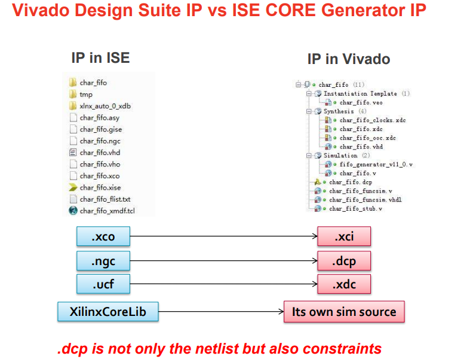

### 1.2 在Vivado下调用IP会生成如下文件：

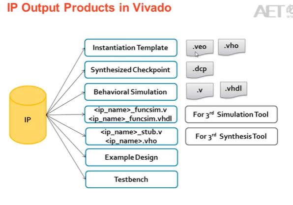

## 2、Vivado IP Design Flow

### 2.1 在Vivado下有两种方式使用IP

（1）采用Manage IP的方式创建IP的工程

（2）在当前的工程中定制IP

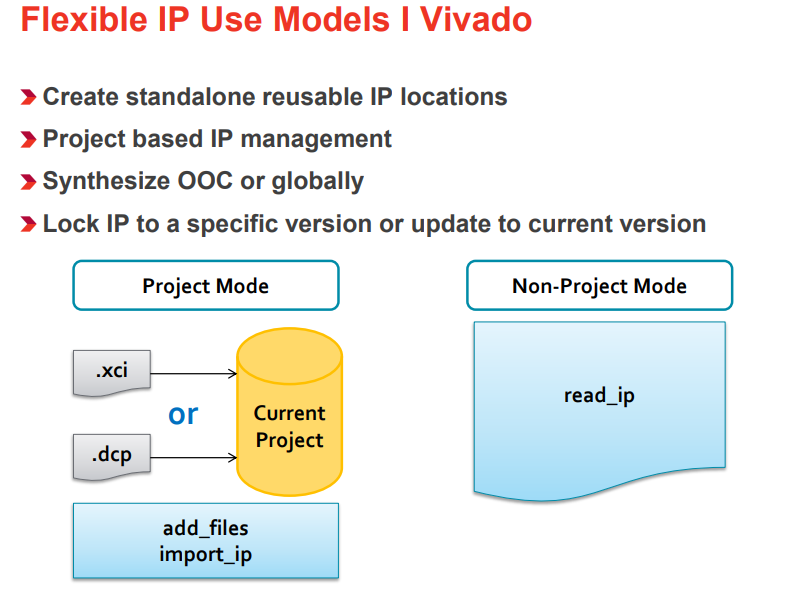

在Vivado设计环境中，所谓的“Flexible IP Use Models”指的是一系列灵活的IP使用模式。这些模式允许设计师以不同方式创建、管理和集成IP核心到他们的项目中，从而满足不同的设计需求和工作流程。

#### Create standalone reusable IP locations (创建独立可复用的IP位置)

这允许开发者创建可以在多个项目中复用的IP库。这样的IP库可以存储在一个集中的位置，便于维护和访问。

#### Project based IP management (基于项目的IP管理)
Vivado提供了一种将IP与特定项目相关联的管理方式。这意味着当你在一个项目中对一个IP进行修改时，这些变更不会影响到其他项目中同一IP的版本。

#### Synthesize Out-of-Context (OOC) or globally (独立编译或全局编译)

“Out-of-Context”(OOC) 编译指的是单独地对某个IP进行综合，而不是在整个设计的上下文中。这使得可以独立优化IP核心，并且能够重用它们的综合结果，加快后续的设计流程。
相比之下，“全局编译”意味着所有的IP和设计元素作为一个整体一起进行综合。

#### Lock IP to a specific version or update to current version (锁定IP到特定版本或更新到当前版本)

Vivado允许用户选择保持某个IP核心的特定版本，这样即使库中的IP有更新，当前项目中使用的仍然是旧版的IP。
用户也可以选择更新IP核心到库中的最新版本，以利用最新的功能或性能改进。

### 2.2 Manage IP的设计流程

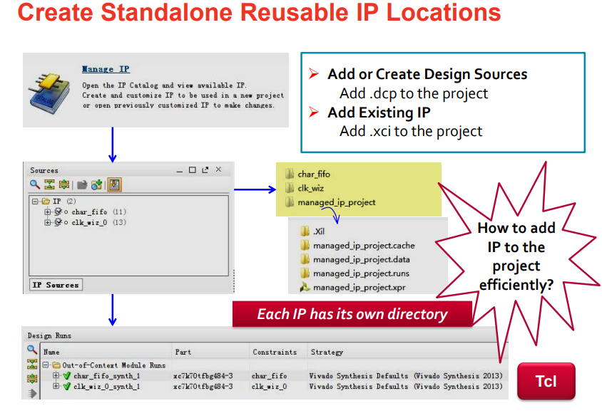

### 2.3 Project Based IP Management的设计流程

在当前工程下点击IP Catolog来定制所需要的IP，之后将IP在设计中实例化。

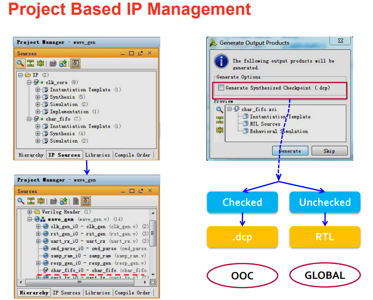

!!! note "两种设计流程的区别"
    在Vivado设计环境中，“Manage IP”和“Project Based IP Management”是两种不同的IP管理方法，它们提供了不同的方式来处理设计中使用的IP核心。

    **Manage IP 设计流程**

    “Manage IP”流程更关注于为整个组织或团队管理一个集中的IP库。在这个流程中，IP核心被创建、维护并存储在一个与特定项目无关的位置。这样做有几个优势：

    * 复用性：独立于项目的IP可以轻松地被多个项目共享和复用。

    * 版本控制：可以单独对每个IP核心进行版本控制，确保设计团队能够访问到特定版本的IP。

    * 独立更新与维护：IP核心的更新和维护不会直接影响到正在使用旧版本IP的现有项目。
    
    当使用“Manage IP”流程时，通常涉及以下步骤：

    * 使用IP Catalog从预定义的模板创建新的IP或选择现有的IP核心。

    * 配置选定的IP参数以满足具体设计需求。
    
    * 将配置好的IP核心打包并添加到中心IP库中。
    
    * 在需要时，从IP库中检索并添加IP到各个项目。

    **Project Based IP Management 设计流程**

    “Project Based IP Management”则侧重于在特定项目范围内管理IP核心。这种方式允许你在项目文件夹结构内创建、配置和维护IP，使得IP与项目密切相关联。该方法的特点包括：

    * 项目隔离：对IP所做的更改局限于当前项目，不会影响到其他项目中相同的IP。

    * 简化版本管理：因为IP与特定项目绑定，所以对IP版本的管理变得更加直观。

    * 易于归档：由于所有相关的IP文件都包含在项目目录中，项目归档和迁移变得更加方便。

    使用“Project Based IP Management”时，通常的步骤如下：

    * 在当前项目内部创建和配置IP核心。

    * IP配置信息存储在项目文件中，并且所有改动仅限于该项目。

    * 对IP进行综合和实现，作为整个项目设计流程的一部分。

    * 如果需要更新或修改IP，更改将只应用于当前项目。

    总结来说，“Manage IP”设计流程适合于更广泛的IP复用和跨项目的IP管理，而“Project Based IP Management”设计流程则让IP的管理与特定项目紧密相关联，适合于那些IP配置信息要与项目一起管理的场景。用户可以根据自己的需求和工作方式来选择最合适的IP管理方法。

### 2.4 Generated XDC

针对每个IP，Vivado会生成相应的约束文件XDC.

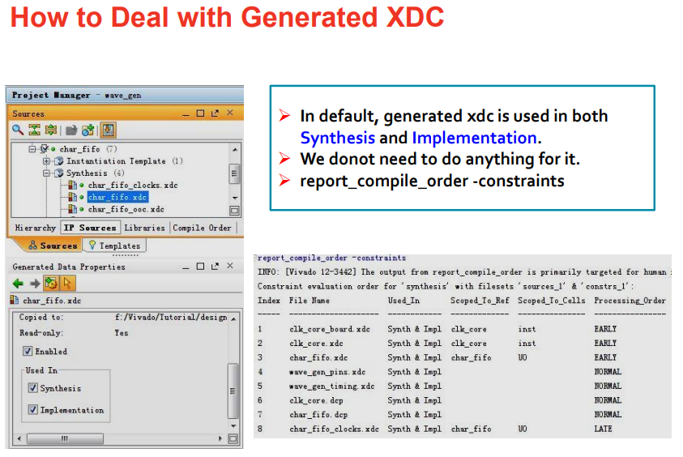

### 2.5 Open IP Example Design

在Vivado下，有的IP会有例子工程，只需要选中IP，然后选择Open IP Example Design，就可以打开一个以该IP为顶层的工程。

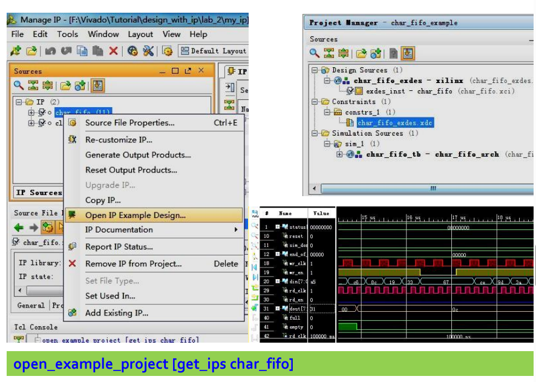

### 2.6 Using Xilinx IP with 3rd Party Synthesis Tools

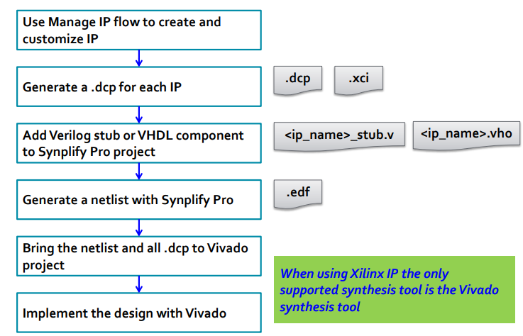

!!! note "使用第三方综合工具与Xilinx IP核心"
    
    当使用第三方综合工具如Synplify Pro与Xilinx IP核心一起时，你可以遵循以下流程来集成和实现设计：

    **1. Use Manage IP flow to create and customize IP (使用管理IP流程创建和自定义IP)**

    * 在Vivado中使用“Manage IP”流程来创建和配置所需的IP核心。这涉及到选择正确的IP、设置参数以匹配设计要求，并保存配置。

    **2. Generate a .dcp for each IP (为每个IP生成.dcp文件)**
    
    
    * 对每个已经创建并配置好的IP核心，生成Design Checkpoint（.dcp）文件。DCP是Vivado中一个封装了设计数据的文件格式，包括了综合后的网表、布局和路由信息等。

    **3. Add Verilog stub or VHDL component to Synplify Pro project (将Verilog存根或VHDL组件添加到Synplify Pro项目中)**

    * 为每个IP核心生成相应的Verilog存根文件或VHDL组件声明。这些文件充当IP核心在第三方综合工具中的接口，它们定义了IP核心的端口但不包含实现。

    * 将这些文件加入到Synplify Pro项目中，这样你就可以在Synplify Pro中引用Xilinx IP核心了。

    **4. Generate a netlist with Synplify Pro (使用Synplify Pro生成网表)**
    
    * 使用Synplify Pro对整个设计进行综合，产生网表。这个过程中，需要确保IP核心的接口被正确连接到用户逻辑中。

    **5. Bring the netlist and all .dcp to Vivado project (将网表和所有.dcp文件带到Vivado项目中)**
    
    * 将Synplify Pro生成的网表和之前生成的所有.dcp文件导入到Vivado项目中。

    * 确保网表文件与.dcp文件中的IP核心匹配，并进行必要的连接。

    **6. Implement the design with Vivado (使用Vivado实现设计)**

    * 在Vivado中执行设计实现，包括布局布线（Place & Route）等步骤。

    * Vivado会利用.dcp文件中的信息以确保IP核心按照预期配置和优化。

    * 进行必要的时序分析和验证，确保设计满足性能要求。
    
    * 最终生成用于编程FPGA的比特流文件。
    
    通过上述步骤，设计师可以将Xilinx IP核心与第三方综合工具结合使用，同时利用Vivado强大的实现和验证能力来完成高效的设计流程。

### 2.7 IP Version Control

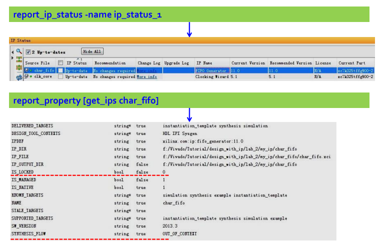

### 2.8 Some Tcl Commands about IP

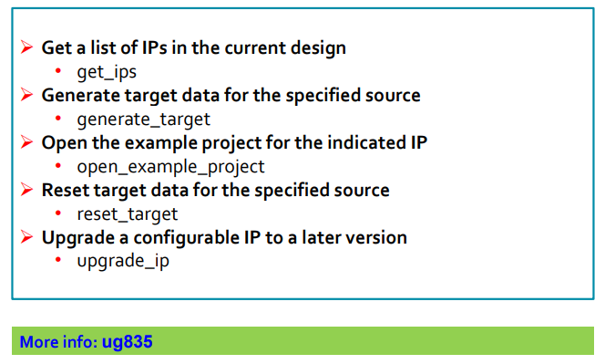

!!! note "关于IP的TCL命令"

    在Vivado设计环境中，你可以使用特定的Tcl命令来管理和操作IP核心。以下是针对一些常见任务的Tcl命令及其简要解释：

    **get_ips**
    - 用途: 获取当前设计中所有IP核心的列表。
    
    - 描述: 当你运行get_ips命令时，Vivado会列出当前项目中所有已经实例化的IP核心。这个列表可以帮助你快速查看设计中包含哪些IP，并获取它们的具体信息。
    
    **generate_target**
    
    - 用途: 为指定源生成目标数据。
    
    - 描述: 此命令通常用于生成或重新生成IP核心的输出产品，如综合后的设计检查点(DCP)、模拟文件或报告。具体生成哪种类型的目标数据依赖于指定的参数和IP核心的配置。
    
    **open_example_project**
    
    - 用途: 打开指定IP的示例项目。
    
    - 描述: 许多IP核心随附有示例项目，这些项目展示了如何在设计中使用该IP。通过open_example_project命令，用户可以快速访问和查看这些示例，以更好地理解并利用IP核心。
    
    **reset_target**
    
    - 用途: 重置指定源的目标数据。
    
    - 描述: 如果你需要将生成的IP核心的目标数据恢复到初始状态，可以使用这个命令。这可能用于撤销之前的生成操作或准备新的生成过程。

    **upgrade_ip**
    
    - 用途: 将可配置IP核心升级到更新版本。
    
    - 描述: 随着时间的推移，IP核心可能会有新版本发布，包含改进或修复。使用upgrade_ip命令可以将项目中的现有IP升级到较新的版本，从而获得这些更新和增强功能。

    每一个命令都可以通过在Vivado的Tcl控制台中输入执行，也可以集成到自动化脚本中以实现更高效的工作流程。这些命令是与Vivado交互的基础，让用户能够更方便地管理他们的IP资源。

### 2.9 IP-Centric Design Flow

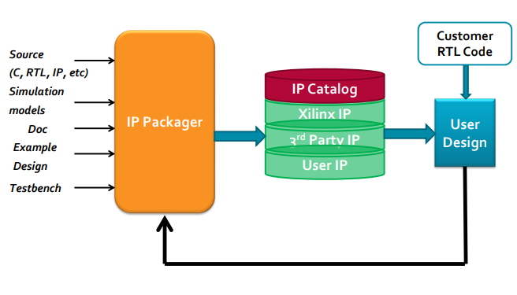

可以通过IP Packager工具，将IP加入到IP Catalog中，IP Catalog里面有Xilinx的IP，3rd Party IP和User IP

## 3、Demo

### 3.1

